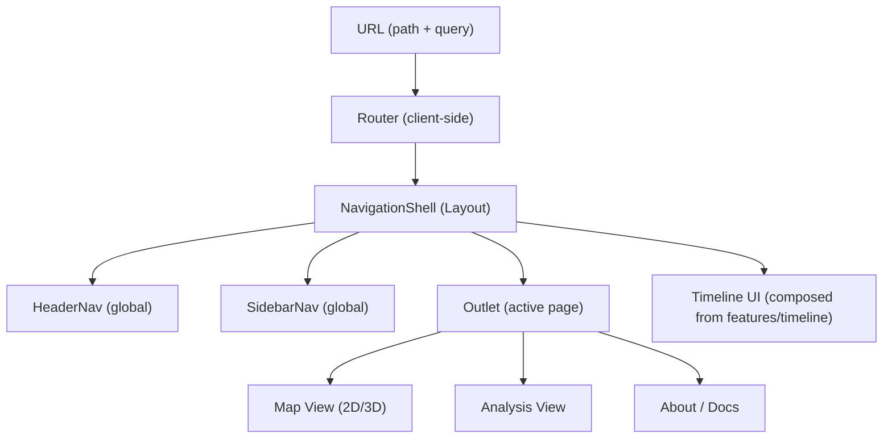

# 🧭 Navigation (Web Feature)


> **Folder:** `web/src/features/navigation`  
> This feature owns **client-side navigation** for the KFM web app: **routes**, **global nav UI** (header/sidebar), and **URL ↔ state** utilities to enable **deep-linking** (shareable, restorable app state).

---

## 🔗 Quick links

- [What this feature owns](#what-this-feature-owns)
- [How navigation fits the KFM frontend](#how-navigation-fits-the-kfm-frontend)
- [Folder layout](#folder-layout)
- [Routing conventions](#routing-conventions)
- [Deep linking and URL state](#deep-linking-and-url-state)
- [Global navigation UI](#global-navigation-ui)
- [Accessibility checklist](#accessibility-checklist)
- [Performance notes](#performance-notes)
- [Testing](#testing)
- [Troubleshooting](#troubleshooting)

---

## What this feature owns

✅ **Owns**
- 🧭 **App routes** (React Router route map, lazy loading, 404 handling)
- 🧱 **Navigation shell layout** (Header + Sidebar + content outlet)
- 🔐 **Route guards** (auth/role gating & redirects)
- 🔗 **Deep-link contract** (URL schema and helpers: parse/serialize)
- 🧰 **Navigation helpers** (breadcrumbs, “back”, “open field”, etc.)
- 🧷 **Navigation UX primitives** (skip-to-content, aria landmarks)

🚫 **Does not own**
- 🗺️ Map rendering, GIS layer logic, Cesium/Leaflet plumbing (belongs to `features/map`)
- ⏱️ Timeline data fetching & domain logic (belongs to `features/timeline`)
- 📊 Chart rendering & analytics dashboards (belongs to `features/dashboard` / `features/charts`)
- 🔑 Authentication implementation (belongs to `features/auth`)

---

## How navigation fits the KFM frontend

KFM’s frontend is designed as a **single-page application (SPA)** with:
- **client-side routing** (e.g., `/map`, `/analysis`, `/about`)  
- **global state** (Redux or equivalent) driving shared UI state like *selected date/time*, *layers*, *selected field*, etc.
- **deep links** (URLs that re-open the app in a specific context)  
- **responsive UI** (desktop + mobile layouts)

Navigation is where those pieces meet:
- The **router** decides which “view” is active.
- The **navigation shell** renders the global chrome (header/sidebar) around the active view.
- The **URL helpers** keep “shareable state” consistent (e.g., selected date + map mode + focus target).

### 🧩 High-level flow



---

## Folder layout

> This is the **recommended** layout for a feature-first React/TypeScript codebase. Adjust filenames to match the actual repo conventions.

```text
📁 web/src/features/navigation
├─ 📄 README.md
├─ 📄 index.ts
├─ 📄 routes.tsx                 # Route objects + lazy imports
├─ 📄 routeMeta.ts               # Route metadata (auth, title, nav visibility)
├─ 📄 navConfig.ts               # Sidebar/header items (labels, icons, paths)
├─ 📄 urlState.ts                # parse/serialize query params
├─ 📁 components
│  ├─ 📄 NavigationShell.tsx      # Layout: header + sidebar + outlet
│  ├─ 📄 HeaderNav.tsx            # Top navigation (global)
│  ├─ 📄 SidebarNav.tsx           # Left nav / drawer (mobile)
│  ├─ 📄 Breadcrumbs.tsx          # Optional, for deeper pages
│  ├─ 📄 SkipToContent.tsx        # A11y: skip link
│  └─ 📄 NotFound.tsx             # 404
├─ 📁 hooks
│  ├─ 📄 useAppNavigate.ts        # Typed wrapper around navigation
│  ├─ 📄 useRouteTitle.ts         # Update document title from route meta
│  └─ 📄 useUrlSyncedState.ts     # Optional: URL<->state glue
├─ 📁 utils
│  ├─ 📄 buildPath.ts             # Safe helpers for route params
│  └─ 📄 safeSearchParams.ts      # Whitelist & sanitize query keys
└─ 📁 __tests__
   ├─ 🧪 urlState.test.ts
   ├─ 🧪 routes.test.tsx
   └─ 🧪 navConfig.test.ts
```

---

## Routing conventions

### 1) Keep route paths stable 🧱
Routes are part of the **public contract** (bookmarks, shared links, documentation).  
Prefer additive changes and backwards-compatible redirects.

✅ Do:
- Use **kebab-case** paths: `/field-report`, `/model-status`
- Use **route params** for identity: `/fields/:fieldId`
- Use **query params** for view state: `?date=YYYY-MM-DD&layers=ndvi`

🚫 Avoid:
- Encoding large objects in the URL
- Renaming paths without a redirect strategy
- Using query params for identity (unless truly optional)

### 2) Prefer a single top-level shell
All primary pages should be children of `NavigationShell` so we get consistent:
- Header controls (2D/3D toggle, account/settings, mode switch)
- Sidebar menu
- Shared components like timeline controls when applicable

### 3) Route metadata lives next to routes
Keep route policy (auth, nav visibility) close to the route definition.

Example (TypeScript sketch):

```ts
// routeMeta.ts
export type RouteMeta = {
  title: string;
  requiresAuth?: boolean;
  roles?: string[];
  showInNav?: boolean;
};

export const ROUTE_META = {
  map: { title: "Map", showInNav: true },
  analysis: { title: "Analysis", showInNav: true, requiresAuth: true },
  about: { title: "About", showInNav: true },
} satisfies Record<string, RouteMeta>;
```

---

## Deep linking and URL state

Deep links let users share **exact context** (e.g., current date, selected layers, 2D/3D mode, focused field).

### URL design rules 🔗
1. **Path** = “where am I?” (page / entity identity)  
2. **Query** = “how am I viewing it?” (time, layers, toggles)  
3. **Hash** = optional in-page anchor (rare; use sparingly)

### Suggested query params for KFM map-like views

| Param | Type | Example | Notes |
|------:|------|---------|------|
| `date` | `YYYY-MM-DD` | `2025-06-01` | ISO date keeps sorting sane |
| `view` | `'2d' \| '3d'` | `3d` | Pairs well with a header toggle |
| `layers` | CSV string | `ndvi,soil_moisture` | Keep layer IDs stable |
| `fieldId` | string | `KS-0451` | Optional focus target (selection) |
| `play` | `0 \| 1` | `1` | Optional: timeline animation state |

Example URL:
```text
/map?date=2025-06-01&view=2d&layers=ndvi,precip&fieldId=KS-0451
```

### History behavior (important for sliders!)
To avoid spamming browser history when the user drags a slider:
- Use **replace** for “continuous” changes (timeline dragging)
- Use **push** for “discrete” navigation (page changes, explicit jumps)

✅ Timeline drag: `replaceState`  
✅ Clicking “Next month”: `pushState`

---

## Global navigation UI

### HeaderNav (global)
Common responsibilities:
- 🗺️ Switch modes: Map / Analysis / Dashboard / About
- 🌐 Toggle view: **2D ↔ 3D**
- ♻️ “Reset view” (especially important for 3D camera navigation)
- 👤 Account/settings (auth-aware)
- 🔎 Optional global search (fields, locations, datasets)

### SidebarNav (contextual + responsive)
- Desktop: persistent left rail
- Mobile: drawer (hamburger button)
- Supports nested groups when the app grows:
  - 🌾 Agriculture
  - 🌦️ Weather
  - 🛰️ Remote sensing
  - 🧪 Models & simulations

> **Tip:** Keep the sidebar about **navigation**. Put “layer toggles” and “map controls” in a separate panel owned by the map feature, even if it visually sits near the sidebar.

---

## Accessibility checklist

Navigation is the first place users feel friction. Keep it smooth ♿️

✅ Required
- Use semantic landmarks: `<header>`, `<nav>`, `<main>`
- Add a **Skip to content** link (`SkipToContent`)
- Mark active item: `aria-current="page"`
- Ensure full keyboard navigation:
  - Tab order is logical
  - Focus is visible
  - Drawer traps focus when open (mobile)
- Don’t rely on color alone for state (selected/active)

✅ Nice-to-have
- Keyboard shortcuts for power users (document them!)
- Respect reduced motion: `prefers-reduced-motion`

---

## Performance notes

- 🚀 **Code splitting:** lazy-load heavy routes (e.g., 3D globe mode, analytics dashboards)
- 🧠 **Memoization:** avoid rerendering nav chrome when only content changes
- 🧰 **Prefetching:** if a nav item is likely next, prefetch on hover (optional)
- 🧊 **URL parsing:** keep it fast and deterministic (parse once per location change)

---

## Testing

### Unit tests (fast)
- `urlState` parse/serialize is **idempotent**:
  - `state -> url -> state` should preserve meaning
- `buildPath` safely handles missing/invalid params
- `routeMeta` guards apply correctly

### Component tests
- Active nav item highlights correctly
- Auth-guarded items hide/disable correctly
- Mobile drawer opens, traps focus, closes on Escape

### E2E (Cypress / Playwright)
- Visiting a deep link restores:
  - correct route
  - correct date/time
  - correct layer selections
  - correct view mode (2D/3D)

---

## Troubleshooting

<details>
<summary><strong>🔁 Refreshing a deep link returns 404 in production</strong></summary>

This is almost always a server config issue for SPAs.

**Fix:** Configure the server to route unknown paths to `index.html` so the client router can handle them.

- ✅ Local dev servers do this automatically
- 🧩 Production (Nginx/S3/CloudFront/Express) needs an explicit fallback rule

</details>

<details>
<summary><strong>🧷 Timeline slider makes “Back” unusable</strong></summary>

If dragging the timeline pushes a new history entry each time, the back button becomes painful.

**Fix:** Use `replace` for continuous slider updates; only `push` on discrete steps (buttons) or when playback toggles.

</details>

<details>
<summary><strong>🧪 Query params don’t apply (e.g., layers=... ignored)</strong></summary>

Common causes:
- param name mismatch (`layer` vs `layers`)
- parsing is too strict (silently drops unknown values)
- URL state not wired into the feature that owns the state

**Fix:** Keep a single source of truth:
- parse once
- validate/normalize
- then dispatch state updates to owning features

</details>