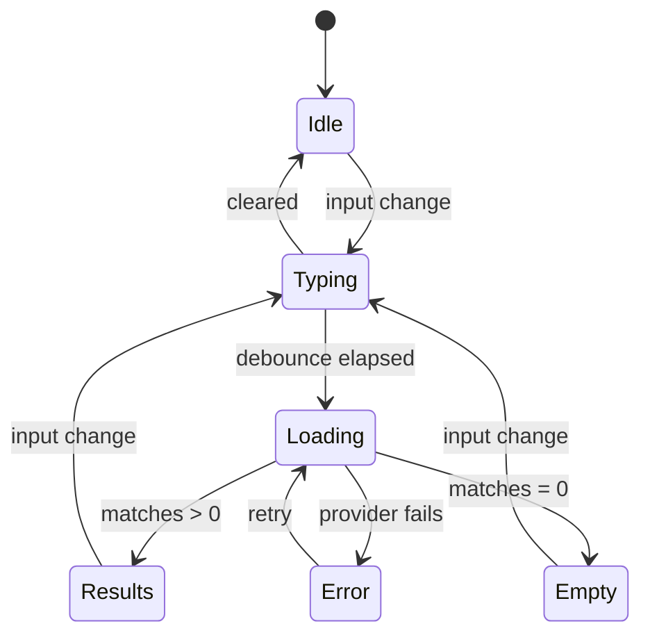
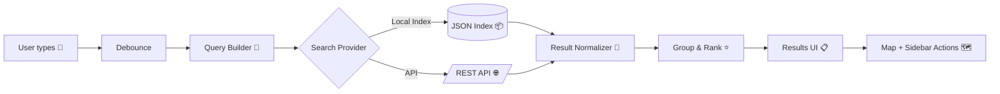

<!--
📄 Path: web/src/features/search/README.md
🧩 Feature: Search (🔎)
Status: Draft (living doc)
-->

# 🔎 Search Feature (web/src/features/search)


The **Search** feature is the user’s fastest path from **intent → map context → actionable insight**.  
In KFM terms, it supports:

- **Geo-referenced search** (names → coordinates → zoom) 🧭
- **Search + query workflows** (selection / attribute / geography) 🗺️
- **Full‑text lookup** of supporting artifacts (docs, records, notes) 📚
- **Permission-safe discovery** (never leak what the user can’t access) 🔐

This design aligns with the KFM frontend being a modern **React SPA** with reusable UI components and responsive layouts.  [oai_citation:0‡Kansas Frontier Matrix (KFM) – Comprehensive Technical Documentation & Markdown Guide.gdoc](file-service://file-XGC3Vf2AfbA2JWvTvmHNGF)

---

## 🧭 Table of contents

- [What “Search” means in KFM](#-what-search-means-in-kfm)
- [User stories](#-user-stories)
- [UX rules + states](#-ux-rules--states)
- [Architecture](#-architecture)
- [Search modalities](#-search-modalities)
- [Data contracts](#-data-contracts)
- [Security requirements](#-security-requirements)
- [Performance rules](#-performance-rules)
- [Testing checklist](#-testing-checklist)
- [Feature folder layout](#-feature-folder-layout)
- [Project references](#-project-references)

---

## 🧠 What “Search” means in KFM

KFM’s UI is built around map-based exploration and “drill‑down” analysis. Search is not just text matching—it’s a **navigation + filtering primitive** that can:

1. **Find a place / boundary / field by name** and zoom there (gazetteer behavior).  [oai_citation:1‡Kansas Frontier Matrix (KFM) – Comprehensive Technical Documentation & Markdown Guide.gdoc](file-service://file-XGC3Vf2AfbA2JWvTvmHNGF)  
2. Support classic GIS query approaches:
   - **Selection** (click / lasso / polygon select)
   - **Query by attribute**
   - **Query by geography**  [oai_citation:2‡Geographic Information System Basics - geographic-information-system-basics.pdf](file-service://file-Kjn2enYFqXQtK3J4zN2DWz)  
3. Optionally support **client-side full-text search** for static deployments via a **pre-built JSON index** (or a lightweight JS search library), keeping the web app fast.  [oai_citation:3‡Kansas-Frontier-Matrix_ Open-Source Geospatial Historical Mapping Hub Design.pdf](file-service://file-ShqHKgjxCS9UT9vbcxDNzA)

> 🧩 In short: Search should feel like a “spotlight” for the whole system—**map, layers, timeline, and documents**.

---

## 👤 User stories

### Farmer / operator 🌾
- As a user, I can search my **fields by name** and jump to them on the map.  [oai_citation:4‡Kansas Frontier Matrix (KFM) – Comprehensive Technical Documentation & Markdown Guide.gdoc](file-service://file-XGC3Vf2AfbA2JWvTvmHNGF)  
- As a user, I only see results I’m allowed to see (no cross-tenant leakage).  [oai_citation:5‡Kansas Frontier Matrix (KFM) – Comprehensive Technical Documentation & Markdown Guide.gdoc](file-service://file-XGC3Vf2AfbA2JWvTvmHNGF)  

### Researcher 🔬
- As a user, I can find a **county / boundary** and zoom there to start analysis.  [oai_citation:6‡Kansas Frontier Matrix (KFM) – Comprehensive Technical Documentation & Markdown Guide.gdoc](file-service://file-XGC3Vf2AfbA2JWvTvmHNGF)  
- As a user, I can filter results by type (Field / County / Dataset / Document / Layer).
- As a user, I can pivot from a search result to:
  - turning on the right layer(s),
  - setting an appropriate time (if relevant),
  - opening supporting documentation.

### Admin / curator 🧰
- As a user, I can verify that search indices do **not include restricted artifacts** and that search endpoints are rate-limited.  [oai_citation:7‡Kansas Frontier Matrix (KFM) – Comprehensive Technical Documentation & Markdown Guide.gdoc](file-service://file-XGC3Vf2AfbA2JWvTvmHNGF)  

---

## 🎛️ UX rules + states

### Non-negotiables ✅
- **Keyboard-first**: arrow keys to navigate results; Enter to open; Esc closes.
- **Debounced input**: don’t spam the API while typing.
- **Clear “no results” state**: explain what to try next (broaden filters, check spelling).
- **Result types are obvious**: icon + label (📍place, 🟩field, 🗺️layer, 📄doc).

### UI states (minimum set)
| State | Trigger | UI behavior |
|---|---|---|
| Idle | empty query | show hint / recent searches |
| Typing | user entering text | show “suggestions…” if available |
| Loading | fetch/index search | spinner + keep input responsive |
| Results | matches found | grouped list + shortcuts |
| Empty | no matches | “No results” + suggestions |
| Error | provider failure | show message + retry |

### State machine (Mermaid) 🧩


---

## 🧱 Architecture

KFM’s frontend is organized as a component-based SPA (React), using state management (Redux or Context/hooks) and responsive CSS layouts.  [oai_citation:8‡Kansas Frontier Matrix (KFM) – Comprehensive Technical Documentation & Markdown Guide.gdoc](file-service://file-XGC3Vf2AfbA2JWvTvmHNGF)  

For Search specifically, treat it as a **feature module** with:

- **UI components** (SearchBar, ResultsList, Filters)
- **Domain-ish types** (query, filters, result)
- **Providers** (local index vs API)
- **Integration actions** (map zoom/highlight, open document, toggle layer)

### Search flow (Mermaid) 🔁


---

## 🧭 Search modalities

### 1) Geo-referenced search (gazetteer) 🧭
When the user searches a known geographic name (e.g., county), Search returns a result with coordinates / bounds and triggers map navigation (“zoom there”).  [oai_citation:9‡Kansas Frontier Matrix (KFM) – Comprehensive Technical Documentation & Markdown Guide.gdoc](file-service://file-XGC3Vf2AfbA2JWvTvmHNGF)  

**Implementation notes**
- Prefer **stored boundary data** in KFM where possible.
- If external geocoding is ever used, ensure:
  - privacy review,
  - rate limiting,
  - and no sensitive query leakage.  [oai_citation:10‡Kansas Frontier Matrix (KFM) – Comprehensive Technical Documentation & Markdown Guide.gdoc](file-service://file-XGC3Vf2AfbA2JWvTvmHNGF)  

### 2) Query by attribute 🧾
Classic GIS behavior: find features by attributes (name, ID, tags, classification). GIS fundamentals treat this as a core search approach.  [oai_citation:11‡Geographic Information System Basics - geographic-information-system-basics.pdf](file-service://file-Kjn2enYFqXQtK3J4zN2DWz)  

**Example**
- “Fields where crop = wheat”
- “Counties with population density ≥ X”
- “Docs tagged ‘survey’”

### 3) Query by geography 🗺️
This includes:
- “within this polygon”
- “intersects this boundary”
- “near this point”

GIS sources describe this as a primary query technique alongside selection and attribute queries.  [oai_citation:12‡Geographic Information System Basics - geographic-information-system-basics.pdf](file-service://file-Kjn2enYFqXQtK3J4zN2DWz)  

### 4) Full-text search (documents / narratives) 📚
If the deployment is static (no server), KFM design materials suggest generating a **pre-built search index** (JSON) and searching it client-side.  [oai_citation:13‡Kansas-Frontier-Matrix_ Open-Source Geospatial Historical Mapping Hub Design.pdf](file-service://file-ShqHKgjxCS9UT9vbcxDNzA)  

> 🧠 Keep heavy NLP/AI offline and ship only lightweight indices to the browser.

---

## 📦 Data contracts

> These are **recommended** contracts for this feature folder. Adjust to match the repo’s existing types & API conventions.

### `SearchQuery`
- `text: string`
- `filters: SearchFilters`
- `scope?: "global" | "map" | "docs"`
- `bbox?: [minLng, minLat, maxLng, maxLat]` (optional map constraint)
- `time?: { start?: string; end?: string }` (optional)

### `SearchResult`
Common normalized result (all providers map into this):
- `id: string`
- `type: "field" | "county" | "place" | "layer" | "doc" | "dataset" | "event"`
- `title: string`
- `subtitle?: string`
- `score?: number`
- `access: "allowed" | "denied"` *(ideally never return denied results to UI)*
- `geometry?: GeoJSON.Geometry`
- `bbox?: [minLng, minLat, maxLng, maxLat]`
- `actions: Array<"zoom" | "highlight" | "open" | "toggleLayer">`
- `meta?: Record<string, unknown>`

### Provider interface (TypeScript-ish)
```ts
export interface SearchProvider {
  search(query: SearchQuery, ctx: SearchContext): Promise<SearchResult[]>;
}

export interface SearchContext {
  userRole?: string;
  // Optional: current map view, zoom, active layers, etc.
}
```

---

## 🔐 Security requirements

KFM explicitly calls out **Search Security** as a risk surface:

- Search must **only return results the user has access to** (avoid “someone else’s field name” leaks).
- Sanitize input to prevent injection.
- Rate limit endpoints to prevent scraping / enumeration.  [oai_citation:14‡Kansas Frontier Matrix (KFM) – Comprehensive Technical Documentation & Markdown Guide.gdoc](file-service://file-XGC3Vf2AfbA2JWvTvmHNGF)  

### UI-side rules (also important)
- Do **not** persist sensitive search results in `localStorage` by default.
- Don’t show “smart suggestions” that could reveal restricted entity names.
- Treat search analytics as sensitive telemetry (aggregate or anonymize where possible).

---

## ⚡ Performance rules

KFM’s frontend-backend interaction guidance emphasizes throttling frequent requests and keeping the UI responsive.  [oai_citation:15‡Kansas Frontier Matrix (KFM) – Comprehensive Technical Documentation & Markdown Guide.gdoc](file-service://file-XGC3Vf2AfbA2JWvTvmHNGF)  

Apply that here:

- ✅ Debounce keystrokes (e.g., 150–300ms)
- ✅ Cancel in-flight requests when query changes
- ✅ Cache recent queries (short-lived, memory cache)
- ✅ Virtualize long result lists (when needed)
- ✅ Prefer local index for static deployments; avoid heavy work in-browser  [oai_citation:16‡Kansas-Frontier-Matrix_ Open-Source Geospatial Historical Mapping Hub Design.pdf](file-service://file-ShqHKgjxCS9UT9vbcxDNzA)  

---

## 🧪 Testing checklist

### Unit tests ✅
- Query parsing / normalization
- Provider mapping (API → normalized `SearchResult`)
- Ranking + grouping logic

### Integration tests 🧩
- Keyboard navigation across results
- Selecting a geo-result triggers map zoom/highlight (mock MapView)

### Security tests 🔐
- Confirm restricted content never appears in results UI
- Input sanitization + escaping (esp. if results include snippets)

### Regression tests 🧯
- “No results” state messaging remains helpful (doesn’t break layout)
- Slow network behavior stays stable (no jitter, no stale results)

---

## 🧰 Feature folder layout

> Suggested structure for `web/src/features/search/` (adjust to match existing conventions).

```text
📦 web/src/features/search
├─ 📄 README.md              👈 you are here
├─ 📄 index.ts               (public exports)
├─ 📂 components
│  ├─ 🧩 SearchBar.tsx
│  ├─ 🧩 SearchFilters.tsx
│  ├─ 🧩 SearchResultsList.tsx
│  ├─ 🧩 SearchResultItem.tsx
│  └─ 🧩 SearchEmptyState.tsx
├─ 📂 hooks
│  ├─ 🪝 useSearch.ts
│  └─ 🪝 useDebouncedValue.ts
├─ 📂 providers
│  ├─ 🌐 apiSearchProvider.ts
│  ├─ 📦 localIndexProvider.ts
│  └─ 🧭 gazetteerProvider.ts
├─ 📂 state
│  ├─ 🧠 searchSlice.ts       (if Redux)
│  └─ 🧠 searchStore.ts       (if Zustand/Context)
├─ 📂 types
│  ├─ 🧾 searchTypes.ts
│  └─ 🧾 geoTypes.ts
├─ 📂 utils
│  ├─ 🧮 rankResults.ts
│  ├─ 🧹 normalizeResults.ts
│  └─ 🛡️ sanitize.ts
└─ 🧪 __tests__
   ├─ ✅ searchProviders.test.ts
   └─ ✅ rankResults.test.ts
```

---

## ✅ Definition of Done (DoD)

- [ ] Search returns **only authorized** results (server + UI)  [oai_citation:17‡Kansas Frontier Matrix (KFM) – Comprehensive Technical Documentation & Markdown Guide.gdoc](file-service://file-XGC3Vf2AfbA2JWvTvmHNGF)  
- [ ] Geo-referenced search zooms to the selected boundary/place  [oai_citation:18‡Kansas Frontier Matrix (KFM) – Comprehensive Technical Documentation & Markdown Guide.gdoc](file-service://file-XGC3Vf2AfbA2JWvTvmHNGF)  
- [ ] Input is debounced + cancellable; no request storms  [oai_citation:19‡Kansas Frontier Matrix (KFM) – Comprehensive Technical Documentation & Markdown Guide.gdoc](file-service://file-XGC3Vf2AfbA2JWvTvmHNGF)  
- [ ] Mobile responsive layout verified (breakpoints, touch targets)  [oai_citation:20‡Kansas Frontier Matrix (KFM) – Comprehensive Technical Documentation & Markdown Guide.gdoc](file-service://file-XGC3Vf2AfbA2JWvTvmHNGF)  
- [ ] Error + empty states are human-friendly and actionable
- [ ] Unit tests added for normalization + ranking
- [ ] Accessibility: keyboard nav + ARIA roles + focus management

---

## 📚 Project references

These are the primary “source-of-truth” documents guiding this feature:

- 🧭 KFM technical + frontend architecture notes  [oai_citation:21‡Kansas Frontier Matrix (KFM) – Comprehensive Technical Documentation & Markdown Guide.gdoc](file-service://file-XGC3Vf2AfbA2JWvTvmHNGF)  
- 🔐 KFM security section (Search security, sanitization, rate limiting)  [oai_citation:22‡Kansas Frontier Matrix (KFM) – Comprehensive Technical Documentation & Markdown Guide.gdoc](file-service://file-XGC3Vf2AfbA2JWvTvmHNGF)  
- 🗺️ Geo-referenced search pattern (gazetteer / boundary zoom)  [oai_citation:23‡Kansas Frontier Matrix (KFM) – Comprehensive Technical Documentation & Markdown Guide.gdoc](file-service://file-XGC3Vf2AfbA2JWvTvmHNGF)  
- 🧾 GIS query methods: selection / attribute / geography  [oai_citation:24‡Geographic Information System Basics - geographic-information-system-basics.pdf](file-service://file-Kjn2enYFqXQtK3J4zN2DWz)  
- 📦 Static-app search index idea (pre-built JSON index / lightweight JS search)  [oai_citation:25‡Kansas-Frontier-Matrix_ Open-Source Geospatial Historical Mapping Hub Design.pdf](file-service://file-ShqHKgjxCS9UT9vbcxDNzA)  
- 🌍 Remote sensing context (Earth Engine workflows)  [oai_citation:26‡Cloud-Based Remote Sensing with Google Earth Engine-Fundamentals and Applications.pdf](file-service://file-CXGLTw8wpR4uKWWqjrGkyk)  

---