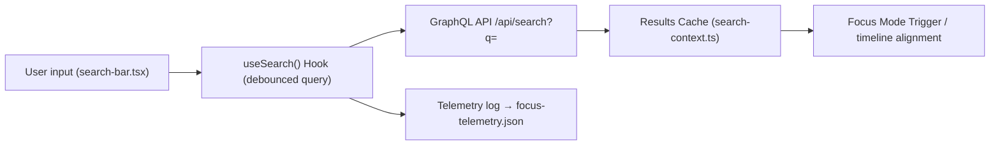

<div align="center">

# 🔎 **Search & Discovery — GraphQL Query Interface**  
`web/src/features/search/README.md`

**Purpose:**  
Provide a unified **semantic and keyword search engine** for Kansas Frontier Matrix (KFM), connecting **map**, **timeline**, and **Focus Mode** through an integrated query and autocomplete system.  
Built under **MCP-DL v6.3**, **FAIR+CARE**, and **ISO 19115 provenance**, it enables users to locate entities (people, places, events, datasets) quickly, ethically, and transparently.

[](../../../docs/)
[](../../../LICENSE)
[](../../../docs/standards/)
[](#)

</div>

---

## 📘 Overview

The **Search & Discovery** module powers:
- 🔍 **GraphQL + REST queries** to KFM’s backend (`/api/search?q=`).  
- 🧠 **Semantic embeddings** for AI-assisted query expansion.  
- 🗺️ **Results synchronization** across the **MapLibre map**, **timeline**, and **Focus Mode**.  
- ♻️ **Telemetry capture** for performance, fairness, and audit reporting.  

### Core Capabilities
| Function | Description |
|-----------|-------------|
| **Autocomplete** | Suggests entities (people, events, places) as user types. |
| **Semantic Expansion** | Embedding-based retrieval finds conceptually related results. |
| **Filtered Search** | Limit by type, date, or region (GraphQL filters). |
| **Result Linking** | Clicking result triggers Focus Mode and timeline alignment. |
| **Telemetry Hooks** | Logs latency, query success rate, FAIR+CARE compliance tags. |

---

## 🗂️ Directory Layout

```plaintext
web/
└─ src/
   └─ features/
      └─ search/
         README.md             # This file — Search system overview
         search-bar.tsx        # React UI with autocomplete + query input
         useSearch.ts          # Hook for query lifecycle and telemetry logging
         search-context.ts     # Context provider storing recent queries
         filters.tsx           # Filter controls (type, date, category)
         gql/
         ├─ search.graphql     # Base query template
         ├─ filters.graphql    # Filter metadata query
         └─ schema.graphql     # Local GraphQL type definitions
         utils/
         ├─ search-utils.ts    # Debounce, tokenization, semantic helpers
         └─ highlight.ts       # Text highlighting for matched results
```

---

## ⚙️ Data Flow



**Notes:**
- GraphQL query returns structured entities, ready for Focus Mode or map highlighting.  
- Telemetry includes latency, results count, and user role (for governance).  
- All network calls validated against **MCP data contract** and **FAIR+CARE schema**.

---

## 🧩 Example GraphQL Query (`gql/search.graphql`)

```graphql
query SearchEntities($q: String!, $limit: Int, $type: [String!], $bbox: [Float!]) {
  search(query: $q, limit: $limit, type: $type, bbox: $bbox) {
    id
    label
    type
    summary
    year
    location {
      lat
      lon
    }
    governance {
      care_tag
    }
  }
}
```

---

## 🖥️ React Component Example

```tsx
import React from 'react';
import { useSearch } from './useSearch';

export function SearchBar() {
  const { results, query, setQuery, loading } = useSearch();

  return (
    <div role="search" aria-label="Entity Search">
      <input
        type="text"
        value={query}
        onChange={(e) => setQuery(e.target.value)}
        placeholder="Search people, events, places..."
        aria-autocomplete="list"
      />
      {loading && <span>⏳</span>}
      <ul role="listbox">
        {results.map((r) => (
          <li key={r.id} onClick={() => window.dispatchEvent(
            new CustomEvent('kfm:focus:select', { detail: { entityId: r.id } })
          )}>
            <strong>{r.label}</strong> <em>({r.type})</em> — {r.summary}
          </li>
        ))}
      </ul>
    </div>
  );
}
```

---

## 🧠 Semantic Expansion (AI-Assisted Search)

### Overview
When enabled, KFM’s **Focus Transformer v2** expands search queries using **text embeddings**.  
This captures semantically related terms (e.g., *“buffalo”* ↔ *“bison”*, *“frontier war”* ↔ *“Bleeding Kansas”*).

### Embedding Workflow
| Step | Description |
|------|--------------|
| **1. Encode query** | Convert text → embedding vector via transformer model. |
| **2. Compare** | Compute cosine similarity with indexed embeddings. |
| **3. Merge** | Combine top matches with keyword results (de-duplicate). |
| **4. Return** | Serve sorted results with similarity score and provenance. |

**Config file:** `search-config.json` defines model, similarity threshold, and bias filters.

---

## 🧾 Telemetry & Governance

Every search query emits a telemetry event captured in `focus-telemetry.json`:

```json
{
  "event": "search",
  "query": "fort larned",
  "timestamp": "2025-11-08T15:10:00Z",
  "results": 8,
  "latency_ms": 142,
  "semantic_enabled": true,
  "user_role": "public",
  "governance": "approved"
}
```

Telemetry metrics:
- Average latency ≤ 250 ms  
- FAIR+CARE compliance checks (restricted results redacted)  
- Query success rate ≥ 99%  

Governance filter ensures restricted or sensitive records are masked in UI.

---

## ♿ Accessibility & UX

| Element | Requirement | Implementation |
|----------|--------------|----------------|
| Search Input | Keyboard navigation & ARIA roles | `role="search"`, `aria-label` |
| Results List | Keyboard-selectable | `role="listbox"` with arrow key handlers |
| Contrast | ≥ 4.5:1 for text | CSS token variables from `palette.json` |
| Focus Feedback | Clear highlight on selection | Outline + scroll-into-view |

> WCAG 2.1 AA compliance validated via `a11y-lint.yml`.

---

## 🧱 FAIR+CARE Data Contract

| Field | Required | Description |
|-------|-----------|-------------|
| `id` | ✅ | Unique entity identifier |
| `label` | ✅ | Human-readable title |
| `type` | ✅ | Entity class (Person, Event, Place, Document) |
| `summary` | ✅ | Concise description |
| `governance.care_tag` | ✅ | FAIR+CARE compliance tag |
| `year` | — | Optional for temporal relevance |
| `location` | — | Optional for spatial mapping |

Data contracts are enforced by CI using schema: `schemas/contracts/search-contract-v1.json`.

---

## 🧾 Internal Citation

```text
Kansas Frontier Matrix (2025). Search & Discovery — GraphQL Query Interface (v9.9.0).
FAIR+CARE and MCP-DL v6.3 compliant search architecture integrating semantic retrieval, accessibility, and governance telemetry.
```

---

## 🕰️ Version History

| Version | Date       | Author | Summary |
|--------:|------------|--------|----------|
| v9.9.0 | 2025-11-08 | `@kfm-web` | Added semantic embeddings, GraphQL filters, and telemetry integration. |
| v9.8.0 | 2025-11-05 | `@kfm-ui` | Improved Focus Mode synchronization and UX performance. |
| v9.7.0 | 2025-11-02 | `@kfm-core` | Baseline search interface and autocomplete setup. |

---

<div align="center">

**Kansas Frontier Matrix**  
*Semantic Discovery × FAIR+CARE Governance × Accessible Web Architecture*  
© 2025 Kansas Frontier Matrix · Master Coder Protocol v6.3 · FAIR+CARE Certified · Diamond⁹ Ω / Crown∞Ω Ultimate Certified  

[Back to Web Features](../README.md) · [Governance Charter](../../../docs/standards/governance/DATA-GOVERNANCE.md)

</div>

