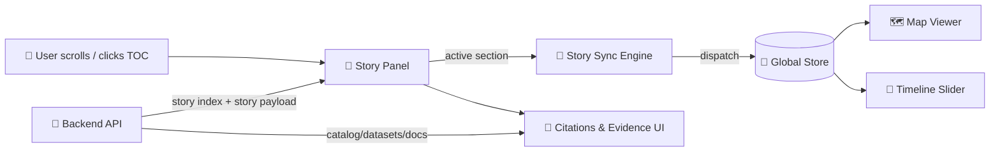

# 📚 Stories Feature (`web/src/features/stories`)


> **What this feature is:** the user-facing “interactive documentary” layer 🎬🗺️ — rendering governed Story Nodes (Markdown + metadata + citations) and synchronizing them with the **map** and **timeline** as the user reads.

---

## ✨ Key idea

A **Story** is not “just text”. It’s **narrative + governed evidence + a playback plan**.

- 📄 **Story Markdown**: readable narrative with citations and entity references  
- 🧩 **Story Metadata**: title/author/time range/tags/license/etc.  
- 🎛️ **Story Bindings (JSON)**: declarative steps that “bind” specific sections of text to:
  - map camera (fly-to / zoom / pitch / bearing),
  - timeline (set year/date range),
  - layer states (toggle layers, filters),
  - highlights (entities/features),
  - media cues (image/audio/video).

This folder implements the **frontend “story player”** and all the glue that makes the experience feel seamless.

---

## 🧭 Table of contents

- [Responsibilities](#-responsibilities)
- [Non-goals](#-non-goals)
- [User flows](#-user-flows)
- [Architecture](#-architecture)
- [Recommended folder layout](#-recommended-folder-layout)
- [Data contracts](#-data-contracts)
- [Story JSON bindings](#-story-json-bindings)
- [Provenance, citations, and “No Source, No Answer”](#-provenance-citations-and-no-source-no-answer)
- [Sensitive data handling](#-sensitive-data-handling)
- [Performance notes](#-performance-notes)
- [Accessibility](#-accessibility)
- [Testing](#-testing)
- [Troubleshooting](#-troubleshooting)
- [Contributing](#-contributing)
- [Roadmap](#-roadmap)
- [Glossary](#-glossary)

---

## ✅ Responsibilities

This feature **owns**:

- 📚 **Story discovery**
  - fetching a story list/index (published stories)
  - basic filtering (tags, eras, regions) if provided by API
- 📖 **Story rendering**
  - render story Markdown safely (no unsafe HTML execution)
  - build a Table of Contents (TOC) from headings
  - render citations/footnotes and “evidence drawers” (dataset/doc links)
- 🧠 **Scroll ↔ Map/Timeline synchronization**
  - detect which story section is “active” while scrolling
  - dispatch map/timeline actions based on binding rules
  - keep UI state consistent (deep links, back/forward, share links)
- 🔒 **Governance enforcement in UI**
  - never display “mystery content” with no provenance ID
  - visibly label AI-generated additions as opt-in + clearly tagged (if present)
  - respect sensitivity rules (generalize/omit restricted locations)

---

## 🚫 Non-goals

This feature does **not**:

- implement MapLibre/Cesium map rendering internals (that belongs to map modules)
- define core timeline logic (that belongs to timeline modules)
- invent data: it renders what the API/catalogs provide (and refuses/limits what isn’t governed)

---

## 🔁 User flows

### 1) Browse stories
1. User opens **Stories** view
2. App requests index (published stories)
3. User clicks a story card
4. App navigates to `/stories/:slug` (or equivalent route)

### 2) Read a story (scroll-linked)
1. Story Markdown renders in the Story Panel
2. As the user scrolls, we detect the active section
3. We apply the section’s bindings:
   - map fly-to + relevant layers,
   - timeline set/highlight,
   - highlight entities/regions,
   - show contextual media/citations.

### 3) Deep link + share
- URLs should restore:
  - selected story
  - (optional) current section anchor
  - (optional) timeline year/date
  - (optional) selected entity

---

## 🏗️ Architecture



---

## 🗂️ Recommended folder layout

> Your repo may vary — this is the **intended shape** for maintainable growth.

```
web/src/features/stories/
├─ 📁 components/
│  ├─ 📄 StoryList.tsx              # story cards + filters
│  ├─ 📄 StoryPanel.tsx             # markdown renderer + layout shell
│  ├─ 📄 StoryTOC.tsx               # headings → navigation
│  ├─ 📄 StoryCitations.tsx         # footnotes/evidence drawer
│  ├─ 📄 StoryHeader.tsx            # title/author/time range + badges
│  └─ 📄 StoryMedia.tsx             # images/audio/video (governed assets)
├─ 📁 hooks/
│  ├─ 📄 useStory.ts                # load story payload + cache
│  ├─ 📄 useStoryScrollSync.ts      # scroll → active section
│  └─ 📄 useStoryBindings.ts        # section → map/time actions
├─ 📁 services/
│  ├─ 📄 storiesApi.ts              # API calls (index, story payload)
│  └─ 📄 storyParser.ts             # md → sections/anchors, citations extraction
├─ 📁 state/
│  ├─ 📄 storiesSlice.ts            # selected story, active section, errors
│  └─ 📄 selectors.ts
├─ 📁 types/
│  └─ 📄 storyTypes.ts              # StoryIndexEntry, StoryPayload, BindingStep…
├─ 📁 __tests__/
│  ├─ 🧪 storyParser.test.ts
│  ├─ 🧪 bindings.test.ts
│  └─ 🧪 storiesApi.contract.test.ts
└─ 📄 README.md
```

---

## 🔌 Data contracts

### Story index entry (example)

```ts
export type StoryVisibility = "public" | "restricted";

export interface StoryIndexEntry {
  id: string;                 // stable ID (slug or UUID)
  slug: string;               // URL-friendly key
  title: string;
  summary?: string;
  timeRange?: { start: string; end?: string }; // ISO date or year string
  tags?: string[];
  thumbnailAssetId?: string;  // governed asset reference (not raw URL)
  visibility: StoryVisibility;

  // Provenance / versioning ✳️
  provenanceId: string;       // must exist or story should not render
  version?: string;           // commit hash / semantic version (if provided)
}
```

### Story payload (example)

```ts
export interface StoryPayload {
  entry: StoryIndexEntry;

  markdown: string;           // governed narrative markdown
  bindings?: StoryBindings;   // optional JSON step plan
  assets?: Record<string, StoryAsset>; // resolved governed assets (optional)

  // Optional enriched references
  entityRefs?: Array<{ id: string; label: string; kind: string }>;
  citations?: Array<CitationRef>; // if API pre-parses citations
}
```

---

## 🧷 Story JSON bindings

Bindings should be **declarative** (story authors configure experience without writing code).

### Minimal example

```json
{
  "version": "1",
  "steps": [
    {
      "anchor": "black-sunday-1935",
      "timeline": { "year": 1935 },
      "map": { "camera": { "center": [-99.5, 38.5], "zoom": 6 } },
      "layers": [
        { "id": "drought_severity", "visible": true, "filter": { "year": 1935 } }
      ],
      "highlight": [{ "type": "region", "id": "ks_dust_bowl_region" }]
    }
  ]
}
```

### Suggested binding schema (frontend expectations)

```ts
export interface StoryBindings {
  version: "1";
  steps: BindingStep[];
}

export interface BindingStep {
  anchor: string; // matches generated heading id in markdown

  timeline?: {
    year?: number;
    date?: string;  // ISO date
    range?: { start: string; end: string };
  };

  map?: {
    camera?: {
      center?: [number, number]; // [lon, lat]
      zoom?: number;
      bearing?: number;
      pitch?: number;
      flyTo?: boolean;           // default true
      durationMs?: number;       // respect prefers-reduced-motion
    };
    bounds?: [[number, number], [number, number]];
  };

  layers?: Array<{
    id: string;
    visible?: boolean;
    opacity?: number;
    filter?: Record<string, unknown>;
  }>;

  highlight?: Array<{
    type: "entity" | "feature" | "region";
    id: string; // stable ID (graph/dataset-derived)
    style?: "pulse" | "outline" | "marker";
  }>;

  media?: Array<{
    assetId: string;       // governed asset reference
    placement?: "inline" | "sidecar" | "modal";
    caption?: string;
  }>;
}
```

---

## 🧾 Provenance, citations, and “No Source, No Answer”

### UI rules (hard gates) 🧱

- **No provenance ID → do not render** (show a governed error state)
- **Citations must be navigable**
  - citations should link to:
    - dataset detail pages (DCAT/STAC),
    - document viewer entries,
    - provenance logs (PROV),
    - or curated external sources that are cataloged
- **AI contributions**
  - must be **opt-in**
  - must be clearly labeled “AI-generated”
  - should include uncertainty/confidence where available
  - must still respect sensitivity and provenance requirements

### What the UI should surface

- ✅ author + date + license (if present)
- ✅ story version (if provided)
- ✅ citation list (footnotes) + clickable evidence
- ✅ “Referenced entities” chips (people/places/events) linking to graph-backed pages
- ✅ layer/source attribution (map overlay “info” includes source)

---

## 🛡️ Sensitive data handling

Stories may reference **restricted** or **sensitive** locations (especially Indigenous heritage).

Frontend must:

- 🧭 **Generalize** markers when required  
  (e.g., show a region polygon or blurred marker instead of a precise point)
- 🙈 **Never** reveal restricted coordinates via:
  - bindings JSON,
  - map popups,
  - debug overlays,
  - URL params,
  - client logs.

If the API returns a binding with restricted data, the UI should treat it as invalid and fall back safely.

---

## ⚡ Performance notes

- Use `IntersectionObserver` for section detection (avoid scroll event spam)
- Throttle/merge map updates:
  - avoid “camera thrash” (only flyTo when section *changes*)
  - coalesce multiple actions in a single animation frame
- Cache story payloads in-memory (and optionally via service worker if your app supports it)
- Prefer “reduced motion” when user has it enabled:
  - disable fly animations
  - shorten transitions

---

## ♿ Accessibility

- Provide a **Skip to story content** link
- TOC must be keyboard navigable
- Headings must be correctly nested (`h2 → h3 → h4`)
- Provide focus management when:
  - selecting a TOC entry
  - loading a new story
- Respect `prefers-reduced-motion` for map/timeline animations
- Ensure citations are readable and have descriptive link text (not just “1”, “2”)

---

## 🧪 Testing

Minimum recommended tests:

- ✅ `storyParser`:
  - consistent anchor generation
  - heading extraction
  - footnote/citation extraction
- ✅ bindings:
  - anchor lookup
  - action mapping correctness
  - restricted data handling
- ✅ contract tests:
  - story index schema
  - story payload schema
- ✅ UI integration:
  - loading/error/empty states
  - TOC jump sets correct active section
  - section change dispatches expected map/timeline actions

---

## 🧯 Troubleshooting

**Story scroll doesn’t trigger map changes**
- Check `anchor` values in JSON vs generated markdown heading ids
- Confirm section detection isn’t blocked by container overflow styles

**Map keeps flying repeatedly (“thrashing”)**
- Ensure bindings apply only when the active section *changes*
- Add dedupe: ignore actions if the resulting state is already active

**Citations show but aren’t clickable**
- Verify citation IDs resolve to catalog entries
- Confirm routing exists for dataset/doc detail pages

**Restricted story shows sensitive location**
- This is a bug 🚨  
  - ensure redaction is enforced in API
  - also enforce client-side guardrails (never trust the payload blindly)

---

## 🤝 Contributing

When touching this feature, keep these guardrails:

1. 🧩 **Don’t expand the schema casually**  
   If you add a new binding capability, update:
   - types (`types/storyTypes.ts`)
   - parser/validator
   - tests
   - docs (this README + any story-node authoring docs)

2. 🧾 **Attribution is a feature**  
   If you add new UI surfaces (layers, popups, callouts), include source/provenance display.

3. 🔒 **Treat all payloads as untrusted**  
   Sanitize markdown output. Validate JSON. Never eval/execute embedded content.

---

## 🗺️ Roadmap

- 🎧 “Tour Mode” (Play/Pause) with timeline scrubber (optional)
- 🗣️ Optional narration (TTS) with user controls + reduced-motion alignment
- 🔍 Better evidence drawer:
  - show dataset previews
  - show provenance chain (“how this layer was produced”)
- 🧠 Optional “Ask Focus Mode about this section” integration (opt-in, cited)

---

## 📓 Glossary

- **Story Node**: a governed narrative artifact (Markdown) with citations + semantic references.
- **Bindings / Steps**: JSON plan that ties narrative anchors to map/timeline/layers.
- **Provenance**: traceable evidence chain (datasets/docs/PROV logs).
- **CARE + FAIR**: governance principles for ethical and reusable data stewardship.
- **No Source, No Answer**: policy that forbids uncited factual output.

---
