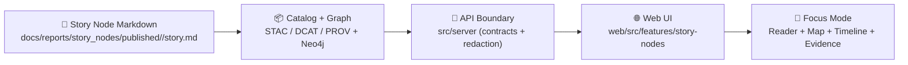

# 🧠📚 Story Nodes (web/src/features/story-nodes)


> [!TIP]
> Looking for the *actual Story Node content* (Markdown narratives)? Go to 📁 `docs/reports/story_nodes/` (draft + published). [oai_citation:0‡MARKDOWN_GUIDE_v13.md.gdoc](file-service://file-UYVruFXfueR8veHMUKeugU) [oai_citation:1‡MARKDOWN_GUIDE_v13.md.gdoc](file-service://file-UYVruFXfueR8veHMUKeugU)

---

## 🧭 What this feature is

**Story Nodes** are KFM’s “machine-ingestible” narrative units: Markdown documents with embedded semantic annotations, **citations for claims**, and **stable links to graph entities** (people/places/events/docs). They’re authored for humans *and* structured for the system to parse, index, and cross-reference. [oai_citation:2‡MARKDOWN_GUIDE_v13.md.gdoc](file-service://file-UYVruFXfueR8veHMUKeugU)

This `web/src/features/story-nodes` feature owns the **frontend experience** for:
- **Browsing** Story Nodes (e.g., lists, search, filters).
- **Reading** a Story Node in **Focus Mode** (narrative + map + timeline context).
- **Rendering evidence** (citations/footnotes → evidence panel).
- **Entity context** (graph IDs → “related places/people/events”).
- **Governance UX** (sensitivity, redaction, provenance gates). [oai_citation:3‡MARKDOWN_GUIDE_v13.md.gdoc](file-service://file-UYVruFXfueR8veHMUKeugU)

---

## 🔗 Quick links

- 📁 **Story Node content (source of truth):** `../../../../docs/reports/story_nodes/` [oai_citation:4‡MARKDOWN_GUIDE_v13.md.gdoc](file-service://file-UYVruFXfueR8veHMUKeugU)
- 🧩 **Story Node template:** `../../../../docs/templates/TEMPLATE__STORY_NODE_V3.md` [oai_citation:5‡MARKDOWN_GUIDE_v13.md.gdoc](file-service://file-UYVruFXfueR8veHMUKeugU)
- 🧱 **Schemas:** `../../../../schemas/storynodes/` (Story Node schema lives here) [oai_citation:6‡MARKDOWN_GUIDE_v13.md.gdoc](file-service://file-UYVruFXfueR8veHMUKeugU)
- 🌐 **UI subsystem home:** `../../../../web/` [oai_citation:7‡MARKDOWN_GUIDE_v13.md.gdoc](file-service://file-UYVruFXfueR8veHMUKeugU)
- 🧾 **API contracts (contract-first):** `../../../../src/server/contracts/` [oai_citation:8‡MARKDOWN_GUIDE_v13.md.gdoc](file-service://file-UYVruFXfueR8veHMUKeugU)

---

## 🧩 Core concepts

| Concept | Meaning in this feature |
|---|---|
| **Story Node** | Markdown narrative with governance metadata + citations + entity refs. [oai_citation:9‡MARKDOWN_GUIDE_v13.md.gdoc](file-service://file-UYVruFXfueR8veHMUKeugU) |
| **Provenance** | Every claim should trace to evidence; UI should surface this clearly. [oai_citation:10‡MARKDOWN_GUIDE_v13.md.gdoc](file-service://file-UYVruFXfueR8veHMUKeugU) |
| **Graph entity references** | Stable IDs link narrative mentions to graph nodes (places/people/events). [oai_citation:11‡MARKDOWN_GUIDE_v13.md.gdoc](file-service://file-UYVruFXfueR8veHMUKeugU) |
| **Fact vs interpretation** | UI should help distinguish sourced facts from analysis/inference. [oai_citation:12‡MARKDOWN_GUIDE_v13.md.gdoc](file-service://file-UYVruFXfueR8veHMUKeugU) |
| **Focus Mode** | “Reader + map + timeline” bundle with strict trust rules (hard gate). [oai_citation:13‡MARKDOWN_GUIDE_v13.md.gdoc](file-service://file-UYVruFXfueR8veHMUKeugU) |
| **Sensitivity / sovereignty** | Some locations/entities must be generalized/hidden; UI must not leak.  [oai_citation:14‡MARKDOWN_GUIDE_v13.md.gdoc](file-service://file-UYVruFXfueR8veHMUKeugU) |

---

## 🧱 Non‑negotiables (hard gates) ✅

> [!IMPORTANT]
> **Focus Mode is hard-gated for trust.** If you’re modifying this feature, treat the following as *system invariants*. [oai_citation:15‡MARKDOWN_GUIDE_v13.md.gdoc](file-service://file-UYVruFXfueR8veHMUKeugU)

### 1) ✅ Only provenance-linked content
- Focus Mode must display **only content that has passed the KFM pipeline with provenance**.
- Anything without a source/ID **must not render** (no “mystery text”, no untracked overlays). [oai_citation:16‡MARKDOWN_GUIDE_v13.md.gdoc](file-service://file-UYVruFXfueR8veHMUKeugU)

### 2) 🤖 AI must be opt‑in + transparent
- Any AI-generated summaries/connections must be **user-triggered** (opt‑in).
- Must be clearly labeled and include an uncertainty/confidence measure.
- Must respect sensitivity rules (no speculation about protected sites; no hidden coordinates). [oai_citation:17‡MARKDOWN_GUIDE_v13.md.gdoc](file-service://file-UYVruFXfueR8veHMUKeugU)

### 3) 🛑 No sensitive location leaks
- The map must **generalize or omit** sensitive locations.
- Focus Mode must not become a side-channel to circumvent sovereignty constraints. [oai_citation:18‡MARKDOWN_GUIDE_v13.md.gdoc](file-service://file-UYVruFXfueR8veHMUKeugU)

---

## 🗺️ Data flow (how Story Nodes become UI)


(High-level pipeline alignment: catalogs → graph → API → Map UI → Story Nodes → Focus Mode.) [oai_citation:19‡MARKDOWN_GUIDE_v13.md.gdoc](file-service://file-UYVruFXfueR8veHMUKeugU)

---

## 🧱 Contract-first expectations (frontend perspective)

When this feature needs *new data*:
1. **Define/extend the contract first** under `src/server/contracts/`.
2. Implement server resolver/controller in `src/server/`.
3. Include **redaction rules** if the data is sensitive.
4. Document the API so the web layer can consume it safely. [oai_citation:20‡MARKDOWN_GUIDE_v13.md.gdoc](file-service://file-UYVruFXfueR8veHMUKeugU)

> [!NOTE]
> The UI should treat the API as the enforcement boundary for redaction, but still defend-in-depth:
> - Never assume coordinates/labels are safe.
> - Never infer private/sensitive locations from narrative context.
> - Prefer server-provided “safe geometry” or generalized regions.

---

## 🧱 UI architecture fit (how this feature should behave inside the app)

KFM’s frontend is a modern SPA (React), with global state (Redux or equivalent) and client-side routing for deep links like `/map` or specific views. Timeline changes should propagate via predictable state updates. Performance optimizations (code-splitting, memoization) and accessibility are expected norms. [oai_citation:21‡Kansas Frontier Matrix (KFM) – Comprehensive Technical Documentation & Markdown Guide.gdoc](file-service://file-XGC3Vf2AfbA2JWvTvmHNGF)

### Practical implications for Story Nodes
- ✅ **Deep linking:** Story Node routes should be shareable (e.g., `.../story/<slug>`), ideally preserving map/timeline state in URL params when appropriate. [oai_citation:22‡Kansas Frontier Matrix (KFM) – Comprehensive Technical Documentation & Markdown Guide.gdoc](file-service://file-XGC3Vf2AfbA2JWvTvmHNGF)
- ✅ **State coherence:** Changing the timeline (or selecting an entity) should trigger consistent updates across:
  - reader highlights
  - map overlays
  - evidence/context panels [oai_citation:23‡Kansas Frontier Matrix (KFM) – Comprehensive Technical Documentation & Markdown Guide.gdoc](file-service://file-XGC3Vf2AfbA2JWvTvmHNGF)
- ✅ **A11y:** Treat the reader as primary content (keyboard nav, headings, skip links, ARIA for panels). [oai_citation:24‡Kansas Frontier Matrix (KFM) – Comprehensive Technical Documentation & Markdown Guide.gdoc](file-service://file-XGC3Vf2AfbA2JWvTvmHNGF)

---

## 🧾 Markdown rendering & evidence extraction

Focus Mode UIs may parse Markdown and expect citation patterns (e.g., bracket references like `[1]` or footnotes) to populate an **evidence panel**. Avoid stray formatting that breaks parsing. Test rendering when changing Markdown parsing logic. [oai_citation:25‡Kansas Frontier Matrix (KFM) – Comprehensive Technical Documentation & Markdown Guide.gdoc](file-service://file-XGC3Vf2AfbA2JWvTvmHNGF)

### Recommended rendering behaviors ✅
- Render Markdown with:
  - Stable heading IDs (for deep links + TOC)
  - Footnote support
  - Link sanitization (no javascript: URLs)
- Evidence panel should:
  - list sources in order of appearance
  - allow click-to-highlight in the narrative
  - (optionally) show provenance IDs when available

> [!TIP]
> Keep citations **close to claims** (“end of sentence”) and keep the reference list updated — that’s the expected story-node style and supports automated extraction. [oai_citation:26‡Kansas Frontier Matrix (KFM) – Comprehensive Technical Documentation & Markdown Guide.gdoc](file-service://file-XGC3Vf2AfbA2JWvTvmHNGF)

---

## 🧭 Entity linking & map synchronization

Story Nodes should reference graph entities using stable IDs so the UI can:
- fetch related context (what else mentions this entity)
- show map overlays tied to that entity (if allowed)
- link to timeline “moments” (if supported by the entity metadata)

This is core to turning narrative into governed data: key entities should be linked to graph nodes, enabling dynamic applications (pull related data, track mentions). [oai_citation:27‡MARKDOWN_GUIDE_v13.md.gdoc](file-service://file-UYVruFXfueR8veHMUKeugU)

### Guardrail reminder 🔒
If an entity is sensitive, **do not**:
- show precise coordinates
- show “nearest match” points
- show inferred routes/paths

Use generalized regions or omit map markers entirely. [oai_citation:28‡MARKDOWN_GUIDE_v13.md.gdoc](file-service://file-UYVruFXfueR8veHMUKeugU)

---

## 📁 Suggested feature folder map (adapt to actual code)

> [!NOTE]
> This is a **recommended** organization pattern for maintainability. If your current folder differs, keep the same *separation of concerns*.

```text
📁 web/src/features/story-nodes/
├── 📁 components/        # Reader, evidence panel, entity chips, etc.
├── 📁 hooks/             # useStoryNode(), useFocusModeSync(), etc.
├── 📁 state/             # slice/reducer/query client bindings
├── 📁 types/             # StoryNode, Citation, EntityRef
├── 📁 utils/             # md parsing helpers, citation extraction, guards
└── 📄 README.md          # ← you are here
```

---

## 🧪 Testing & CI expectations

KFM uses CI gates to enforce governance invariants. For example, Story Node changes that don’t meet template/citation requirements should be rejected, and violations like missing provenance artifacts or sensitive info leaks should fail builds. [oai_citation:29‡MARKDOWN_GUIDE_v13.md.gdoc](file-service://file-UYVruFXfueR8veHMUKeugU)

### Minimum test coverage (recommended)
- ✅ Markdown renderer:
  - footnotes + bracket citation patterns
  - heading anchors
  - safe link handling
- ✅ Evidence panel:
  - citation ordering
  - click-to-highlight
- ✅ Sensitivity:
  - redaction/generalization rendering
  - no coordinate exposure in UI strings/tooltips
- ✅ Focus Mode composition:
  - map ↔ narrative ↔ timeline sync
- ✅ Accessibility:
  - keyboard navigation across panels
  - landmark regions + ARIA labels

---

## ✅ Definition of Done (DoD) for changes in this feature

- [ ] **Provenance gate upheld:** no UI path renders unprovenanced content by default. [oai_citation:30‡MARKDOWN_GUIDE_v13.md.gdoc](file-service://file-UYVruFXfueR8veHMUKeugU)
- [ ] **AI remains opt-in:** any AI text is user-triggered, labeled, confidence shown. [oai_citation:31‡MARKDOWN_GUIDE_v13.md.gdoc](file-service://file-UYVruFXfueR8veHMUKeugU)
- [ ] **No sensitive leakage:** sensitive entities are generalized/omitted on map and in UI strings. [oai_citation:32‡MARKDOWN_GUIDE_v13.md.gdoc](file-service://file-UYVruFXfueR8veHMUKeugU)
- [ ] **Contract-first respected:** new data needs contracts + redaction rules as needed. [oai_citation:33‡MARKDOWN_GUIDE_v13.md.gdoc](file-service://file-UYVruFXfueR8veHMUKeugU)
- [ ] **Rendering validated:** Story Node Markdown still renders + evidence extraction still works. [oai_citation:34‡Kansas Frontier Matrix (KFM) – Comprehensive Technical Documentation & Markdown Guide.gdoc](file-service://file-XGC3Vf2AfbA2JWvTvmHNGF)
- [ ] **A11y pass:** reader and panels remain usable with keyboard + screen readers. [oai_citation:35‡Kansas Frontier Matrix (KFM) – Comprehensive Technical Documentation & Markdown Guide.gdoc](file-service://file-XGC3Vf2AfbA2JWvTvmHNGF)

---

## 🧷 Example: “governed” Story Node snippet (for UI expectations)

> [!WARNING]
> This is an **illustrative snippet** showing the kinds of structure the UI should handle (front-matter + citations + entity refs). Use the official template when authoring story content. [oai_citation:36‡MARKDOWN_GUIDE_v13.md.gdoc](file-service://file-UYVruFXfueR8veHMUKeugU)

```md
---
title: "Fort Riley & the Kansas Frontier"
status: "draft"
care_label: "Public"
sensitivity: "public"
entities:
  - "urn:kfm:graph:place:fort-riley"
  - "urn:kfm:graph:event:1854-kansas-territory"
---

Fort Riley played a strategic role in the region’s development.[1]

> "Primary source quote goes here." — Archival record[2]

## Notes / Interpretation
This section is interpretation, not a direct factual claim.[3]

## References
[1] dcat:dataset:kansas-frontier/forts:record-001
[2] prov:bundle:archive-scan:00042
[3] analyst_note:inference:confidence=0.62
```

---

## 📚 Sources used for this README (project docs)

- Master Guide v13: Story Nodes definition + Focus Mode hard gates + contract-first patterns. [oai_citation:37‡MARKDOWN_GUIDE_v13.md.gdoc](file-service://file-UYVruFXfueR8veHMUKeugU) [oai_citation:38‡MARKDOWN_GUIDE_v13.md.gdoc](file-service://file-UYVruFXfueR8veHMUKeugU) [oai_citation:39‡MARKDOWN_GUIDE_v13.md.gdoc](file-service://file-UYVruFXfueR8veHMUKeugU)
- Repo layout: Story Node content location + schemas + UI subsystem home. [oai_citation:40‡MARKDOWN_GUIDE_v13.md.gdoc](file-service://file-UYVruFXfueR8veHMUKeugU) [oai_citation:41‡MARKDOWN_GUIDE_v13.md.gdoc](file-service://file-UYVruFXfueR8veHMUKeugU)
- Frontend expectations + Markdown governance notes (rendering, citations, front-matter practices). [oai_citation:42‡Kansas Frontier Matrix (KFM) – Comprehensive Technical Documentation & Markdown Guide.gdoc](file-service://file-XGC3Vf2AfbA2JWvTvmHNGF) [oai_citation:43‡Kansas Frontier Matrix (KFM) – Comprehensive Technical Documentation & Markdown Guide.gdoc](file-service://file-XGC3Vf2AfbA2JWvTvmHNGF)