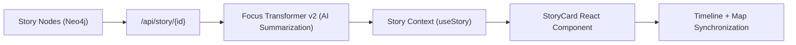

<div align="center">

# 📖 **Story Nodes — Narrative Graph & Temporal Explorer**  
`web/src/features/story/README.md`

**Purpose:**  
Bring **history to life** through interconnected story nodes that merge text, time, and geography.  
This feature renders AI-enhanced narratives (from the KFM knowledge graph) as **interactive cards**, synchronizing them with **timeline**, **map**, and **Focus Mode** components in a FAIR+CARE-aligned interface.

[](../../../docs/)
[](../../../LICENSE)
[](../../../docs/standards/)
[](#)

</div>

---

## 📘 Overview

The **Story Node** system links **events**, **people**, **places**, and **documents** into cohesive, explorable narratives.  
Each node follows the [Story Node JSON Schema](../../../schemas/story-node.schema.json) and is enriched by the **Focus Transformer v2** to provide AI-generated summaries and ethical context.

**Core Goals**
- 🧩 Merge structured graph data with human-readable narrative.  
- 🗺️ Synchronize story rendering with map & timeline.  
- 🧠 Summarize related entities via Focus AI.  
- ♻️ Maintain FAIR+CARE ethics, accessibility, and traceability.  

---

## 🗂️ Directory Layout

```plaintext
web/
└─ src/
   └─ features/
      └─ story/
         README.md              # This file — Story Nodes overview
         story-card.tsx         # Renders narrative cards
         story-context.ts       # Context for story state and selected node
         useStory.ts            # Hook for fetching and caching story data
         story-service.ts       # API calls to /api/story and focus summaries
         story-metadata.json    # Story schema reference and version metadata
         utils/
         ├─ formatters.ts       # Markdown → HTML + link handling
         └─ governance.ts       # CARE tags & visibility filters
```

---

## 🧩 Story Node Schema

Story nodes follow the **MCP-DL story-node schema** (based on `designing-schema-for-story-nodes.md`).  
Each node represents a **narrative unit** combining text, geometry, and time range.

### Example (`story-node.json`)
```json
{
  "id": "story-fort-larned-1859",
  "type": "story-node",
  "title": "Fort Larned on the Santa Fe Trail",
  "summary": "Established in 1859, Fort Larned protected the Santa Fe Trail and was a site of peace treaty councils.",
  "narrative": {
    "body": "Fort Larned stood as a frontier post during an era of transition...",
    "format": "text/markdown"
  },
  "spacetime": {
    "geometry": { "type": "Point", "coordinates": [-99.219, 38.183] },
    "when": { "start": "1859-01-01", "end": "1878-12-31", "precision": "year" }
  },
  "relations": [
    { "rel": "mentions", "target": "event-medicine-lodge-1867" },
    { "rel": "located_in", "target": "place-pawnee-county" }
  ],
  "stac": {
    "collection": "historic-sites",
    "assets": [
      { "href": "pmtiles://datasets/settlements.pmtiles", "roles": ["data"], "type": "application/vnd.pmtiles" }
    ]
  },
  "governance": { "care_tag": "public" }
}
```

> Each story node can reference map layers or documents and automatically inherit Focus Mode explainability metadata.

---

## ⚙️ Data Flow



**Lifecycle**
1. User selects an event/person on map or timeline.  
2. `useStory()` fetches node and AI summary.  
3. StoryCard renders text, images, and links.  
4. Related items link to other story nodes (narrative graph).  
5. Telemetry logs entity type, latency, and ethical compliance.

---

## 🖥️ React Component — `StoryCard`

```tsx
export function StoryCard({ node }) {
  return (
    <article aria-labelledby={`${node.id}-title`} className="story-card">
      <h2 id={`${node.id}-title`}>{node.title}</h2>
      <p>{node.summary}</p>
      <section dangerouslySetInnerHTML={{ __html: node.narrative.body }} />
      <footer>
        <span>🕰 {node.spacetime.when.start} – {node.spacetime.when.end}</span>
        <span>📍 {node.spacetime.geometry.coordinates.join(', ')}</span>
      </footer>
    </article>
  );
}
```

**Accessibility:**  
Uses semantic HTML (`<article>`, `<section>`, `<footer>`) and ARIA labels; compatible with screen readers and keyboard navigation.

---

## 🧭 Timeline & Map Synchronization

Story nodes align with **timeline year** and **map focus** automatically:
- When `currentYear` intersects `story.spacetime.when`, the card becomes visible.  
- Related locations highlight on the map (via `map.addLayerHighlight()`).  
- Clicking a story on the map opens the corresponding card in Focus Mode.  

> *Performance Tip:* Use lazy loading for narrative content to avoid blocking render during fast timeline scrubs.

---

## 📊 Telemetry & FAIR+CARE Governance

Telemetry and governance are logged per node render or interaction.

```json
{
  "event": "story-view",
  "story_id": "story-fort-larned-1859",
  "timestamp": "2025-11-08T14:35:00Z",
  "user_role": "public",
  "latency_ms": 128,
  "governance": "public"
}
```

### Governance Tags
| Tag | Description | Behavior |
|-----|-------------|-----------|
| `public` | Open access. | Shown normally. |
| `restricted` | Sensitive or licensed. | Mask text, allow title. |
| `sensitive` | Private cultural heritage. | Hide node entirely. |

All story nodes undergo **ethical review** per FAIR+CARE Council before publication.

---

## 🧮 Markdown & Media Rendering

| Feature | Implementation |
|----------|----------------|
| Markdown → HTML | `formatters.ts` using `marked` parser. |
| Inline Media | `story-node.narrative.media` array with captions. |
| Hyperlinks | Internal links resolved to other story nodes. |
| Lazy Loading | IntersectionObserver for off-screen cards. |

---

## ♿ Accessibility Highlights

- Text zoom and high-contrast themes supported.  
- ARIA roles: `region`, `article`, `navigation`, `heading`.  
- Narratives are `aria-live="polite"` updated during Focus Mode transitions.  
- Keyboard shortcuts: `←/→` = next/previous story, `Esc` = close.  

---

## 🧾 Internal Citation

```text
Kansas Frontier Matrix (2025). Story Nodes — Narrative Graph & Temporal Explorer (v9.9.0).
Integrates AI narratives, geospatial context, and ethical governance for historical storytelling.
FAIR+CARE and MCP-DL v6.3 compliant web component within the Kansas Frontier Matrix.
```

---

## 🕰️ Version History

| Version | Date       | Author | Summary |
|--------:|------------|--------|----------|
| v9.9.0 | 2025-11-08 | `@kfm-web` | Established Story Node feature with AI narrative rendering and FAIR+CARE tagging. |
| v9.8.0 | 2025-11-05 | `@kfm-ui` | Timeline synchronization and accessibility hooks. |
| v9.7.0 | 2025-11-01 | `@kfm-core` | Base schema integration and Focus Mode linkages. |

---

<div align="center">

**Kansas Frontier Matrix**  
*Living Narratives × FAIR+CARE Ethics × Transparent Storytelling*  
© 2025 Kansas Frontier Matrix · Master Coder Protocol v6.3 · FAIR+CARE Certified · Diamond⁹ Ω / Crown∞Ω Ultimate Certified  

[Back to Web Features](../README.md) · [Governance Charter](../../../docs/standards/governance/DATA-GOVERNANCE.md)

</div>

