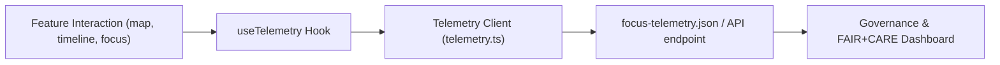

<div align="center">

# 📡 **Web Telemetry — Performance, FAIR+CARE & Sustainability Metrics**  
`web/src/features/telemetry/README.md`

**Purpose:**  
Track and visualize **frontend performance, energy efficiency, accessibility, and FAIR+CARE governance compliance** across the Kansas Frontier Matrix (KFM) web interface.  
This module enables **transparent monitoring**, **ethical accountability**, and **data-driven optimization** under the **Master Coder Protocol v6.3**.

[](../../../docs/)
[](../../../LICENSE)
[](../../../docs/standards/)
[](#)

</div>

---

## 📘 Overview

The **Web Telemetry system** collects runtime and interaction metrics from all major user features — **Map**, **Timeline**, **Focus Mode**, **Story**, and **Search**.  
It serves two primary roles:
1. 🧩 **Operational Monitoring:** track FPS, latency, memory, and API performance.  
2. ⚖️ **Governance & FAIR+CARE Auditing:** log ethical visibility, user roles, and accessibility compliance.

All telemetry outputs are streamed to **`focus-telemetry.json`** and summarized in **Grafana dashboards** within KFM’s governance pipeline.

---

## 🗂️ Directory Layout

```plaintext
web/
└─ src/
   └─ features/
      └─ telemetry/
         README.md            # This file — telemetry overview
         telemetry.ts         # Core event logger & batching client
         useTelemetry.ts      # React hook for feature-level logging
         reporters.ts         # Prebuilt metric reporters (FPS, A11y, Energy)
         dashboard.tsx        # Optional Grafana-style visualization panel
         schema.json          # Telemetry event schema (web-telemetry-v1)
```

---

## ⚙️ Core Architecture



**Key Components**
- `telemetry.ts` — batching client and schema validator.  
- `useTelemetry.ts` — React hook to log interactions with context.  
- `reporters.ts` — collects device, FPS, accessibility, and power usage metrics.  
- `dashboard.tsx` — renders summary tables and live performance plots.  

---

## 🧩 Example Event Schema

Telemetry follows `schemas/telemetry/web-telemetry-v1.json`.

```json
{
  "event": "map-interaction",
  "feature": "timeline",
  "timestamp": "2025-11-08T15:01:00Z",
  "latency_ms": 134,
  "fps": 59,
  "energy_wh": 0.018,
  "user_role": "public",
  "governance": "approved",
  "faircare": {
    "a11y_compliant": true,
    "ethical_tag": "public"
  }
}
```

---

## 🧮 Usage — Logging with `useTelemetry`

### Hook Example

```tsx
import { useTelemetry } from './useTelemetry';

export function TimelineSlider({ year, setYear }) {
  const { log } = useTelemetry('timeline');

  const onChange = (e) => {
    const y = parseInt(e.target.value, 10);
    setYear(y);
    log('timeline-scrub', { year: y });
  };

  return (
    <input type="range" min={1700} max={2025} value={year} onChange={onChange} />
  );
}
```

**Output**
```json
{ "event": "timeline-scrub", "feature": "timeline", "year": 1856, "timestamp": "2025-11-08T15:03:00Z" }
```

---

## 📊 Built-in Reporters

### FPS & Render Latency
Measures rendering performance and animation stability.
```ts
export function reportFPS() {
  let lastFrame = performance.now(), frames = 0;
  const loop = (t: number) => {
    frames++;
    if (t - lastFrame >= 1000) {
      logTelemetry({ event: 'fps', fps: frames });
      frames = 0;
      lastFrame = t;
    }
    requestAnimationFrame(loop);
  };
  requestAnimationFrame(loop);
}
```

### Accessibility Reporter
Checks for missing ARIA labels, color contrast, and focus visibility.
```ts
export function reportA11yIssues() {
  const unlabeled = document.querySelectorAll('img:not([alt])').length;
  if (unlabeled > 0) {
    logTelemetry({ event: 'a11y-warning', details: { unlabeled } });
  }
}
```

### Energy Reporter
Estimates client-side energy usage (Wh) for sustainable analytics.
```ts
export function reportEnergyUsage(ms: number) {
  const wh = (ms / 1000) * 0.000012; // estimated browser draw cost
  logTelemetry({ event: 'energy', energy_wh: wh });
}
```

---

## ⚖️ FAIR+CARE Governance Logging

Telemetry extends ethical governance validation into runtime:

| Attribute | Description | Example |
|------------|--------------|----------|
| `user_role` | Current authenticated user category | `public`, `editor`, `admin` |
| `governance` | CARE compliance status | `approved`, `restricted`, `sensitive` |
| `faircare.a11y_compliant` | Accessibility validation result | `true` |
| `faircare.ethical_tag` | CARE classification | `public` |
| `faircare.energy_efficiency` | Average energy usage threshold | `≤ 25 Wh/build` |

Logs are stored and versioned with each release for transparency.

---

## ♻️ Integration Summary

| Feature | Metrics Tracked | Emitted Events |
|----------|----------------|----------------|
| **Map** | FPS, zoom, pan, layer toggles | `map-interaction`, `map-layer` |
| **Timeline** | Slider latency, frame performance | `timeline-scrub`, `timeline-play` |
| **Focus Mode** | AI latency, confidence drift | `focus-select`, `ai-summary` |
| **Story** | View count, markdown render time | `story-view`, `story-link-click` |
| **Search** | Query latency, results count | `search`, `search-result` |

All telemetry events share a common structure: `{ event, feature, timestamp, ... }`

---

## 🧠 Governance Dashboard Integration

Telemetry output feeds KFM’s FAIR+CARE dashboards, combining:
- Real-time energy & latency data.  
- Accessibility scoring.  
- Role-based visibility compliance metrics.  

Dashboards are hosted via **Grafana** or **ObservableHQ**, querying telemetry logs in:
```
releases/v9.9.0/focus-telemetry.json
```

---

## ♿ Accessibility Metrics

Telemetry also validates WCAG 2.1 AA standards:
- ARIA compliance rates (`a11y_pass_rate ≥ 98%`).  
- Keyboard navigation test coverage.  
- Color contrast success ratio.  
- Reduced motion preference adherence.  

Reports stored under `reports/audit/ui_a11y_summary.json`.

---

## 🧾 Internal Citation

```text
Kansas Frontier Matrix (2025). Web Telemetry — Performance, FAIR+CARE & Sustainability Metrics (v9.9.0).
Implements cross-feature telemetry logging for performance, accessibility, and ethical governance auditing under MCP-DL v6.3.
```

---

## 🕰️ Version History

| Version | Date       | Author | Summary |
|--------:|------------|--------|----------|
| v9.9.0 | 2025-11-08 | `@kfm-web` | Added full telemetry hooks for map, timeline, focus, story, and search modules. |
| v9.8.0 | 2025-11-05 | `@kfm-ui` | Integrated Grafana dashboard pipeline and energy tracking. |
| v9.7.0 | 2025-11-01 | `@kfm-core` | Established baseline telemetry and governance schema. |

---

<div align="center">

**Kansas Frontier Matrix**  
*Sustainable Telemetry × FAIR+CARE Governance × Transparent Performance*  
© 2025 Kansas Frontier Matrix · Master Coder Protocol v6.3 · FAIR+CARE Certified · Diamond⁹ Ω / Crown∞Ω Ultimate Certified  

[Back to Web Features](../README.md) · [Governance Charter](../../../docs/standards/governance/DATA-GOVERNANCE.md)

</div>
