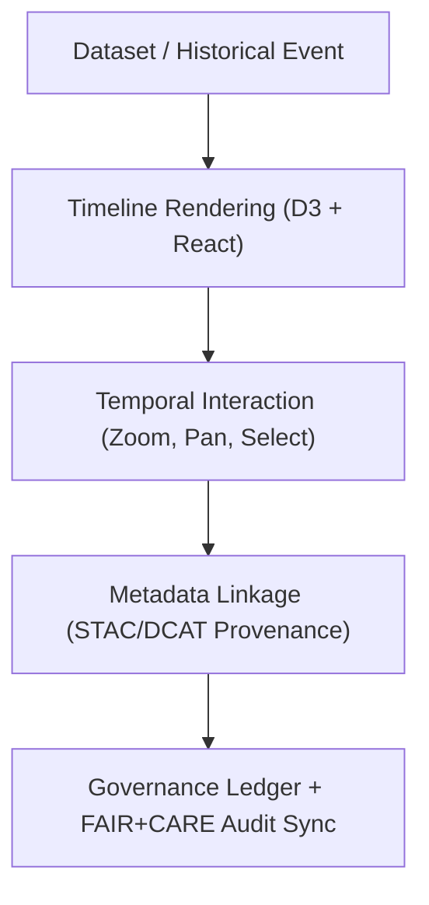

<div align="center">

# 🕰️ **Kansas Frontier Matrix — Timeline Feature Module (v2.1.1 · Tier-Ω+∞ Certified)**  
`web/src/features/timeline/README.md`

**Mission:** Deliver a FAIR+CARE-compliant, accessible, and interactive **timeline visualization system**  
for the **Kansas Frontier Matrix (KFM)** web application — linking historical events, datasets, and AI-driven insights  
to a unified temporal interface.

[](../../../../docs/)
[](../../../../docs/standards/faircare-validation.md)
[](../../../../docs/standards/accessibility.md)
[](../../../../LICENSE)

</div>

---

## 📚 Overview

The **Timeline Feature Module** powers the temporal visualization system of the Kansas Frontier Matrix (KFM) web app.  
It synchronizes historical events, environmental data, and AI-derived insights along a **reactive D3-powered timeline**,  
integrated with the **MapLibre** spatial view for complete spatiotemporal context.

Core objectives:
- 🧭 Display time-bound datasets (events, hazards, treaties, AI summaries).  
- 🧩 Synchronize temporal selections with map layers and Focus Mode.  
- ♿ Ensure accessibility, keyboard navigation, and contrast validation (WCAG 2.1 AA).  
- 📜 Provide FAIR+CARE metadata for all temporal entities and datasets.  

---

## 🗂️ Directory Layout

```bash
web/src/features/timeline/
├── README.md                       # This file — Timeline feature module documentation
│
├── slider/                         # Interactive D3 timeline slider components
│   ├── timeline-slider.tsx          # Primary timeline range slider
│   ├── timeline-scale.ts            # D3 scale definitions and transitions
│   └── tooltip.tsx                  # Date range tooltips with provenance details
│
├── events/                         # Temporal event rendering and data binding
│   ├── event-markers.tsx            # Plot historical or dataset events on the timeline
│   ├── event-groups.tsx             # Group and cluster events by type
│   └── event-details.tsx            # Detail drawer with linked STAC/DCAT metadata
│
└── hooks/                          # Timeline state and interaction logic
    ├── use-timeline-state.ts        # Synchronizes timeline + map selections
    ├── use-timeline-zoom.ts         # Handles zoom/scroll gestures and scale snapping
    └── use-provenance-sync.ts       # Links timeline events with governance ledger entries
```

---

## ⚙️ Timeline Governance Model


<!-- END OF MERMAID -->

---

## 🧱 Core Components

| Component | Description | FAIR+CARE Function | Validation Workflow |
|:--|:--|:--|:--|
| **Timeline Slider** | Interactive D3 slider with adjustable time range. | Findable + Accessible | `ui-validate.yml` |
| **Event Markers** | Points representing key historical or dataset events. | Transparency + Ethics | `stac-validate.yml` |
| **Event Groups** | Clusters related datasets or events into logical groups. | Reusability + Responsibility | `policy-check.yml` |
| **Event Details Drawer** | Displays event info, provenance, and related resources. | Provenance + Authority to Control | `faircare-validate.yml` |

---

## 🧠 FAIR + CARE Integration

| Principle | Implementation | Validation |
|:--|:--|:--|
| **Findable** | Timeline events linked to STAC/DCAT metadata IDs. | `stac-validate.yml` |
| **Accessible** | Keyboard + screen-reader navigation for all event markers. | `design-validate.yml` |
| **Interoperable** | D3 + React JSON schema alignment for reproducible rendering. | `policy-check.yml` |
| **Reusable** | Timeline components share standardized props and schemas. | `ui-validate.yml` |
| **Collective Benefit (CARE)** | Inclusive representation of Indigenous and archival events. | `faircare-validate.yml` |

---

## 🧩 Accessibility Standards

| Category | Implementation | Validation |
|:--|:--|:--|
| **Keyboard Control** | Arrow + tab key navigation between timeline events. | `design-validate.yml` |
| **Color Contrast** | ≥ 4.5:1 for all markers and lines. | `design-validate.yml` |
| **Focus Mode Sync** | Event selection syncs with Focus Mode for context expansion. | `ui-validate.yml` |
| **Screen Reader Support** | Event details and ranges announced via ARIA live region. | `docs-validate.yml` |

---

## 🔍 Provenance Integration

| Artifact | Purpose | Path |
|:--|:--|:--|
| **STAC Item Metadata** | Spatiotemporal dataset linkage. | `data/stac/items/` |
| **DCAT Catalog** | Dataset registry and discoverability. | `data/meta/dcat_catalog.json` |
| **Governance Ledger** | Temporal audit record and checksum verification. | `data/reports/audit/data_provenance_ledger.json` |

Each event marker embeds a reference to its STAC `id` and governance ledger entry for  
transparent traceability within Focus Mode and FAIR+CARE council reviews.

---

## 🧾 Observability Metrics

| Metric | Description | Target | Workflow |
|:--|:--|:--|:--|
| **Event Rendering Time** | Avg. D3 rendering per 100 events. | ≤ 0.8s | `ui-validate.yml` |
| **Accessibility Score (WCAG)** | A11y compliance rating. | ≥ 95 | `design-validate.yml` |
| **Metadata Link Validity** | STAC/DCAT linkage success rate. | 100% | `stac-validate.yml` |
| **Governance Ledger Sync Rate** | Provenance linkage accuracy. | 100% | `governance-ledger.yml` |

---

## 🧾 Example Metadata Block

```yaml
---
feature_id: "web_feature_timeline_v2.1.1"
authors: ["@kfm-web"]
faircare_status: "Tier-Ω+∞ Verified"
checksum: "sha256:fae13b9ac3b4e77f..."
governance_ledger_entry: "data/reports/audit/data_provenance_ledger.json"
accessibility_compliance: "WCAG 2.1 AA"
license: "MIT"
---
```

---

## 🧩 Validation Workflows

| Workflow | Purpose | Output |
|:--|:--|:--|
| `ui-validate.yml` | Validates rendering performance and event state sync. | `reports/validation/ui_validation.json` |
| `design-validate.yml` | Runs accessibility (WCAG 2.1 AA) validation. | `reports/validation/a11y_validation.json` |
| `stac-validate.yml` | Confirms metadata link accuracy. | `reports/validation/stac_validation_report.json` |
| `faircare-validate.yml` | Verifies ethical and cultural representation. | `reports/fair/data_care_assessment.json` |
| `governance-ledger.yml` | Logs checksum and provenance metadata. | `data/reports/audit/data_provenance_ledger.json` |

---

## 🕰 Version History

| Version | Date | Author | Summary |
|:--|:--|:--|:--|
| **v2.1.1** | 2025-11-16 | @kfm-web | Added FAIR+CARE governance integration, Focus Mode synchronization, and accessibility metrics. |
| v2.0.0 | 2025-10-25 | @kfm-architecture | Introduced event grouping and provenance syncing hooks. |
| v1.0.0 | 2025-10-04 | @kfm-docs | Initial timeline visualization documentation. |

---

<div align="center">

**Kansas Frontier Matrix © 2025**  
*“Time Connects All Stories — Provenance Keeps Them Honest.”*  
📍 `web/src/features/timeline/README.md` — FAIR+CARE-governed timeline module documentation for the Kansas Frontier Matrix.

</div>

