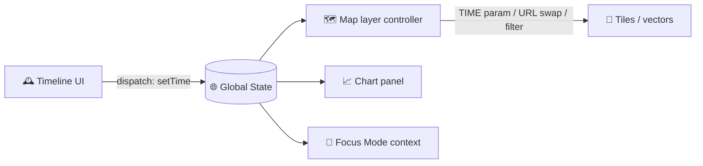

# 🕰️ Timeline (Temporal Navigation) — `web/src/features/timeline/`


> **One sentence:** The Timeline feature provides a **global “time cursor”** for the app — moving it updates **time-aware map layers**, **charts**, and **Focus Mode context** (when active). 🧭

---

## ✨ What this feature does

### Core UX
- **Scrubber/slider** with **discrete steps** (tick marks) for available dates 🧷
- **Step controls** (`<< < > >>`) to move one time-step at a time ⏪⏩
- **Play/Pause** animation loop to “flip-book” a phenomenon across time ▶️⏸️
- **Date picker / manual entry** for precision 🎯
- **Irregular time-series support** (e.g., satellite captures not exactly every N days) — timeline steps only where data exists 🛰️
- Optional: **time-range zoom** (scale changes when the time range changes) 🔎

### What Timeline *does not* do (by design)
- ❌ It should not be responsible for **business logic** of how a layer renders at time *t*.
- ❌ It should not directly query the **graph database** (all data goes through governed APIs).
- ❌ It should not surface dates/times for content that is not **provenance-linked** and approved for the current view mode (esp. Focus Mode).

---

## 🧠 Mental model

Think of Timeline as a **single source of truth** for “what time is it?” in the UI.



---

## 🧩 Integration points

### 1) Global state (Redux)
Timeline is typically wired to global state so that **any** part of the UI can react:
- Map layer renderers
- Chart highlight cursor
- Numeric readouts (“current NDVI = X”)
- Focus Mode “story-in-context” panels

✅ **Rule of thumb:** Timeline dispatches **intent** (`setCurrentTime` / `setIsPlaying`) and downstream systems subscribe to the state.

---

### 2) Map layers (2D + optional 3D)
When time changes, map layers update in one of these common strategies:

#### A) WMS/WMTS time dimension (preferred when supported)
- Send a `TIME=...` (or equivalent) parameter with tile/image requests.

#### B) URL swap (date embedded in path/query)
- Example: `.../ndvi/{date}/{z}/{x}/{y}.png`
- Changing date triggers tile reload.

#### C) Vector filtering / source swap
- Filter features by date, or load a new GeoJSON/source for the selected time step.

> 💡 **Important:** Timeline should be fast to scrub. If layer updates are expensive, treat slider movement as:
> - **Preview / scrub** (cheap UI updates)
> - **Commit** (on release) to trigger heavy map reloads

---

### 3) Charts & analytics panels
Charts typically:
- Render the full time series, then
- Highlight the chosen time with a **vertical cursor line** or a **selected point**

This keeps temporal context visible even while scrubbing.

---

### 4) Focus Mode (Story Node + Map + Timeline)
Focus Mode is the “read a story with context” experience:
- Story Node in one panel
- Map + Timeline showing only provenance-linked assets in the other panels

✅ Timeline must behave like a **trust boundary** here:
- Only show time steps that correspond to **cataloged** data used in the Focus Mode bundle
- Never “invent” dates, layers, or intermediate states

---

## 📦 Data contract expectations

Timeline needs **a list of available time steps** (per dataset / per layer), coming from:
- A governed API endpoint (contract-first), **or**
- A precomputed timeline config bundle (JSON) shipped with the web app

### Recommended representation
- Use **ISO 8601** date/time strings (`YYYY-MM-DD` or full timestamp with `Z`)
- Keep internal comparisons in UTC to avoid timezone drift

### Example (illustrative) timeline config
```json
{
  "layerId": "ndvi",
  "availableTimes": ["2018-01-01", "2018-02-01", "2018-03-01"],
  "defaultTime": "2018-02-01",
  "labelFormat": "MMM yyyy",
  "stepBehavior": "discrete"
}
```

---

## 🗂️ Suggested folder layout (feature-first)

> Your exact filenames may vary — this is the *recommended* shape for maintainability.

```text
📁 web/src/features/timeline/
├── 📄 README.md
├── 📁 components/
│   ├── 📄 TimelineSlider.tsx
│   ├── 📄 TimelineControls.tsx
│   └── 📄 TimelineDatePicker.tsx
├── 📁 hooks/
│   └── 📄 useTimeline.ts
├── 📁 store/
│   └── 📄 timelineSlice.ts
├── 📁 utils/
│   ├── 📄 timeFormat.ts
│   ├── 📄 timeSteps.ts
│   └── 📄 clampIndex.ts
└── 📁 __tests__/
    ├── 📄 timelineSlice.test.ts
    └── 📄 timeline.integration.test.ts
```

---

## 🧰 “Add a new temporal layer” checklist ✅

### 1) Data readiness (pipeline + provenance)
- The layer’s assets must exist in catalogs (e.g., STAC/DCAT) with temporal metadata.
- If the dataset is sensitive/restricted, ensure redaction/classification rules are already enforced upstream.

### 2) API contract-first (if timeline steps come from backend)
- Define/extend the API contract first (OpenAPI/GraphQL).
- Implement server logic + tests.
- Ensure the endpoint returns:
  - Available times (sorted)
  - Optional default time
  - Any redaction constraints (e.g., missing steps)

### 3) UI registry/config
- Add the layer to the UI layer registry/config.
- Ensure the layer includes:
  - Provenance link (source citations / IDs)
  - Legend/info popup citing the dataset source
  - Time behavior (WMS time param vs URL swap vs vector filter)

### 4) Timeline integration
- Connect the layer to the global `currentTime`.
- Verify:
  - Scrubbing updates the map layer correctly
  - Chart cursor updates (if applicable)
  - Focus Mode only shows provenance-linked time steps

---

## ♿ Accessibility expectations
- Slider is keyboard operable:
  - `←/→` = step
  - `Shift + ←/→` = bigger step
  - `Home/End` = first/last step
- Buttons have labels (not icon-only), or icon buttons include `aria-label`
- Visible focus states in high-contrast mode

---

## 🧪 Testing strategy
- **Unit tests**
  - time parsing/formatting
  - discrete stepping logic
  - reducer state transitions (play/pause, set time, clamp index)
- **Integration tests**
  - “changing time triggers layer update”
  - “changing time updates chart cursor”
- **E2E (recommended)**
  - Play animation for N steps without crashes
  - Scrub quickly without UI lockups
  - Irregular time list behaves (no intermediate phantom steps)

---

## 🧯 Troubleshooting
- **Map doesn’t change when timeline changes**
  - Confirm the layer is time-enabled and subscribed to `currentTime`
  - Confirm the layer update strategy (TIME param vs URL swap vs filter) is implemented
- **Slider shows dates that have no data**
  - Ensure `availableTimes` comes from the real catalog/API for that layer
  - For irregular series, use discrete list stepping only
- **Animation is choppy**
  - Consider caching or prefetching adjacent time steps
  - Avoid triggering expensive reloads on every drag event (use “commit” on release)

---

## 🔗 Related docs (repo)
- 📘 Master Guide: `docs/MASTER_GUIDE_v13.md`
- 🧠 Story Nodes / Focus Mode rules: `docs/templates/` and `docs/reports/story_nodes/`
- ⚖ Governance: `docs/governance/`
- 📜 API contracts: `src/server/contracts/`
- 🧾 UI schemas/config: `schemas/ui/` (if present)

---

## 🧭 Future ideas (nice-to-have)
- Range brushing (start/end) for comparative windows 📏
- Multi-layer sync groups (e.g., lock NDVI + rainfall to same cursor) 🔗
- “Bookmark” time moments for story playback ⭐
- Performance telemetry hooks (playback FPS, tile latency) 📊