<div align="center">

# 🕰️ **Kansas Frontier Matrix — Timeline Feature Architecture**  
`web/src/features/timeline/README.md`

**Purpose:**  
Define the **Diamond⁹ Ω / Crown∞Ω Ultimate Certified deep architecture** for the Timeline feature in the Kansas Frontier Matrix (KFM) v10.3.2 web platform.  
This module binds **temporal navigation** (slider, playback, bands) to **MapLibre** and **Cesium** style layers, synchronizes with **Focus Mode v2.5**, **Story Nodes**, and **Diff-First** views, and enforces **FAIR+CARE**, **WCAG 2.1 AA**, and **MCP-DL v6.3** compliance.

[]()  
[]()  
[]()  
[]()

</div>

---

## 📘 Overview

The **Timeline Feature** provides:

- A **global temporal control** (`currentYear` and ranges)  
- Real-time binding of **year** to **MapLibre/Cesium** style variables & filters  
- Integration with **Diff-First Entity** modules (change over releases)  
- Temporal alignment with **Focus Mode v2.5** and Story Nodes  
- Predictive-band support (2030–2100 SSP scenarios)  
- FAIR+CARE-aware temporal masking and governance cues  
- Accessibility-first temporal UI (keyboard, screenreader, high-contrast)  
- Telemetry emission for temporal interactions and energy modeling  

The Timeline feature is the primary **time-navigation plane** for KFM.

---

## 🗂️ Directory Layout

```text
web/src/features/timeline/
├── README.md
├── timeline.ts             # Binding logic, style variable integration, telemetry hooks
├── slider.tsx              # React slider UI (WCAG-compliant)
├── styles/
│   ├── timeline-style.json # MapLibre style with temporal expressions
│   └── palette.json        # Era palettes and temporal token definitions
└── datasets/
    ├── landcover.pmtiles
    ├── hydrology.pmtiles
    └── settlements.pmtiles
````

---

## 🧩 High-Level Timeline Architecture

```mermaid
flowchart TD
    UI[Slider · Controls] --> TLSTATE[Timeline State<br/>currentYear · bands]
    TLSTATE --> MAPARB[Map Binding<br/>MapLibre · Cesium]
    TLSTATE --> FOCUSALIGN[Focus Mode Align]
    TLSTATE --> STORYALIGN[Story Node Align]
    TLSTATE --> DIFFSYNC[Diff-First Sync]
    TLSTATE --> TEL[Telemetry Emit]
    TLSTATE --> GOV[Governance Check<br/>FAIRCARE temporal rules]
```



---

## 🧬 Timeline State Model

The **Timeline State** exposes:

* `currentYear` — primary year for all temporal expressions
* `range` — selected time window (for brushing)
* `mode` — historic | predictive | mixed
* `playback` — playing | paused
* `bands` — predictive period definitions (2030–2050, 2050–2100)

```ts
export type TimelineState = {
  currentYear: number;
  range?: { start: number; end: number };
  mode: "historic" | "predictive" | "mixed";
  playback: "playing" | "paused";
  bands?: { label: string; start: number; end: number; predictive: boolean }[];
};
```

---

## 🗺️ Temporal Binding to MapLibre & Cesium

The Timeline feature controls map rendering via:

* **style variables** (preferred) in `timeline-style.json`
* **fallback filter updates** when style vars are unavailable


### Style Variable Example (`timeline-style.json`)

```json
{
  "version": 8,
  "metadata": { "vars": { "currentYear": 1900 } },
  "sources": {
    "settlements": { "type": "vector", "url": "pmtiles://datasets/settlements.pmtiles" }
  },
  "layers": [
    {
      "id": "settlements-dots",
      "type": "circle",
      "source": "settlements",
      "source-layer": "settlements",
      "filter": ["all",
        ["<=", ["get","year_start"], ["var","currentYear"]],
        [">=", ["coalesce", ["get","year_end"], 9999], ["var","currentYear"]]
      ]
    }
  ]
}
```

---

## ⚙️ Binding Logic — `timeline.ts`

Key responsibilities:

* Provide `initTimeline(map, initialYear)`
* Bind `currentYear` to style variable or fallback filters
* Dispatch `kfm:timeline:year` events
* Integrate telemetry & governance checks

```ts
import maplibregl from "maplibre-gl";

export function initTimeline(map: maplibregl.Map, initialYear = 1900) {
  if ((map as any).setStyleVar) (map as any).setStyleVar("currentYear", initialYear);
  (map as any).__currentYear = initialYear;

  function setYear(year: number) {
    (map as any).__currentYear = year;
    if ((map as any).setStyleVar) {
      (map as any).setStyleVar("currentYear", year);
    } else {
      updateFiltersFallback(map, year);
    }
    window.dispatchEvent(
      new CustomEvent("kfm:timeline:year", { detail: { year } })
    );
  }

  function getYear() {
    if ((map as any).getStyleVar) {
      return (map as any).getStyleVar("currentYear") as number;
    }
    return (map as any).__currentYear ?? initialYear;
  }

  return { setYear, getYear };
}
```

---

## 🎚 Slider UI — `slider.tsx`

The slider must be:

* keyboard operable
* labeled with ARIA attributes
* visually focusable
* compatible with reduced-motion

```tsx
import React from "react";

export function YearSlider({
  year,
  setYear,
  min = 1700,
  max = 2100
}: {
  year: number;
  setYear: (y: number) => void;
  min?: number;
  max?: number;
}) {
  return (
    <section aria-labelledby="timeline-heading" className="timeline-slider">
      <h2 id="timeline-heading">Interactive Timeline</h2>
      <label>
        <span className="sr-only">Year</span>
        <input
          type="range"
          min={min}
          max={max}
          value={year}
          onChange={(e) => setYear(parseInt(e.target.value, 10))}
          aria-valuenow={year}
          aria-valuemin={min}
          aria-valuemax={max}
          aria-label="Timeline year"
        />
      </label>
      <p aria-live="polite">Year: {year}</p>
    </section>
  );
}
```

---

## 🔁 Interaction with Focus Mode & Story Nodes

When **Focus Mode** selects an event with a known date:

* Timeline snaps `currentYear` to that event’s temporal anchor
* predictive/historic bands adjust to include the event
* Story Node context updates accordingly

```mermaid
flowchart TD
    FSELECT[Focus Event Selection] --> DATE[Extract Event Date]
    DATE --> SETY[setYear(currentYear)]
    SETY --> MAPSYNC[Map Temporal Filter]
    SETY --> STORYSYNC[Story Node Focus]
```

---

## 🔐 FAIR+CARE Temporal Governance

Temporal governance includes:

* masking sensitive periods as redacted bands
* providing warnings around trauma-heavy eras
* ensuring predictive overlays are labeled as scenarios


Governance metadata must be logged to:

```text
../../../docs/reports/audit/web-timeline-governance-ledger.json
```

---

## ♿ Accessibility Architecture (WCAG 2.1 AA)

Timeline feature must provide:

* full keyboard control for the slider
* screenreader announcements for `currentYear` and band changes
* high-contrast colors for bars & markers
* optional simplified view for cognitive load reduction


---

## 📡 Telemetry & Sustainability Integration

Timeline telemetry records:

* `timeline_year_change` events
* latency for map + focus sync
* energy estimate for scrubbing
* predictive band usage

Telemetry snapshots are appended to:

```text
../../../releases/v10.3.2/focus-telemetry.json
```

Examples of telemetry payload fields:

```json
{
  "event": "timeline_year_change",
  "year": 1880,
  "layersUpdated": 12,
  "fps": 59,
  "energy_est_wh": 0.03,
  "timestamp": "2025-11-14T21:55:00Z"
}
```

---

## ⚙️ CI / Validation Requirements

| Layer      | Validator                |
| ---------- | ------------------------ |
| Docs       | `docs-lint.yml`          |
| A11y       | `accessibility_scan.yml` |
| Governance | `faircare-validate.yml`  |
| Telemetry  | `telemetry-export.yml`   |
| Types      | TS strict mode           |
| Security   | CodeQL + Trivy           |

---

## 🧾 Example Timeline Feature Metadata Record

```json
{
  "id": "web_timeline_feature_v10.3.2",
  "min_year": 1700,
  "max_year": 2100,
  "a11y_score": 98.9,
  "care_compliance": "certified",
  "telemetry_synced": true,
  "energy_profile_wh": 0.31,
  "timestamp": "2025-11-14T22:01:00Z"
}
```

---

## 🕰️ Version History

| Version | Date       | Summary                                                                                                                                     |
| ------- | ---------- | ------------------------------------------------------------------------------------------------------------------------------------------- |
| v10.3.2 | 2025-11-14 | Deep-architecture rebuild: MapLibre/Cesium time-binding, Focus Mode alignment, predictive-band support, governance + telemetry integration. |
| v9.7.0  | 2025-11-08 | Initial KFM-ready MapLibre timeline playbook.                                                                                               |

---

<div align="center">

**Kansas Frontier Matrix — Timeline Feature Architecture**
🕰️ Temporal Intelligence · 🌐 FAIR+CARE Governance · 🔗 Provenance-Aware Time Navigation · 🧠 AI-Synchronized Narratives
© 2025 Kansas Frontier Matrix — MIT License

[Back to Web Features](../README.md)

</div>
