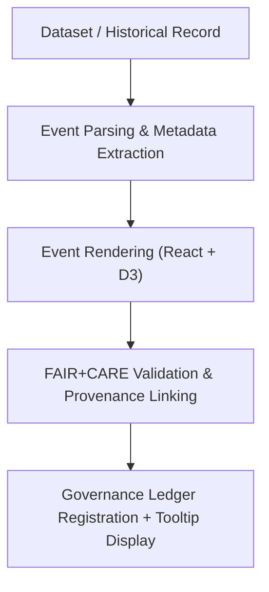

<div align="center">

# 📍 **Kansas Frontier Matrix — Timeline Events Module (v2.1.1 · Tier-Ω+∞ Certified)**  
`web/src/features/timeline/events/README.md`

**Mission:** Manage visualization and governance for **historical, environmental, and AI-derived events**  
displayed along the Kansas Frontier Matrix (KFM) timeline. Ensures every event is **FAIR+CARE-linked**,  
provenance-traceable, and accessible under WCAG 2.1 AA standards.

[](../../../../../docs/)
[](../../../../../docs/standards/faircare-validation.md)
[](../../../../../docs/standards/accessibility.md)
[](../../../../../LICENSE)

</div>

---

## 📚 Overview

The **Timeline Events Module** visualizes all temporal events in KFM — from historical treaties  
to AI-processed environmental records — providing ethical, transparent, and accessible interaction.  
It connects each event to its **FAIR+CARE metadata**, **STAC/DCAT provenance**, and **governance ledger entry**,  
ensuring every visualization on the timeline is verifiable and culturally respectful.

Core objectives:
- 📜 Display time-stamped data from FAIR+CARE-indexed datasets.  
- 🌍 Synchronize with MapLibre and Focus Mode for spatial-temporal exploration.  
- 🧩 Link every event to governance metadata and provenance logs.  
- ♿ Ensure visual and interactive accessibility under WCAG 2.1 AA.

---

## 🗂️ Directory Layout

```bash
web/src/features/timeline/events/
├── README.md                      # This file — Documentation for timeline events module
│
├── event-markers.tsx              # Renders event points or icons on the timeline
├── event-groups.tsx               # Clusters related events (e.g., treaties, climate data)
└── event-details.tsx              # Expands contextual details with provenance and FAIR+CARE info
```

---

## ⚙️ Event Governance Model


<!-- END OF MERMAID -->

---

## 🧱 Core Components

| Component | Description | FAIR+CARE Function | Validation Workflow |
|:--|:--|:--|:--|
| **Event Markers** | Displays dataset or historical events on the timeline. | Findable + Transparent | `stac-validate.yml` |
| **Event Groups** | Aggregates related datasets (e.g., droughts, treaties). | Reusability + Collective Benefit | `faircare-validate.yml` |
| **Event Details** | Expands provenance, ethical context, and data source. | Responsibility + Ethics | `governance-ledger.yml` |

---

## 🧠 FAIR + CARE Integration

| Principle | Implementation | Validation |
|:--|:--|:--|
| **Findable** | Each event references a STAC/DCAT ID and metadata path. | `stac-validate.yml` |
| **Accessible** | Event details accessible via tooltip and keyboard focus. | `design-validate.yml` |
| **Interoperable** | Metadata conforms to CIDOC CRM and JSON-LD. | `policy-check.yml` |
| **Reusable** | Component architecture reusable across datasets. | `ui-validate.yml` |
| **Collective Benefit (CARE)** | Includes ethical context and Indigenous data governance. | `faircare-validate.yml` |

---

## ♿ Accessibility Standards (WCAG 2.1 AA)

| Feature | Implementation | Validation Workflow |
|:--|:--|:--|
| **Keyboard Navigation** | Tab, arrow keys cycle through event markers. | `ui-validate.yml` |
| **Tooltips & Labels** | ARIA `role="tooltip"` and `aria-describedby` support. | `design-validate.yml` |
| **Color Contrast** | Event colors meet ≥ 4.5:1 contrast ratio. | `design-validate.yml` |
| **Screen Reader Support** | Event type and description announced live. | `docs-validate.yml` |
| **Focus Highlighting** | Visual outlines for selected events. | `design-validate.yml` |

---

## 🧩 Provenance Metadata Schema

Each event includes metadata ensuring reproducibility and traceability:

```json
{
  "id": "event_1854_treaty_kansas",
  "title": "Treaty of 1854 — Land Cession Agreement",
  "datetime": "1854-06-03T00:00:00Z",
  "description": "Cession of Kansa lands per treaty terms.",
  "stac_reference": "data/stac/items/treaties_1854.json",
  "governance_ledger": "data/reports/audit/data_provenance_ledger.json",
  "license": "Public Domain",
  "faircare_status": "CARE-Verified"
}
```

---

## 🔍 Provenance Integration & Governance Artifacts

| Artifact | Description | Path |
|:--|:--|:--|
| **STAC Items** | Dataset metadata for temporal alignment. | `data/stac/items/` |
| **DCAT Catalog** | Broader dataset interoperability. | `data/meta/dcat_catalog.json` |
| **Governance Ledger** | Provenance and checksum verification logs. | `data/reports/audit/data_provenance_ledger.json` |

---

## 🧮 Observability Metrics

| Metric | Description | Target | Workflow |
|:--|:--|:--|:--|
| **Render Time** | Average event marker draw time. | ≤ 0.6s | `ui-validate.yml` |
| **Metadata Link Accuracy** | % of events correctly linked to metadata. | 100% | `stac-validate.yml` |
| **Accessibility Score (WCAG)** | Compliance rate for ARIA roles and keyboard support. | ≥ 95 | `design-validate.yml` |
| **Governance Sync Rate** | Events with checksum entry in ledger. | 100% | `governance-ledger.yml` |

---

## 🧾 Example Component Metadata

```yaml
---
component_id: "timeline_events_v2.1.1"
authors: ["@kfm-web"]
faircare_status: "Tier-Ω+∞ Verified"
checksum: "sha256:b8d9f39a112ef8c9..."
governance_ledger_entry: "data/reports/audit/data_provenance_ledger.json"
accessibility_compliance: "WCAG 2.1 AA"
license: "MIT"
---
```

---

## 🧾 Validation Workflows

| Workflow | Function | Output |
|:--|:--|:--|
| `ui-validate.yml` | Verifies rendering, grouping, and focus behavior. | `reports/validation/ui_validation.json` |
| `design-validate.yml` | Runs accessibility tests on event tooltips and colors. | `reports/validation/a11y_validation.json` |
| `stac-validate.yml` | Confirms metadata references are valid and complete. | `reports/validation/stac_validation_report.json` |
| `faircare-validate.yml` | Audits ethical representation of cultural and environmental data. | `reports/fair/data_care_assessment.json` |
| `governance-ledger.yml` | Logs checksums and provenance data for audit. | `data/reports/audit/data_provenance_ledger.json` |

---

## 🕰 Version History

| Version | Date | Author | Summary |
|:--|:--|:--|:--|
| **v2.1.1** | 2025-11-16 | @kfm-web | Added FAIR+CARE provenance integration and event grouping logic. |
| v2.0.0 | 2025-10-25 | @kfm-architecture | Introduced tooltip governance metadata and a11y compliance features. |
| v1.0.0 | 2025-10-04 | @kfm-docs | Initial event module documentation for timeline visualization. |

---

<div align="center">

**Kansas Frontier Matrix © 2025**  
*“Every Event Leaves a Trace — Every Trace Tells a Story.”*  
📍 `web/src/features/timeline/events/README.md` — FAIR+CARE-aligned timeline events module documentation for the Kansas Frontier Matrix.

</div>

