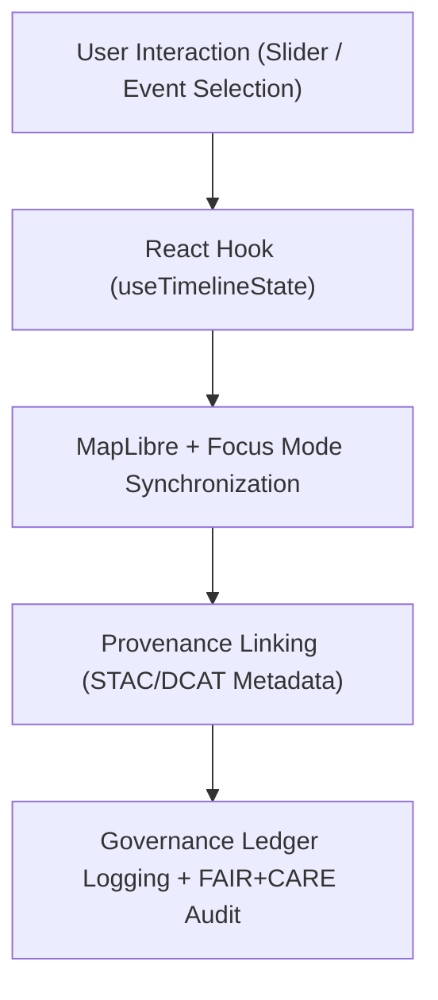

<div align="center">

# 🪝 **Kansas Frontier Matrix — Timeline Hooks Module (v2.1.1 · Tier-Ω+∞ Certified)**  
`web/src/features/timeline/hooks/README.md`

**Mission:** Provide reusable React hooks for **temporal state management, provenance linking, and AI synchronization**  
across the timeline visualization system of the **Kansas Frontier Matrix (KFM)** — ensuring accessibility, ethical design,  
and FAIR+CARE-aligned provenance integrity.

[](../../../../../docs/)
[](../../../../../docs/standards/faircare-validation.md)
[](../../../../../docs/standards/accessibility.md)
[](../../../../../LICENSE)

</div>

---

## 📚 Overview

The **Timeline Hooks Module** manages temporal state, synchronization, and accessibility for all timeline interactions  
within the Kansas Frontier Matrix (KFM). It powers **event rendering**, **timeline zoom**, and **provenance sync** logic  
using lightweight React + TypeScript patterns validated under FAIR+CARE governance.

Each hook:
- Enables **deterministic data linkage** between the timeline and MapLibre layers.  
- Incorporates **FAIR+CARE metadata validation** for events and datasets.  
- Enforces **WCAG 2.1 AA** accessibility and ARIA compliance in interactive state changes.  
- Logs provenance data to the **Governance Ledger** for reproducibility and audit trails.  

---

## 🗂️ Directory Layout

```bash
web/src/features/timeline/hooks/
├── README.md                     # This file — Documentation for timeline hooks module
│
├── use-timeline-state.ts          # Manages timeline range and event synchronization
├── use-timeline-zoom.ts           # Handles user zoom/pan gestures with scale snapping
└── use-provenance-sync.ts         # Connects temporal state changes with governance metadata
```

---

## ⚙️ Hook Governance Model


<!-- END OF MERMAID -->

---

## 🧱 Core Hooks

| Hook | Description | FAIR+CARE Function | Validation Workflow |
|:--|:--|:--|:--|
| **useTimelineState** | Manages timeline state (start, end, active range). | Findable + Accessible | `ui-validate.yml` |
| **useTimelineZoom** | Enables D3 zoom/pan with dynamic scale snapping. | Interoperable + Usability | `policy-check.yml` |
| **useProvenanceSync** | Synchronizes event selections with metadata & ledger. | Responsibility + Provenance | `faircare-validate.yml` |

---

## 🧠 FAIR + CARE Integration

| Principle | Implementation | Validation |
|:--|:--|:--|
| **Findable** | Timeline state linked to dataset IDs in STAC/DCAT catalogs. | `stac-validate.yml` |
| **Accessible** | Full ARIA and keyboard navigation integrated in hooks. | `design-validate.yml` |
| **Interoperable** | Standardized state management across React ecosystem. | `policy-check.yml` |
| **Reusable** | Hooks shared across all timeline components. | `ui-validate.yml` |
| **Collective Benefit (CARE)** | Supports cultural and ethical representation in data playback. | `faircare-validate.yml` |

---

## ♿ Accessibility Standards (WCAG 2.1 AA)

| Feature | Implementation | Validation |
|:--|:--|:--|
| **Keyboard Navigation** | Arrow keys adjust timeline range and zoom. | `ui-validate.yml` |
| **ARIA Roles** | `role="slider"` + `aria-valuetext` for temporal range. | `design-validate.yml` |
| **Screen Reader Support** | Timeline state changes announced dynamically. | `docs-validate.yml` |
| **Focus Management** | Active timeline range receives visible focus ring. | `design-validate.yml` |

---

## 🔍 Provenance & Governance Integration

| Artifact | Purpose | Path |
|:--|:--|:--|
| **STAC Items** | Temporal metadata linkage. | `data/stac/items/` |
| **DCAT Catalog** | Dataset registry and discoverability. | `data/meta/dcat_catalog.json` |
| **Governance Ledger** | Provenance checksum and audit validation. | `data/reports/audit/data_provenance_ledger.json` |

> Every timeline event logged by hooks includes a governance checksum and is validated during FAIR+CARE audits.

---

## 🧾 Example Hook Metadata

```yaml
---
hook_id: "use-timeline-state_v2.1.1"
authors: ["@kfm-web"]
faircare_status: "Tier-Ω+∞ Verified"
checksum: "sha256:92ba0cc87e51a4b5..."
governance_ledger_entry: "data/reports/audit/data_provenance_ledger.json"
accessibility_compliance: "WCAG 2.1 AA"
license: "MIT"
---
```

---

## 🧮 Observability Metrics

| Metric | Description | Target | Validation |
|:--|:--|:--|:--|
| **Render Stability** | % of consistent timeline re-renders. | ≥ 95% | `ui-validate.yml` |
| **Metadata Link Validity** | Successful provenance linkage per event. | 100% | `stac-validate.yml` |
| **Accessibility Compliance** | Lighthouse or axe-core accessibility score. | ≥ 95 | `design-validate.yml` |
| **Ledger Sync Accuracy** | Ratio of valid governance ledger entries. | 100% | `governance-ledger.yml` |

---

## 🧾 Validation Workflows

| Workflow | Function | Output |
|:--|:--|:--|
| `ui-validate.yml` | Tests hook reactivity, zoom, and state consistency. | `reports/validation/ui_validation.json` |
| `design-validate.yml` | Ensures accessibility and ARIA compliance. | `reports/validation/a11y_validation.json` |
| `stac-validate.yml` | Confirms metadata integrity across linked events. | `reports/validation/stac_validation_report.json` |
| `faircare-validate.yml` | Verifies ethical data representation and inclusivity. | `reports/fair/data_care_assessment.json` |
| `governance-ledger.yml` | Records checksum and governance provenance. | `data/reports/audit/data_provenance_ledger.json` |

---

## 🕰 Version History

| Version | Date | Author | Summary |
|:--|:--|:--|:--|
| **v2.1.1** | 2025-11-16 | @kfm-web | Added provenance synchronization and accessibility integration across all hooks. |
| v2.0.0 | 2025-10-25 | @kfm-architecture | Introduced temporal zoom logic and metadata linkage validation. |
| v1.0.0 | 2025-10-04 | @kfm-docs | Initial timeline hooks documentation and architecture. |

---

<div align="center">

**Kansas Frontier Matrix © 2025**  
*“Time Has Context — Context Has Provenance.”*  
📍 `web/src/features/timeline/hooks/README.md` — FAIR+CARE-aligned React hook documentation for the Kansas Frontier Matrix timeline module.

</div>

