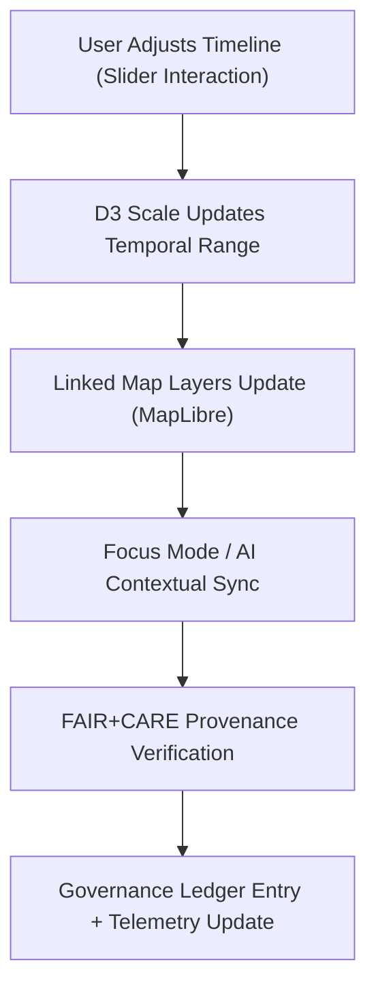

<div align="center">

# ⏩ **Kansas Frontier Matrix — Timeline Slider Module (v2.1.1 · Tier-Ω+∞ Certified)**  
`web/src/features/timeline/slider/README.md`

**Mission:** Deliver an interactive, FAIR+CARE-compliant **timeline slider** component that synchronizes  
temporal datasets, historical events, and AI-derived insights across the Kansas Frontier Matrix (KFM)  
web application while maintaining accessibility, ethical transparency, and provenance traceability.

[](../../../../../docs/)
[](../../../../../docs/standards/faircare-validation.md)
[](../../../../../docs/standards/accessibility.md)
[](../../../../../LICENSE)

</div>

---

## 📚 Overview

The **Timeline Slider Module** is the interactive control interface for navigating  
time-based data and historical events within the KFM web application.  
It integrates with the **D3 visualization engine** and **MapLibre** components to provide synchronized  
spatiotemporal navigation and ethical context via FAIR+CARE metadata linkages.

Core capabilities:
- Interactive timeline slider supporting **zoom, pan, and playback**.  
- Linked **temporal filters** for map and Focus Mode data synchronization.  
- Accessibility-first interface with keyboard and ARIA support.  
- Provenance-linked rendering using dataset metadata (STAC/DCAT).  

---

## 🗂️ Directory Layout

```bash
web/src/features/timeline/slider/
├── README.md                     # This file — Documentation for timeline slider
│
├── timeline-slider.tsx           # Main timeline slider component (D3 + React)
├── timeline-scale.ts             # Time scale generation, snapping, and zoom control
└── tooltip.tsx                   # Hover tooltip for temporal metadata and provenance
```

---

## ⚙️ Component Governance Model


<!-- END OF MERMAID -->

---

## 🧩 Core Components

| Component | Description | FAIR+CARE Role | Validation Workflow |
|:--|:--|:--|:--|
| **timeline-slider.tsx** | Interactive D3 + React slider rendering component. | Findable & Accessible | `ui-validate.yml` |
| **timeline-scale.ts** | Manages timeline scale, snapping, and zoom state. | Interoperable | `policy-check.yml` |
| **tooltip.tsx** | Displays event metadata, provenance, and STAC/DCAT links. | Ethics & Transparency | `faircare-validate.yml` |

---

## 🧠 FAIR + CARE Integration

| Principle | Implementation | Validation |
|:--|:--|:--|
| **Findable** | Temporal range linked to STAC/DCAT metadata. | `stac-validate.yml` |
| **Accessible** | Keyboard navigation and tooltip descriptions. | `design-validate.yml` |
| **Interoperable** | JSON-based time schema integrated across modules. | `policy-check.yml` |
| **Reusable** | Exposed as reusable React hook via `use-timeline-state.ts`. | `ui-validate.yml` |
| **Collective Benefit (CARE)** | Displays inclusive and culturally sensitive events. | `faircare-validate.yml` |

---

## ♿ Accessibility Standards (WCAG 2.1 AA)

| Feature | Implementation | Validation Workflow |
|:--|:--|:--|
| **Keyboard Navigation** | Arrow keys and tab order navigation for the slider. | `ui-validate.yml` |
| **Color Contrast** | ≥ 4.5:1 ratio for timeline markers and highlights. | `design-validate.yml` |
| **ARIA Roles** | `role="slider"`, `aria-valuenow`, `aria-valuetext` for range indicators. | `docs-validate.yml` |
| **Tooltip Readability** | Alt text and contextual description for each temporal event. | `faircare-validate.yml` |

---

## 🔍 Provenance & Metadata Linkage

| Artifact | Description | Location |
|:--|:--|:--|
| **STAC Item Metadata** | Temporal dataset catalog entries. | `data/stac/items/` |
| **DCAT Catalog** | Temporal dataset records for public APIs. | `data/meta/dcat_catalog.json` |
| **Governance Ledger** | Provenance ledger entries for FAIR+CARE validation. | `data/reports/audit/data_provenance_ledger.json` |

**Tooltip Integration Example:**  
Displays dataset provenance directly from metadata (STAC/DCAT) when hovering over an event.

---

## 🧮 Observability Metrics

| Metric | Description | Target | Workflow |
|:--|:--|:--|:--|
| **Render Latency** | Average time to redraw timeline after interaction. | ≤ 0.5s | `ui-validate.yml` |
| **FAIR Metadata Link Rate** | % of events with verified metadata linkage. | 100% | `stac-validate.yml` |
| **Accessibility Score (WCAG)** | Lighthouse / axe-core accessibility score. | ≥ 95 | `design-validate.yml` |
| **Governance Ledger Sync Rate** | Ledger validation entries successfully logged. | 100% | `governance-ledger.yml` |

---

## 🧾 Example Component Metadata

```yaml
---
component_id: "timeline_slider_v2.1.1"
authors: ["@kfm-web"]
faircare_status: "Tier-Ω+∞ Verified"
checksum: "sha256:c84ab77e9ac2a1f5..."
governance_ledger_entry: "data/reports/audit/data_provenance_ledger.json"
accessibility_compliance: "WCAG 2.1 AA"
license: "MIT"
---
```

---

## 🧾 Validation Workflows

| Workflow | Function | Output |
|:--|:--|:--|
| `ui-validate.yml` | Validates rendering performance and interactive state. | `reports/validation/ui_validation.json` |
| `design-validate.yml` | Runs accessibility audits for keyboard and contrast. | `reports/validation/a11y_validation.json` |
| `stac-validate.yml` | Ensures metadata linkage integrity. | `reports/validation/stac_validation_report.json` |
| `faircare-validate.yml` | Verifies ethical representation in temporal data. | `reports/fair/data_care_assessment.json` |
| `governance-ledger.yml` | Records checksum and provenance signature. | `data/reports/audit/data_provenance_ledger.json` |

---

## 🕰 Version History

| Version | Date | Author | Summary |
|:--|:--|:--|:--|
| **v2.1.1** | 2025-11-16 | @kfm-web | Added provenance-linked tooltip and FAIR+CARE audit synchronization. |
| v2.0.0 | 2025-10-25 | @kfm-architecture | Introduced D3 scale control and accessible slider behaviors. |
| v1.0.0 | 2025-10-04 | @kfm-docs | Initial timeline slider documentation and accessibility mapping. |

---

<div align="center">

**Kansas Frontier Matrix © 2025**  
*“Time Is a Layer of Meaning — Ethics Gives It Context.”*  
📍 `web/src/features/timeline/slider/README.md` — FAIR+CARE-compliant timeline slider module documentation for the Kansas Frontier Matrix.

</div>

