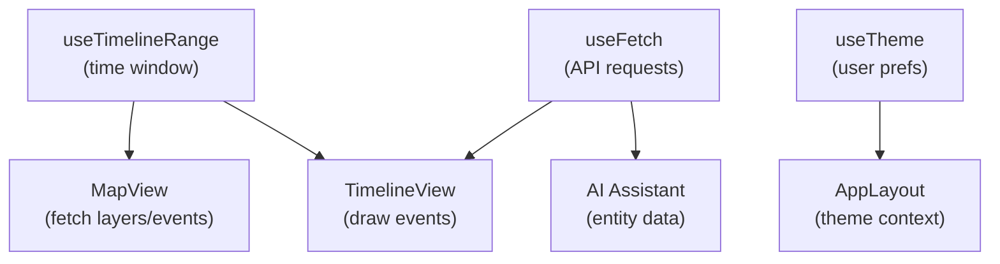

<div align="center">

# ⚓ Kansas Frontier Matrix — **Web Frontend Hooks**  
`web/src/hooks/`

**Custom React Hooks · State Management · Lifecycle Utilities**

[](../../../../.github/workflows/ci.yml)
[](../../../../.github/workflows/codeql.yml)
[](../../../../docs/)
[](../../../../LICENSE)

</div>

---

```yaml
---
title: "KFM • Web Frontend Hooks (web/src/hooks/)"
version: "v1.4.0"
last_updated: "2025-10-14"
owners: ["@kfm-web", "@kfm-architecture"]
tags: ["react","hooks","state-management","accessibility","lifecycle","mcp"]
license: "MIT"
semantic_alignment:
  - CIDOC CRM (UI context entities)
  - OWL-Time (timeline synchronization)
  - WCAG 2.1 AA (keyboard focus management)
---
````

---

## 🧭 Overview

The `web/src/hooks/` directory defines **custom React Hooks** that encapsulate reusable logic for data fetching, state synchronization, event handling, theming, and responsiveness across the **Kansas Frontier Matrix (KFM)** web application.

These hooks maintain clean separation of concerns between **Map**, **Timeline**, and **AI Assistant** interfaces while adhering to **MCP-DL v6.2** principles:

* 🧾 Fully documented via JSDoc/TSDoc
* ⚙️ Deterministic and side-effect aware
* 🧪 Unit tested with Jest & RTL
* 🔒 Explicit dependencies (no globals)
* ♿ Accessibility and lifecycle compliant

---

## 🧱 Directory Structure

```text
web/src/hooks/
├── useFetch.ts              # REST/GraphQL fetch wrapper (loading/error state)
├── useDebounce.ts           # Debounces fast-changing inputs (search, sliders)
├── useResizeObserver.ts     # Observes element size (MapView/Timeline responsiveness)
├── useTimelineRange.ts      # Manages timeline state (start/end)
├── useMapInteraction.ts     # Handles map click/hover and layer synchronization
├── useKeyboardShortcuts.ts  # Accessibility keyboard navigation
├── useTheme.ts              # Theme persistence + toggling (dark/light)
└── index.ts                 # Barrel export for all hooks
```

Each hook is modular, reusable, and directly supports high-level KFM UI components.

---

## 🧩 Hook Overview

| Hook                     | Purpose                                                         | Example Usage                                        |
| :----------------------- | :-------------------------------------------------------------- | :--------------------------------------------------- |
| **useFetch**             | Simplifies async API requests with built-in loading/error state | `const { data, loading } = useFetch('/api/events');` |
| **useDebounce**          | Prevents rapid function calls (e.g. search throttling)          | `const query = useDebounce(inputValue, 300);`        |
| **useResizeObserver**    | Monitors element resizing (responsive layouts)                  | `useResizeObserver(ref, onResize);`                  |
| **useTimelineRange**     | Centralized timeline state manager (start/end, zoom)            | `const { range, setRange } = useTimelineRange();`    |
| **useMapInteraction**    | Consolidates MapLibre map interactions                          | `useMapInteraction(mapRef, onSelectLayer);`          |
| **useKeyboardShortcuts** | Adds accessibility navigation & focus management                | `useKeyboardShortcuts(shortcutMap);`                 |
| **useTheme**             | Toggles dark/light theme & persists preference                  | `const { theme, toggleTheme } = useTheme();`         |

---

## ⚙️ Example Implementation

```ts
// useFetch.ts
import { useState, useEffect } from "react";
import axios from "axios";

export function useFetch(url: string, options: any = {}) {
  const [data, setData] = useState<any>(null);
  const [loading, setLoading] = useState(true);
  const [error, setError] = useState<any>(null);

  useEffect(() => {
    if (!url) return;
    let active = true;
    setLoading(true);

    axios(url, options)
      .then(res => active && setData(res.data))
      .catch(err => active && setError(err))
      .finally(() => active && setLoading(false));

    return () => { active = false; };
  }, [url]);

  return { data, loading, error };
}
```

> This base hook pattern underpins nearly all data-fetching workflows across **Timeline**, **Map**, and **Entity Panels**.

---

## 🧠 Hook Data Flow



Hooks ensure synchronized updates across the interface:

* Timeline range changes trigger **new data fetches**
* Map selections propagate to **detail panels**
* User preferences persist between sessions and reloads

---

## 🧩 Best Practices

* 🧩 **Single Responsibility:** Each hook performs one focused task
* 🔍 **Naming:** Hooks begin with `use` and return `{ data, loading, error }` or similar predictable shapes
* 🧹 **Cleanup:** Manage all subscriptions, abort signals, or observers on unmount
* 🧪 **Testing:** Simulate async/DOM behaviors with Jest mocks + `act()` wrappers
* 📘 **Documentation:** Each hook includes usage examples in TSDoc/JSDoc

---

## ♿ Accessibility Integration

Hooks such as `useKeyboardShortcuts` and `useResizeObserver` improve accessibility and responsive layout behavior.

| Accessibility Feature   | Implementation                                                            |
| :---------------------- | :------------------------------------------------------------------------ |
| **Keyboard Navigation** | Arrow keys to move timeline, Esc to close panels, `Tab` order enforcement |
| **Focus Management**    | React focus trap pattern via hook context                                 |
| **Reduced Motion**      | `useTheme` & `useLayoutEffect` respect `prefers-reduced-motion`           |
| **ARIA Event Sync**     | Hooks trigger announcements via `aria-live` regions for state changes     |

---

## 🧾 Provenance & Integrity

| Artifact         | Description                                                             |
| :--------------- | :---------------------------------------------------------------------- |
| **Inputs**       | REST/GraphQL data, MapLibre instances, user preferences                 |
| **Outputs**      | Component-ready states (`data`, `range`, `theme`, `focus`)              |
| **Dependencies** | React 18+, Axios, MapLibre GL, D3                                       |
| **Integrity**    | CI enforces lint/type/test coverage ≥ **85%** with CodeQL + Trivy scans |

---

## 🧠 MCP Compliance Checklist

| MCP Principle       | Implementation                                       |
| :------------------ | :--------------------------------------------------- |
| Documentation-first | JSDoc/TSDoc annotations + per-hook examples          |
| Reproducibility     | Deterministic state transitions; regression tests    |
| Open Standards      | WCAG 2.1 AA, WAI-ARIA roles, ISO time formats        |
| Provenance          | Clear data lineage from API → state → component      |
| Auditability        | Hook-level test suites & CI logs                     |
| Versioning          | Semantic commits & release tracking via package.json |

---

## 🧩 Example — Keyboard Shortcut Hook

```ts
// useKeyboardShortcuts.ts
import { useEffect } from "react";

export function useKeyboardShortcuts(shortcutMap: Record<string, () => void>) {
  useEffect(() => {
    const handleKey = (e: KeyboardEvent) => {
      const key = e.key.toLowerCase();
      if (shortcutMap[key]) {
        e.preventDefault();
        shortcutMap[key]();
      }
    };
    window.addEventListener("keydown", handleKey);
    return () => window.removeEventListener("keydown", handleKey);
  }, [shortcutMap]);
}
```

> Example: arrow keys control timeline range, `f` focuses map, `s` opens search bar.

---

## 🧩 Test Example

```ts
import { renderHook, act } from "@testing-library/react";
import { useDebounce } from "../useDebounce";

describe("useDebounce", () => {
  it("delays updates", () => {
    jest.useFakeTimers();
    const { result, rerender } = renderHook(
      ({ value }) => useDebounce(value, 300),
      { initialProps: { value: "start" } }
    );

    rerender({ value: "next" });
    act(() => jest.advanceTimersByTime(200));
    expect(result.current).toBe("start");

    act(() => jest.advanceTimersByTime(100));
    expect(result.current).toBe("next");
  });
});
```

---

## 🧩 Reproducibility Hooks

* 🧱 **Deterministic builds** — Vite + pinned deps (`package-lock.json`)
* 🧪 **Pre-commit hooks** — run lint, test, typecheck before merge
* 🔒 **CI Gatekeeping** — CodeQL + Jest coverage reports
* 🧾 **Checksum Logs** — optional SHA-256 for built hook bundles

---

## 🚀 Performance Considerations

* Cache stable fetch responses (with React Query or SWR pattern)
* Use `useMemo` + `useCallback` to prevent re-renders
* Throttle map event handlers (`useMapInteraction`)
* Debounce resize observers to minimize layout thrash
* Avoid synchronous loops inside hooks; defer heavy calculations

---

## 🔗 Related Documentation

* **Web Frontend Overview** — `web/README.md`
* **Web Frontend Utilities** — `web/src/utils/README.md`
* **Web UI Architecture** — `web/ARCHITECTURE.md`
* **Accessibility Focus Review** — `docs/design/reviews/accessibility/`

---

## 📜 License

Released under the **MIT License**.
© 2025 Kansas Frontier Matrix — developed under **MCP-DL v6.2** for modularity, reproducibility, and accessibility.

> *“Custom hooks are the logic trail markers — guiding users through time, terrain, and story.”*

```
```
