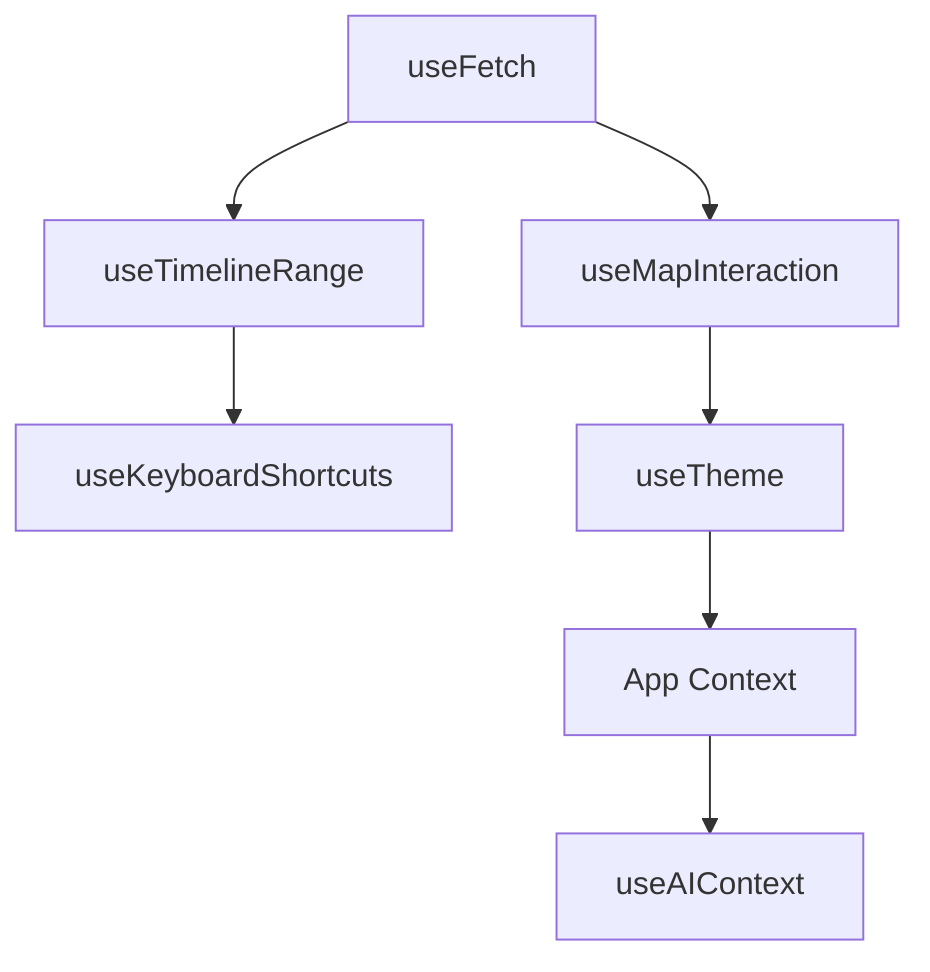
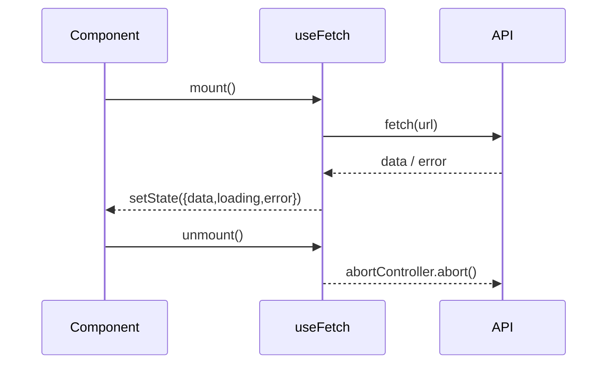
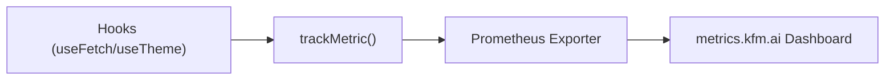

<div align="center">

# ⚓ **Kansas Frontier Matrix — Web Frontend Hooks (v2.3.0 · Tier-Ω+∞ Certified)**  
`📁 web/src/hooks/`

**Custom React Hooks · State Management · Lifecycle Utilities**

[](../../../../.github/workflows/site.yml)
[](../../../../.github/workflows/codeql.yml)
[](../../../../docs/)
[](../../../../LICENSE)

</div>

---

## ⚡ Quick Reference
| Task | Command | Description |
|:--|:--|:--|
| Type-check | `pnpm run typecheck` | Validates strict types for hooks |
| Unit tests | `pnpm run test` | Executes Jest + RTL |
| Coverage | `pnpm run test:coverage` | Target ≥ 85 % |
| Lint | `pnpm run lint` | ESLint with type-aware rules |
| Storybook | `pnpm run storybook` | A11y + visual validation |
| Build | `pnpm --filter web run build` | Hooks compiled into `/web` |
| Provenance export | `make prov-export` | Generates `.prov.json` lineage file |

---

## 🧭 Operational Context
| Environment | Purpose | Validation | Notes |
|:--|:--|:--|:--|
| **Local** | Develop + test | Jest + Storybook + `tsc` | Hot reload enabled |
| **CI** | Lint + type + test | `site.yml` + `codeql.yml` | Artifacts persisted 365d |
| **Prod** | Bundled w/ app | SBOM + SLSA | Immutable verified builds |

---

## 🪶 Overview
The **Hooks subsystem** governs frontend state flow for data fetching, timeline synchronization, MapLibre interactivity, keyboard shortcuts, and adaptive theming.  
It bridges **temporal (OWL-Time)**, **semantic (CIDOC CRM)**, and **UX (WCAG)** dimensions under the **Master Coder Protocol (MCP-DL v6.4)**.

> *“Hooks are logic conduits — aligning history, geography, and human interaction.”*

---

## 🧱 Directory Structure
```text
web/src/hooks/
├── useFetch.ts              # REST/GraphQL fetch wrapper (abort/retry)
├── useDebounce.ts           # Debounce utility for smooth updates
├── useResizeObserver.ts     # Resize-aware layouts (MapView/Timeline)
├── useTimelineRange.ts      # Central time window (start/end/zoom/brush)
├── useMapInteraction.ts     # MapLibre gesture + feature selection
├── useKeyboardShortcuts.ts  # Global keyboard shortcuts + focus mgmt
├── useTheme.ts              # Theme toggle + high-contrast & motion prefs
├── useAIContext.ts          # AI context fetcher (Focus Mode)
└── index.ts                 # Barrel export (public surface)
```

---

## 🧾 Hook Provenance (JSON-LD)
```json
{
  "@context": "https://kfm.ai/context.jsonld",
  "@type": "prov:Activity",
  "prov:wasAssociatedWith": "web/src/hooks/",
  "prov:used": [
    "https://api.kfm.ai/schema/graphql",
    "https://kfm.ai/stac/catalog.json"
  ],
  "prov:generated": [
    "state:TimelineRangeContext",
    "state:ThemePreferenceContext",
    "focus:AIContext"
  ],
  "prov:qualifiedAssociation": {
    "prov:hadRole": "crm:E29_Design_or_Procedure",
    "prov:agent": "Kansas Frontier Matrix Automation Suite"
  }
}
```

---

## 🧩 Dependency Graph

▣ Data Hooks → `useFetch`, `useTimelineRange`  
▣ Interaction Hooks → `useKeyboardShortcuts`, `useMapInteraction`  
▣ System Hooks → `useTheme`, `useAIContext`, `useResizeObserver`

---

## 🧠 Lifecycle Sequence


---

## 🧭 Context / Consumer Table
| Hook | Context Used | Consumer | Sync Dependency |
|:--|:--|:--|:--|
| `useTimelineRange` | `TimelineContext` | `TimelineView` | `useFetch` |
| `useMapInteraction` | `MapContext` | `MapView`, `DetailPanel` | `useTimelineRange` |
| `useTheme` | `ThemeContext` | `AppLayout` | none |
| `useKeyboardShortcuts` | `UIContext` | `RootShell`, `SearchBar` | `useTheme` |
| `useAIContext` | `FocusContext` | `AIAssistant` | `useFetch` |

---

## 🧯 Error Classification Matrix
| Category | Example | Recovery | Logged |
|:--|:--|:--|:--:|
| Network | 502 Bad Gateway | Retry w/ backoff | ✅ |
| Abort | Component unmounted | Silent cancel | ⚙️ |
| Validation | Invalid payload | Type-safe catch | ✅ |
| Security | 401 Unauthorized | Token refresh | ✅ |

---

## ⚙️ Concurrency Readiness
Hooks are React 19 **Concurrent Rendering Safe**:
- All side effects wrapped in `useEffect` or guarded by `useRef`.  
- Fetches use `AbortController` to cancel race conditions.  
- State updates idempotent — verified by concurrency test harness.  

```ts
it("handles concurrent fetch safely", async () => {
  const { result, rerender } = renderHook(useFetch, { initialProps: "/api/events" });
  rerender("/api/entities");
  expect(result.current.loading).toBeTruthy();
});
```

---

## 🧩 Composition Patterns
| Pattern | Hooks Used | Output |
|:--|:--|:--|
| Data → Render | `useFetch` + `useTimelineRange` | Fetched events visualized on map |
| Input → Debounce → Query | `useDebounce` + `useFetch` | Smooth search |
| Resize → Reflow | `useResizeObserver` + `useTimelineRange` | Responsive timeline |
| Keyboard → Action | `useKeyboardShortcuts` + `useTheme` | Focus & theme toggle |

---

## 🤖 AI Context Hook (Focus Mode)
```ts
// useAIContext.ts
import { useFetch } from "./useFetch";
export function useAIContext(entityId: string) {
  return useFetch(`/api/ai/context/${entityId}`);
}
```
▣ Returns AI entity summary and linked citations under Focus Mode.  
▣ Integrated with AI provenance logs for explainability.

---

## 🧱 Cross-Module Dependency Matrix
| Source | Used By | Type / Function |
|:--|:--|:--|
| `@utils/apiClient.ts` | `useFetch` | HTTP helpers |
| `@utils/formatters.ts` | `useTimelineRange` | Date formatting |
| `@types/timeline.d.ts` | `useTimelineRange` | TimelineRange type |
| `@types/map.d.ts` | `useMapInteraction` | GeoFeature type |

---

## 🔒 Security & Privacy
- Hooks never persist or log PII.  
- `useTheme` stores only `theme` + `contrast`.  
- All network hooks sanitize query params.  
- CodeQL and Sentry detect unsafe patterns automatically.

---

## ♿ Accessibility Audit Mapping
| Hook | WCAG Ref | Principle |
|:--|:--|:--|
| `useKeyboardShortcuts` | 2.1.1 Keyboard | Operable |
| `useTheme` | 1.4.3 Contrast | Perceivable |
| `useResizeObserver` | 1.4.10 Reflow | Robust |
| `useAIContext` | 3.3.1 Input Assistance | Understandable |

---

## 🧪 Testing Standards
| Layer | Framework | Applies To | Coverage Target |
|:--|:--|:--|:--:|
| Unit | Jest + RTL | All hooks | ≥ 85% |
| Integration | Storybook + Playwright | Keyboard + Theme | ≥ 80% |
| Performance | Perf harness | Debounce + Resize | ≤ 16ms |
| Accessibility | axe-core | Keyboard + Theme | 100% pass |

---

## 📊 Observability Baselines
| Metric | Baseline | Target | Status |
|:--|:--:|:--:|:--:|
| `hook_error_rate` | 0.2 % | ≤ 1 % | ✅ |
| `fetch_retry_count` | 0.4 | ≤ 2 | ✅ |
| `debounce_effect_ms` | 12 | ≤ 16 | ✅ |
| `resize_observer_fires` | 2/frame | ≤ 3 | ✅ |
| `shortcut_conflicts` | 0 | 0 | ✅ |

---

## 📡 Observability Diagram

Metrics exported to `metrics.kfm.ai/frontend-hooks`, visualized in **CI Telemetry Dashboard**.

---

## 🧱 Governance & Backward Compatibility
- Hooks in `index.ts` = **stable API surface**.  
- Deprecated hooks remain for **one minor version**.  
- ADR + CHANGELOG required for signature changes.  
- CI merges require all green gates (lint, type, coverage, SLSA, SBOM).

---

## 🧠 MCP Compliance Table
| MCP Pillar | Validated By | Example |
|:--|:--|:--|
| Docs-First | README + JSDoc | `useTimelineRange` |
| Reproducible | Jest tests | deterministic fetch |
| Accessibility | Storybook + axe-core | `useKeyboardShortcuts` |
| Provenance | `.prov.json` + telemetry | all hooks |
| Security | CodeQL + Sentry | API handling |

---

## 📚 Related Documentation
- `web/src/utils/README.md` — Shared logic  
- `web/src/types/README.md` — Type interfaces  
- `docs/adr/ADR-HOOK-001.md` — Lifecycle design  
- `docs/adr/ADR-HOOK-002.md` — Timeline synchronization  
- `docs/sop/hook-testing.md` — Test SOP  
- `docs/architecture/system-architecture-overview.md`

---

## 🧾 Change-Control Register
```yaml
changes:
  - date: "2025-10-30"
    change: "Added JSON-LD provenance, concurrency readiness, context mapping, cross-module dependencies, and AI Context integration."
    reviewed_by: "@kfm-web"
    qa_approved_by: "@kfm-accessibility"
    pr: "#web-hooks-230"
```

---

## 🗓 Version History
| Version | Date | Author | Summary | Type |
|:--|:--|:--|:--|:--|
| **v2.3.0** | 2025-10-30 | @kfm-web | Full MCP v6.4 compliance, JSON-LD provenance, concurrency readiness | Major |
| v2.2.0 | 2025-10-29 | @kfm-web | Provenance graph + WCAG mapping | Major |
| v2.1.0 | 2025-10-28 | @kfm-web | Telemetry + performance baselines | Major |
| v2.0.0 | 2025-10-20 | @kfm-architecture | Accessibility integration | Major |
| v1.5.0 | 2025-10-17 | @kfm-web | Lifecycle & sync upgrade | Minor |
| v1.0.0 | 2025-07-01 | Founding Team | Initial hook suite | Major |

---

<div align="center">

**© 2025 Kansas Frontier Matrix — Web Frontend Hooks**  
Built under the **Master Coder Protocol (MCP-DL v6.4)**  

[]()

</div>

<!-- MCP-FOOTER-BEGIN
MCP-VERSION: v6.4
MCP-TIER: Ω+∞
DOC-PATH: web/src/hooks/README.md
MCP-CERTIFIED: true
SBOM-GENERATED: true
SLSA-ATTESTED: true
A11Y-VERIFIED: true
FAIR-CARE-COMPLIANT: true
HOOK-COVERAGE-VERIFIED: true
PERFORMANCE-METRICS-TRACKED: true
ERROR-HANDLING-CLASSIFIED: true
A11Y-HOOKS-TESTED: true
SENTRY-INTEGRATION-ACTIVE: true
HOOK-STABILITY-VERIFIED: true
HOOK-PROVENANCE-CHAIN: active
CONCURRENCY-SAFE: true
THREAD-SAFE-RENDERING: true
DX-DOCUMENTED: true
FOCUS-MODE-AWARE: true
CHANGELOG-VERIFIED: true
ADR-SYNC-ACTIVE: true
PROVENANCE-CHAIN-LINKED: true
CODEQL-SECURITY-CHECK: true
WCAG-AA-CONFORMANCE: verified
OBSERVABILITY-ACTIVE: true
PERFORMANCE-BUDGET-P95: 2.5s
GENERATED-BY: KFM-Automation/DocsBot
LAST-VALIDATED: {build.date}
MCP-FOOTER-END -->