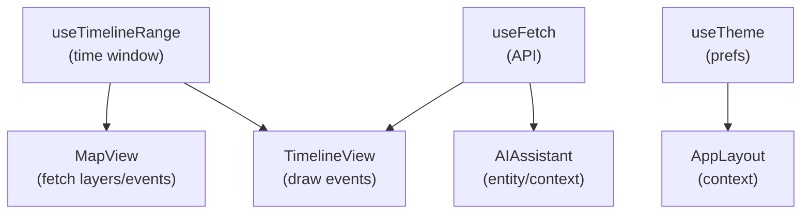

<div align="center">

# ⚓ Kansas Frontier Matrix — **Web Frontend Hooks**  
`web/src/hooks/`

**Custom React Hooks · State Management · Lifecycle Utilities**

[](../../../../.github/workflows/ci.yml)
[](../../../../.github/workflows/codeql.yml)
[](../../../../docs/)
[](../../../../LICENSE)

</div>

---

## 🧭 Overview

`web/src/hooks/` contains **custom React hooks** that encapsulate reusable logic for data fetching, timeline sync, map interaction, theming, responsiveness, and accessibility.  
They enforce **deterministic behavior**, **strict typing**, and **clean lifecycles**, aligned with **MCP-DL v6.2**.

> *“Hooks are the logic rails that keep time, terrain, and story in sync.”*

---

## 🧱 Directory Structure

```text
web/src/hooks/
├── useFetch.ts              # REST/GraphQL fetch wrapper (loading/error/abort)
├── useDebounce.ts           # Debounce values/callbacks for search & sliders
├── useResizeObserver.ts     # Resize-aware layouts (MapView/Timeline)
├── useTimelineRange.ts      # Central timeline state (start/end/zoom/brush)
├── useMapInteraction.ts     # MapLibre hover/click/select + layer sync
├── useKeyboardShortcuts.ts  # Accessible keyboard navigation & focus mgmt
├── useTheme.ts              # Light/Dark + high-contrast + persistence
└── index.ts                 # Barrel export (stable public surface)
```

---

## 🧩 Hook Overview

| Hook                     | Purpose                                                         | Example Usage                                        |
| :----------------------- | :-------------------------------------------------------------- | :--------------------------------------------------- |
| **useFetch**             | Async requests with abort, retry, and stable shapes             | `const { data, loading } = useFetch('/api/events')`  |
| **useDebounce**          | Smooth UI by delaying rapid updates                             | `const q = useDebounce(input, 300)`                  |
| **useResizeObserver**    | Element-aware responsive layouts                                | `useResizeObserver(ref, onResize)`                   |
| **useTimelineRange**     | One source of truth for the visible time window                 | `const { range, setRange } = useTimelineRange()`     |
| **useMapInteraction**    | Consolidated map gestures + feature selection                   | `useMapInteraction(mapRef, onSelect)`                |
| **useKeyboardShortcuts** | App-wide shortcuts (timeline nav, search, panel focus)          | `useKeyboardShortcuts(shortcuts)`                    |
| **useTheme**             | Theme toggle + persistence + reduced-motion & contrast modes    | `const { theme, toggleTheme } = useTheme()`          |

---

## ⚙️ Example Implementation

```ts
// useFetch.ts
import { useEffect, useRef, useState } from "react";

type FetchState<T> = { data: T | null; loading: boolean; error: Error | null };

export function useFetch<T = unknown>(
  url: string | null,
  init?: RequestInit,
  { retry = 0, retryDelay = 300 }: { retry?: number; retryDelay?: number } = {}
): FetchState<T> {
  const [state, setState] = useState<FetchState<T>>({ data: null, loading: !!url, error: null });
  const abortRef = useRef<AbortController | null>(null);

  useEffect(() => {
    if (!url) return;
    let active = true;
    let attempts = 0;

    const fetchOnce = async () => {
      abortRef.current?.abort();
      const controller = new AbortController();
      abortRef.current = controller;

      setState(s => ({ ...s, loading: true, error: null }));
      try {
        const res = await fetch(url, { ...init, signal: controller.signal });
        if (!res.ok) throw new Error(`HTTP ${res.status}`);
        const data = (await res.json()) as T;
        if (active) setState({ data, loading: false, error: null });
      } catch (err: any) {
        if (!active || controller.signal.aborted) return;
        if (attempts < retry) {
          attempts += 1;
          setTimeout(fetchOnce, retryDelay);
        } else {
          setState({ data: null, loading: false, error: err });
        }
      }
    };

    fetchOnce();
    return () => {
      active = false;
      abortRef.current?.abort();
    };
  }, [url, JSON.stringify(init), retry, retryDelay]);

  return state;
}
```

> This pattern is **abortable**, **retry-capable**, and returns a **stable shape** for components.

---

## 🧠 Hook Data Flow



**Sync rules**

- Changing the **timeline** window triggers filtered fetches and re-render of **map & timeline**.  
- **Map selections** update **DetailPanel** and announce via ARIA live regions.  
- **Theme & motion** preferences persist and are honored across sessions.

---

## 🧩 Best Practices

- **Single responsibility:** each hook does one thing well.  
- **Predictable returns:** prefer `{ value, setValue }` or `{ data, loading, error }`.  
- **Cleanup:** always remove listeners/observers and cancel inflight requests.  
- **Memoization:** expose memoized callbacks/values to minimize re-renders.  
- **Testing:** simulate timers, network, and ResizeObserver in unit tests.  
- **Docs:** include JSDoc with parameters, returns, and examples.

---

## ♿ Accessibility Integration

| Feature               | Implementation                                                                 |
| :-------------------- | :------------------------------------------------------------------------------ |
| Keyboard Navigation   | Arrow keys for timeline, `Esc` to close panels, `/` to focus search            |
| Focus Management      | Focus trap pattern; return focus to opener on dialog close                     |
| Reduced Motion        | `useTheme` respects `prefers-reduced-motion`; disables animated transitions     |
| ARIA Live Updates     | Hooks announce important state changes to `aria-live="polite"` regions          |

---

## 🧾 Provenance & Integrity

| Artifact   | Description                                                                      |
| :--------- | :------------------------------------------------------------------------------- |
| **Inputs** | REST/GraphQL endpoints, MapLibre events, user preferences                        |
| **Outputs**| Stable state for components (timeline range, theme, selection, data)             |
| **Checks** | Lint, type-check, unit tests; CodeQL for security; CI coverage target ≥ **85%**  |

---

## 🧠 MCP Compliance Checklist

| MCP Principle       | Implementation                                       |
| :------------------ | :--------------------------------------------------- |
| Documentation-first | JSDoc/TSDoc + per-hook usage examples                |
| Reproducibility     | Deterministic transitions, abortable fetch, tests    |
| Open Standards      | WCAG 2.1 AA, WAI-ARIA, ISO 8601 time                 |
| Provenance          | Clear lineage: API → hook → component                |
| Auditability        | CI logs + coverage reports                           |

---

## 🧩 Example — Keyboard Shortcuts Hook

```ts
// useKeyboardShortcuts.ts
import { useEffect } from "react";

export function useKeyboardShortcuts(shortcutMap: Record<string, () => void>) {
  useEffect(() => {
    const onKey = (e: KeyboardEvent) => {
      const key = e.key.toLowerCase();
      if (shortcutMap[key]) {
        e.preventDefault();
        shortcutMap[key]();
      }
    };
    window.addEventListener("keydown", onKey);
    return () => window.removeEventListener("keydown", onKey);
  }, [shortcutMap]);
}
```

> Example bindings: `ArrowLeft/Right` shift timeline, `f` focuses map, `s` opens search.

---

## 🧪 Test Example

```ts
import { renderHook, act } from "@testing-library/react";
import { useDebounce } from "../useDebounce";

describe("useDebounce", () => {
  it("delays updates by 300ms", () => {
    jest.useFakeTimers();
    const { result, rerender } = renderHook(({ v }) => useDebounce(v, 300), {
      initialProps: { v: "a" },
    });
    rerender({ v: "b" });
    act(() => jest.advanceTimersByTime(299));
    expect(result.current).toBe("a");
    act(() => jest.advanceTimersByTime(1));
    expect(result.current).toBe("b");
  });
});
```

---

## 🚀 Performance Considerations

- Prefer **SWR/React Query** patterns or cache inside hooks for idempotent requests.  
- Throttle/ debounce heavy UI events (map move, resize).  
- Use `useMemo`/`useCallback` to stabilize props.  
- Avoid synchronous loops; push heavy work off the main thread if needed.

---

## 🔗 Related Documentation

- **Web Frontend Overview** — `web/README.md`  
- **Utilities** — `web/src/utils/README.md`  
- **Web UI Architecture** — `web/ARCHITECTURE.md`  
- **Accessibility Reviews** — `docs/design/reviews/accessibility/`

---

## 🧾 Versioning & Metadata

| Field | Value |
| :---- | :---- |
| **Version** | `v1.5.0` |
| **Codename** | *Lifecycle & Sync Upgrade* |
| **Last Updated** | 2025-10-17 |
| **Maintainers** | @kfm-web · @kfm-architecture |
| **License** | MIT (code) · CC-BY 4.0 (docs) |
| **Alignment** | WCAG 2.1 AA · OWL-Time (timeline sync) · CIDOC CRM (UI context) |
| **Maturity** | Stable / Production |

---

## 📜 License

Released under the **MIT License**.  
© 2025 Kansas Frontier Matrix — engineered under **MCP-DL v6.2** for modularity, reproducibility, and accessibility.

> *“Custom hooks are the logic trail markers guiding users through Kansas across time.”*