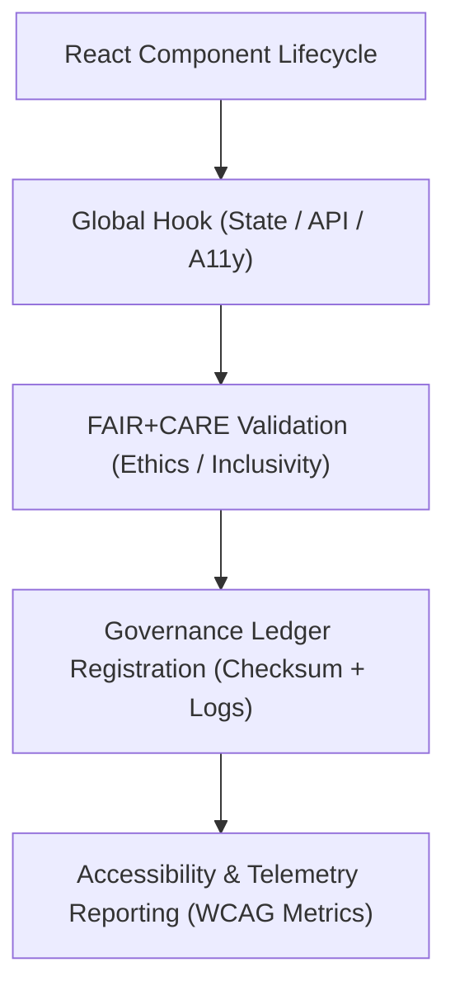

<div align="center">

# 🪝 **Kansas Frontier Matrix — Global React Hooks Library (v2.1.1 · Tier-Ω+∞ Certified)**  
`web/src/hooks/README.md`

**Mission:** Provide a FAIR+CARE-aligned library of reusable React hooks that unify accessibility,  
governance, and ethical data handling throughout the **Kansas Frontier Matrix (KFM)** web ecosystem.

[](../../../docs/)
[](../../../docs/standards/faircare-validation.md)
[](../../../docs/standards/accessibility.md)
[](../../../LICENSE)

</div>

---

## 📚 Overview

The **Global Hooks Library** defines reusable, governance-aware logic for state management,  
event handling, provenance tracking, and accessibility.  
Each hook adheres to FAIR+CARE and WCAG principles, ensuring ethical, transparent,  
and accessible user interactions across the KFM platform.

Core objectives:
- ♻️ Provide standardized, tested hooks for consistent UI/UX behavior.  
- 🔗 Enable FAIR+CARE compliance across stateful interactions.  
- 🧠 Integrate governance metadata and provenance tracking.  
- ♿ Maintain full accessibility through ARIA and WCAG alignment.  

---

## 🗂️ Directory Layout

```bash
web/src/hooks/
├── README.md                      # This file — Hooks library overview
│
├── use-accessibility.ts            # Global accessibility utilities (focus, keyboard, ARIA)
├── use-governance-ledger.ts        # Manages checksum and provenance metadata sync
├── use-faircare-metrics.ts         # Calculates FAIR+CARE compliance scores
├── use-ui-state.ts                 # Handles persistent UI settings (themes, preferences)
└── use-api-fetch.ts                # Fetch wrapper for API requests with provenance tracking
```

---

## ⚙️ Governance Workflow for Hooks


<!-- END OF MERMAID -->

---

## 🧱 Core Hooks

| Hook | Description | FAIR+CARE Function | Validation Workflow |
|:--|:--|:--|:--|
| **useAccessibility** | Provides focus, keyboard navigation, and ARIA utilities. | Accessibility + Ethics | `design-validate.yml` |
| **useGovernanceLedger** | Syncs UI interactions and data provenance to ledger. | Transparency + Responsibility | `governance-ledger.yml` |
| **useFairCareMetrics** | Tracks FAIR+CARE scores for data and interactions. | Accountability + Ethics | `faircare-validate.yml` |
| **useUIState** | Persists user settings and preferences across sessions. | Reusability + Inclusivity | `ui-validate.yml` |
| **useAPIFetch** | Wraps fetch calls with checksum and provenance registration. | Traceability + Transparency | `stac-validate.yml` |

---

## 🧠 FAIR + CARE Integration

| Principle | Implementation | Validation |
|:--|:--|:--|
| **Findable** | Hook metadata documented and indexed in governance reports. | `policy-check.yml` |
| **Accessible** | ARIA-safe interaction utilities built into hooks. | `design-validate.yml` |
| **Interoperable** | Hooks written in TypeScript for reusability across modules. | `ui-validate.yml` |
| **Reusable** | Shared library integrated into all frontend modules. | `docs-validate.yml` |
| **Collective Benefit (CARE)** | Promotes inclusive, ethical, and explainable design logic. | `faircare-validate.yml` |

---

## ♿ Accessibility Standards (WCAG 2.1 AA)

| Feature | Implementation | Validation |
|:--|:--|:--|
| **Keyboard Navigation** | Managed globally via `useAccessibility`. | `ui-validate.yml` |
| **Focus Management** | Tracks focus state and restores on modal/dialog close. | `ui-validate.yml` |
| **ARIA Roles** | Automatically applies ARIA attributes to interactive elements. | `design-validate.yml` |
| **Color Scheme Awareness** | Detects OS/system theme for contrast optimization. | `design-validate.yml` |

---

## 🔍 Provenance & Governance Integration

| Artifact | Description | Path |
|:--|:--|:--|
| **Governance Ledger** | Records provenance data and checksums from hook activity. | `data/reports/audit/data_provenance_ledger.json` |
| **FAIR+CARE Ethics Report** | Summarizes inclusivity and compliance audits. | `data/reports/fair/data_care_assessment.json` |
| **Telemetry Schema** | Tracks interaction events and validation status. | `schemas/telemetry/web-hooks-schema.json` |

> 🧩 Hooks automatically log key governance and accessibility actions  
> to the ledger during CI/CD validation.

---

## 🧾 Example Hook Metadata

```yaml
---
hook_id: "use-accessibility_v2.1.1"
authors: ["@kfm-web","@kfm-accessibility"]
faircare_status: "Tier-Ω+∞ Verified"
checksum: "sha256:dfb1a2e7a9c1b40e..."
governance_ledger_entry: "data/reports/audit/data_provenance_ledger.json"
accessibility_compliance: "WCAG 2.1 AA"
license: "MIT"
---
```

---

## 🧮 Observability Metrics

| Metric | Description | Target | Workflow |
|:--|:--|:--|:--|
| **Hook Stability Index** | % of tests passing across environments. | ≥ 95 | `ui-validate.yml` |
| **Accessibility Compliance (WCAG)** | Global accessibility adherence rate. | ≥ 95 | `design-validate.yml` |
| **FAIR+CARE Ethics Score** | Inclusive design and governance rating. | ≥ 95 | `faircare-validate.yml` |
| **Governance Sync Rate** | Provenance log success for hook calls. | 100% | `governance-ledger.yml` |

---

## 🧾 Validation Workflows

| Workflow | Function | Output |
|:--|:--|:--|
| `ui-validate.yml` | Tests hook state behavior and persistence. | `reports/validation/ui_validation.json` |
| `design-validate.yml` | Validates ARIA and accessibility behaviors. | `reports/validation/a11y_validation.json` |
| `faircare-validate.yml` | Reviews inclusivity and ethical compliance. | `reports/fair/data_care_assessment.json` |
| `stac-validate.yml` | Ensures provenance metadata integration. | `reports/validation/stac_validation_report.json` |
| `governance-ledger.yml` | Logs hook provenance and checksums. | `data/reports/audit/data_provenance_ledger.json` |

---

## 🕰 Version History

| Version | Date | Author | Summary |
|:--|:--|:--|:--|
| **v2.1.1** | 2025-11-16 | @kfm-web | Added governance logging, accessibility hooks, and FAIR+CARE metrics. |
| v2.0.0 | 2025-10-25 | @kfm-architecture | Introduced API provenance and ethical metric tracking. |
| v1.0.0 | 2025-10-04 | @kfm-docs | Initial hooks documentation and governance integration. |

---

<div align="center">

**Kansas Frontier Matrix © 2025**  
*“Reusable Logic. Ethical Design. Provenance by Default.”*  
📍 `web/src/hooks/README.md` — FAIR+CARE-aligned React hooks documentation for the Kansas Frontier Matrix web ecosystem.

</div>
