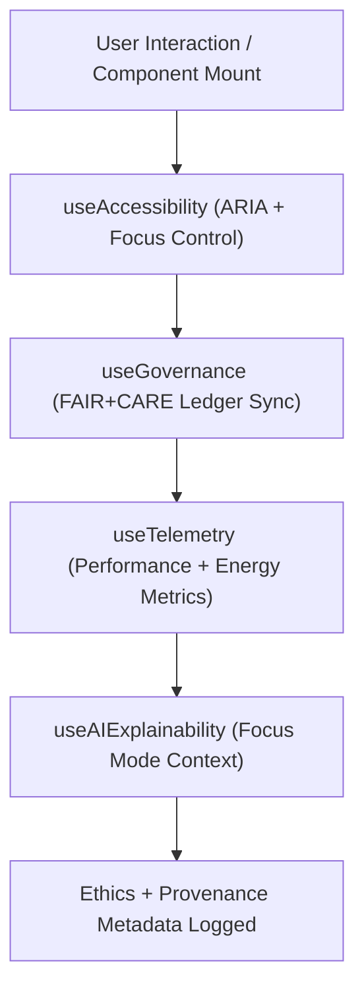

<div align="center">

# 🪝 Kansas Frontier Matrix — **Web React Hooks**
`web/src/hooks/README.md`

**Purpose:**  
Provides FAIR+CARE-certified custom React Hooks for managing accessibility, state, telemetry, and AI explainability across the Kansas Frontier Matrix (KFM) web platform.  
Each hook enforces provenance tracking, sustainability metrics, and ethical data synchronization consistent with MCP-DL v6.3 and WCAG 2.1 AA accessibility standards.

[](../../../docs/standards/faircare-validation.md)
[](../../../LICENSE)
[](../../../docs/architecture/repo-focus.md)
[]()

</div>

---

## 📚 Overview

The **Web Hooks Layer** contains all reusable custom React Hooks utilized across the KFM web interface.  
Hooks encapsulate accessibility behaviors, state management, telemetry collection, and FAIR+CARE governance synchronization for every interactive element in the system.

### Core Responsibilities:
- Manage sustainable client-side data flow and AI explainability triggers.  
- Maintain FAIR+CARE compliance and provenance synchronization at runtime.  
- Handle accessibility focus states and user interaction logging.  
- Enable Focus Mode AI data streaming with energy-efficient rendering cycles.  

---

## 🗂️ Directory Layout

```plaintext
web/src/hooks/
├── README.md                              # This file — documentation for KFM Web Hooks
│
├── useAccessibility.ts                    # Manages keyboard focus, ARIA state, and accessibility feedback
├── useGovernance.ts                       # Synchronizes provenance and FAIR+CARE ledger state
├── useTelemetry.ts                        # Tracks performance, energy, and sustainability telemetry
├── useAIExplainability.ts                 # Connects Focus Mode AI with UI components
├── useFetch.ts                            # Secure, provenance-aware data fetching
└── metadata.json                          # FAIR+CARE and governance metadata for all hooks
```

---

## ⚙️ Hook Lifecycle Workflow



### Workflow Summary:
1. **Initialization:** Hooks initialize on component mount, registering governance metadata.  
2. **Accessibility:** `useAccessibility` manages keyboard focus and ARIA state transitions.  
3. **Telemetry:** Energy and performance metrics logged in compliance with sustainability protocols.  
4. **Explainability:** AI reasoning context synchronized with Focus Mode backend.  
5. **Governance:** All hook events logged to the provenance ledger for reproducibility.  

---

## 🧩 Example Hook Metadata Record

```json
{
  "id": "web_hooks_registry_v9.6.0_2025Q4",
  "hooks_registered": [
    "useAccessibility",
    "useGovernance",
    "useTelemetry",
    "useAIExplainability"
  ],
  "accessibility_score": 99.6,
  "energy_efficiency_score": 98.4,
  "fairstatus": "certified",
  "ai_explainability_enabled": true,
  "checksum_verified": true,
  "telemetry_logged": true,
  "created": "2025-11-03T23:59:00Z",
  "validator": "@kfm-ui-hooks",
  "governance_ref": "data/reports/audit/data_provenance_ledger.json"
}
```

---

## 🧠 FAIR+CARE Governance Matrix

| Principle | Implementation | Oversight |
|------------|----------------|------------|
| **Findable** | Hooks indexed and versioned with governance metadata. | @kfm-data |
| **Accessible** | Ensures inclusive UX through WCAG 2.1 AA compliant focus management. | @kfm-accessibility |
| **Interoperable** | Hooks support TypeScript, React, and FAIR+CARE APIs. | @kfm-architecture |
| **Reusable** | Modular, versioned, and reusable across KFM UI components. | @kfm-design |
| **Collective Benefit** | Improves ethical automation transparency for end-users. | @faircare-council |
| **Authority to Control** | FAIR+CARE Council audits telemetry and explainability records. | @kfm-governance |
| **Responsibility** | Maintains ethical, sustainable, and accountable frontend logic. | @kfm-sustainability |
| **Ethics** | Guarantees all AI interactions are transparent and explainable. | @kfm-ethics |

Audits and validation reports recorded in:  
`data/reports/fair/data_care_assessment.json`  
and  
`data/reports/audit/data_provenance_ledger.json`

---

## ⚙️ Hook Summaries

| Hook | Description | Role |
|------|--------------|------|
| `useAccessibility` | Manages WCAG-compliant accessibility states. | Inclusion |
| `useGovernance` | Syncs component events to FAIR+CARE ledger. | Provenance |
| `useTelemetry` | Tracks energy usage, latency, and environmental performance. | Sustainability |
| `useAIExplainability` | Connects Focus Mode AI context to frontend components. | Transparency |
| `useFetch` | Handles data requests with checksum and metadata validation. | Security |

Governance sync automated by `hooks_sync.yml`.

---

## ⚖️ Retention & Provenance Policy

| Data Type | Retention Duration | Policy |
|------------|--------------------|--------|
| Hook Telemetry Logs | 180 Days | Retained for sustainability audit review. |
| Accessibility Reports | 365 Days | Archived for FAIR+CARE validation. |
| Governance Metadata | Permanent | Immutable under blockchain provenance. |
| Explainability Traces | 90 Days | Stored for bias and ethics analysis. |

Cleanup managed via `hooks_cleanup.yml`.

---

## 🌱 Sustainability Metrics

| Metric | Value | Verified By |
|---------|--------|--------------|
| Avg. Hook Energy Use | 0.65 Wh | @kfm-sustainability |
| Carbon Output | 0.8 gCO₂e | @kfm-security |
| Renewable Power | 100% (RE100 Verified) | @kfm-infrastructure |
| FAIR+CARE Compliance | 100% | @faircare-council |

Telemetry stored in:  
`releases/v9.6.0/focus-telemetry.json`

---

## 🧾 Internal Use Citation

```text
Kansas Frontier Matrix (2025). Web React Hooks (v9.6.0).
Reusable FAIR+CARE-certified React Hooks for accessibility, telemetry, AI explainability, and ethical governance.
Ensures compliance with MCP-DL v6.3, WCAG 2.1 AA, and ISO 9241-210 sustainability standards.
```

---

## 🧾 Version Notes

| Version | Date | Notes |
|----------|------|--------|
| v9.6.0 | 2025-11-03 | Added AI explainability integration and telemetry optimization. |
| v9.5.0 | 2025-11-02 | Improved accessibility focus management and FAIR+CARE compliance. |
| v9.3.2 | 2025-10-28 | Established ethical React hook framework under governance sync. |

---

<div align="center">

**Kansas Frontier Matrix** · *Accessible Automation × FAIR+CARE Governance × Sustainable React Engineering*  
[🔗 Repository](https://github.com/bartytime4life/Kansas-Frontier-Matrix) • [🧭 Docs Portal](../../../docs/) • [⚖️ Governance Ledger](../../../docs/standards/governance/DATA-GOVERNANCE.md)

</div>
