<div align="center">

# 🪝 **Kansas Frontier Matrix — Web React Hooks**
`web/src/hooks/README.md`

**Purpose:** Provide **FAIR+CARE-aligned**, reusable React hooks for accessibility, governance, telemetry, and AI explainability across the KFM web platform.  
Hooks are typed, testable, and validated under **MCP v6.3** with **WCAG 2.1 AA** coverage and release telemetry.

[](../../../docs/README.md)
[](../../../LICENSE)
[](../../../docs/standards/faircare.md)
[]()

</div>

---

## 📘 Overview

The **Hooks layer** encapsulates cross-cutting concerns for the frontend: accessibility, provenance synchronization, sustainability telemetry, and Focus Mode explainability.  
Each hook exposes a typed API and emits structured events for governance and dashboards.

---

## 🗂️ Directory Layout

```
web/src/hooks/
├── README.md
├── useAccessibility.ts       # Keyboard focus, landmarks, skip links, ARIA helpers
├── useGovernance.ts          # FAIR+CARE ledger + provenance sync
├── useTelemetry.ts           # Perf/energy metrics + build markers
├── useAIExplainability.ts    # Focus Mode context bindings (UI-side only)
├── useFetch.ts               # Provenance-aware fetch w/ checksum + ETag
└── metadata.json             # Governance metadata for registered hooks
```

---

## 🧩 Hook Lifecycle

```mermaid
flowchart TD
A["Component Mount / User Action"] --> B["useAccessibility (Focus/ARIA)"]
B --> C["useGovernance (Ledger Sync)"]
C --> D["useTelemetry (Perf/Energy)"]
D --> E["useAIExplainability (Focus Context)"]
E --> F["Provenance & A11y Logs → Telemetry"]
```



1. **Mount:** hooks register governance metadata and defaults.  
2. **A11y:** `useAccessibility` ensures WCAG-compliant interactions.  
3. **Telemetry:** `useTelemetry` logs energy and latency (non-PII).  
4. **Explainability:** `useAIExplainability` binds Focus Mode summaries and traces.  
5. **Governance:** events append to provenance ledgers and release telemetry.

---

## ⚙️ Contracts & Validation

| Contract | Purpose | Location |
|---------|---------|----------|
| Hook Types (TS) | Strongly typed signatures | `*.ts` + `types/` |
| A11y Contract | Page-level assertions | `useAccessibility.ts` + CI scans |
| Governance Contract | FAIR+CARE + provenance fields | `useGovernance.ts` |
| Telemetry Contract | Perf/energy schema v1 | `useTelemetry.ts` + `telemetry_schema` |

**CI workflows:** `docs-lint.yml`, `build-and-deploy.yml`, `telemetry-export.yml`, `codeql.yml`, `trivy.yml`.

---

## 🧠 Hook Summaries

| Hook | Description | Role |
|------|-------------|------|
| `useAccessibility` | Focus rings, skip links, live regions, ARIA toggles. | Inclusion |
| `useGovernance` | Emits FAIR+CARE events, provenance chips, consent states. | Oversight |
| `useTelemetry` | Logs CLS/LCP/TTI + energy estimates per interaction. | Sustainability |
| `useAIExplainability` | Renders explainability panes and summary bindings. | Transparency |
| `useFetch` | Adds checksums, ETags, and error guards to fetch. | Integrity |

---

## ♿ Accessibility Guarantees

- Focus management and **skip-to-content** links on all routes.  
- Color contrast ≥ **4.5:1** (text), **3:1** (large).  
- Motion-safe animations honoring `prefers-reduced-motion`.  
- Axe/Lighthouse scans; results surfaced in telemetry.

---

## 📊 Telemetry & Provenance

- **Build metrics:** `docs/reports/telemetry/build_metrics.json`  
- **Release snapshot:** `../../../releases/v9.7.0/focus-telemetry.json`  
- **Ledgers:** `../../../docs/reports/audit/` (workflow and governance)

---

## 🕰️ Version History

| Version | Date | Author | Summary |
|----------|------|---------|----------|
| v9.7.0 | 2025-11-05 | KFM Core Team | Upgraded & aligned: contracts, telemetry schema v1, CI mappings, CARE safeguards. |
| v9.6.0 | 2025-11-03 | KFM Core Team | Added explainability integration + sustainability telemetry. |
| v9.5.0 | 2025-11-02 | KFM Core Team | Improved focus management and provenance sync. |
| v9.3.2 | 2025-10-28 | KFM Core Team | Established hook framework with governance sync. |

---

<div align="center">

**© 2025 Kansas Frontier Matrix — MIT / CC-BY 4.0**  
Maintained under **Master Coder Protocol v6.3** · FAIR+CARE Certified · Diamond⁹ Ω / Crown∞Ω Ultimate Certified  
[Back to Web Source](../README.md) · [Docs Index](../../../docs/README.md)

</div>