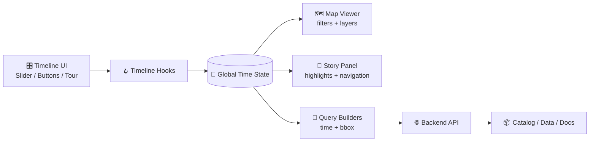
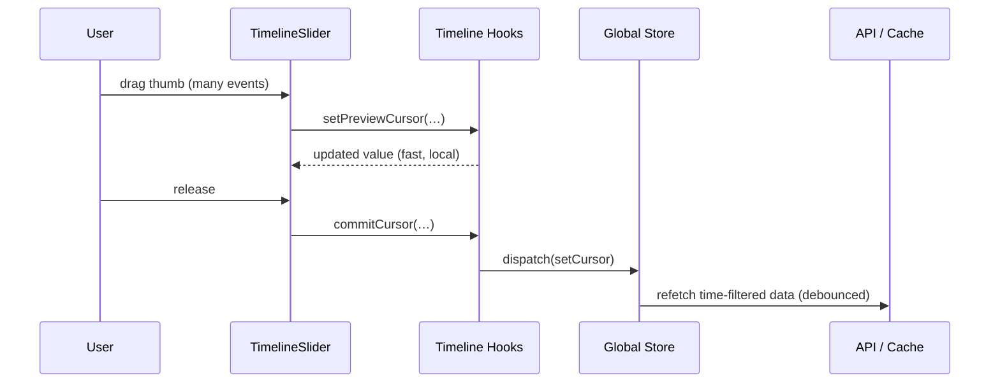

# ⏳ Timeline Hooks (`web/src/hooks/timeline`)  

> 🧭 **Mission:** provide a single, typed, performance-safe “temporal truth” for the web app — so **maps**, **storytelling**, and **time-aware queries** stay in sync (year ✅, ranges ✅, playback ✅).

---

## 📍 Why this folder exists

KFM’s UI isn’t “a map with a date filter.” It’s an interactive historical system where **time is a first-class navigation axis**:

- 🗺️ **Map** layers appear/disappear or morph based on year/range (e.g., population, boundaries, land cessions, etc.).
- 📖 **Story** experiences (Story Nodes / scrollytelling) “pull” the timeline as you read.
- 🔎 **Search & retrieval** (catalog, documents/snippets, entities) must be filtered by **time window** to stay relevant and citable.
- ⏯️ **Tour / playback** lets users scrub or animate through time with “video-like” controls (play/pause/step/speed/loop).

This folder is the **bridge** between “a user changed time” and “every timeline-aware feature responds correctly” — without re-implementing time logic in every component.

---

## ✅ Design goals (non-negotiables)

| Goal | What it means in practice |
|---|---|
| **Single source of temporal truth** 🧠 | Timeline state lives in one place (global store and/or canonical provider). Components read it via hooks. |
| **Fast while dragging** ⚡ | Dragging a slider should not cause network storms or heavy rerenders. Use “preview vs commit.” |
| **Composable & typed** 🧩 | Hooks expose small, focused slices: cursor, range, playback, URL sync, story sync. |
| **Deterministic & testable** 🧪 | Playback uses an injectable clock or predictable timers. URL sync is pure + reversible. |
| **Accessible by default** ♿ | Keyboard stepping, screen-reader friendly values, reduced-motion support for playback. |
| **Governance-aware** 🪶 | Time filters can change meaning, sensitivity, and context — hooks must make it easy to surface provenance + constraints. |

---

## 🧠 Timeline mental model

Think of timeline state as **three layers**:

1. **Cursor (instant)** → “Where are we right now?” (often a `year`)
2. **Window (range)** → “What span is active for filtering?” (start/end)
3. **Playback (transport)** → “Are we animating? How fast? Which direction?”

```text
Cursor:   |----•-----------------------------|
Range:    |------[=========]-----------------|
Playback:          ⏮️  ⏸️  ⏭️   Speed × Loop
```

---

## 🧬 Canonical types (recommended)

> These are the suggested shared types for this folder. If the project already defines equivalents elsewhere, **import and reuse** rather than duplicating.

```ts
// ✅ Prefer explicit, serializable values (great for URL sync + storage)
export type TimeInstant = number | string; // e.g., 1870 or "1870-01-01"

// ✅ Be strict: start <= end
export type TimeRange = {
  start: TimeInstant;
  end: TimeInstant;
};

export type TimeGranularity = "year" | "month" | "day" | "event";
export type TimelineMode = "cursor" | "range";

export type PlaybackState = {
  isPlaying: boolean;
  direction: 1 | -1;
  speed: number;     // e.g., 0.25x, 1x, 4x
  loop: boolean;
};
```

---

## 🧩 What lives here (hook responsibilities)

> ⚠️ Hook filenames may differ across branches. Treat this as the **responsibility map** for `web/src/hooks/timeline/*`.

### 1) Read hooks (no side-effects)
Use these in components that need to *display* time state without changing it.

- `useTimelineState()` → full state snapshot (cursor + range + playback + granularity)
- `useTimelineCursor()` → `{ cursor, granularity }`
- `useTimelineRange()` → `{ range, granularity }`
- `useTimelinePlaybackState()` → `{ playback }`

### 2) Action hooks (write / dispatch)
Use these to *change* timeline state in a controlled way.

- `useTimelineActions()` → `setCursor`, `setRange`, `setGranularity`, `step`, `jumpTo`, `reset`
- `useTimelinePlayback()` → `play`, `pause`, `toggle`, `setSpeed`, `setLoop`, `setDirection`

### 3) Bridge hooks (integration / effects)
These connect timeline state to “other realities.”

- `useTimelineUrlSync()` → encode/decode timeline in query params (shareable deep links)
- `useTimelineStorySync()` → sync timeline to Story Nodes / scrollytelling triggers
- `useTimelineCommitOnRelease()` → “preview while dragging, commit on pointerup”
- `useTimelineQueryBridge()` → build stable query objects for API calls (time + bbox + filters)

---

## 🔁 Architecture flow (who talks to whom)



---

## 🧪 “Preview vs Commit” pattern (performance cornerstone)

When the user drags a slider:

- **Preview state** updates at interactive speed (UI-only)
- **Commit** happens on drag end (pointer up / key confirm)
- Heavy work (network requests, map layer rebuilds) should hang off **commit**



**Rule of thumb:**  
✅ Preview = “make the UI feel instant”  
✅ Commit = “make the system correct”  
🚫 Never fetch on every pixel of a drag

---

## 🧭 Usage examples

### Example A — Map layer filter driven by cursor year 🗺️

```tsx
import { useEffect } from "react";
import { useTimelineCursor } from "@/hooks/timeline";

export function PopulationLayerBridge({ map }: { map: any }) {
  const { cursor, granularity } = useTimelineCursor();

  useEffect(() => {
    if (granularity !== "year") return;

    // Example: apply a year filter to a layer
    map.setFilter("population-layer", ["==", ["get", "year"], cursor]);
  }, [cursor, granularity, map]);

  return null;
}
```

### Example B — Time-range query builder for the catalog 🔎

```ts
import { useMemo } from "react";
import { useTimelineRange } from "@/hooks/timeline";
import { useMapViewportBbox } from "@/hooks/map"; // example

export function useTimeAwareCatalogQuery() {
  const { range } = useTimelineRange();
  const bbox = useMapViewportBbox();

  return useMemo(() => {
    return {
      bbox,
      time: range,
      // add other filters here (tags, sources, layer types…)
    };
  }, [bbox, range]);
}
```

### Example C — URL sync (shareable time links) 🔗

> Keep encoding **stable**, **human-readable**, and **backwards-compatible**.

```ts
// Suggested query params:
// ?t=1870
// ?t=1870&g=year
// ?range=1860,1890&g=year
// ?play=1&speed=2&loop=1

// `useTimelineUrlSync()` should:
// ✅ parse once on load
// ✅ update URL on commit (not preview)
// ✅ handle invalid params gracefully (fallback to defaults)
```

---

## 📖 Story + Scrollytelling sync

Timeline hooks should support both:

1. **Discrete Story Nodes** (Next/Prev)
2. **Scroll-linked storytelling** (Intersection Observer triggers)

### Recommended approach

- Story content emits “temporal anchors” (year or range)
- A bridge hook listens and commits timeline changes
- Timeline changes update map layers + highlights automatically

```html
<!-- Example: embedded trigger markers in story markup -->
<div data-trigger data-year="1934" data-layer="drought_layer"></div>
```

```ts
// A `useTimelineStorySync()` hook can:
// - subscribe to story events OR observe DOM triggers
// - read data-year/data-range
// - commitCursor/commitRange
```

---

## ⏯️ Tour / playback support

Timeline playback should feel like “map time-lapse” controls:

- ▶️ Play / ⏸️ Pause / ⏭️ Step / ⏮️ Step back
- 🐢 Speed control (0.25×, 1×, 2×, 4×)
- 🔁 Loop toggle
- 🎯 Jump to keyframes (important years/events)

### Implementation notes

- Prefer a **single driver** (`requestAnimationFrame` or interval) owned by the playback hook
- Respect `prefers-reduced-motion`
- Ensure playback updates use **commit** semantics (or “commit per tick” with throttling)

---

## ♿ Accessibility checklist

> [!NOTE]
> Timeline controls are *navigation*, not decoration. Treat them as core UX.

- Keyboard:
  - `←/→` step by 1 unit
  - `Shift + ←/→` step by 10 units
  - `Home/End` jump to min/max
- Screen readers:
  - Provide an explicit text readout: `Year: 1870`
  - Ensure the slider has correct ARIA attributes
- Reduced motion:
  - Disable autoplay
  - Provide step buttons as an alternative to animation

---

## 🪶 Data governance & provenance (timeline-aware)

Time filtering can *change meaning* — especially with sensitive datasets (e.g., Indigenous land/cession histories, treaty documents, community narratives).

Hooks in this folder should make it easy for UI layers to:

- Surface **source + provenance** for whatever appears at a given time
- Enforce dataset-level constraints (e.g., “only show by decade,” “blur exact dates,” “restricted window”)
- Keep timeline context attached to queries so results remain **auditable** and **citable**

### Practical “do this” guide ✅

- ✅ Always treat `(bbox + timeRange)` as part of the **query identity**
- ✅ Cache by `(datasetId + bboxHash + timeHash + filtersHash)`
- ✅ Make it easy to render “Why am I seeing this?” metadata (source, method, license, notes)
- ✅ Provide opt-in “safe defaults” (e.g., coarse granularity) for sensitive layers

---

## 🧪 Testing strategy

### Unit tests
- Cursor/range reducers: `setCursor`, `setRange`, clamp rules, invalid inputs
- URL encoding/decoding: round-trip tests + backward compatibility
- Playback: deterministic stepping with fake timers

### Integration tests
- Drag slider → preview updates → release commits → triggers one refetch
- Scrollytelling trigger → commits time → map/story update together
- Deep link (`?t=1870`) → app boots into correct state

---

## 🧯 Common pitfalls (and how we avoid them)

- **Network storm while dragging** → preview/commit split + debounced refetch
- **Map rerenders too often** → selectors + memoized query objects + commit-only rebuilds
- **URL fights state** → URL writes on commit only; parse once; ignore invalid params
- **Off-by-one year bugs** → normalize instants (year vs date) and document conversions
- **Time range inversion** → enforce `start <= end` at the action boundary

---

## 🧰 Add a new timeline-aware feature (checklist)

1. ✅ Read time state via a hook (`cursor` or `range`) — **never** by duplicating state
2. ✅ Decide if you need preview updates or commit-only updates
3. ✅ If it triggers heavy work, hang it off **commit**
4. ✅ Ensure the feature can explain itself (metadata/provenance)
5. ✅ Add tests:
   - one for “responds to time”
   - one for “does not spam”

---

## 📚 Glossary

- **Cursor**: a single instant (often a year) the UI is “on”
- **Range / Window**: start/end selection for filtering
- **Granularity**: the scale of time (year/month/day/event)
- **Preview**: fast UI-only state during interaction
- **Commit**: canonical state update that drives queries + map rebuilds
- **Keyframe**: a semantically meaningful timestamp (e.g., treaty year, drought year)

---

## 📦 Suggested folder layout

> Use this as a guide; adjust to match the repo’s actual exports.

```text
📁 web/src/hooks/timeline/
├─ README.md
├─ index.ts                # barrel exports
├─ types.ts                # TimeInstant/TimeRange/etc
├─ useTimelineState.ts
├─ useTimelineCursor.ts
├─ useTimelineRange.ts
├─ useTimelineActions.ts
├─ useTimelinePlayback.ts
├─ useTimelineUrlSync.ts
├─ useTimelineStorySync.ts
└─ __tests__/
   ├─ timeline.reducer.test.ts
   ├─ timeline.url.test.ts
   └─ timeline.playback.test.ts
```