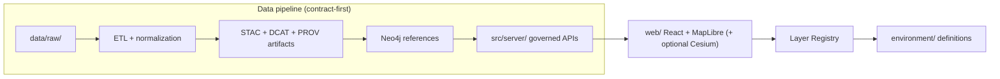

# 🌿 Environment Layer Definitions


**📍 Path:** `web/src/layers/definitions/environment/`

This folder contains **UI-layer definitions** for **environment + terrain** map layers (2D via MapLibre; optional 3D via Cesium). These are **configuration artifacts** (what to show + how to style it + how to explain it), not datasets. The actual data must be served through the governed API boundary.  [oai_citation:0‡MARKDOWN_GUIDE_v13.md.gdoc](file-service://file-UYVruFXfueR8veHMUKeugU) [oai_citation:1‡MARKDOWN_GUIDE_v13.md.gdoc](file-service://file-UYVruFXfueR8veHMUKeugU)

---

## 🧭 What “Environment” covers

Typical layer categories in this folder include:

- 🏔️ **Terrain & elevation** (DEM, hillshade, slope/aspect)
- 🌊 **Hydrology** (streams/rivers, watersheds, wetlands, floodplains)
- 🌾 **Land cover / vegetation** (land use classification, NDVI-style products)
- 🧱 **Soils & geology** (SDA/SSURGO-style products, soil properties)
- 🌫️ **Air & climate** (air quality surfaces, climate normals, drought indices)
- 🔥 **Hazards** (fire risk, erosion risk, heat islands—*if governed + sourced*)

The system’s mapping layer scope explicitly includes **“Environmental & Terrain Data … hydrology and land cover”** as core map content.  [oai_citation:2‡Kansas-Frontier-Matrix_ Open-Source Geospatial Historical Mapping Hub Design.pdf](file-service://file-BJN3xmP44EHc9NRCccCn4H)

---

## ✅ Non‑negotiables (KFM invariants)

> [!IMPORTANT]
> These rules are *system design constraints*, not preferences.

### 1) Pipeline order is absolute 🔒  
Data must flow: **ETL → Catalogs (STAC/DCAT/PROV) → Graph → API → UI** (then Story Nodes / Focus Mode).  [oai_citation:3‡MARKDOWN_GUIDE_v13.md.gdoc](file-service://file-UYVruFXfueR8veHMUKeugU) [oai_citation:4‡MARKDOWN_GUIDE_v13.md.gdoc](file-service://file-UYVruFXfueR8veHMUKeugU)

### 2) API boundary rule 🚧  
The UI must **never** query the Neo4j graph directly; all data access must go through the governed API layer.  [oai_citation:5‡MARKDOWN_GUIDE_v13.md.gdoc](file-service://file-UYVruFXfueR8veHMUKeugU)

### 3) “No hidden data in UI” 🧼  
The frontend is the canonical home for UI code and map configuration, but it **must not** embed hidden datasets or bypass governance controls.  [oai_citation:6‡MARKDOWN_GUIDE_v13.md.gdoc](file-service://file-UYVruFXfueR8veHMUKeugU)

### 4) Sovereignty & classification propagation 🪶  
No output can be less restricted than its inputs. The UI must implement safeguards such as **generalizing/blurring/hiding sensitive locations** when required.  [oai_citation:7‡MARKDOWN_GUIDE_v13.md.gdoc](file-service://file-UYVruFXfueR8veHMUKeugU)

---

## 🧱 How environment layer definitions fit the architecture



- KFM’s pipeline explicitly requires boundary artifacts (STAC/DCAT/PROV) before downstream use.  [oai_citation:8‡MARKDOWN_GUIDE_v13.md.gdoc](file-service://file-UYVruFXfueR8veHMUKeugU) [oai_citation:9‡MARKDOWN_GUIDE_v13.md.gdoc](file-service://file-UYVruFXfueR8veHMUKeugU)
- The web UI is a React app with MapLibre and optional Cesium, consuming map layers from the backend.  [oai_citation:10‡Kansas Frontier Matrix Comprehensive System Documentation.pdf](sediment://file_00000000ef40722faf17987b69730695) [oai_citation:11‡Kansas Frontier Matrix Comprehensive System Documentation.pdf](sediment://file_00000000ef40722faf17987b69730695)

---

## 📦 What belongs in this folder (and what does not)

### ✅ DO put here
- Layer config objects/files (IDs, titles, grouping)
- MapLibre / Cesium styling defaults
- Legend + explanatory text (human-readable meaning)
- Provenance pointers (DCAT/STAC/PROV IDs + citations)
- Visibility/redaction constraints (zoom gates, tier flags)
- Attribution strings (license + source requirements)

### ❌ DO NOT put here
- Raw datasets, CSVs, GeoJSON dumps, “just for the UI” copies
- Direct DB queries, graph queries, or client-side “shadow APIs”
- Secrets, tokens, API keys
- Any restricted coordinates that governance expects to be redacted at the API layer

This aligns with the “canonical subsystem homes” rule: UI config lives in `web/`, while data and access control live earlier in the pipeline and behind the API.  [oai_citation:12‡MARKDOWN_GUIDE_v13.md.gdoc](file-service://file-UYVruFXfueR8veHMUKeugU)

---

## 🗂️ Suggested folder layout (typical)

> Your exact filenames may differ; the intent is consistency + discoverability.

```text
📁 web/
  📁 src/
    📁 layers/
      📁 definitions/
        📁 environment/
          📄 README.md   ✅ you are here
          📄 index.ts    (exports environment layers)
          📄 terrain.ts
          📄 hydrology.ts
          📄 landcover.ts
          📄 soils.ts
          📄 climate.ts
          📄 hazards.ts  (optional; governance-sensitive)
```

---

## 🔌 API wiring expectations (tiles + datasets)

Environment layers typically point to one of these API patterns:

### Vector tiles (PBF)
```txt
GET /api/v1/tiles/{layer}/{z}/{x}/{y}.pbf
```

### Raster tiles (PNG / WebP)
```txt
GET /api/v1/tiles/{layer}/{z}/{x}/{y}.png
GET /api/v1/tiles/{layer}/{z}/{x}/{y}.webp
```

### Dataset metadata (catalog-backed)
```txt
GET /api/v1/datasets
GET /api/v1/datasets/{id}
```

These endpoints and formats are part of the documented KFM API surface (including the tile endpoint patterns and the datasets endpoints).  [oai_citation:13‡Kansas Frontier Matrix Comprehensive System Documentation.pdf](sediment://file_00000000ef40722faf17987b69730695)

> [!NOTE]
> Even when a layer is “just a visualization,” the data it visualizes must still be cataloged and governed (STAC/DCAT/PROV + policy checks) before it’s considered publishable.  [oai_citation:14‡MARKDOWN_GUIDE_v13.md.gdoc](file-service://file-UYVruFXfueR8veHMUKeugU) [oai_citation:15‡MARKDOWN_GUIDE_v13.md.gdoc](file-service://file-UYVruFXfueR8veHMUKeugU)

---

## 🧾 The “definition contract” (recommended shape)

KFM is explicitly **contract-first**: schemas and API contracts are first-class artifacts, and changes require compatibility/version discipline.  [oai_citation:16‡MARKDOWN_GUIDE_v13.md.gdoc](file-service://file-UYVruFXfueR8veHMUKeugU)

So layer definitions should be **typed** (TS) and ideally validated via a JSON Schema in `schemas/`. (The repo structure expects schemas to exist for UI + telemetry, etc.)  [oai_citation:17‡MARKDOWN_GUIDE_v13.md.gdoc](file-service://file-UYVruFXfueR8veHMUKeugU)

Here’s a **practical** (UI-friendly) baseline interface for environment layers:

```ts
/**
 * Environment layer definition (UI config).
 * Keep this object small; defer data heavy-lifting to the API.
 */
export type VisibilityTier = "public" | "restricted" | "internal";

export interface ProvenanceRefs {
  /** DCAT dataset id or stable key (preferred) */
  dcatDatasetId?: string;

  /** STAC collection/item IDs (or stable keys) */
  stacCollectionId?: string;
  stacItemIds?: string[];

  /** PROV bundle id/key for lineage inspection */
  provBundleId?: string;

  /** Human-readable citations shown in UI */
  citations?: Array<{ label: string; url: string }>;
}

export interface LegendItem {
  label: string;
  color?: string;         // e.g. "#2c7fb8"
  icon?: string;          // sprite id
  range?: [number, number]; // continuous bin range
  opacity?: number;       // 0..1 (optional)
}

export interface EnvironmentLayerDefinition {
  // Identity
  id: string;             // kebab-case unique
  title: string;
  summary: string;

  // Classification
  theme: "environment";
  tags?: string[];

  // Data wiring (API-first)
  source: {
    kind: "vector-tile" | "raster-tile" | "geojson" | "wms" | "wmts";
    url: string;          // e.g. `${API_BASE}/api/v1/tiles/...`
    tileFormat?: "pbf" | "png" | "webp";
    minzoom?: number;
    maxzoom?: number;
  };

  // Rendering defaults
  maplibre?: {
    /** MapLibre layer id(s) / style fragments */
    styleLayers: unknown[];
  };
  cesium?: {
    /** Optional Cesium imagery/terrain hints */
    imageryType?: "urlTemplate" | "wmts";
  };

  // UX (legend + help)
  legend?: {
    title?: string;
    items: LegendItem[];
    notes?: string;
  };

  // Temporal behavior (if time-aware)
  time?: {
    start?: string;       // ISO date
    end?: string;         // ISO date
    resolution?: "annual" | "monthly" | "daily" | "instant";
    defaultTime?: string; // ISO date
  };

  // Governance
  visibility: {
    tier: VisibilityTier;
    /** enforce zoom gates + redaction constraints */
    minZoomGate?: number;
    maxZoomGate?: number;
    redaction?: "none" | "generalize" | "blur" | "hide";
    reason?: string;
  };

  // Provenance & attribution
  provenance: ProvenanceRefs;
  attributionHtml?: string;
}
```

> [!TIP]
> If your UI already has a canonical layer type elsewhere, treat this as a **documentation contract** and keep it aligned with that code (not divergent).

---

## 🧠 Provenance & metadata rules (required)

### Every environment layer must link to catalogs 📚  
KFM requires **STAC + DCAT + PROV** alignment for published datasets, including licenses, discovery info, and lineage.  [oai_citation:18‡MARKDOWN_GUIDE_v13.md.gdoc](file-service://file-UYVruFXfueR8veHMUKeugU)

### Layer popovers must be evidence-friendly 🔍  
When a user clicks a layer, the UI should have enough pointers to show:

- What it is (definition + scope)
- Where it came from (source org + license)
- When it was collected/updated (temporal metadata)
- How it was produced (PROV lineage)
- How to cite it (citation info)

“Making Maps” emphasizes that dependable geographic data includes metadata such as identification, quality, spatial reference, distribution, citation, and temporal information.  [oai_citation:19‡making-maps-a-visual-guide-to-map-design-for-gis.pdf](sediment://file_00000000602471f786dfbbaac9329fb9)

---

## 🪶 Sovereignty, ethics, and sensitive environmental data

Environmental layers can be sensitive (e.g., culturally sensitive places, endangered species, sacred sites, archaeological locations, privately owned water infrastructure).

- Governance + metadata must include licensing and sensitivity classification, and can incorporate cultural metadata like Traditional Knowledge / Biocultural labels.  [oai_citation:20‡Indigenous Statistics.pdf](sediment://file_0000000033ec72308e1f791a79f61bfe)
- KFM governance explicitly flags **sensitive layers** (including Indigenous sovereignty contexts) as a trigger for manual review.  [oai_citation:21‡MARKDOWN_GUIDE_v13.md.gdoc](file-service://file-UYVruFXfueR8veHMUKeugU)

> [!CAUTION]
> If your layer touches sensitive locations or sovereignty-relevant land/water/place data, assume you need:
> - tiered visibility
> - zoom gating
> - redaction/generalization
> - governance review
>
> The system is designed to “fail closed” when policies/checks fail.  [oai_citation:22‡Kansas Frontier Matrix (KFM) – Comprehensive Technical Blueprint.pdf](sediment://file_000000006dbc71f89a5094ce310a452d)

---

## 🎛️ Symbology & legend guidelines (map design)

Environment layers are often continuous surfaces (elevation, temperature) or categorical classes (land cover, soils). Design choices change interpretation.

### Legend discipline 🧩
A map legend is the key to interpretation and should include symbols not familiar to the audience; don’t clutter it with obvious elements.  [oai_citation:23‡making-maps-a-visual-guide-to-map-design-for-gis.pdf](sediment://file_00000000602471f786dfbbaac9329fb9)

### Sources & credits in UI 🧾
Include relevant metadata and credits (data sources, date, disclaimers, projection/CRS when needed).  [oai_citation:24‡making-maps-a-visual-guide-to-map-design-for-gis.pdf](sediment://file_00000000602471f786dfbbaac9329fb9)

### Visual hierarchy (figure/ground) 👁️
Use layering + contrast so that important data read as “figure” and less important data as “ground.” A practical checklist for figure/ground, visual differences, generalization, and classification is included in *Making Maps*.  [oai_citation:25‡making-maps-a-visual-guide-to-map-design-for-gis.pdf](sediment://file_000000002d2471fdb19e238af41b3408)

---

## ⚡ Performance & tile format notes

### Raster tile formats 🖼️  
Compression matters: common web image formats include JPEG, PNG, GIF, and SVG, each with tradeoffs; compression methods reduce file size for performance.  [oai_citation:26‡Scalable Data Management for Future Hardware.pdf](sediment://file_000000007d74722fa87beabc663630f7)

Recommended defaults:
- Use **PBF vector tiles** when features need styling per zoom or interactivity.
- Use **WebP raster tiles** when delivering imagery/surfaces (when supported), with PNG fallback.
- Keep legends lightweight and avoid huge client-side style expressions that slow render loops.

### Time-aware layers 🕰️  
If a layer is time-enabled, consider level-of-detail strategies (show lower-resolution summaries for low-interest ranges and higher resolution for high-interest/zoomed contexts). Multi-resolution approaches are discussed for time-oriented visualization.  [oai_citation:27‡Visualization of Time-Oriented Data.pdf](sediment://file_000000001468722f929b8752236e5a72)

---

## ♿ UX & accessibility expectations (for layer UI)

The layer panel is part of the user interface; usability and accessibility matter.

From the web design guidance in the project library:
- Keep pages fast (avoid heavy graphics that increase download time).
- Make navigation consistent and understandable (users expect consistency).
- Test with real users; accessibility is a core concern.  [oai_citation:28‡professional-web-design-techniques-and-templates.pdf](sediment://file_000000000acc71f8b2e5128c030179fc)

Practical layer-panel expectations:
- ✅ Keyboard operable (toggle, expand, slider)
- ✅ Visible focus states
- ✅ Legend labels readable at minimum font sizes
- ✅ Color choices not relying on color alone (patterns, outlines, labels)
- ✅ “More info” panel includes citations + license

---

## 🧪 Adding a new Environment layer (checklist)

> [!NOTE]
> Use this as your “Definition of Done” for environment layer PRs.

### A) Dataset readiness (upstream)
- [ ] Data exists in the canonical pipeline (raw/work/processed).
- [ ] STAC + DCAT + PROV artifacts exist and validate.  [oai_citation:29‡MARKDOWN_GUIDE_v13.md.gdoc](file-service://file-UYVruFXfueR8veHMUKeugU)
- [ ] API exposes it via `/api/v1/datasets/{id}` and/or `/api/v1/tiles/...`.  [oai_citation:30‡Kansas Frontier Matrix Comprehensive System Documentation.pdf](sediment://file_00000000ef40722faf17987b69730695)
- [ ] Any sensitive classification/visibility constraints are defined (and not downgraded).  [oai_citation:31‡MARKDOWN_GUIDE_v13.md.gdoc](file-service://file-UYVruFXfueR8veHMUKeugU)

### B) Definition work (this folder)
- [ ] Add a new `*.ts` definition file (or extend the correct category file).
- [ ] Include `provenance` pointers (DCAT/STAC/PROV IDs + citations).
- [ ] Add a clear legend + short “what does this mean” note.  [oai_citation:32‡making-maps-a-visual-guide-to-map-design-for-gis.pdf](sediment://file_00000000602471f786dfbbaac9329fb9)
- [ ] Add attribution + license text.
- [ ] Register it in `environment/index.ts` (or equivalent export).

### C) UI + governance
- [ ] Confirm the UI enforces zoom gates/redaction where required.  [oai_citation:33‡MARKDOWN_GUIDE_v13.md.gdoc](file-service://file-UYVruFXfueR8veHMUKeugU)
- [ ] Confirm no direct graph/database calls from UI.  [oai_citation:34‡MARKDOWN_GUIDE_v13.md.gdoc](file-service://file-UYVruFXfueR8veHMUKeugU)
- [ ] Confirm a11y basics in the layer panel.  [oai_citation:35‡professional-web-design-techniques-and-templates.pdf](sediment://file_000000000acc71f8b2e5128c030179fc)
- [ ] If sensitive or sovereignty-relevant: request governance review.  [oai_citation:36‡MARKDOWN_GUIDE_v13.md.gdoc](file-service://file-UYVruFXfueR8veHMUKeugU)

---

## 🧯 Troubleshooting quick hits

<details>
<summary><strong>🧩 Layer toggles on but nothing draws</strong></summary>

- Check the tile URL (404 vs 200).
- Confirm the layer name matches the API’s tile layer key. (Tile endpoint pattern is strict.)  [oai_citation:37‡Kansas Frontier Matrix Comprehensive System Documentation.pdf](sediment://file_00000000ef40722faf17987b69730695)
- Confirm min/max zoom gates aren’t blocking display.
- Verify style layer `source-layer` (for vector tiles) matches the server’s PBF source-layer.
</details>

<details>
<summary><strong>🧾 “Where’s the source/license?”</strong></summary>

- Add `attributionHtml` and `provenance.citations`.
- Ensure the DCAT entry includes license + distribution links.  [oai_citation:38‡MARKDOWN_GUIDE_v13.md.gdoc](file-service://file-UYVruFXfueR8veHMUKeugU)
</details>

<details>
<summary><strong>🪶 Sensitive places are visible at high zoom</strong></summary>

- This is a regression: enforce the tier rule and zoom gates/redaction.
- Re-check sovereignty/classification propagation: outputs can’t be less restricted than inputs.  [oai_citation:39‡MARKDOWN_GUIDE_v13.md.gdoc](file-service://file-UYVruFXfueR8veHMUKeugU)
</details>

---

## 📚 Reference shelf (project files)

> These are the “why” behind the rules in this README. ✨

- **KFM Master Guide v13 (contracts, pipeline, invariants, governance)**  [oai_citation:40‡MARKDOWN_GUIDE_v13.md.gdoc](file-service://file-UYVruFXfueR8veHMUKeugU)  
- **KFM Comprehensive Technical Blueprint (API + tiles + web UI stack)**  [oai_citation:41‡Kansas Frontier Matrix (KFM) – Comprehensive Technical Blueprint.pdf](sediment://file_000000006dbc71f89a5094ce310a452d)  
- **Open-Source Mapping Hub design (environment + terrain scope)**  [oai_citation:42‡learn-to-code-html-and-css-develop-and-style-websites.pdf](sediment://file_00000000ed6471fdb0ecead71e051444)  
- **Indigenous Statistics (governance + sovereignty framing)**  [oai_citation:43‡Kansas Frontier Matrix Comprehensive System Documentation.pdf](sediment://file_00000000ef40722faf17987b69730695)  
- **Professional Web Design Techniques (usability + accessibility)**  [oai_citation:44‡Node.js-React-CSS-HTML.pdf](sediment://file_00000000b09c71f8b277cb19b9f597b2)  
- **Making Maps (legend, sources/credits, metadata discipline)**  [oai_citation:45‡making-maps-a-visual-guide-to-map-design-for-gis.pdf](sediment://file_000000002d2471fdb19e238af41b3408)  
- **Visualization of Time-Oriented Data (time + multi-resolution ideas)**  [oai_citation:46‡Node.js-React-CSS-HTML.pdf](sediment://file_00000000b09c71f8b277cb19b9f597b2)  
- **Various Programming Concepts (image formats + compression overview)**  [oai_citation:47‡professional-web-design-techniques-and-templates.pdf](sediment://file_000000000acc71f8b2e5128c030179fc)  

---

## 🧩 Related (recommended) repo paths

- `docs/MASTER_GUIDE_v13.md` (system contracts + governance)  [oai_citation:48‡MARKDOWN_GUIDE_v13.md.gdoc](file-service://file-UYVruFXfueR8veHMUKeugU)
- `docs/standards/` (STAC/DCAT/PROV profiles)  [oai_citation:49‡MARKDOWN_GUIDE_v13.md.gdoc](file-service://file-UYVruFXfueR8veHMUKeugU)
- `schemas/` (validation schemas; should include UI artifacts)  [oai_citation:50‡MARKDOWN_GUIDE_v13.md.gdoc](file-service://file-UYVruFXfueR8veHMUKeugU)
- `src/server/` (API boundary; contracts + redaction)  [oai_citation:51‡MARKDOWN_GUIDE_v13.md.gdoc](file-service://file-UYVruFXfueR8veHMUKeugU)
- `docs/data/soils/...` / `docs/data/air-quality/...` (domain runbooks)  [oai_citation:52‡MARKDOWN_GUIDE_v13.md.gdoc](file-service://file-UYVruFXfueR8veHMUKeugU)

---

## 🏁 Guiding principle

**These definitions are “the map’s promise”**: what the UI claims the layer is, how it’s drawn, and how it’s justified.  
If we can’t point to **cataloged evidence + lineage + license**, the layer doesn’t ship.  [oai_citation:53‡MARKDOWN_GUIDE_v13.md.gdoc](file-service://file-UYVruFXfueR8veHMUKeugU) [oai_citation:54‡MARKDOWN_GUIDE_v13.md.gdoc](file-service://file-UYVruFXfueR8veHMUKeugU)