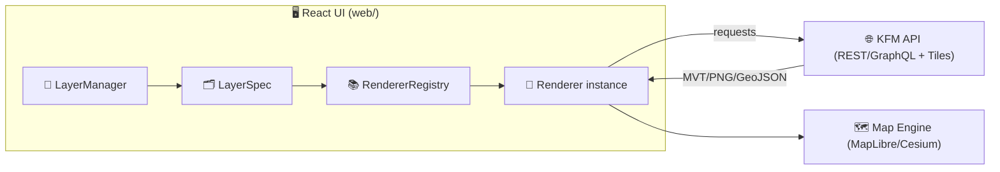

# 🧩 Layer Renderers (KFM Web)


> **What lives here?**  
> This folder contains the **renderer layer**: the code that turns a **KFM Layer** (dataset + styling + behavior + governance rules) into **on-screen pixels** on MapLibre (2D) and/or Cesium (3D).  
> It’s where “data → map” becomes real — while preserving KFM’s core promise: **the map behind the map** (traceability, citations, and source metadata).  [oai_citation:0‡Kansas Frontier Matrix Comprehensive System Documentation.pdf](sediment://file_00000000ef40722faf17987b69730695)  [oai_citation:1‡Kansas Frontier Matrix Comprehensive System Documentation.pdf](sediment://file_00000000ef40722faf17987b69730695)

---

## 📚 Table of Contents

- [🎯 Goals](#-goals)
- [🧠 Mental Model](#-mental-model)
- [📦 Folder Layout](#-folder-layout)
- [🧱 Core Concepts](#-core-concepts)
- [🧬 Data Contracts & Sources](#-data-contracts--sources)
- [🔁 Renderer Lifecycle](#-renderer-lifecycle)
- [🧾 Provenance, Attribution, and Indigenous Data Governance](#-provenance-attribution-and-indigenous-data-governance)
- [⚡ Performance Rules of Thumb](#-performance-rules-of-thumb)
- [🧪 Testing & Debugging](#-testing--debugging)
- [➕ Adding a New Renderer](#-adding-a-new-renderer)
- [✅ Checklist](#-checklist)
- [🔗 References](#-references)

---

## 🎯 Goals

Renderers must:

1. **Render faithfully** (correct geometry, correct styling, correct filtering).
2. **Respect the KFM “truth path”** — the Web UI consumes governed APIs (tiles/data/catalog), not databases directly.  [oai_citation:2‡Kansas Frontier Matrix Comprehensive System Documentation.pdf](sediment://file_00000000ef40722faf17987b69730695)  [oai_citation:3‡Kansas Frontier Matrix Comprehensive System Documentation.pdf](sediment://file_00000000ef40722faf17987b69730695)
3. **Be composable and isolated** (a renderer can be added/removed without leaving ghosts behind).
4. **Be deterministic & idempotent** (applying the same state twice yields the same map).
5. **Carry provenance forward** (layer metadata, citations, license, lineage, and attribution hooks).  [oai_citation:4‡Kansas Frontier Matrix Comprehensive System Documentation.pdf](sediment://file_00000000ef40722faf17987b69730695)  [oai_citation:5‡MARKDOWN_GUIDE_v13.md.gdoc](file-service://file-UYVruFXfueR8veHMUKeugU)
6. **Support both 2D and 3D** where relevant (MapLibre and Cesium are first-class map engines in KFM’s UI architecture).  [oai_citation:6‡Kansas Frontier Matrix (KFM) – Comprehensive Technical Blueprint.pdf](sediment://file_000000006dbc71f89a5094ce310a452d)  [oai_citation:7‡Kansas Frontier Matrix (KFM) – Comprehensive Technical Blueprint.pdf](sediment://file_000000006dbc71f89a5094ce310a452d)

---

## 🧠 Mental Model

Think of renderers as “drivers”:

- **Layer definition** describes *what* we want.
- **Renderer** knows *how* to draw that type of thing on a specific engine.
- **Engine** (MapLibre/Cesium) is the “hardware target”.



KFM explicitly supports:
- MapLibre GL JS for **2D vector/raster maps**
- CesiumJS for **3D globe/terrain + 3D assets**  [oai_citation:8‡Kansas Frontier Matrix (KFM) – Comprehensive Technical Blueprint.pdf](sediment://file_000000006dbc71f89a5094ce310a452d)

---

## 📦 Folder Layout

> ⚠️ This layout may evolve — keep it tidy and grouped by engine + capability.

```text
📁 web/src/layers/renderers/
├─ 📄 README.md                👈 you are here
├─ 📁 maplibre/                🗺️ 2D renderers (style layers + sources)
│  ├─ 📄 VectorTileRenderer.ts
│  ├─ 📄 RasterTileRenderer.ts
│  ├─ 📄 GeoJsonRenderer.ts
│  └─ 📄 index.ts
├─ 📁 cesium/                  🌍 3D renderers (imagery, terrain, 3D Tiles, entities)
│  ├─ 📄 ImageryRenderer.ts
│  ├─ 📄 Tileset3DRenderer.ts
│  └─ 📄 index.ts
├─ 📄 types.ts                 🧾 shared interfaces + contracts
└─ 📄 registry.ts              📚 choose renderer for a layer (factory/DI)
```

---

## 🧱 Core Concepts

### 1) `LayerSpec` (what to draw) 🗂️
A *serializable* description of:
- dataset identifier(s)
- renderer “kind” / type
- styling rules
- time/attribute filters
- interaction policy (click/hover/selection)
- governance flags (sensitive data, restricted zoom, etc.)

> **Rule:** `LayerSpec` should be safe to store in story nodes / URLs.

### 2) `RendererContext` (where/how to draw) 🧠
A runtime object that provides:
- engine instance (MapLibre `map`, Cesium `viewer`)
- API client(s)
- global app state (time slider, viewport, theme)
- event bus (hover/click dispatch)
- attribution/provenance sink (register dataset/license/citations)

### 3) `LayerRenderer` (the driver) 🧩
A renderer is responsible for translating LayerSpec → engine primitives:
- MapLibre: sources + style layers
- Cesium: imagery layers / entities / 3D tilesets

**A renderer must NOT:**
- fetch directly from databases
- bypass the KFM API contracts
- contain business logic that belongs in layer definitions, cataloging, or governance gates  [oai_citation:9‡Kansas Frontier Matrix Comprehensive System Documentation.pdf](sediment://file_00000000ef40722faf17987b69730695)  [oai_citation:10‡Kansas Frontier Matrix Comprehensive System Documentation.pdf](sediment://file_00000000ef40722faf17987b69730695)

---

## 🧬 Data Contracts & Sources

KFM’s API supports both **data** and **tiles** for map visualization:

- **Vector tiles (MVT)**: `GET /tiles/{layer}/{z}/{x}/{y}.pbf`
- **Raster tiles**: `GET /tiles/{layer}/{z}/{x}/{y}.png` (or `.webp`)
- **Dataset metadata** + discovery: dataset catalog endpoints
- **GeoJSON streaming (smaller layers / overlays)**: dataset data endpoints with `format=geojson` and bbox filtering  [oai_citation:11‡Kansas Frontier Matrix Comprehensive System Documentation.pdf](sediment://file_00000000ef40722faf17987b69730695)

> ✅ Renderers should choose the **lowest-cost** representation that meets UX needs:
- Big/continuous layers → tiles
- Small, interactive overlays → GeoJSON (with care)

---

## 🔁 Renderer Lifecycle

Renderers should follow a predictable contract so the UI can manage them safely.

### Recommended interface shape (TypeScript)

```ts
export interface LayerRenderer {
  /** Called once per instance (optional). */
  init?(ctx: RendererContext): Promise<void> | void;

  /** Attach all engine resources (sources/layers/entities). */
  attach(ctx: RendererContext, layer: LayerSpec): Promise<void> | void;

  /** Update visibility/opacity/filters/time without recreating everything. */
  update?(ctx: RendererContext, layer: LayerSpec, patch: LayerPatch): Promise<void> | void;

  /** Remove engine resources created by this renderer (idempotent!). */
  detach(ctx: RendererContext, layerId: string): Promise<void> | void;

  /** Cleanup internal resources (timers, listeners, caches). */
  dispose?(): Promise<void> | void;

  /** Optional: tell registry if it can handle a layer. */
  supports?(layer: LayerSpec): boolean;
}
```

### Lifecycle expectations ✅

- `attach()` **must** record every engine resource ID it creates.
- `detach()` **must** remove those resources safely, even if partially created.
- `update()` should avoid full rebuilds unless absolutely necessary.
- All calls should be **safe to repeat** (React re-renders happen).

---

## 🧾 Provenance, Attribution, and Indigenous Data Governance

### Provenance is not optional 🧾✨
KFM’s mission emphasizes that every layer and answer should be **traceable to original sources** (“the map behind the map”).  [oai_citation:12‡Kansas Frontier Matrix Comprehensive System Documentation.pdf](sediment://file_00000000ef40722faf17987b69730695)  [oai_citation:13‡Kansas Frontier Matrix Comprehensive System Documentation.pdf](sediment://file_00000000ef40722faf17987b69730695)

Renderers **must**:
- register **dataset ID(s)** used
- register **license / attribution text**
- link to **citations** or provenance objects when available
- surface **data freshness / temporal coverage** in UI metadata hooks

> Practical pattern: when `attach()` succeeds, push an attribution record into a shared store:
- dataset title
- license
- source agency/archive
- “learn more” link (catalog)
- citations bundle reference

### Indigenous data considerations 🪶🛡️
KFM documentation explicitly treats Indigenous-related data with special governance and references CARE principles.  [oai_citation:14‡Kansas Frontier Matrix Comprehensive System Documentation.pdf](sediment://file_00000000ef40722faf17987b69730695)  [oai_citation:15‡Indigenous Statistics.pdf](sediment://file_0000000033ec72308e1f791a79f61bfe)

If a layer is flagged as Indigenous / culturally sensitive:
- **Never** infer beyond what the dataset supports
- Prefer **aggregated** or **appropriate** representations
- Respect any **access constraints** and **community rules**
- Ensure the UI metadata includes clear **context + source + limitations**

> Reminder: statistics/data are **culturally embedded**, not neutral “just numbers.”  [oai_citation:16‡Indigenous Statistics.pdf](sediment://file_0000000033ec72308e1f791a79f61bfe)

---

## ⚡ Performance Rules of Thumb

### Choose the right payload 📦
- **Vector tiles** for large feature sets (roads, parcels, hydro, boundaries).
- **Raster tiles** for continuous surfaces (heatmaps, historical scans, DEM-derived rasters).
- **GeoJSON** only when:
  - feature count is low
  - interactivity needs feature-level details immediately
  - you can clip by bbox and/or time

KFM’s system documentation explicitly supports tile serving to power map visualizations.  [oai_citation:17‡Kansas Frontier Matrix Comprehensive System Documentation.pdf](sediment://file_00000000ef40722faf17987b69730695)

### Avoid UI jank 🧠💨
- Keep heavy transforms out of the main thread.
- Debounce rapid updates (timeline scrubbing, opacity sliders).
- Cache derived style expressions where possible.
- Make `update()` incremental.

### Clean teardown 🧹
Memory leaks in renderers show up as:
- ghost layers
- duplicate sources
- duplicate event listeners
- Cesium primitives persisting after toggle

Treat `detach()` like a **transaction rollback**.

---

## 🧪 Testing & Debugging

### Unit tests ✅
Test:
- renderer selection logic (`RendererRegistry`)
- MapLibre layer/source specs generated from LayerSpec
- Cesium entity/tileset config mapping
- `detach()` idempotence (call twice, nothing breaks)

### Integration tests 🧩
- mount a map, attach a layer, toggle it, confirm:
  - sources/layers exist, then are removed
  - click/hover routes events correctly
  - attribution store contains expected records

### Debugging tips 🔍
- MapLibre: toggle debug overlays (tile boundaries, collision boxes) when available
- Cesium: enable inspector (primitives/entities count)
- Add structured logs: `[renderer:<kind>] attach|update|detach`

---

## ➕ Adding a New Renderer

1. **Decide engine target**:
   - `maplibre/` for 2D
   - `cesium/` for 3D
   - (or both, if truly dual-mode)

2. **Create the renderer** file:
   - `FooRenderer.ts` implementing `LayerRenderer`

3. **Register it** in `registry.ts`:
   - map layer kind/type → renderer factory
   - include `supports()` if selection is dynamic

4. **Add a small demo LayerSpec**:
   - ideally a story node fixture or dev-only example

5. **Verify provenance hooks**:
   - dataset metadata appears in UI layer inspector
   - license/attribution is displayed

6. **Add tests**:
   - at least one unit test + one integration test path

---

## ✅ Checklist

Before merging a renderer:

- [ ] `attach()` creates resources with unique, namespaced IDs
- [ ] `detach()` removes **everything** it created (idempotent)
- [ ] `update()` does not rebuild unless required
- [ ] Uses **KFM API** for tiles/data (no direct DB paths)  [oai_citation:18‡Kansas Frontier Matrix Comprehensive System Documentation.pdf](sediment://file_00000000ef40722faf17987b69730695)  [oai_citation:19‡Kansas Frontier Matrix Comprehensive System Documentation.pdf](sediment://file_00000000ef40722faf17987b69730695)
- [ ] Registers attribution + dataset provenance  [oai_citation:20‡Kansas Frontier Matrix Comprehensive System Documentation.pdf](sediment://file_00000000ef40722faf17987b69730695)
- [ ] Handles errors gracefully (network failures, missing tiles)
- [ ] Adds tests
- [ ] Handles “Indigenous / sensitive” governance flags appropriately  [oai_citation:21‡Indigenous Statistics.pdf](sediment://file_0000000033ec72308e1f791a79f61bfe)

---

## 🔗 References

- **KFM system mission & architecture** (evidence-first, governed pipeline, tile APIs)  [oai_citation:22‡Kansas Frontier Matrix Comprehensive System Documentation.pdf](sediment://file_00000000ef40722faf17987b69730695)  [oai_citation:23‡Kansas Frontier Matrix Comprehensive System Documentation.pdf](sediment://file_00000000ef40722faf17987b69730695)  
- **KFM technical blueprint** (React UI + MapLibre 2D + Cesium 3D expectations)  [oai_citation:24‡Kansas Frontier Matrix (KFM) – Comprehensive Technical Blueprint.pdf](sediment://file_000000006dbc71f89a5094ce310a452d)  [oai_citation:25‡Kansas Frontier Matrix (KFM) – Comprehensive Technical Blueprint.pdf](sediment://file_000000006dbc71f89a5094ce310a452d)  
- **Markdown/diagram conventions** (Mermaid patterns used across KFM docs)  [oai_citation:26‡MARKDOWN_GUIDE_v13.md.gdoc](file-service://file-UYVruFXfueR8veHMUKeugU)  
- **Indigenous data sovereignty framing** (CARE, culturally embedded statistics)  [oai_citation:27‡Indigenous Statistics.pdf](sediment://file_0000000033ec72308e1f791a79f61bfe)  
- **Frontend TypeScript discipline reminder** (type safety + explicitness)  [oai_citation:28‡Node.js-React-CSS-HTML.pdf](sediment://file_00000000b09c71f8b277cb19b9f597b2)