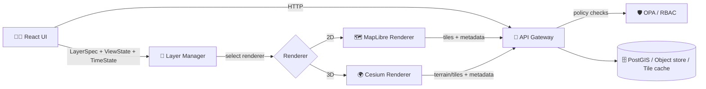

# 🛰️ Cesium Renderer
> 🌎 **3D Globe + Terrain rendering for KFM layers**  
> 🧭 **Scope:** `web/src/layers/renderers/cesium/`  
> 🧩 **Pairs with:** MapLibre (2D) renderer for seamless 2D↔3D switching

---

## 🎯 Why this folder exists

KFM supports **two spatial renderers**:

- 🗺️ **MapLibre (2D)** for fast, classic cartography (vector/raster tiles)
- 🌍 **Cesium (3D)** for **terrain, globe navigation, height-aware visualization**, and (optionally) **3D Tiles / CZML**

This folder contains the **Cesium-specific adapter layer** that:
- renders KFM’s **shared LayerSpec model** in a Cesium `Viewer`
- keeps **camera + timeline** consistent with the rest of the UI
- enforces KFM’s core governance rules:
  - 🔒 **UI does not query databases directly**
  - 🧾 **provenance/metadata is first-class**
  - 🚫 **no “mystery layers” (No Source, No Answer)**

---

## 🧭 Table of Contents

- [🧩 Architecture](#-architecture)
- [📁 Directory layout](#-directory-layout)
- [🔌 Renderer contract](#-renderer-contract)
- [🧱 Layer adapters](#-layer-adapters)
- [🖱️ Interaction & picking](#️-interaction--picking)
- [⏳ Time, timeline & story sync](#-time-timeline--story-sync)
- [🧾 Provenance, attribution & licensing](#-provenance-attribution--licensing)
- [🔐 Governance, privacy & “CARE + FAIR”](#-governance-privacy--care--fair)
- [⚡ Performance & stability](#-performance--stability)
- [🧪 Testing strategy](#-testing-strategy)
- [🧯 Troubleshooting](#-troubleshooting)
- [🤝 Contributing](#-contributing)
- [📚 Glossary](#-glossary)

---

## 🧩 Architecture

### 🧱 Big picture



### ✅ Non‑negotiables (KFM rules applied here)

- 🔒 **Never** fetch raw data directly from databases from the browser.
- 🧾 Every layer must have **metadata + provenance** available to the UI.
- 🚫 Missing provenance must behave like **“not publishable”** (fail closed).
- 🔐 Respect access policies (RBAC / OPA). If the API refuses, the renderer must gracefully show “not permitted” behavior.

---

## 📁 Directory layout

> 📝 Your exact filenames may differ. The key is the **separation of concerns**.

A recommended (and commonly used) structure:

```text
📂 web/src/layers/renderers/cesium/
├─ 📄 README.md
├─ 🧩 CesiumRenderer.ts              # Renderer entry (mount/unmount, view/time)
├─ 📂 viewer/
│  ├─ createViewer.ts                # Viewer bootstrap (scene, imagery, terrain)
│  └─ destroyViewer.ts               # Cleanup + WebGL resource release
├─ 📂 adapters/                      # LayerSpec -> Cesium implementation
│  ├─ rasterImagery.ts               # imagery layers
│  ├─ geojson.ts                     # GeoJSON overlays (small/medium)
│  ├─ primitives.ts                  # high-perf primitives for large datasets
│  ├─ czml.ts                        # time-dynamic assets
│  └─ tiles3d.ts                     # 3D Tilesets
├─ 📂 interactions/
│  ├─ pick.ts                        # unified feature picking
│  ├─ hover.ts                       # hover highlight rules
│  └─ events.ts                      # normalize Cesium events to app events
├─ 📂 utils/
│  ├─ coords.ts                      # WGS84/Cartesian conversions, bounds helpers
│  ├─ time.ts                        # app TimeState <-> Cesium Clock/JulianDate
│  ├─ styles.ts                      # KFM style tokens -> Cesium materials
│  └─ attribution.ts                 # enforce layer attribution rendering
└─ 📂 types/
   ├─ rendererTypes.ts               # Renderer interfaces
   └─ cesiumTypes.ts                 # Cesium-specific typed wrappers
```

---

## 🔌 Renderer contract

The Cesium renderer should behave like a **pluggable backend** for the layers system.

### ✅ Expected responsibilities

- 🧱 Own the Cesium `Viewer` lifecycle (create, resize, destroy)
- 🧩 Translate KFM `LayerSpec` → Cesium layers/primitives/datasources
- 🧭 Maintain & report camera state (for 2D↔3D continuity)
- ⏳ Apply global timeline/time filters
- 🖱️ Normalize interaction (click/hover/select)
- 🧾 Enforce “metadata required” + attribution UX

### 🧠 Suggested TypeScript-ish interface

```ts
export type ViewState = {
  // Keep this renderer-agnostic (lat/lon/zoom-ish), so 2D/3D can sync.
  center: { lon: number; lat: number };
  zoom: number;           // conceptual zoom; renderer maps it to camera distance
  bearing: number;        // degrees
  pitch: number;          // degrees
};

export type TimeState = {
  mode: "instant" | "range";
  // Use ISO strings or epoch ms; map to Cesium JulianDate internally.
  t?: string;
  start?: string;
  end?: string;
};

export interface Renderer {
  mount(container: HTMLElement): void;
  resize(): void;
  unmount(): void;

  setView(view: ViewState): void;
  getView(): ViewState;

  setTime(time: TimeState): void;

  upsertLayer(layer: LayerSpec): void;
  removeLayer(layerId: string): void;

  on(event: "click" | "hover" | "error", cb: (payload: unknown) => void): () => void;
}
```

> 🧠 **Design intent:** The **Layer Manager** owns “what layers exist + their specs”,  
> the renderer owns “how to draw them in its engine”.

---

## 🧱 Layer adapters

Think of adapters as **“render strategies”** per layer type.

### 🧩 Recommended mapping table

| KFM layer kind | Cesium strategy | Best for | Notes |
|---|---|---|---|
| 🖼️ Raster / imagery | `ImageryLayer` | basemaps, scanned maps | honor attribution + license rules |
| 🧾 Vector (small) | `GeoJsonDataSource` / Entities | ≤ few thousand features | easiest, but can be slow at scale |
| 🧱 Vector (large) | `PrimitiveCollection` / `GroundPrimitive` | big lines/points/polygons | prefer for performance |
| 🏛️ 3D Tiles | `Cesium3DTileset` | buildings, meshes, photogrammetry | streamable + scalable |
| ⏳ Time-dynamic | `CZML` | moving/temporal entities | connect to global timeline |
| 🧍 Models | glTF via Entities/Primitives | artifacts, landmarks | keep polygon count sane |

### ✅ Adapter rules (important)

- 🧾 **Every adapter must accept metadata** (at least dataset id + attribution)
- 🔐 **Every adapter must tolerate “policy denied”** without breaking the viewer
- 🧯 **Every adapter must implement cleanup** (remove primitives/datasources, destroy resources)
- ⚖️ Prefer **Primitives** over Entities for large volumes

---

## 🖱️ Interaction & picking

### Goal
Make Cesium interactions feel identical to 2D:

- click selects a feature
- hover highlights
- selection opens the same **metadata + provenance panel**

### Recommended pattern

- Normalize Cesium pick results into a renderer-agnostic payload:

```ts
export type PickResult =
  | { kind: "feature"; layerId: string; featureId: string; properties: Record<string, unknown> }
  | { kind: "empty" }
  | { kind: "blocked"; reason: "no-permission" | "no-provenance" };
```

### 🔎 Picking hierarchy (suggested)

1. **Top-most selectable feature** under cursor
2. If multiple: prefer “interactive” layers (configured)
3. If ambiguous: return a small list for UI disambiguation (optional UX)

---

## ⏳ Time, timeline & story sync

KFM’s UI includes:
- a **timeline slider / year filter**
- scrollytelling / story navigation that triggers map view changes

The Cesium renderer should:

- ⏱️ Map `TimeState` → Cesium `Clock.currentTime` (or `start/stop`)
- 🧭 Keep camera sync consistent when switching renderers
- 🧩 Allow story nodes to call `setView()` + `setTime()` in one atomic update

### 🧠 Clutter control for time filtering

When time filters remove content, don’t just “hard delete everything” visually.
A robust pattern is:

- show filtered-out items **in less detail** (faded, simplified)
- or make them **invisible** when necessary for clarity/performance

> 🔭 Rule of thumb: **reduce cognitive load before you reduce truth.**

---

## 🧾 Provenance, attribution & licensing

### ✅ Provenance (KFM)

Every layer rendered in Cesium must be traceable:

- dataset id (immutable)
- source citation(s)
- collection method + date range
- processing steps (pipeline lineage if available)

If metadata is missing:
- 🚫 treat the layer as **blocked**
- surface a user-facing explanation (“No Source, No Answer”)

### 🧾 Attribution UI

Cesium supports on-screen credits/attribution.
KFM should:
- display attribution **per active layer**
- provide a **“map behind the map”** path to see sources + method

### ⚖️ Licensing realities (very practical)

- Many basemaps / imagery sources have licensing constraints.
- Do **not** assume you can legally embed *any* external imagery source.
- Prefer basemaps served through KFM-approved sources and/or self-hosted tiles.

✅ When adding imagery layers, include:
- attribution text
- license identifier (SPDX-ish if you have it)
- “allowed uses” (internal/public)
- whether screenshots/export is allowed

---

## 🔐 Governance, privacy & “CARE + FAIR”

KFM’s governance stance matters *extra* in 3D:
- terrain + tilt can reveal details (structures, access routes, sensitive locations)
- “pretty” can accidentally become “too revealing”

### 🧭 CARE + FAIR awareness (especially for Indigenous data)

When layers include Indigenous-related data, cultural heritage, or sensitive locations:

- ✅ treat data as a **valued cultural resource**
- ✅ support **collective rights + authority to control**
- ✅ support metadata/labels that carry protocols (e.g., TK/BC-style constraints)
- ✅ minimize harm via redaction rules (server side) *and* UI affordances (client side)

Practical renderer implications:

- 🧩 **precision throttling:** optionally snap/blur coordinates for sensitive layers
- 🧱 **visibility gating:** hide certain zoom/altitude levels
- 🧾 **metadata gating:** require “sensitivity classification” to render
- 🧯 **export gating:** if layer is restricted, block screenshot/export UI paths (if present)

---

## ⚡ Performance & stability

Cesium can be extremely fast—if we avoid the common traps.

### ✅ High-impact performance rules

- 🧱 Prefer **Primitives** for large datasets (Entities don’t scale as well)
- 🧹 Destroy resources on unmount (WebGL memory leaks are real)
- 🧭 Use camera distance/height thresholds to avoid drawing tiny features
- 🧊 Avoid thrashing: batch updates, debounce style changes, keep diffs small
- 🧠 Use LOD strategies: simplify geometry at distance; increase detail near camera

### 🧯 Stability rules

- Handle WebGL context loss gracefully (surface a recover UX)
- Never assume terrain/tiles load: network failure must not crash the app
- Keep errors user-readable **and** developer-actionable

---

## 🧪 Testing strategy

Cesium rendering is hard to test directly in headless environments.
So we test in layers:

### ✅ What to unit test (cheap + valuable)
- style mapping functions (`styles.ts`)
- coordinate conversions (`coords.ts`)
- time conversion helpers (`time.ts`)
- adapter diffing logic (input LayerSpec → output operations)

### ✅ What to integration test (browser/E2E)
- viewer mounts/unmounts without leaks
- switching 2D↔3D preserves view state
- picking returns correct `PickResult`
- time slider affects visibility/appearance

### 🧩 Testing trick: wrap Cesium for mockability
Create thin wrappers (or dependency injection) so most logic doesn’t require a real WebGL context.

---

## 🧯 Troubleshooting

### “Nothing renders”
- ✅ Verify the viewer is mounted into a visible container (non-zero size)
- ✅ Confirm imagery/terrain endpoints are reachable
- ✅ Check policy: layer might be blocked (no permission / no provenance)

### “Clicking doesn’t select anything”
- ✅ Ensure pickable primitives/entities are assigned metadata (layerId/featureId)
- ✅ Confirm depth testing / translucency isn’t blocking picks

### “Switching 2D↔3D jumps somewhere else”
- ✅ Ensure both renderers share a single canonical `ViewState`
- ✅ Avoid renderer-specific state being the source of truth

### “Performance tanks with big datasets”
- ✅ Move from Entities → Primitives / 3D Tiles
- ✅ Add LOD + distance culling
- ✅ Reduce per-frame allocations and rebuilds

---

## 🤝 Contributing

### ✅ Add a new Cesium layer adapter (checklist)

- [ ] Define/extend the shared `LayerSpec` (renderer-agnostic)
- [ ] Create adapter file in `adapters/`
- [ ] Enforce metadata presence (fail closed)
- [ ] Implement `create`, `update(diff)`, `destroy`
- [ ] Ensure selection/picking emits normalized `PickResult`
- [ ] Add attribution wiring
- [ ] Add unit tests for style/time/coord logic
- [ ] Add an example layer entry (dev/demo)
- [ ] Document any new runtime config/env requirements

### 🧠 Design principle

> 🧩 **LayerSpec describes intent** (what the map means).  
> 🎨 **Renderer decides implementation** (how it’s drawn).  
> 🧾 **Metadata/provenance makes it trustworthy.**

---

## 📚 Glossary

- **Cesium Viewer**: The main 3D globe/scene container.
- **Entity**: High-level Cesium object model (easy, slower at scale).
- **Primitive**: Lower-level drawing building block (harder, faster).
- **3D Tiles**: Streaming format for massive 3D geospatial datasets.
- **CZML**: Cesium JSON format for time-dynamic entities.
- **WGS84**: Standard lon/lat coordinate reference used by Cesium.
- **Provenance**: Traceable lineage of *where data came from + how it was processed*.

---

## 🔗 Related docs (repo-relative)

- `web/src/layers/renderers/maplibre/README.md` (2D renderer, if present)
- `docs/architecture/` (system architecture)
- `src/server/api/README.md` (API gateway + policy constraints)
- `docs/data/metadata.md` (dataset metadata + provenance requirements)

---

🧭 **If you change how layers render here, also verify:**
- 2D↔3D switching still preserves view
- the provenance panel still shows correct sources
- policy-denied behavior remains “fail closed”