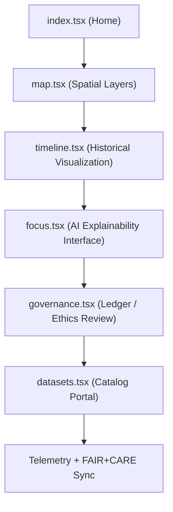

<div align="center">

# 🌐 **Kansas Frontier Matrix — Web Application Pages**
`web/src/pages/README.md`

**Purpose:** Describe all top-level, FAIR+CARE-certified page views for the KFM web platform — combining accessibility, AI explainability, provenance, and sustainability under **MCP v6.3** and **WCAG 2.1 AA**.

[](../../../docs/README.md)
[](../../../LICENSE)
[](../../../docs/standards/faircare.md)
[]()

</div>

---

## 📘 Overview

The **Web Pages layer** defines the user-facing routes for the Kansas Frontier Matrix (KFM) application.  
Each page integrates FAIR+CARE governance, AI Focus Mode explainability, and accessibility validation.  
Pages are built in **React (TypeScript)** and validated for sustainability, provenance, and ethical interaction.

---

## 🗂️ Directory Layout

```
web/src/pages/
├── README.md              # This file
├── index.tsx              # Landing overview of KFM datasets and mission
├── map.tsx                # Map interface (MapLibre + FAIR+CARE datasets)
├── timeline.tsx           # Temporal storytelling and data change visualization
├── focus.tsx              # AI Focus Mode conversational view
├── governance.tsx         # Governance dashboard (FAIR+CARE & provenance)
├── datasets.tsx           # Dataset catalog portal (STAC/DCAT)
└── metadata.json          # Provenance + a11y metadata for all pages
```

---

## 🧩 Page Flow & Architecture



### Page Workflow Summary
1. **Landing (index.tsx):** Introduces KFM and highlights mission + datasets.  
2. **Map (map.tsx):** Displays Kansas spatial datasets (hydrology, hazards, landcover).  
3. **Timeline (timeline.tsx):** Time-series visualization with provenance overlays.  
4. **Focus Mode (focus.tsx):** Conversational explainability with CARE safeguards.  
5. **Governance (governance.tsx):** Displays validation ledgers and audits.  
6. **Datasets (datasets.tsx):** Central STAC/DCAT data catalog access.

---

## ⚙️ FAIR+CARE Governance Matrix

| Principle | Implementation | Oversight |
|------------|----------------|------------|
| **Findable** | All pages indexed with semantic metadata and links. | @kfm-data |
| **Accessible** | WCAG 2.1 AA keyboard, ARIA, and screen-reader support. | @kfm-accessibility |
| **Interoperable** | Uses DCAT, STAC, FAIR+CARE, and ISO 19115 metadata. | @kfm-architecture |
| **Reusable** | Pages modular and composable across other KFM tools. | @kfm-design |
| **Collective Benefit** | Publicly shares Kansas data ethically and inclusively. | @faircare-council |
| **Authority to Control** | FAIR+CARE Council reviews Focus Mode and content. | @kfm-governance |
| **Responsibility** | Developers maintain a11y, telemetry, and low-carbon optimization. | @kfm-sustainability |
| **Ethics** | All content validated under CARE and inclusivity audits. | @kfm-ethics |

Ledgers and telemetry reports stored in:  
`docs/reports/audit/data_provenance_ledger.json`  
and  
`docs/reports/fair/data_care_assessment.json`

---

## 🧾 Example Metadata Record

```json
{
  "id": "web_pages_v9.7.0",
  "pages": [
    "index.tsx",
    "map.tsx",
    "timeline.tsx",
    "focus.tsx",
    "governance.tsx",
    "datasets.tsx"
  ],
  "accessibility_score": 99.3,
  "fairstatus": "certified",
  "explainability_enabled": true,
  "telemetry_synced": true,
  "governance_registered": true,
  "timestamp": "2025-11-05T18:15:00Z"
}
```

---

## 🧩 Page Summaries

| Page | Description | Role |
|------|-------------|------|
| `index.tsx` | Landing overview, mission, and dataset intro. | Entry Point |
| `map.tsx` | Interactive geospatial explorer for Kansas data. | Spatial Interface |
| `timeline.tsx` | Time-aware storytelling for environmental change. | Historical Context |
| `focus.tsx` | AI-assisted explainability + CARE-validated reasoning. | AI Narrative |
| `governance.tsx` | FAIR+CARE compliance dashboards and ledgers. | Governance View |
| `datasets.tsx` | Catalog access and STAC/DCAT registry viewer. | Data Discovery |

---

## ⚙️ Validation & CI/CD Workflows

| Workflow | Function | Output |
|----------|----------|--------|
| `accessibility_scan.yml` | Runs axe/Lighthouse for all pages. | `reports/self-validation/web-pages/a11y.json` |
| `telemetry-export.yml` | Aggregates per-page metrics. | `releases/v9.7.0/focus-telemetry.json` |
| `build-and-deploy.yml` | Validates routing and provenance. | `docs/reports/telemetry/build_metrics.json` |

All outputs versioned and linked through `manifest_ref` + `sbom_ref`.

---

## ♿ Accessibility Highlights

- **Keyboard navigation**: skip links, focus rings, and modal traps.  
- **Alt text**: required for all icons and visual assets.  
- **Reduced motion**: respects OS preference and disables parallax by default.  
- **Contrast testing**: color pairs pass WCAG 2.1 thresholds.  
- **Lighthouse audits**: run in CI/CD, results stored in telemetry.

---

## 🌱 Sustainability Metrics

| Metric | Target | Verified By |
|---------|---------|-------------|
| Avg. Page Load Energy | ≤ 1.0 Wh | @kfm-sustainability |
| Carbon Output | ≤ 1.2 gCO₂e | @kfm-security |
| Lighthouse A11y Score | ≥ 95 | CI pipeline |
| Renewable Hosting | 100% RE100 | @kfm-infrastructure |

Tracked in:  
`releases/v9.7.0/focus-telemetry.json`

---

## 🕰️ Version History

| Version | Date | Author | Summary |
|----------|------|---------|----------|
| v9.7.0 | 2025-11-05 | KFM Core Team | Upgraded and aligned with MCP v6.3, improved CI mapping, added a11y/CARE audits. |
| v9.6.0 | 2025-11-03 | KFM Core Team | Integrated Focus Mode telemetry and governance dashboards. |
| v9.5.0 | 2025-11-02 | KFM Core Team | Improved accessibility tokens and sustainable performance. |
| v9.3.2 | 2025-10-28 | KFM Core Team | Established baseline page structure and provenance context. |

---

<div align="center">

**© 2025 Kansas Frontier Matrix — MIT / CC-BY 4.0**  
Maintained under **Master Coder Protocol v6.3** · FAIR+CARE Certified · Diamond⁹ Ω / Crown∞Ω Ultimate Certified  
[Back to Web Source](../README.md) · [Docs Index](../../../docs/README.md)

</div>