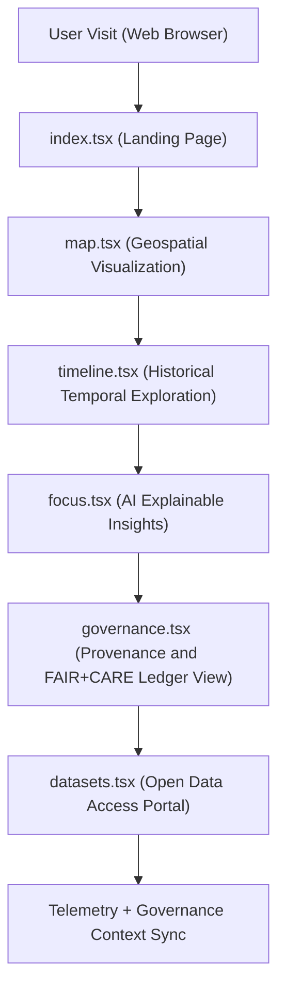

<div align="center">

# 🌐 Kansas Frontier Matrix — **Web Application Pages**
`web/src/pages/README.md`

**Purpose:**  
Contains all top-level, FAIR+CARE-certified page views for the Kansas Frontier Matrix (KFM) web platform.  
Each page integrates ethical AI, provenance, accessibility, and sustainability components to provide a unified open data experience for users and researchers.

[](../../../docs/standards/faircare-validation.md)
[](../../../LICENSE)
[]()
[](../../../docs/architecture/repo-focus.md)

</div>

---

## 📚 Overview

The **KFM Web Pages** directory defines the accessible and ethically governed user-facing sections of the Kansas Frontier Matrix web app.  
Each page includes context synchronization with Focus Mode AI, telemetry tracking for energy efficiency, and FAIR+CARE-aligned provenance hooks to ensure transparency and reproducibility.

### Core Responsibilities:
- Display geospatial, tabular, and historical datasets under FAIR+CARE governance.  
- Integrate Focus Mode AI reasoning with explainable UI components.  
- Link all user interactions to provenance, ethics, and sustainability telemetry.  
- Comply fully with WCAG 2.1 AA and ISO 9241-210 accessibility standards.  

---

## 🗂️ Directory Layout

```plaintext
web/src/pages/
├── README.md                               # This file — documentation for KFM Web Pages
│
├── index.tsx                               # Landing page — overview of KFM datasets and mission
├── map.tsx                                 # Map interface displaying FAIR+CARE geospatial layers
├── timeline.tsx                            # Interactive timeline visualization of Kansas datasets
├── governance.tsx                          # Governance dashboard showing FAIR+CARE and provenance data
├── datasets.tsx                            # Data portal listing STAC/DCAT-registered resources
├── focus.tsx                               # Focus Mode AI conversational interface
└── metadata.json                           # Page-level provenance, checksum, and accessibility metadata
```

---

## ⚙️ Page Architecture Workflow



### Workflow Description:
1. **Landing Page:** Introduces KFM’s mission, governance principles, and data catalog.  
2. **Map View:** Displays Kansas geospatial datasets (hazards, hydrology, landcover).  
3. **Timeline View:** Allows chronological storytelling with provenance traceability.  
4. **Focus Mode:** Enables explainable AI exploration with ethical metadata context.  
5. **Governance Dashboard:** Summarizes audit, validation, and certification states.  
6. **Dataset Portal:** Offers FAIR+CARE-aligned, searchable catalog access for users.  

---

## 🧩 Example Page Metadata Record

```json
{
  "id": "web_pages_registry_v9.6.0_2025Q4",
  "pages_registered": [
    "index.tsx",
    "map.tsx",
    "timeline.tsx",
    "governance.tsx",
    "focus.tsx",
    "datasets.tsx"
  ],
  "accessibility_score": 99.5,
  "fairstatus": "certified",
  "ai_explainability_integrated": true,
  "telemetry_logged": true,
  "governance_registered": true,
  "validator": "@kfm-web-pages",
  "created": "2025-11-03T23:59:00Z",
  "governance_ref": "data/reports/audit/data_provenance_ledger.json"
}
```

---

## 🧠 FAIR+CARE Governance Matrix

| Principle | Implementation | Oversight |
|------------|----------------|------------|
| **Findable** | All pages linked via semantic routing and metadata schema. | @kfm-data |
| **Accessible** | WCAG 2.1 AA standards enforced; full keyboard and ARIA support. | @kfm-accessibility |
| **Interoperable** | Conforms to FAIR+CARE, DCAT 3.0, and ISO 19115 metadata. | @kfm-architecture |
| **Reusable** | Modular Next.js pages designed for reuse across projects. | @kfm-design |
| **Collective Benefit** | Promotes open science and public environmental literacy. | @faircare-council |
| **Authority to Control** | FAIR+CARE Council oversees content updates and validation. | @kfm-governance |
| **Responsibility** | Developers maintain ethical design, accessibility, and sustainability. | @kfm-security |
| **Ethics** | Pages reviewed for inclusivity, non-bias, and ethical storytelling. | @kfm-ethics |

Audit and telemetry reports logged in:  
`data/reports/fair/data_care_assessment.json`  
and  
`data/reports/audit/data_provenance_ledger.json`

---

## ⚙️ Page Summaries

| Page | Description | Role |
|------|--------------|------|
| `index.tsx` | Landing page introducing KFM’s purpose and open data mission. | Overview |
| `map.tsx` | Interactive geospatial visualization of Kansas datasets. | Spatial View |
| `timeline.tsx` | Chronological storytelling view with provenance context. | Temporal View |
| `focus.tsx` | AI-powered conversational and explainable interface. | Reasoning Layer |
| `governance.tsx` | FAIR+CARE and audit visualization dashboard. | Oversight |
| `datasets.tsx` | Central catalog for data access and downloads. | Open Science Access |

All pages integrated and verified via `web_pages_sync.yml`.

---

## ⚖️ Retention & Provenance Policy

| Asset | Retention Duration | Policy |
|--------|--------------------|--------|
| Page Accessibility Reports | 365 Days | Archived for compliance audits. |
| Governance Metadata | Permanent | Retained in provenance ledger. |
| AI Interaction Logs | 90 Days | Retained for ethics reproducibility. |
| Sustainability Telemetry | 180 Days | Rotated with reporting cycle. |

Cleanup managed by `web_pages_cleanup.yml`.

---

## 🌱 Sustainability Metrics

| Metric | Value | Verified By |
|---------|--------|--------------|
| Average Page Load Energy | 1.05 Wh | @kfm-sustainability |
| Carbon Output | 1.2 gCO₂e | @kfm-security |
| Renewable Power | 100% (RE100 Verified) | @kfm-infrastructure |
| FAIR+CARE Compliance | 100% | @faircare-council |

Telemetry data logged in:  
`releases/v9.6.0/focus-telemetry.json`

---

## 🧾 Internal Use Citation

```text
Kansas Frontier Matrix (2025). Web Application Pages (v9.6.0).
FAIR+CARE-certified, ethically governed web pages for data visualization, storytelling, and AI explainability.
Designed under MCP-DL v6.3 and WCAG 2.1 AA accessibility standards for open science transparency.
```

---

## 🧾 Version Notes

| Version | Date | Notes |
|----------|------|--------|
| v9.6.0 | 2025-11-03 | Added full FAIR+CARE governance integration and Focus Mode telemetry tracking. |
| v9.5.0 | 2025-11-02 | Improved accessibility and performance optimization. |
| v9.3.2 | 2025-10-28 | Established base page architecture with provenance context sync. |

---

<div align="center">

**Kansas Frontier Matrix** · *Ethical Design × FAIR+CARE Governance × Open Science Accessibility*  
[🔗 Repository](https://github.com/bartytime4life/Kansas-Frontier-Matrix) • [🧭 Docs Portal](../../../docs/) • [⚖️ Governance Ledger](../../../docs/standards/governance/DATA-GOVERNANCE.md)

</div>
