<div align="center">

# 🚀 **Kansas Frontier Matrix — Web Pipelines & Dataflow Orchestration**  
`web/src/pipelines/README.md`

**Purpose:**  
Define the **client-side dataflow architecture** for KFM v10.3.2 — the pipelines orchestrating data retrieval, transformation, enrichment, governance enforcement, and telemetry for the web UI.  
These pipelines unify **Focus Mode v2.5**, **STAC/DCAT**, **Neo4j**, **timeline**, and **layering** into a coherent FAIR+CARE-compliant interface.

[]()
[]()
[]()
[]()

</div>

---

## 📘 Overview

The Web Pipelines Layer sits **between**:

- `services/` (data access)  
- `hooks/` (React state/query layers)  
- `components/` (UI)  

It centralizes logic for:

- REST + GraphQL + STAC + DCAT aggregation  
- JSON-LD provenance enrichment  
- CARE-governed masking and access rules  
- Telemetry emission (WebVitals, ethics, sustainability)  
- Predictive temporal overlays  
- Map/timeline/Focus Mode cross-syncing  

**Pipelines → Hooks → UI → Telemetry → Governance**

---

## 🗂️ Directory Layout (Authoritative v10.3.2)

```text
web/src/pipelines/
├── README.md
│
├── focusPipeline.ts
├── stacPipeline.ts
├── entityPipeline.ts
├── timelinePipeline.ts
├── layerPipeline.ts
└── metadata.json
```

---

## 🧩 High-Level Pipeline Flow

```mermaid
flowchart TD
    SVC[Services Layer<br/>REST · GraphQL · STAC · DCAT] --> PL[Pipeline Layer<br/>focus · stac · entity · timeline · layers]
    PL --> ENR[Enrichment<br/>JSON LD · Provenance · CARE Flags]
    ENR --> VAL[Validation<br/>schemaGuards]
    VAL --> HK[Hooks Layer<br/>useFocus · useStac · useTimeline · useLayers]
    HK --> UI[UI Components<br/>MapView · Timeline · FocusPanel · StoryNode]
    UI --> TEL[Telemetry<br/>WebVitals · Ethics · A11y · Energy]
```



---

# 🧠 Pipeline Specifications (Deep Architecture Mode)

## 1️⃣ `focusPipeline.ts` — Focus Mode v2.5 Assembly

### Goals
Produce the **single, fully enriched FocusPayload** powering Focus Mode’s narrative reasoning UI.

### Pipeline Stages
- GraphQL entity + subgraph retrieval  
- `/api/focus/{id}` narrative & explainability fetch  
- STAC/DCAT dataset linking  
- JSON-LD provenance merging  
- CARE/sovereignty/redaction rules  
- Telemetry attachment (reasoning depth, ethics flags)  
- Strict schema validation (schemaGuards.ts)

### Consumers
- `useFocus`  
- FocusPanel  
- MapView (highlight geometries)  
- TimelineView (temporal extents)

---

## 2️⃣ `stacPipeline.ts` — Unified STAC Layer Pipeline

### Goals
Normalize and prepare geospatial layers across the UI.

### Pipeline Stages
- STAC search (bbox, datetime, keywords)  
- Collection → Item flattening  
- Asset classification (raster, vector, COG, NetCDF)  
- Layer metadata creation (title, legend, attribution, styles)  
- CARE-governed masking for restricted layers  
- Validation via schemaGuards

### Consumers
- `useStac`  
- LayerControls  
- Map legends

---

## 3️⃣ `entityPipeline.ts` — Entity & Lineage Consolidation

### Goals
Produce a **canonical entity representation** with lineage, datasets, documents, and CARE labels.

### Pipeline Stages
- GraphQL entity fetch  
- Related events, places, datasets, documents  
- Provenance + STAC/DCAT lineage mapping  
- CARE/ethics flag propagation  
- Validation (schemaGuards)

### Consumers
- DetailDrawer  
- StoryNode  
- Focus Mode

---

## 4️⃣ `timelinePipeline.ts` — Temporal Aggregation + Forecast Bands

### Goals
Generate timeline-friendly temporal structures.

### Pipeline Stages
- Gather events + dataset temporal extents  
- Temporal bucketization (year, decade, scenario ranges)  
- Integration of **future scenario bands (2030–2100)**  
- CARE temporal redaction for sensitive histories  
- Validation

### Consumers
- TimelineView  
- Predictive overlays  
- Focus temporal logic

---

## 5️⃣ `layerPipeline.ts` — Layer Stack + Governance Masking

### Goals
Construct an **ethics-compliant**, **pre-styled** layer stack.

### Pipeline Stages
- Load category groups (hydrology, climate, hazards, treaties, ecology, archaeology)  
- Apply CARE + sovereignty rules  
- H3 r7 generalization, jittering, or blocking  
- Compute visual styles from Tailwind tokens  
- Validate layer stack (schemaGuards)

### Consumers
- MapView  
- LayerControls

---

# 🔐 FAIR+CARE Governance Integration

All pipelines must:

- Propagate `care_label`  
- Determine `is_masked`, `requires_consent`, `is_restricted`  
- Enforce sovereignty constraints  
- Ensure **no UI element bypasses governance**  
- Include provenance fields:
  - `lineage`  
  - `source_ids`  
  - `ledger_refs`

Governance reference:

```text
../../../docs/reports/audit/web-governance-ledger.json
```

---

# 📡 Telemetry & Sustainability Integration

All pipelines call `telemetryService.ts` to log:

- Pipeline latencies  
- CARE/ethics gating events  
- Layer usage & Focus Mode interactions  
- WebVitals  
- Modeled energy & CO₂e impacts  

Global telemetry target:

```text
../../../releases/v10.3.2/focus-telemetry.json
```

---

# ⚙️ Validation & MCP-DL Compliance

| Area | Enforcement |
|------|-------------|
| DTO correctness | `schemaGuards.ts` |
| Provenance injection | `provenance.ts` |
| Governance | CARE masking rules |
| Types | TypeScript strict |
| Telemetry | `telemetryService.ts` |
| CI | docs-lint · build-and-deploy · telemetry-export |

**Rule:** No pipeline output may reach the UI without passing schemaGuards.

---

# 🚀 Local Development

```bash
npm --prefix web install
npm --prefix web run dev
npm --prefix web run typecheck
npm --prefix web run lint
npm --prefix web run build
```

---

# 🕰️ Version History

| Version | Date | Summary |
|---------|--------|---------|
| v10.3.2 | 2025-11-14 | Fully rebuilt under Deep Architecture Mode; added DAG diagrams; upgraded Focus Mode wiring; upgraded governance & telemetry; aligned paths to v10.3.2. |
| v10.3.1 | 2025-11-13 | Initial pipeline specification. |
| v10.2.2 | 2025-11-12 | Early sketches for pipeline flows. |

---

<div align="center">

**Kansas Frontier Matrix — Web Pipelines Layer**  
🚀 Reactive Dataflow · 🧠 Explainable AI · 🌐 FAIR+CARE · 🔗 Provenance by Design  
© 2025 Kansas Frontier Matrix — MIT License  

[Back to Web Source Index](../README.md) · [Web Source Architecture](../ARCHITECTURE.md)

</div>
