<div align="center">

# 🚀 **Kansas Frontier Matrix — Web Pipelines & Dataflow Orchestration**  
`web/src/pipelines/README.md`

**Purpose:**  
Define the **client-side dataflow architecture** for KFM v10.3.2 — the pipelines that orchestrate data retrieval, transformation, enrichment, governance enforcement, and telemetry for the web UI.  
These pipelines unify **Focus Mode v2.5**, **STAC/DCAT**, **Neo4j**, **timeline**, and **layer** data into a coherent, reactive, FAIR+CARE-certified interface.

[]()
[]()
[]()
[]()

</div>

---

## 📘 Overview

The **Web Pipelines Layer** lives between the **services** and **hooks/components** layers and centralizes all **multi-step, cross-source logic**:

- Aggregating data from **REST**, **GraphQL**, **STAC**, **DCAT**, and **Focus** APIs  
- Enriching results with **JSON-LD provenance**, **lineage**, and **CARE flags**  
- Enforcing **governance and redaction** rules before data hits the UI  
- Attaching **telemetry** (WebVitals, ethics, sustainability, usage) to pipeline outcomes  
- Providing **stable, typed outputs** for hooks (`useFocus`, `useStac`, `useTimeline`, `useLayers`)  
- Ensuring everything respects **MCP-DL v6.3** and **FAIR+CARE** standards  

Conceptually:

> **Services → Pipelines → Hooks → UI → Telemetry & Governance**

---

## 🗂️ Directory Layout (Authoritative v10.3.2)

```text
web/src/pipelines/
├── README.md                     # This file
│
├── focusPipeline.ts              # Multi-stage Focus Mode v2.5 assembly
├── stacPipeline.ts               # Dataset/layer pipeline from STAC
├── entityPipeline.ts             # Graph entity + lineage consolidation
├── timelinePipeline.ts           # Temporal aggregation + predictive bands
├── layerPipeline.ts              # Layer activation, presets, governance masking
└── metadata.json                 # Pipeline-level governance + telemetry metadata
````

All pipelines:

* Consume DTOs from `services/`
* Pass results through `utils/schemaGuards.ts`
* Are consumed only via hooks in `hooks/`

---

## 🧩 High-Level Pipeline Flow

```mermaid
flowchart TD
    SVC[Services Layer<br/>REST · GraphQL · STAC · DCAT] --> PL[Pipeline Layer<br/>focus · stac · entity · timeline · layers]
    PL --> ENR[Enrichment Layer<br/>JSON LD · Provenance · CARE flags]
    ENR --> VAL[Validation Layer<br/>schemaGuards]
    VAL --> HK[Hooks Layer<br/>useFocus · useStac · useTimeline · useLayers]
    HK --> UI[UI Components<br/>MapView · Timeline · FocusPanel · StoryNode]
    UI --> TEL[Telemetry Emission<br/>WebVitals · Ethics · A11y · Energy]
```



---

## 🧠 Pipeline Definitions (Deep Specification)

### 1️⃣ `focusPipeline.ts` — Focus Mode Orchestration

**Goal:** Provide a **single, enriched FocusPayload** for `useFocus` and the `FocusPanel`, `MapView`, and `TimelineView`.

**Stages**

1. **Entity & subgraph fetch**

   * Uses `graphService.ts` (GraphQL) to retrieve:

     * Entity details
     * Related events, places, datasets

2. **Focus API narrative fetch**

   * Calls `/api/focus/{id}` via `apiClient.ts`
   * Receives narrative, explainability, ethics flags, provenance

3. **STAC/DCAT linkage**

   * Invokes `stacService.ts` / `dcatService.ts` to fetch datasets and layers tied to the entity
   * Builds a normalized list of candidate layers

4. **JSON-LD & provenance enrichment**

   * Uses `utils/provenance.ts` to:

     * Merge dataset and document provenance
     * Add ledger references

5. **CARE label & redaction application**

   * Applies governance rules to:

     * Mark sensitive or restricted content
     * Decide mask vs block behavior

6. **Telemetry enrichment**

   * Attaches pipeline-level telemetry info:

     * focus_type (entity, event, place, dataset)
     * reasoning_depth
     * ethics_flags

7. **Validation**

   * Passes through `schemaGuards.ts` to validate the shape of the final FocusPipelineOutput.

**Consumers:**

* `useFocus` hook
* `FocusPanel`
* `MapView` (for highlight geometries)
* `TimelineView` (for temporal markers)

---

### 2️⃣ `stacPipeline.ts` — Dataset & Layer Preparation

**Goal:** Provide UI with a **clean, uniform view of STAC datasets and layers**.

**Stages**

1. **STAC search**

   * `stacService.ts` used to run searches (by bbox, time, keywords)

2. **Collection → Item flattening**

   * Flattens nested Collections into a dense list of Items

3. **Asset inspection**

   * Recognizes asset types: raster, vector, COG, NetCDF, etc.

4. **Layer metadata building**

   * Constructs:

     * title
     * description
     * attribution
     * visual defaults (colormap, opacity, min/max)

5. **Governance and CARE**

   * Applies:

     * `care_label` logic
     * heritage/tribal masking rules
     * layer availability gating

6. **Validation**

   * Applies `schemaGuards.ts` to ensure a safe `LayerConfig[]` output.

**Consumers:**

* `useStac`
* `LayerControls`
* Legends in `MapView`

---

### 3️⃣ `entityPipeline.ts` — Entity & Lineage Fusion

**Goal:** Build a **canonical entity view** with lineage + CARE flags, used across drawers and Story Nodes.

**Stages**

1. **Graph entity fetch** (GraphQL)

2. **Contextual aggregation**:

   * events
   * places
   * datasets
   * documents

3. **Lineage merge**

   * Uses `provenance.ts` to attach:

     * lineage tree
     * ledger references
     * STAC/DCAT dataset IDs

4. **CARE annotations**

   * Tag the entity as sensitive or restricted, if needed

5. **Validation** via `schemaGuards.ts`.

**Consumers:**

* `DetailDrawer`
* `StoryNode` components
* Focus Mode

---

### 4️⃣ `timelinePipeline.ts` — Temporal Aggregation & Forecast Bands

**Goal:** Produce **temporal aggregates** for timeline visualizations, including **future bands**.

**Stages**

1. **Event & time-extent gather**

   * Fetches events, datasets, and Story Nodes with start/end times

2. **Bucketization**

   * Aggregates into:

     * yearly
     * decadal
     * scenario band intervals

3. **Predictive integration**

   * Integrates future scenario metadata (2030–2100) where available

4. **CARE-temporal handling**

   * Optionally redacts or aggregates sensitive events without exposing raw temporal detail

5. **Validation**

   * Applies `schemaGuards.ts` to ensure structured timeline data.

**Consumers:**

* `TimelineView`
* Predictive overlays in map & Focus

---

### 5️⃣ `layerPipeline.ts` — Layer Stack & Governance Masking

**Goal:** Manage **map layer activation and governance masking**.

**Stages**

1. **Load layer groups**

   * hydrology, climate, hazards, treaties, ecology, archaeology

2. **Apply governance constraints**

   * For each layer:

     * check `care_label`
     * apply H3 generalization / coordinate obfuscation
     * decide hide vs fuzz vs full show

3. **Style resolution**

   * Uses `styles/tokens.css` for:

     * color scales
     * border styles
     * icon sets

4. **Layout mapping**

   * Prepares user-facing legends and categories

5. **Validation**

   * Guarantees LayerStack output structure via `schemaGuards.ts`.

**Consumers:**

* `MapView`
* `LayerControls`

---

## 🔐 Governance & FAIR+CARE Integration

All pipelines must:

* Read and propagate `care_label` from upstream services
* Make **no UI-breaking assumptions** when governance denies access
* Output explicit flags like:

  * `is_masked`
  * `is_restricted`
  * `requires_consent`
* Guarantee provenance via `provenance.ts`:

  * `lineage`
  * `source_ids`
  * `ledger_refs`

Governance artifacts for pipeline operations are referenced from:

```text
../../../docs/reports/audit/web-governance-ledger.json
```

---

## 📡 Telemetry & Sustainability

Pipelines collaborate with `telemetryService.ts` and `useTelemetry.ts` to:

* Log pipeline latencies
* Capture AI reasoning depth in Focus Mode
* Record CARE masking vs blocking events
* Track layer usage, timeline navigation, and dataset exploration
* Attach approximate energy & CO₂e info by route/session type

All pipeline telemetry contributes to:

```text
../../../releases/v10.3.2/focus-telemetry.json
```

---

## ⚙️ Validation & MCP-DL Compliance

| Area              | Mechanism                                                       |
| ----------------- | --------------------------------------------------------------- |
| Shape correctness | `schemaGuards.ts` runtime checks                                |
| Provenance        | `provenance.ts` lineage builder                                 |
| Governance        | CARE-flag enforcement in pipelines                              |
| Telemetry         | `telemetryService.ts`                                           |
| Types             | TypeScript strict mode                                          |
| CI                | `docs-lint.yml`, `build-and-deploy.yml`, `telemetry-export.yml` |

**Rule:** No pipeline output may be consumed by the UI unless it has passed `schemaGuards.ts`.

---

## 🚀 Local Development

```bash
npm --prefix web install
npm --prefix web run dev
npm --prefix web run typecheck
npm --prefix web run lint
npm --prefix web run build
```

---

## 🕰️ Version History

| Version | Date       | Summary                                                                                                                                                          |
| ------- | ---------- | ---------------------------------------------------------------------------------------------------------------------------------------------------------------- |
| v10.3.2 | 2025-11-14 | Deep architecture rewrite; added full pipeline DAG and governance flows; aligned telemetry & schema paths with v10.3.2; upgraded Focus Mode integration to v2.5. |
| v10.3.1 | 2025-11-13 | Initial specification of Web Pipelines Layer for v10.3.                                                                                                          |
| v10.2.2 | 2025-11-12 | Early internal sketches for Focus/STAC/timeline pipelines.                                                                                                       |

---

<div align="center">

**Kansas Frontier Matrix — Web Pipelines Layer**
🚀 Reactive Dataflow · 🧠 Explainable AI · 🌐 FAIR+CARE · 🔗 Provenance by Design
© 2025 Kansas Frontier Matrix — MIT License

[Back to Web Source Index](../README.md) · [Web Source Architecture](../ARCHITECTURE.md)

</div>
```
