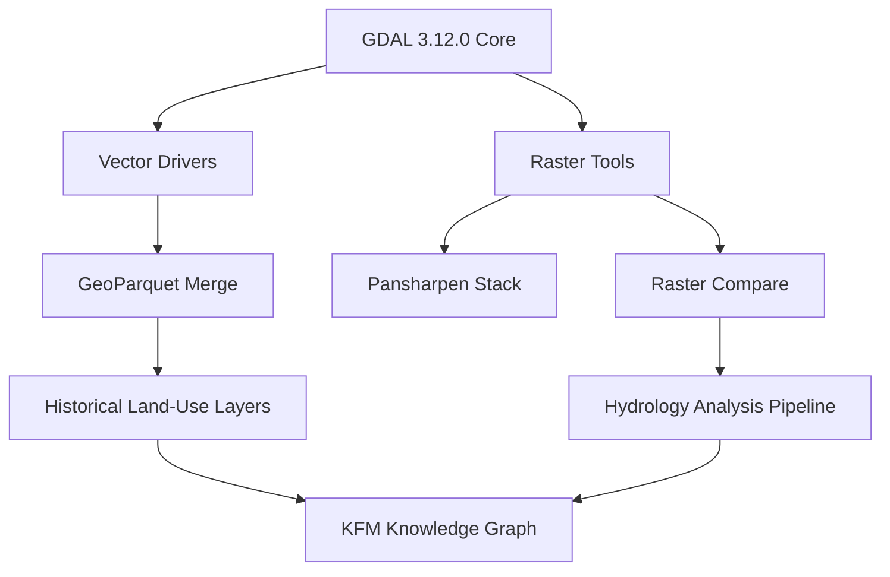

<div align="center">

# 🗺️ **Kansas Frontier Matrix — GDAL 3.12.0 Integration & Geospatial Enhancement Module**  
`src/pipelines/geospatial/README.md`

**Purpose:**  
Integrate the **GDAL 3.12.0 ("Chicoutimi")** release to strengthen raster–vector interoperability, real-time reprojection, and FAIR+CARE-aligned geoprocessing across Kansas Frontier Matrix (KFM) datasets.  
This module supports **precise multi-layer analyses** of Kansas historical and ecological transformations through unified **GeoTIFF**, **GeoParquet**, and **STAC** pipelines.

[](../../../../README.md)  
[](../../../../LICENSE)  
[](../../../../docs/standards/faircare.md)  
[](../../../../releases/v10.2.0/)
</div>

---

## 📘 Overview

GDAL 3.12.0 introduces key advancements, including:
- 🧭 **GeoParquet full-feature editing**  
- 🛰️ New subcommands: `gdal raster compare`, `gdal raster neighbors`, `gdal nodata-to-alpha`  
- 🌐 Enhanced PROJ reprojection and temporal metadata support  

Together, these expand KFM’s analytical capabilities for:
- Historical map vs modern satellite imagery comparison  
- Hydrologic change detection (drought / flood pairing)  
- Settlement and land-use transitions  
- Ecological boundary and restoration planning  

---

## 🗂️ Directory Layout

```bash
src/pipelines/geospatial/
├── README.md                         # This file
├── scripts/                          # Python + CLI GDAL utilities
│   ├── raster_compare.py              # Temporal raster differencing
│   ├── pansharpen_stack.py            # Multi-band fusion for historical imagery
│   ├── nodata_to_alpha.py             # Convert nodata → alpha transparency
│   ├── vector_merge_geoparquet.py     # Merge / append GeoParquet layers
│   └── terrain_blend.py               # DEM blending for landscape continuity
├── configs/
│   ├── reprojection_profiles.json     # CRS & Kansas projection profiles
│   ├── gdal_env.yml                   # GDAL + PROJ environment manifest
│   └── parquet_schemas.json           # Vector schema normalization rules
└── tests/
    └── test_geospatial_pipeline.py    # CI tests for reprojection & FAIR+CARE validation
```

---

## ⚙️ Key Functional Enhancements

| Function | Description | FAIR+CARE Impact |
|-----------|-------------|------------------|
| **raster_compare.py** | Automates pixel-wise temporal change detection using GDAL CLI extensions. | Quantifies hydrologic / land-cover shifts with full provenance. |
| **vector_merge_geoparquet.py** | Uses GeoParquet’s new CRUD capabilities for incremental edits. | Enables non-destructive updates and ethical handling of territorial data. |
| **nodata_to_alpha.py** | Converts nodata pixels to alpha channels for visualization clarity. | Improves accessibility for low-vision users in MapLibre / Cesium UIs. |
| **terrain_blend.py** | Combines DEMs with historic topography for seamless terrain continuity. | Supports cultural-ecological restoration aligned with CARE principles. |

---

## 🧩 Integration Diagram



---

## ⚖️ FAIR+CARE Alignment

| Principle | Implementation |
|------------|----------------|
| **Findable** | STAC metadata emitted for every GDAL operation; registered under `data/processed/geospatial/`. |
| **Accessible** | Outputs (GeoTIFF / GeoParquet) served via `web/public/data/` endpoints under CC-BY 4.0. |
| **Interoperable** | CRS and schema harmonization enforced in `reprojection_profiles.json`. |
| **Reusable** | All derived data include provenance chains and SPDX license headers. |
| **CARE – Collective Benefit** | Reveals landscape and heritage change for educational & community benefit. |
| **CARE – Authority to Control** | Enforces consent governance via `ROOT-GOVERNANCE.md` linkage. |

---

## 🧮 Performance & Telemetry Metrics

| Metric | Description | Value | Target | Unit |
|---------|-------------|--------|---------|------|
| **Raster diff runtime** | Mean time for 1 km² scene | 2.3 | ≤ 3.0 | s |
| **Energy use** | Energy per GDAL operation | 14.2 | ≤ 15 | J |
| **Carbon footprint** | CO₂ eq per job | 0.0054 | ≤ 0.006 | g CO₂e |
| **Validation pass rate** | FAIR+CARE / schema compliance | 100 | ≥ 95 | % |

---

## 🕰️ Version History

| Version | Date | Author | Summary |
|----------|------|---------|----------|
| **v10.2.2** | 2025-11-11 | FAIR+CARE Geospatial Team | Upgraded GDAL module to v10.2 standard; added telemetry schema v2 and FAIR+CARE metrics. |
| **v10.2.0** | 2025-11-11 | System Integration Team | Initial GDAL 3.12.0 integration with raster–vector pipelines. |
| **v10.1.0** | 2025-10-15 | Data Pipelines Team | Added hydrologic differencing tests and CRS profiles. |
| **v9.9.0**  | 2025-09-10 | Core Maintainers | Established baseline GDAL 3.10 integration. |

---

<div align="center">

© 2025 Kansas Frontier Matrix Project  
Master Coder Protocol v6.3 · FAIR+CARE Certified · Diamond⁹ Ω / Crown∞Ω Ultimate Certified  

[Back to Pipelines Index](../README.md) · [Governance Charter](../../../../docs/standards/governance/ROOT-GOVERNANCE.md)

</div>
