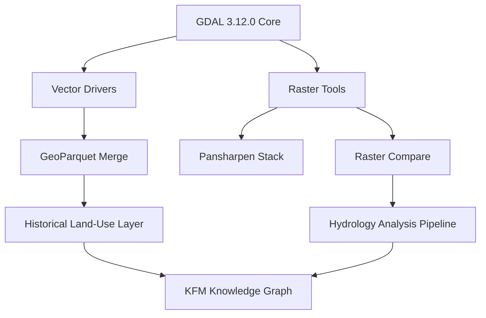

<div align="center">

# 🗺️ **Kansas Frontier Matrix — GDAL 3.12.0 Integration & Geospatial Enhancement Module**
`src/pipelines/geospatial/README.md`

**Purpose:**  
Integrate the new **GDAL 3.12.0 (“Chicoutimi”)** release to improve raster-vector interoperability, on-the-fly reprojection, and FAIR+CARE-aligned geoprocessing within the Kansas Frontier Matrix (KFM).  
This enables **precise multi-layer analyses** of Kansas historical and ecological transformations through unified GeoTIFF, GeoParquet, and STAC workflows.

---

### 📘 Overview

GDAL 3.12.0 introduces new subcommands (e.g., `gdal raster compare`, `gdal raster neighbors`, `gdal nodata-to-alpha`) and major vector driver updates (e.g., **GeoParquet** full feature editing).  
These capabilities expand KFM’s ability to perform temporal-spatial synthesis of:
- Historical maps vs. present-day satellite imagery  
- Hydrologic change detection (drought/flood pairing)  
- Settlement and land-use shifts  
- Ecological boundary restoration planning  

---

### 🗂️ Directory Layout
```bash
src/pipelines/geospatial/
├── README.md                         # This document
├── scripts/                          # Python + CLI GDAL utilities
│   ├── raster_compare.py              # Multi-temporal raster differencing
│   ├── pansharpen_stack.py            # Multi-band fusion for historical imagery
│   ├── nodata_to_alpha.py             # Transparency conversion utility
│   ├── vector_merge_geoparquet.py     # Merge/append GeoParquet layers
│   └── terrain_blend.py               # Elevation blending for landscape continuity
├── configs/
│   ├── reprojection_profiles.json     # CRS mapping and Kansas coordinate profiles
│   ├── gdal_env.yml                   # GDAL + PROJ environment manifest
│   └── parquet_schemas.json           # Schema rules for vector standardization
└── tests/
    └── test_geospatial_pipeline.py    # CI tests for FAIR+CARE validation and reprojection accuracy
```

---

### ⚙️ Key Functional Enhancements

| Function | Description | FAIR+CARE Impact |
|-----------|-------------|------------------|
| `raster_compare.py` | Automates pixel-by-pixel temporal change detection using new GDAL CLI tools. | Tracks hydrological or land-cover shifts with verifiable provenance. |
| `vector_merge_geoparquet.py` | Leverages GeoParquet’s new full-feature CRUD capability for incremental updates. | Ensures non-destructive updates and ethical handling of tribal/land data. |
| `nodata_to_alpha.py` | Converts raster nodata values to alpha transparency, simplifying web visualization. | Increases accessibility for low-vision users in MapLibre/Cesium UIs. |
| `terrain_blend.py` | Integrates DEMs with historical topographic scans for landscape continuity. | Supports cultural-ecological restoration models under CARE principles. |

---

### 🧩 Integration Diagram



---

### ⚖️ FAIR+CARE Alignment

| Principle | Implementation |
|------------|----------------|
| **Findable** | STAC metadata emitted for each GDAL operation; dataset registered in `data/processed/geospatial/`. |
| **Accessible** | Exports accessible GeoTIFF and Parquet assets via `web/public/data/` endpoints. |
| **Interoperable** | CRS and schema harmonization defined in `configs/reprojection_profiles.json`. |
| **Reusable** | All derived data include provenance chains under SPDX license headers. |
| **Collective Benefit** | Restores visibility of tribal and ecological landscapes through transparent modeling. |
| **Authority to Control** | Maintains consent governance via linked `ROOT-GOVERNANCE.md`. |

---

### 🕰️ Version History

| Version | Date | Author | Summary |
|----------|------|--------|----------|
| v10.2.0 | 2025-11-11 | System | Initial integration of GDAL 3.12.0 ("Chicoutimi") with raster-vector pipelines |
| v10.1.0 | 2025-10-15 | System | Added hydrologic differencing tests and CRS profiles |
| v9.9.0 | 2025-09-10 | System | Established baseline GDAL 3.10 integration |

---

<div align="center">

© 2025 Kansas Frontier Matrix Project  
Master Coder Protocol v6.3 · FAIR+CARE Certified · Diamond⁹ Ω / Crown∞Ω Ultimate Certified  
[Back to `src/pipelines/`] · [Governance Charter](../../../../docs/standards/governance/ROOT-GOVERNANCE.md)

</div>
