<div align="center">

# 🗺️ **Kansas Frontier Matrix — GDAL 3.12.0 Integration & Geospatial Enhancement Module**  
`src/pipelines/geospatial/README.md`

**Purpose:**  
Define the **complete deep-architecture specification** for geospatial processing pipelines in KFM v10.3.2 using **GDAL 3.12.0 “Chicoutimi”**, GeoParquet, PROJ, and FAIR+CARE-governed geospatial workflows.  
This module powers hydrologic differencing, ecological modeling, historic map restoration, DEM fusion, CRS lineage enforcement, and Story Node spatial intelligence.

[]()
[]()
[]()
[]()

</div>

---

# 📘 Overview

The Geospatial Enhancement Module provides:

- **Raster compute pipelines** (GDAL Compute Engine v3)  
- **Vector & GeoParquet pipelines**  
- **CRS lineage + projection safety**  
- **STAC/DCAT metadata emitters for all outputs**  
- **Temporal differencing** for hydrology, climate, land cover  
- **DEM blending & restoration** (historic → modern)  
- **Historic map harmonization** (plats, surveys, early sheets)  
- **CARE-governed sensitive-site masking**  
- **Predictive raster synthesis** (2030–2100 SSP projections)  
- **Spatial lineage + provenance injection** (PROV-O, GeoSPARQL)  

This subsystem is responsible for turning raw spatial data into **FAIR+CARE-certified geospatial assets** powering:

- Focus Mode v2.5  
- Story Nodes  
- Timeline overlays  
- MapView (2D/3D)  
- Predictive scenario layers  

---

# 🗂️ Directory Layout (v10.3.2)

```text
src/pipelines/geospatial/
├── README.md
│
├── scripts/
│   ├── raster_compare.py
│   ├── pansharpen_stack.py
│   ├── nodata_to_alpha.py
│   ├── vector_merge_geoparquet.py
│   └── terrain_blend.py
│
├── configs/
│   ├── reprojection_profiles.json
│   ├── gdal_env.yml
│   └── parquet_schemas.json
│
└── tests/
    └── test_geospatial_pipeline.py
```

---

# 🧬 Deep Raster Compute Pipeline (GDAL 3.12.0)

```mermaid
flowchart TD
    R1[Input Raster<br/>GeoTIFF · COG · NetCDF] --> R2[GDAL Open]
    R2 --> R3[Virtual Raster Layers]
    R3 --> R4[Compute Engine<br/>Sliding Window Eval]
    R4 --> R5[Raster Ops<br/>Diff · Slope · Hillshade · Neighbors]
    R5 --> R6[Mask Engine<br/>NoData · Alpha · CARE Generalization]
    R6 --> R7[Reproject<br/>EPSG + Kansas Custom Grids]
    R7 --> R8[COG Writer<br/>Overviews · Tiling · Compression]
    R8 --> R9[STAC Item Builder<br/>Checksum · Lineage · Metadata]
```



### Included Operations
- **Differencing:** pixel-wise change analysis  
- **Gradient operations:** slope, aspect, DEM surface derivatives  
- **Window ops:** neighbors, smoothing, contextual classification  
- **Historic map blending:** pansharpen + nodata-to-alpha  
- **Predictive overlays:** raster algebra + bias-corrected SSP scenarios  

---

# 🧱 Vector / GeoParquet Processing Pipeline

```mermaid
flowchart LR
    V1[GeoParquet Input] --> V2[Schema Harmonizer]
    V2 --> V3[PROJ Reprojector]
    V3 --> V4[Topology Normalizer]
    V4 --> V5[Governance Engine<br/>H3 Generalization · Fuzzing]
    V5 --> V6[Parquet Writer + Index]
    V6 --> V7[STAC Collection Export]
```



### Features
- Schema normalization rules in `parquet_schemas.json`  
- CRSes controlled by `reprojection_profiles.json`  
- Automatic lineage stamping (PROV-O)  
- CARE + sovereignty redaction applied before write  

---

# 🧭 CRS Lineage & Projection Safety

Each reprojection must:

- Record input & output CRS  
- Embed `projjson` in STAC metadata  
- Update lineage chain with:
  - source CRS  
  - derived CRS  
  - transformation parameters  
- Validate against Kansas-specific custom grids  

Stored in:

```
configs/reprojection_profiles.json
```

---

# 📊 Temporal Differencing & Future Scenario Engine

```mermaid
flowchart TB
    T1[Multi-epoch Rasters] --> T2[Temporal Sort]
    T2 --> T3[Pixel Differencer]
    T3 --> T4[Anomaly Detector<br/>Climate · Hydrology · Landcover]
    T4 --> T5[Scenario Bands<br/>2030 2050 2100]
    T5 --> T6[Timeline Overlay Builder]
```



This subsystem powers:

- Drought/flood mapping  
- Vegetation regrowth modeling  
- Land-use change detection  
- Predictive climate hydrology overlays  

---

# 🧩 Integration with Story Nodes & Focus Mode v2.5

### Spatial AI / Story Node Binding
Outputs from this module feed:

- **Story Node spatial extents**  
- **Temporal coverage**  
- **Raster-based explainability overlays**  
- **Contextual layers for Focus Mode**  

### Provenance Surfacing
Each asset includes:

- DOIs  
- lineage chain (PROV-O)  
- checksum (SHA-256)  
- method specification  
- CARE flags  

---

# 🛡️ FAIR+CARE Geospatial Governance

| Standard | Implementation |
|---------|----------------|
| **CARE – Collective Benefit** | Hydrology/ecology transitions designed for community benefit. |
| **CARE – Authority to Control** | Tribal/heritage coordinates masked (H3 r7). |
| **CARE – Responsibility** | GeoParquet CRUD operations maintain non-destructive updates. |
| **CARE – Ethics** | Heritage-sensitive outputs require reviewers in FAIR+CARE Council. |
| **Findable** | Every output is indexed via STAC & DCAT. |
| **Interoperable** | Harmonized CRS + GeoParquet schemas guarantee interoperability. |

Governance ledger:

```
../../../../docs/reports/audit/geospatial-governance-ledger.json
```

---

# 📡 Telemetry & Sustainability

Collected metrics:

| Metric | Meaning |
|--------|---------|
| `gdal_runtime_s` | Runtime per GDAL operation |
| `co2e_g` | Carbon grams emitted per job |
| `energy_wh` | Watt-hours per raster op |
| `masking_events` | Number of CARE masking operations |
| `crs_transforms` | Projection conversions performed |

Telemetry export:

```
../../../../releases/v10.3.2/focus-telemetry.json
```

---

# 🧪 Validation & CI/CD

Validation suite includes:

- **CRS correctness**  
- **GeoParquet schema checks**  
- **Raster integrity tests**  
- **STAC/DCAT metadata validation**  
- **Lineage chain continuity**  
- **CARE compliance review**  

CI workflows:

- `geospatial-tests.yml`  
- `stac-validate.yml`  
- `faircare-validate.yml`  
- `telemetry-export.yml`

---

# 🕰️ Version History

| Version | Date | Summary |
|--------|--------|---------|
| v10.3.2 | 2025-11-14 | Full deep-architecture rebuild; added CRS lineage model, predictive scenario engine, vector pipeline; updated governance & telemetry. |
| v10.3.1 | 2025-11-13 | Previous version. |
| v10.2.2 | 2025-11-11 | Added new hydrology models + GeoParquet upgrades. |
| v10.2.0 | 2025-11-11 | Initial GDAL 3.12 integration. |

---

<div align="center">

**Kansas Frontier Matrix — Geospatial Pipelines**  
Geospatial Integrity × Predictive Insight × FAIR+CARE × Temporal Truth  
© 2025 Kansas Frontier Matrix — CC-BY 4.0  

[Back to Pipelines Index](../README.md) · [Governance Charter](../../../../docs/standards/governance/ROOT-GOVERNANCE.md)

</div>
