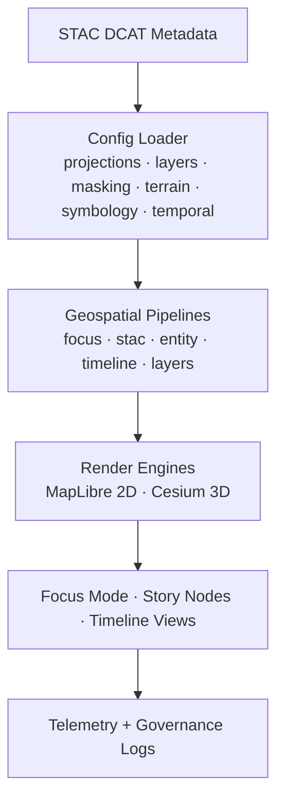
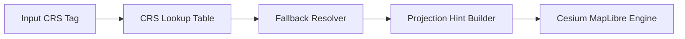
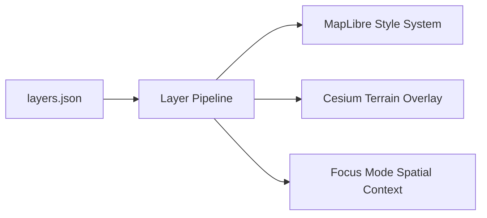
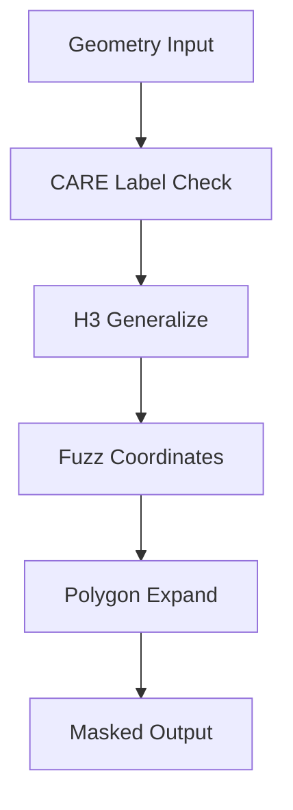
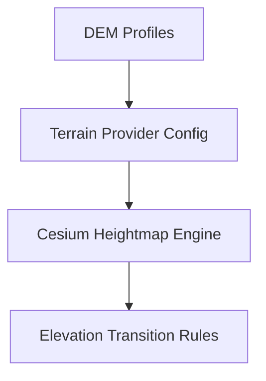
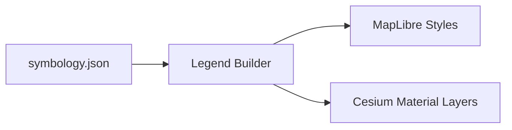
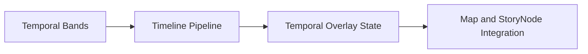

<div align="center">

# 🗺️ **Kansas Frontier Matrix — Geospatial Pipeline Configuration Architecture**  
`web/src/pipelines/geospatial/configs/README.md`

**Purpose:**  
Provide the **full deep-architecture specification** for the geospatial configuration subsystem of the Kansas Frontier Matrix (KFM) web platform.  
These configurations govern *how the browser interprets, styles, masks, projects, filters, and time-aligns* geospatial layers sourced from STAC/DCAT, Neo4j, and predictive scenario engines.  
All configs comply with **FAIR+CARE**, **WCAG 2.1 AA**, **MCP-DL v6.3**, **GeoJSON/COG/TopoJSON standards**, and the **Diamond⁹ Ω ethical governance framework**.

[]()
[]()
[]()
[]()

</div>

---

# 📘 Overview

The **Geospatial Configuration Subsystem** defines:

- CRS profiles + projection fallbacks  
- Layer metadata + ingestion rules  
- CARE-governed masking templates (H3 r7–r9, buffers, fuzzing)  
- DEM & terrain rendering profiles for Cesium  
- Symbology tokens for WCAG-compliant map legends  
- Temporal predictive bands (2030–2100 SSP)  
- Metadata schema for governance + lineage  

These configs serve as the **source of truth** for all map, timeline, Focus Mode, and Story Node geospatial display in the web UI.

---

# 🗂️ Directory Layout (Authoritative v10.3.2)

```text
web/src/pipelines/geospatial/configs/
├── README.md
│
├── projections.json                # CRS mappings + preferred Kansas CRSes
├── layers.json                     # Layer registry (hydro, climate, hazards, ecology, treaties)
├── masking.json                    # CARE masking definitions (H3, buffers, fuzzing)
├── terrain.json                    # Cesium DEM profiles + elevation rules
├── symbology.json                  # Color/legend/style tokens for MapLibre/Cesium
├── temporal_bands.json             # Predictive time windows (2030–2100 SSPs)
└── metadata.json                   # Config lineage, governance, telemetry info
```

All JSON files must pass **schema validation**, **governance checks**, and **lineage stamping**.

---

# 🧩 Configuration Architecture (Deep Specification)



---

# 🔷 1. projections.json — CRS & Projection Lineage

This file controls **all CRS logic** for the web.

### Contents
- EPSG 4326, 3857, 26914 (Kansas UTM Zone 14N)  
- Custom Kansas grids (historic cartography)  
- Cesium terrain projection hints  
- Deprecated CRS warning table  
- PROJ-derived accuracy metadata  

### CRS Lineage Architecture



### Rules
- If CRS unsupported → return **fallback CRS**  
- If CRS deprecated → UI displays warning  
- All reprojected assets inherit:
  - `projjson`
  - `transform_chain`
  - `accuracy_notes`

---

# 🔷 2. layers.json — Layer Registry & Metadata Model

Defines **all map layers**, grouped by domain:

- hydrology  
- climate  
- hazards  
- ecology  
- archaeology  
- treaties  
- historic1 (plats)  
- historic2 (surveys)  

### Layer Metadata Fields
- `id`  
- `title`  
- `description`  
- `source_stac`  
- `asset_type` (raster, vector, COG, tilejson)  
- `default_opacity`  
- `legend_style_key`  
- `care_label`  
- `projection_profile`  

### Architecture



---

# 🔷 3. masking.json — CARE Masking Profiles

Defines **all sovereignty + cultural protection rules** for browser rendering.

### Features
- H3 r7/r8/r9 generalization levels  
- Fuzzing (0–500m secure noise)  
- Buffer expansion for sovereignty territories  
- Mask replacement geometries  
- Block-list for extreme sensitivity  

### Masking Architecture



### Governance Rules
- All **restricted** geometries → **block or envelope**  
- All **sensitive** geometries → **generalize + fuzz**  
- All **public** geometries → full resolution  

---

# 🔷 4. terrain.json — DEM Profiles & Elevation Rules

Defines 3D elevation/rendering parameters used by Cesium:

- DEM blending  
- historic DEM → modern DEM fusion  
- height exaggeration  
- slope shading  
- motion-safe terrain transitions  

### Terrain Engine Architecture



---

# 🔷 5. symbology.json — WCAG-Compliant Legend & Style Tokens

Includes:

- Colorblind-safe palettes  
- Symbology for hydrology, hazards, biomes, treaties, archaeological sites  
- Responsive legend templates  
- Pattern fills for predictive bands  
- CARE warning icons  

### Symbology Architecture



---

# 🔷 6. temporal_bands.json — Predictive Time Windows (2030–2100)

Defines future environmental scenario windows for the timeline & Focus Mode.

Examples:
- Hydrology shift: 2030–2050  
- Drought risk: 2040–2080  
- Vegetation succession: 2060–2100  
- Multi-band uncertainty windows  

### Temporal Architecture



---

# 🔷 7. metadata.json — Config Lineage & Governance

Tracks:

- `version`  
- `checksum`  
- `schema_version`  
- `changed_fields`  
- `care_label_distribution`  
- `governance_events`  
- `telemetry_fields`  
- `lineage_refs`  

Lineage is PROV-O aligned.

---

# 🔐 FAIR+CARE Governance

| Principle | Implementation |
|----------|----------------|
| **Authority to Control** | masking.json enforces sovereignty-aligned masking. |
| **Ethics** | Restricted coordinates never rendered. |
| **Findable** | All configs indexed in metadata.json + telemetry. |
| **Interoperable** | CRS + Stylistic HPC tokens match STAC/DCAT standards. |
| **Reusable** | Stable JSON schemas + versioning patterns. |

Governance ledger:

```
../../../../../docs/reports/audit/web-geospatial-config-ledger.json
```

---

# 📡 Telemetry & Sustainability

Scripts and pipelines using these configs emit:

- `config_load_ms`  
- `masking_profile_applied`  
- `projection_profile_used`  
- `terrain_profile_loaded`  
- `symbology_legend_hits`  

Stored in:

```
../../../../../releases/v10.3.2/focus-telemetry.json
```

---

# ⚙️ CI / Validation Requirements

CI ensures:
- JSON Schema validity  
- CRS alignment  
- CARE masking enforcement  
- WCAG-checked color contrast  
- Predictive band correctness  
- Zero breaking changes to config lineage  

Tools involved:
- schemaGuards  
- CARE governance tests  
- STAC/DCAT schema validators  
- A11y color contrast verifiers  

---

# 🕰️ Version History

| Version | Date | Summary |
|--------|--------|---------|
| v10.3.2 | 2025-11-14 | Complete deep-architecture rebuild; CRS lineage, masking engine, terrain profiles, symbology tokens, predictive temporal bands added. |
| v10.3.1 | 2025-11-13 | Previous version. |

---

<div align="center">

**Kansas Frontier Matrix — Geospatial Config Architecture**  
🗺️ Spatial Integrity · 🔐 Sovereignty-Aligned Governance · 📡 Telemetry by Design  
© 2025 Kansas Frontier Matrix — MIT  

[Back to Geospatial Pipelines](../README.md) · [Web Source Index](../../README.md)

</div>
