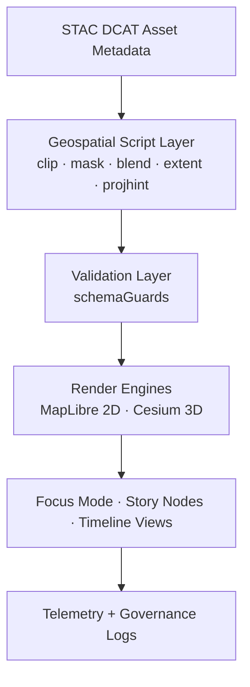
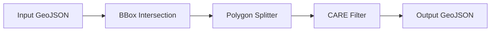
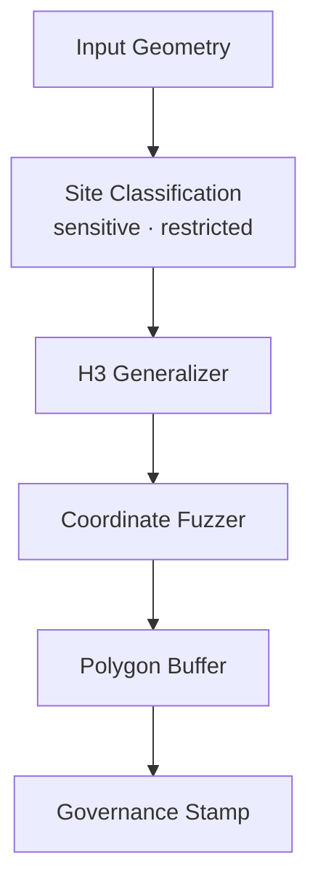
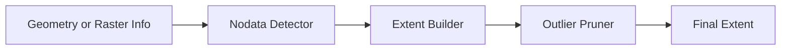
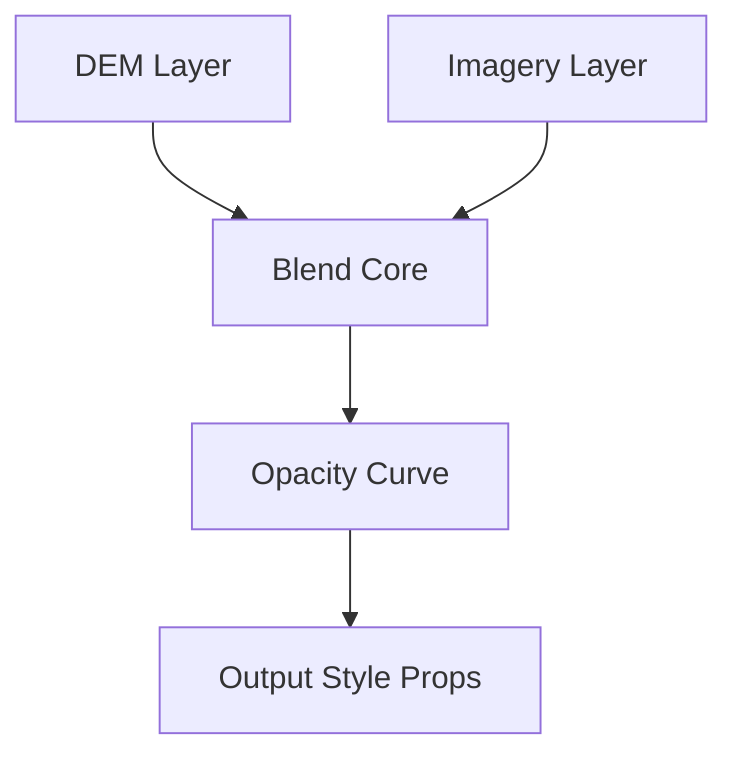
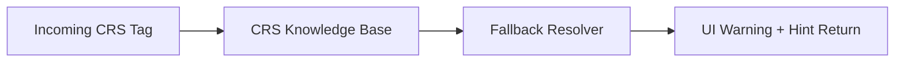
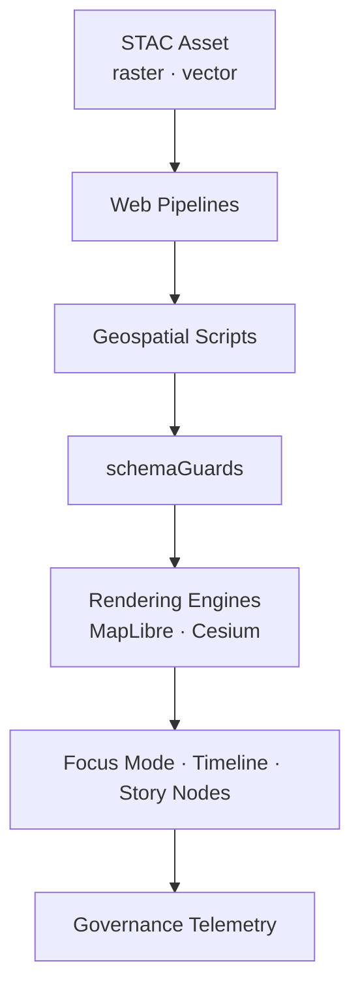

<div align="center">

# 🛰️ **Kansas Frontier Matrix — Web Geospatial Scripts Architecture**  
`web/src/pipelines/geospatial/scripts/README.md`

**Purpose:**  
Define the **deep technical architecture** for all client-side geospatial scripts powering the KFM v10.3.2 web platform.  
These scripts form the **lightweight in-browser geospatial engine**, enabling safe, performant, FAIR+CARE-certified spatial transformations directly in the user’s environment.

[]()
[]()
[]()
[]()

</div>

---

# 📘 Executive Summary

The **Web Geospatial Script Layer** provides:

- **Client-side GeoJSON/TopoJSON processing**  
- **Realtime masking and redaction** (H3 r7, fuzzing, sovereignty buffers)  
- **Projection fallback & CRS hinting**  
- **Raster/imagery blending rules** for MapLibre & Cesium  
- **Nodata-aware extent detection**  
- **Provenance & JSON-LD enrichment**  
- **FAIR+CARE-driven spatial governance**  
- **Telemetry emission** (ethics, masking, render cost, projection fixes)  

This layer acts **between** pipelines and rendering engines:

```text
services → pipelines → geospatial scripts → UI → telemetry/governance
```

It is intentionally **lightweight**, **sandboxed**, **deterministic**, and **fully auditable**.

---

# 🗂️ Directory Layout (Authoritative v10.3.2)

```text
web/src/pipelines/geospatial/scripts/
├── README.md
│
├── clipGeoJSON.ts                 # Extent-clipped GeoJSON with CARE masking
├── maskCoordinates.ts             # H3 generalization + fuzzing engine
├── extentCalculator.ts            # Nodata-aware bounds extraction
├── blendRules.ts                  # DEM/imagery blending rules for UI
├── projectionHints.ts             # CRS fallback + projection warning system
└── metadata.json                  # Script-level lineage + governance metadata
```

---

# 🧩 Deep Architecture Overview



Each script must satisfy:

- deterministic output  
- pure function semantics  
- zero side-effects  
- full CARE compliance  
- reproducible transformations  

---

# 🧠 Script-Level Deep Specifications

## 1️⃣ `clipGeoJSON.ts` — Deterministic, CARE-Aware Clipping Engine

### Purpose  
Perform **in-browser bounding-box clipping** for vector layers while maintaining:

- no coordinate exposure for sensitive sites  
- H3-governed generalizations  
- performance budget for 60 FPS rendering  

### Architecture



### Governance Constraints
- If clipping reveals sensitive geometry → **mask** instead  
- If layer is restricted → return only generalized envelope  
- Full provenance injection via JSON-LD after final stage  

---

## 2️⃣ `maskCoordinates.ts` — CARE Masking + Territorial Sovereignty Engine

### Purpose  
Protect culturally sensitive or sovereign areas.

### Masking Stack
- **H3 r7 generalization**  
- **Coordinate fuzzing** (secure RNG noise)  
- **Polygon dilation** (sovereignty buffers)  
- **Site obfuscation** using convex hull bounding  

### Masking Architecture



---

## 3️⃣ `extentCalculator.ts` — Nodata-Aware Extent Engine

### Purpose  
Determine robust spatial bounds for:

- GeoJSON / TopoJSON  
- Raster footprints  
- Imagery masks  

### Architecture



This powers:

- “Zoom to entity”  
- “Zoom to dataset”  
- Story Node context previews  

---

## 4️⃣ `blendRules.ts` — UI-Safe DEM + Imagery Blending

### Purpose  
Provide blending logic for terrain, hillshade, historical imagery, and DEM composites.

### Features
- Non-destructive visual masks  
- DEM-first elevation precedence  
- Dynamic opacity curve based on camera height  
- Time-sensitive blends (historic vs modern)  

### Architecture



---

## 5️⃣ `projectionHints.ts` — Projection Resolver & Fallback System

### Purpose  
Enable the browser to handle unknown or exotic CRS definitions gracefully.

### Capabilities
- Detect deprecated CRS  
- Suggest best-fit CRS for Kansas datasets  
- Provide MapLibre/Cesium with numeric projection hints  
- Warn user about projection misalignment  

### Architecture



---

# 🧭 End-to-End Client-Side Geospatial Flow



---

# 🔐 FAIR+CARE Governance Rules (Required)

| Requirement | Implementation |
|------------|----------------|
| No sensitive location exposure | H3 masking + fuzzing + polygon dilation |
| Geometries always redacted before render | `maskCoordinates.ts` mandatory |
| CARE labels stored in metadata.json | Script-level governance metadata |
| User cannot disable CARE masking | Hard-coded in scripts, not toggleable |
| Provenance attached to all outputs | JSON-LD stamping in each script |

Governance ledger:

```
../../../../../docs/reports/audit/web-geospatial-script-ledger.json
```

---

# 📡 Telemetry & Sustainability

Scripts emit:

- `clip_runtime_ms`  
- `masking_events`  
- `projection_hint_used`  
- `blend_compute_ms`  
- Estimated energy & CO₂e (UI event model)  

Telemetry target:

```
../../../../../releases/v10.3.2/focus-telemetry.json
```

---

# ⚙️ CI/CD & MCP-DL Compliance

| Area | Enforcement |
|------|-------------|
| Shape validation | schemaGuards.ts |
| Governance | CARE filters + sovereignty rules |
| Security | CodeQL + Trivy |
| A11y | Accessible spatial interactions verified |
| Telemetry | telemetry-export.yml |
| Docs | docs-lint.yml |
| Behavior determinism | deterministic tests in Jest |

Scripts may **not** be merged if any governance or schema guard fails.

---

# 🧾 Example Script Metadata Entry

```json
{
  "id": "web_geospatial_scripts_v10.3.2",
  "scripts": [
    "clipGeoJSON.ts",
    "maskCoordinates.ts",
    "extentCalculator.ts",
    "blendRules.ts",
    "projectionHints.ts"
  ],
  "masking_enforced": true,
  "a11y_compliant": true,
  "telemetry_linked": true,
  "checksum_verified": true,
  "timestamp": "2025-11-14T16:32:00Z",
  "governance_ref": "docs/reports/audit/web-geospatial-script-ledger.json"
}
```

---

# 🕰️ Version History

| Version | Date | Summary |
|---------|--------|---------|
| v10.3.2 | 2025-11-14 | Full deep-architecture rebuild; added masking engine, projection hint system, telemetry path upgrades, predictive blending logic. |
| v10.3.1 | 2025-11-13 | Previous version. |

---

<div align="center">

**Kansas Frontier Matrix — Web Geospatial Scripts Layer**  
🛰️ Client-Side Spatial Intelligence · 🌐 FAIR+CARE · 🔐 Ethical Masking · 🔗 Provenance by Design  
© 2025 Kansas Frontier Matrix — MIT License  

[Back to Geospatial Pipelines](../README.md)

</div>
