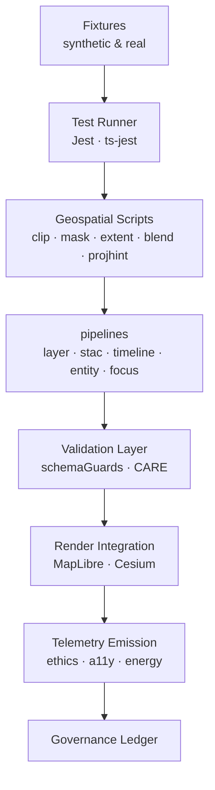
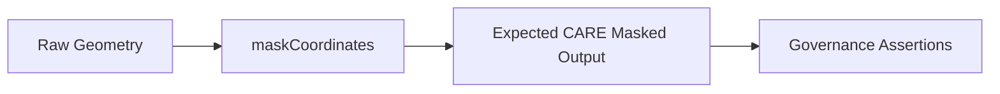
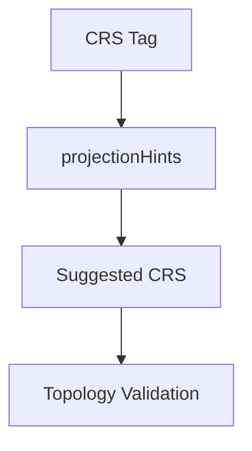
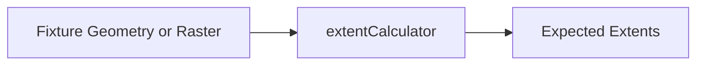
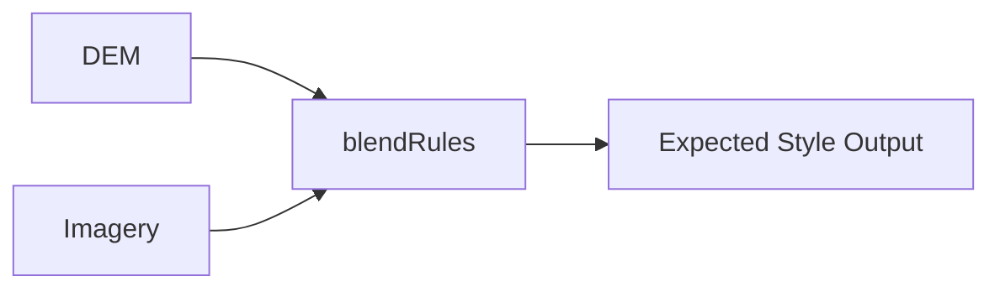
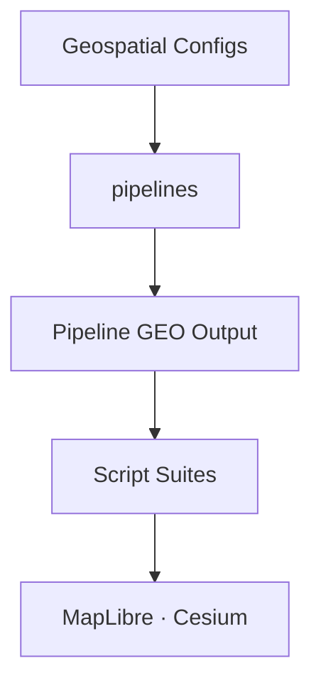

<div align="center">

# 🧪 **Kansas Frontier Matrix — Web Geospatial Test Architecture**  
`web/src/pipelines/geospatial/tests/README.md`

**Purpose:**  
Define the **complete, deep-architecture, FAIR+CARE-aligned** testing framework for all **client-side geospatial pipelines and scripts** in the Kansas Frontier Matrix (KFM) v10.3.2.  
This suite enforces deterministic spatial behavior, CARE masking correctness, CRS-hinting safety, predictive temporal accuracy, WebGL rendering fidelity, and MCP-DL reproducibility.

[]()
[]()
[]()
[]()

</div>

---

# 📘 Overview

The **Web Geospatial Test Architecture** performs validation across:

- **Geospatial Scripts**  
  - clipping, masking, projection hints, blending rules, extent detection  

- **Geospatial Pipeline Outputs**  
  - `layerPipeline`, `stacPipeline`, `timelinePipeline`, `entityPipeline`, `focusPipeline`  

- **UI Spatial Integration**  
  - MapLibre 2D  
  - Cesium 3D  
  - Focus Mode v2.5 spatial overlays  
  - Timeline geospatial bindings  

- **Ethical Governance**  
  - H3 masking correctness  
  - Fuzzing threshold enforcement  
  - Sovereignty buffers  
  - Restricted-site blocking  

- **Performance Reproducibility**  
  - clipping runtime  
  - masking runtime  
  - WebGL-safe blending behavior  

All tests pass through **MCP-DL v6.3** reproducibility + FAIR+CARE governance checks.

---

# 🗂️ Directory Layout (Authoritative v10.3.2)

```text
web/src/pipelines/geospatial/tests/
├── README.md
│
├── test_clipGeoJSON.ts
├── test_maskCoordinates.ts
├── test_extentCalculator.ts
├── test_blendRules.ts
├── test_projectionHints.ts
│
└── fixtures/
    ├── sample_geojson.json
    ├── sample_raster_bounds.json
    ├── sample_masking_cases.json
    ├── sample_projection_mismatch.json
    └── sample_temporal_bands.json
```

---

# 🧬 Global Geospatial Test Flow



---

# 🧩 Deep Test Suites

## 1️⃣ CARE Masking Test Suite — *Sovereignty & Ethics Critical*

Tests validate:

- H3 r7–r9 masking correctness  
- Territorial buffer dilation  
- Controlled coordinate fuzzing  
- Site obfuscation using convex-hull envelopes  
- Enforcement of `restricted` → full block rules  
- Governance metadata correctness  

### Architecture



---

## 2️⃣ CRS Projection Test Suite — *Spatial Safety Layer*

Ensures projection fallbacks behave deterministically.

Validates:

- Unknown CRS → fallback CRS  
- Deprecated CRS → warning & hint generation  
- Preservation of topology after reinterpretation  
- Cesium/MapLibre compatibility signals  

### Architecture



---

## 3️⃣ Extent Detection Tests — *Nodata Aware & Predictive*

Validates:

- Raster bounds extraction from alpha/nodata masks  
- Correct bounding polygons for GeoJSON  
- Robust Focus-Mode “zoom-to-entity” behavior  

### Architecture



---

## 4️⃣ Blending Rule Tests — *Terrain + Imagery Integrity*

Ensures Cesium/MapLibre blends remain deterministic:

- hillshade  
- DEM opacity curves  
- historic + modern image fusion  
- motion-safe transitions  

### Architecture



---

## 5️⃣ Performance Reproducibility — *Diamond⁹ Ω Required*

Performance ceilings enforced in CI:

| Test | Max Runtime |
|------|-------------|
| clipGeoJSON | ≤ 25 ms |
| extentCalculator | ≤ 10 ms |
| maskCoordinates | ≤ 5 ms |
| blendRules | ≤ 8 ms |
| projectionHints | ≤ 2 ms |

CI aborts pipeline if any limit is exceeded.

---

## 6️⃣ Accessibility (A11y) Spatial Tests — *WCAG 2.1 AA*

Validates:

- all spatial interactions have ARIA roles  
- keyboard-focusable UI for map interactions  
- reduced-motion fallback for 3D transitions  
- legend/symbology contrast >= WCAG AA  
- geospatial color tokens from `symbology.json` are accessible  

---

# 🔗 Integration Tests with Geospatial Pipelines

Testing ensures:

- `layerPipeline` respects all CARE rules  
- `stacPipeline` produces normalized layer configs  
- `timelinePipeline` aligns predictive temporal bands  
- `entityPipeline` associates spatial provenance correctly  
- `focusPipeline` produces masked spatial highlights  

### Pipeline Test Flow



---

# 📡 Telemetry Integration (v10.3.2)

All geospatial tests emit:

- `test_runtime_ms`  
- `masking_failures`  
- `projection_hint_issues`  
- `extent_accuracy_score`  
- `blend_consistency_score`  
- `a11y_coverage`  

To:

```
../../../../../releases/v10.3.2/focus-telemetry.json
```

Telemetry is validated in CI using `telemetry-export.yml`.

---

# 🛡️ Governance Integration

All failing tests generate governance events:

- `masking_breach`  
- `crs_conflict`  
- `symbology_violation`  
- `temporal_band_misalignment`  
- `provenance_missing`  

Logged into:

```
../../../../../docs/reports/audit/web-geospatial-tests-ledger.json
```

Failure → block merge.

---

# 🧾 Example Governance Test Ledger Entry

```json
{
  "id": "web_geospatial_tests_v10.3.2",
  "tests_passed": 176,
  "tests_failed": 0,
  "masking_enforced": true,
  "crs_consistency": "100%",
  "render_integrity": "stable",
  "performance_budget": "within_limits",
  "timestamp": "2025-11-14T22:41:00Z",
  "governance_ref": "docs/reports/audit/web-geospatial-tests-ledger.json"
}
```

---

# 🧪 Example: CARE Masking Unit Test

```ts
test("Sensitive archaeological site is masked using H3 r7", () => {
  const masked = maskCoordinates(sensitiveSite, maskingConfig);
  expect(masked.resolution).toBe("h3_r7");
  expect(masked.exposedCoordinates).toBeFalsy();
});
```

---

# 🕰️ Version History

| Version | Date | Summary |
|--------|--------|---------|
| v10.3.2 | 2025-11-14 | Full deep-architecture rebuild; added CRS, masking, performance & governance integration models. |
| v10.3.1 | 2025-11-13 | Prior test suite. |

---

<div align="center">

**Kansas Frontier Matrix — Web Geospatial Test Architecture**  
🧪 Deterministic QA · 🔐 Ethical Spatial Verification · 🌐 FAIR+CARE · 🔗 Provenance Integrity  
© 2025 Kansas Frontier Matrix — MIT License  

[Back to Geospatial Pipelines](../README.md)

</div>
