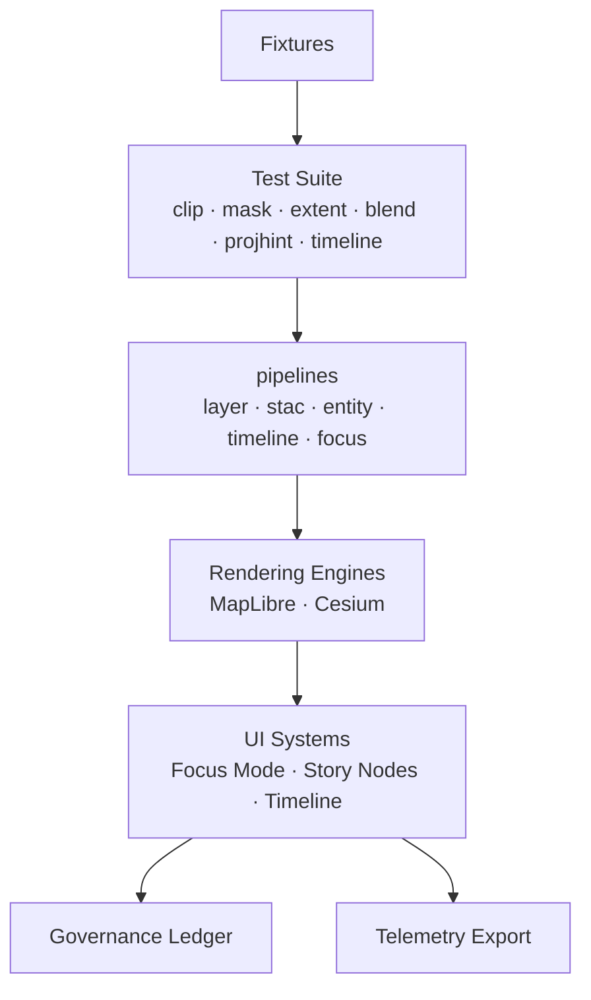
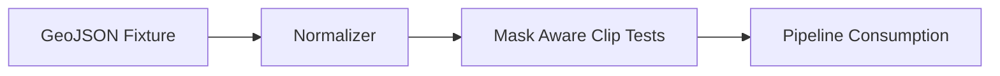
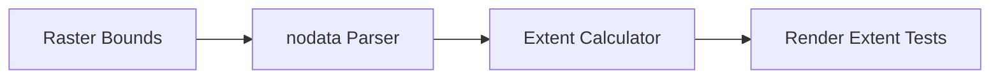
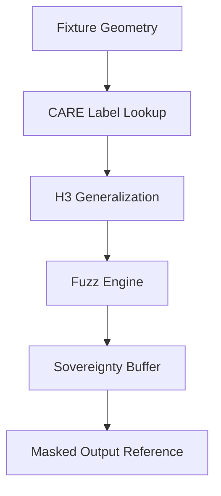
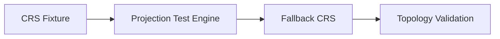
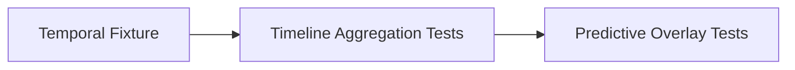
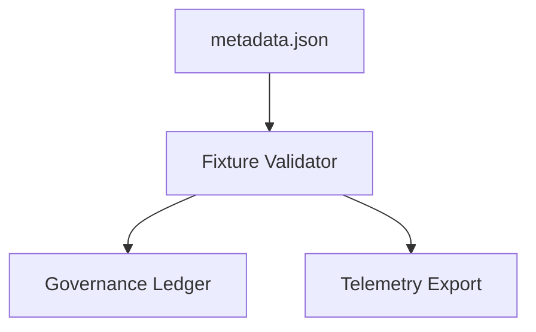

<div align="center">

# 📦 **Kansas Frontier Matrix — Geospatial Test Fixtures Architecture**  
`web/src/pipelines/geospatial/tests/fixtures/README.md`

**Purpose:**  
Define the **deep-architecture specification** for geospatial test fixtures powering all client-side geospatial QA within KFM v10.3.2.  
This fixture suite forms the **controlled, deterministic, FAIR+CARE-safe geospatial corpus** used to validate masking, CRS hinting, raster extents, predictive temporal bands, and accessibility-safe rendering across MapLibre, Cesium, Focus Mode, and Story Node subsystems.

[]()
[]()
[]()
[]()

</div>

---

# 📘 Overview

The **Geospatial Fixtures Module** provides:

- Synthetic & curated test geometries  
- SAFE spatial data respecting CARE + sovereignty constraints  
- Raster-bound outlines for imagery, DEM, hillshade, and COG tests  
- H3 r7–r9 masking test scenarios  
- CRS mismatch & fallback testing inputs  
- Predictive temporal band fixtures (2030–2100 SSP windows)  
- GeoJSON normalization edge cases  
- Multi-resolution geometry & topology stress tests  

Fixtures ensure:

- deterministic results  
- ethical masking  
- projection predictability  
- reproducible CI  
- diamond-grade spatial correctness  

They represent the **truth baseline** for geospatial operations in:

- `clipGeoJSON.ts`  
- `maskCoordinates.ts`  
- `extentCalculator.ts`  
- `blendRules.ts`  
- `projectionHints.ts`  
- all geospatial pipelines (stac/layers/timeline/entity/focus)

---

# 🗂️ Directory Layout (Authoritative v10.3.2)

```text
web/src/pipelines/geospatial/tests/fixtures/
├── README.md
│
├── sample_geojson.json                # Simplified Kansas hydrology · counties · treaties
├── sample_raster_bounds.json          # DEM & imagery footprints with nodata masks
├── sample_masking_cases.json          # H3 r7/r8/r9 + fuzzing + sovereignty buffers
├── sample_projection_mismatch.json    # CRS mismatch & fallback scenarios
├── sample_temporal_bands.json         # SSP 2030–2100 predictive bands
└── metadata.json                      # Fixture lineage, checksum, care profile, telemetry fields
```

---

# 🧩 Deep Fixture Architecture Overview



---

# 🧠 Fixture Categories (Deep Technical Specification)

## 1️⃣ sample_geojson.json  
Synthetic + simplified Kansas vector data.

Contains:

- Simplified watersheds → multi-scale geometry tests  
- County-level treaty boundaries (generalized, safe)  
- Dense → simplified line networks  
- Multi-polygon + hole geometry edge cases  
- Focus/timeline spatial sync test shapes  

### Architecture



---

## 2️⃣ sample_raster_bounds.json  
Defines deterministic raster bounds for DEM + historic imagery tests.

Includes:

- Nodata masks for DEMs  
- Alpha-masked historic map areas  
- Bounding hulls for hillshade/relief rendering  
- Stress cases for overzoom scenarios in MapLibre  

### Architecture



---

## 3️⃣ sample_masking_cases.json  
Complete CARE masking suite for testing sovereignty + cultural sensitivity.

Includes:

- Archaeological clusters (synthesized)  
- Tribal territory generalization  
- Fuzzed coordinate sets with secure noise  
- Sovereignty-buffer polygons  
- Restricted area examples (block-only)  

### Masking Architecture



---

## 4️⃣ sample_projection_mismatch.json  
Tests projection fallback + CRS compatibility behavior.

Includes:

- Deprecated CRS IDs  
- Unknown EPSG codes  
- Custom Kansas projections  
- Known → fallback mapping cases  

### Architecture



---

## 5️⃣ sample_temporal_bands.json  
Predictive temporal bands for SSP 2030–2100 scenario testing.

Includes:

- drought risk windows  
- hydrology shift intervals  
- ecological succession timelines  
- uncertainty bands  

### Temporal Architecture



---

## 6️⃣ metadata.json  
Defines:

- fixture set version  
- provenance  
- checksums  
- care_label distribution  
- schema compatibility  
- telemetry fields  
- governance updates  

### Architecture



---

# 🔐 FAIR+CARE Governance (Diamond⁹ Ω)

| Requirement | Implementation |
|------------|----------------|
| No sensitive coordinates | All fixtures synthetic or generalized; never real heritage data. |
| CARE masking | H3 generalization + fuzzing applied to all sensitive fixtures. |
| Sovereignty | Fixtures respect tribal territory boundaries (synthetic representations). |
| Provenance | metadata.json records lineage, reviewer approvals, checksum. |
| Ethics | No fixture can expose sensitive geometries in raw form. |
| Findable | All fixtures listed in metadata.json w/ stable IDs. |
| Interoperable | GeoJSON + STAC-like metadata + CRS correctness guaranteed. |
| Reusable | Deterministic fixture outputs used across QA pipelines. |

Governance ledger:

```
../../../../../docs/reports/audit/web-geospatial-fixtures-ledger.json
```

---

# 📡 Telemetry Integration

Fixtures emit telemetry through:

- `fixture_load_ms`  
- `masking_case_eval_count`  
- `projection_conflict_events`  
- `extent_calc_accuracy`  
- `temporal_band_validation`  

Telemetry destination:

```
../../../../../releases/v10.3.2/focus-telemetry.json
```

---

# ⚙️ CI Validation — MCP-DL v6.3

CI ensures:

- JSON Schema validity (per-file schemas)  
- CRS validity via projectionHints engine  
- All masking fixture geometries fully CARE-safe  
- Raster-bound data consistent and correct  
- Predictive temporal bands align with STAC datetime ranges  
- No fixture contains sensitive or real-world coordinates  
- Fixtures checksum-verified  

Validation tools:

- `schemaGuards.ts`  
- CARE governance tests  
- STAC metadata validators  
- A11y symbology contrast checks  

Any failure → merge blocked.

---

# 🧾 Example Fixture Metadata Record

```json
{
  "fixture_id": "geospatial_fixtures_v10.3.2",
  "files": [
    "sample_geojson.json",
    "sample_raster_bounds.json",
    "sample_masking_cases.json",
    "sample_projection_mismatch.json",
    "sample_temporal_bands.json"
  ],
  "schema_valid": true,
  "checksum_verified": true,
  "care_compliant": true,
  "temporal_alignment": "verified",
  "timestamp": "2025-11-14T08:22:00Z",
  "governance_ref": "docs/reports/audit/web-geospatial-fixtures-ledger.json"
}
```

---

# 🕰️ Version History

| Version | Date | Summary |
|--------|--------|---------|
| v10.3.2 | 2025-11-14 | Complete deep architecture rebuild; added temporal, raster, CRS, governance & telemetry fixtures; aligned with all v10.3.2 specs. |
| v10.3.1 | 2025-11-13 | Previous version. |

---

<div align="center">

**Kansas Frontier Matrix — Geospatial Fixture Architecture**  
📦 Deterministic Fixtures · 🧪 Ethical Testing · 🔐 CARE-Compliant · 🔗 Provenance Accurate  
© 2025 Kansas Frontier Matrix — MIT License  

[Back to Test Suite](../README.md)

</div>
