<!-- 📄 FILE: web/src/routes/datasets/README.md -->

# 🗂️ Datasets Route (`/datasets`) — KFM Data Catalog UI


Welcome to the **Datasets** route for **Kansas Frontier Matrix (KFM)**. This route is the **public-facing catalog + dataset detail experience** where people discover, preview, cite, and download datasets—without ever bypassing KFM’s governance layers.

KFM’s north star is **“the map behind the map”**: every dataset and layer must be traceable back to original sources with metadata + lineage. 🧭

---

## ✨ What this route does

### ✅ Responsibilities
- **Browse** the dataset catalog (cards/list)
- **Search** and **filter** datasets (keyword, bbox, time range, themes)
- **Open dataset detail pages** (metadata + preview + downloads + provenance)
- **Present trust**: license, source, sensitivity, caveats, and lineage (PROV)
- **Stay governed**: all reads go through the **backend API** (never direct DB)

### 🚫 Non-responsibilities
- ❌ Ingesting / transforming datasets (that’s pipelines/ETL)
- ❌ Creating metadata (that’s catalog tooling + CI gates)
- ❌ Direct DB access (PostGIS/Neo4j/etc. are backend-only)

> [!IMPORTANT]
> This UI must **never** become a backdoor around governance. If a dataset can’t be served safely via the API, it should not be “worked around” in the UI—**fail closed** instead. 🧱

---

## 🧱 Route map

Typical structure (exact filenames may differ by framework):

```text
📁 web/
  📁 src/
    📁 routes/
      📁 datasets/
        📄 README.md   👈 you are here
        📄 (index route)           → /datasets
        📄 (detail route)          → /datasets/:id  (or /datasets/[id])
        📁 components/             → DatasetCard, Filters, etc.
        📁 lib/                    → API client, query helpers, types
```

**Expected pages**
- `GET /datasets` → Catalog page (search + filters + results)
- `GET /datasets/:id` → Dataset detail page (metadata + preview + downloads)

---

## 🧬 The “Truth Path” data flow (non-negotiable)

KFM data moves through a strict pipeline to preserve trust:

```mermaid
flowchart LR
  A[🧾 Raw Sources] --> B[🧹 Processed Outputs]
  B --> C[🏷️ Catalog Metadata\nSTAC/DCAT + PROV]
  C --> D[🗄️ Datastores\nPostGIS / Search / Graph]
  D --> E[🛡️ API Layer\nAuth + OPA Policies]
  E --> F[🖥️ Web UI\n/datasets]
```



**UI rule:** the web app “drinks from the same well” as everything else—**the governed API**.

---

## 🔌 API contracts this route depends on

> [!NOTE]
> Names/params below reflect KFM’s documented intent. Always verify exact request/response shapes in the **OpenAPI / Swagger UI** and `src/server/api/README.md` (or equivalent).

### Core endpoints

| Need | Endpoint | Used by |
|---|---|---|
| Dataset details (metadata) | `GET /api/v1/datasets/{id}` | Dataset detail page |
| Search datasets | `GET /api/v1/catalog/search` | Catalog page |
| Stream dataset data | `GET /api/v1/datasets/{id}/data?format=...&bbox=...` | Preview map/table + downloads |
| Tiles (vector/raster) | `GET /tiles/{layer}/{z}/{x}/{y}.pbf` / `.png` | Map preview & layers |

### Example calls (developer sanity checks)

```bash
# 🔎 Search by keyword + bbox + time range (example params)
curl "http://localhost:8000/api/v1/catalog/search?q=hydrology&bbox=-102.05,36.99,-94.59,40.00&datetime=1880-01-01/1900-12-31"

# 📦 Fetch dataset metadata (DCAT summary + links to STAC assets)
curl "http://localhost:8000/api/v1/datasets/ks_hydrology_1880"

# 🗺️ Stream actual data as GeoJSON filtered by bbox
curl "http://localhost:8000/api/v1/datasets/ks_hydrology_1880/data?format=geojson&bbox=-97.5,38.8,-96.9,39.2"
```

---

## 🧾 Data model expectations (front-end types)

The dataset UI should treat the API as the **source of truth**, but you’ll likely want stable typed shapes. The minimal UI contract is:

- **DCAT-ish** dataset summary (title/description/license/publisher/updated/themes)
- **STAC-ish** asset links (items/collections, COGs, tiles, downloads)
- **PROV** lineage link(s) (how it was created, from what sources, by which pipeline run)
- **Governance flags** (sensitivity tier, access restrictions, redaction notes)

Example TypeScript shape (illustrative):

```ts
export type DatasetAccess =
  | "public"
  | "registered"
  | "restricted"
  | "confidential";

export interface DatasetSummary {
  id: string;                  // stable slug, e.g. "ks_hydrology_1880"
  title: string;
  description?: string;

  themes?: string[];           // e.g. ["Environment", "Health"]
  keywords?: string[];

  license: {
    name: string;              // UI MUST show this
    url?: string;
  };

  publisher?: {
    name: string;
    url?: string;
  };

  updated?: string;            // ISO date
  temporal?: { start?: string; end?: string };
  spatial?: { bbox?: [number, number, number, number] };

  access: DatasetAccess;       // governs UI behavior
  sensitivity?: string;        // e.g. "public" | "restricted" | "sacred"

  links: {
    self: string;              // /api/v1/datasets/{id}
    search?: string;           // /api/v1/catalog/search
    data?: string;             // /api/v1/datasets/{id}/data
    prov?: string;             // PROV record location (or API endpoint)
    stac?: string;             // STAC collection/items
    tiles?: string;            // tile template, if applicable
    downloads?: Array<{ href: string; type: string; title?: string }>;
  };
}
```

> [!IMPORTANT]
> If you add a new map overlay / preview layer in this route, it must have an **info popup or legend** that cites its source (from DCAT/STAC), and must honor CARE constraints (e.g., hide precise coords when sensitive). ✅

---

## 🧭 UX: what the dataset pages should include

### `/datasets` catalog page
Minimum UX features:
- 🔎 Search bar (keyword)
- 🧰 Filters:
  - category/theme
  - time range (if applicable)
  - spatial filter (bbox / “current map view”)
  - format (vector/raster/tabular)
  - access tier (if user is authenticated)
- 📚 Result list:
  - title, short description
  - key tags
  - last updated
  - license badge
  - access badge (public/restricted)
- 🧾 “About this catalog” + trust notes (plain language)

### `/datasets/:id` dataset detail page
Recommended layout (tabs or sections):
- 📝 **Overview**
  - summary + purpose
  - publisher/source + update cadence
  - methodology notes / caveats
- 🗺️ **Preview**
  - map preview or sample rows
  - lightweight by default (don’t load the world)
- ⬇️ **Downloads**
  - formats (GeoJSON/CSV/COG/etc.)
  - clear file sizes (if known)
- 🔗 **API**
  - copy/paste endpoints + parameter examples
- ⛓️ **Provenance**
  - link to PROV record
  - “what pipeline produced this?”
  - input sources + transformation notes
- 📌 **Citation**
  - how to cite the dataset (human-readable)
  - persistent identifiers if available

---

## 🛡️ Governance behaviors (UI requirements)

### Fail closed (always)
If the API says:
- **401/403** → show “Access restricted” UI and stop
- **404** → show “Dataset not found” and stop
- **missing license / missing sensitivity** → treat as **non-publishable** (don’t render as if valid)

### Sensitivity-aware UI
When `access != "public"` or dataset flagged sensitive:
- hide precise coordinates / exact point locations when required
- avoid “download everything” buttons if policy prohibits bulk export
- show redaction notes (what is withheld and why)

### Never bypass the API
Even if you “know” PostGIS has what you need:
- no direct DB queries from web
- no “special dev-only” fetch paths in production builds
- no embedding raw data files in the UI without catalog metadata + provenance

---

## ⚡ Performance notes (don’t accidentally DDoS yourself)

- Prefer **search endpoints** that return *summaries* (not full features).
- For previews:
  - request small bounding boxes
  - use tiles (MVT/COG) where available
  - paginate tabular samples
- Cache *metadata* aggressively (ETags / stale-while-revalidate patterns if the stack supports it).
- Lazy-load heavy sections:
  - provenance panel
  - downloads list (if large)
  - preview layer initialization

---

## ♿ Accessibility & plain-language rules

KFM datasets must be usable by non-technical users:
- keyboard navigation for all controls
- screen-reader friendly structure (headings, landmarks, button labels)
- sufficient color contrast
- use **plain language** + provide legends / “About this data” explanations
- tooltips/help icons only as an assist—core meaning must be readable without hover

---

## 🧪 Testing checklist

### Contract + unit tests
- ✅ dataset list renders with empty result set
- ✅ search/filter state produces correct querystring
- ✅ dataset detail handles:
  - 200 OK (public dataset)
  - 401/403 (restricted)
  - 404 (not found)
  - 500 (server error)
- ✅ sensitive dataset flags toggle UI redaction behavior

### E2E smoke tests
- ✅ `/datasets` loads < N seconds on cold start
- ✅ open dataset detail from catalog works
- ✅ preview loads without fetching entire dataset

---

## 🧰 Adding a new dataset so it appears here

> [!TIP]
> If you’re “just adding UI” but the dataset doesn’t exist in the catalog, you’re doing it backwards. Start upstream. 🧱➡️🖥️

### 1) Add / update data upstream
- Add raw data to the correct domain folder under `data/<domain>/...`
- Run/extend pipeline to produce processed outputs

### 2) Produce metadata + lineage
- Create/validate:
  - STAC records (assets/items)
  - DCAT dataset summary
  - PROV lineage (inputs → processes → outputs)

### 3) Ensure API exposure
- Confirm:
  - `/api/v1/datasets/{id}` returns expected metadata
  - `/api/v1/catalog/search` can discover it
  - any redaction/access policies are implemented

### 4) Update UI
- If the catalog page is purely API-driven, no code change may be needed.
- If you maintain curated categories/featured sections:
  - add the dataset ID to the curated list
  - ensure the card still renders license/access badges
  - add a provenance/citation link in the detail UI

### 5) Verify governance gates
- CI should fail if license/sensitivity/provenance are missing—fix upstream, don’t patch around it.

---

## 🧠 Glossary (quick)

- **DCAT** 🏷️: dataset-level metadata (title, publisher, license, etc.)
- **STAC** 🛰️: spatiotemporal asset catalog (items/assets like imagery, tiles, COGs)
- **W3C PROV** ⛓️: lineage model (“how this was made”)
- **FAIR** ✅: Findable, Accessible, Interoperable, Reusable
- **CARE** 🤝: Collective Benefit, Authority to Control, Responsibility, Ethics
- **OPA** 🛡️: policy engine used to enforce access/governance rules

---

## 🔗 Recommended internal docs (repo-relative)

> [!NOTE]
> Paths assume the standard monorepo layout. If they move, update links here.

- `../../../../docs/architecture/system_overview.md` 🏗️
- `../../../../src/server/api/README.md` 🔌
- `../../../../docs/standards/` 🧾
- `../../../../docs/data/` 📚

---

## ✅ “Definition of Done” for changes in this folder

- [ ] Catalog & detail pages still work with **public** datasets
- [ ] Restricted datasets fail closed (clear UX for 401/403)
- [ ] Every new layer/preview has **source + license + provenance link**
- [ ] No direct DB calls or “temporary bypasses”
- [ ] A11y check: keyboard + screen reader basics pass
- [ ] Performance sanity: preview doesn’t fetch entire dataset

---

<details>
  <summary>🧷 Optional: UI copy snippets (plain-language defaults)</summary>

- **About this data:** “This dataset is provided by {publisher}. It includes {what}. It was last updated {date}.”
- **License:** “You may reuse this dataset under {license}.”
- **Provenance:** “See how this dataset was created (inputs, processing steps, and outputs).”
- **Restricted:** “This dataset is restricted due to sensitivity or privacy concerns. You may need additional access.”

</details>