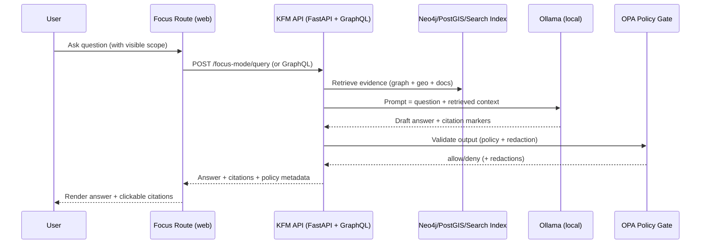

# 🧠 `focus/` Route — Focus Mode UI (Evidence‑First Q&A)


> **Path:** `web/src/routes/focus/`  
> **Purpose:** The “Focus Mode” experience: 🗺️ map + ⏱️ timeline + 🧩 Story Nodes + 💬 AI Q&A — with **strict provenance + citations**.

---

## 🔗 Quick Links

- ⬆️ Repo root: `../../../../README.md`
- 🧭 Docs (architecture / governance / templates): `../../../../docs/`
- 🧪 Tests: `../../../../tests/`
- 🧰 Tooling & validators: `../../../../tools/`
- 🧾 Story Nodes (content): `../../../../docs/reports/story_nodes/` (if present)

---

## 🎯 What this route is

This route is the **user-facing Focus Mode UI** — the place where people:

- read a **Story Node** 📚 (governed narrative artifact),
- see the corresponding **map + timeline context** 🗺️⏱️,
- ask questions in the **Focus Mode chat** 💬,
- and get answers that are **grounded in KFM sources** with **clickable citations** 🔍.

### ✅ What belongs here (frontend responsibilities)

- UI layout (map/timeline + reading pane + chat pane)
- Scope capture (current bbox, time range, selected layers, active Story Node)
- API calls to the governed backend (never to DBs directly)
- Rendering of:
  - answers (markdown/rich text),
  - citation footnotes,
  - evidence drawers / “open source” actions,
  - refusal states (fail‑closed UX)
- Accessibility + keyboard flows
- UI-side caching (safe + shallow only: e.g., last N chat turns, last scope)

### ❌ What must NOT belong here

- Direct calls to Neo4j / PostGIS / search index ❌
- Direct calls to Ollama / LLM services ❌
- Any “free-form” answers without citations ❌
- Any attempt to bypass policy gates ❌
- Secrets / tokens / credentials ❌

> [!IMPORTANT]
> **API boundary rule:** The frontend must never query knowledge stores directly.  
> All retrieval + governance enforcement happens behind the API layer.

---

## 🧭 The “Truth Path” this UI must respect

Focus Mode sits *downstream* of the pipeline and therefore must treat upstream artifacts as canonical:

**ETL → Catalogs (STAC/DCAT/PROV) → Graph/DB → API → UI → Story Nodes → Focus Mode**

If something is missing upstream (metadata, provenance, classification, policy decision), Focus Mode must **fail closed** 🧱✅.

---

## 🗺️ UX at a glance

A typical Focus Mode layout looks like:

- **Left / main:** Map canvas 🗺️ (layers, hover/inspect, selection)
- **Bottom or side:** Timeline ⏱️ (time range, scrubber, playback)
- **Right / side panel:**  
  - Story Node viewer 📚 (with citations & entity links)  
  - Focus chat 💬 (questions + answers + footnotes)  
  - Evidence drawer 🔎 (what a citation actually points to)

> [!TIP]
> Make the **scope visible**. Users should always see what the AI is “allowed” to use:
> bbox, time range, selected layers, and active Story Node.

---

## 🔄 Data flow (end‑to‑end)



---

## 📦 Contract expectations (UI ↔ API)

> This folder **does not define** the canonical contract — it **implements** it.  
> The canonical contract should live in the repo’s API contract location (OpenAPI / GraphQL schema).

### Request (conceptual)

- `question`: string
- `scope`: object capturing what the user is looking at
  - `bbox` (map extent) 🗺️
  - `timeRange` (timeline window) ⏱️
  - `selectedLayers` (active overlays) 🧩
  - `storyNodeId` (active narrative) 📚
  - `selection` (optional: clicked feature IDs)
- `session`: conversation id / turn index (for multi‑turn)

```json
{
  "question": "What changed in land patents in this county during the 1880s?",
  "scope": {
    "bbox": [-101.2, 37.1, -100.4, 38.0],
    "timeRange": { "start": "1880-01-01", "end": "1889-12-31" },
    "selectedLayers": ["land_patents", "railroads"],
    "storyNodeId": "story:homestead_wave_1880s",
    "selection": [{ "layer": "land_patents", "featureId": "patent:ks:1234" }]
  },
  "session": { "id": "focus_7f1c", "turn": 3 }
}
```

### Response (conceptual)

- `answerMarkdown` (or rich-text format)
- `citations[]` mapping markers → evidence
- `refusal` (if fail-closed) 🚫
- `policy` decision metadata (for auditability)
- `usedScope` (what the backend actually applied)

```json
{
  "answerMarkdown": "Based on the cataloged land patent records... [1][2]",
  "citations": [
    {
      "marker": "1",
      "kind": "dataset",
      "title": "BLM GLO Land Patents (Kansas)",
      "provenanceId": "prov:run:abc123",
      "href": "/catalog/dcat/land_patents_ks"
    }
  ],
  "refusal": null,
  "policy": { "decision": "allow", "decisionId": "opa:dec:9b2e" },
  "usedScope": { "timeRange": { "start": "1880-01-01", "end": "1889-12-31" } }
}
```

> [!NOTE]
> **Refusal is a feature.** When evidence is missing or policy fails, the correct UI behavior is a clear refusal state with “how to proceed” guidance (change scope, open evidence, select a Story Node, etc.).

---

## 🔗 Citation UX rules (non‑negotiable) 🔒

Focus Mode is **evidence‑first**. The UI must make that visible and testable.

### ✅ Required behaviors

- Render citation markers (e.g., `[1]`, `[2]`) as **clickable** footnotes
- Clicking a citation opens an **Evidence Drawer** 🔎 that shows:
  - title / source type (dataset / doc / graph node)
  - provenance id (PROV) / catalog id (STAC/DCAT) where applicable
  - license / access classification (public / restricted)
  - snippet preview (when allowed)
- If the backend returns **no citations**, treat as **invalid** and show fail‑closed UI 🚫

### ❌ Disallowed behaviors

- “Helpful” paraphrases without evidence
- Hiding citations to “clean up” the UI
- Letting the UI fabricate citations or “guess” sources

---

## 📚 Story Nodes + Focus Mode (how they connect)

Story Nodes are **markdown narratives with embedded citations + semantic references** to graph entities.

In Focus Mode, Story Nodes are displayed **alongside** the map/timeline context, and questions should be interpreted within that scope.

### Story Node viewer responsibilities

- Render Story Node markdown 📄
- Preserve and display Story Node citations (these are *not optional*)
- Provide entity affordances:
  - click an entity → highlight on map 🗺️
  - jump timeline to referenced periods ⏱️
- Make “fact vs interpretation” visible (styling or section labeling) 🧾

> [!TIP]
> Treat Story Nodes as a **first-class dataset**: they are machine-ingestible, linkable, and auditable — not just “static content”.

---

## 🛡️ Governance + Safety guardrails (frontend implications)

Even though enforcement happens server-side, the UI must **not undermine** policy.

### UI must assume “fail closed” 🧱

Show a refusal UI when any of the following occur:

- missing citations
- policy denial / redaction required
- scope too broad / ambiguous
- user requests disallowed content (e.g., private personal data)
- sensitive location precision is not allowed

### Sensitivity-aware UI patterns ⚖️

When data is sensitive or restricted:

- redact precise coordinates (show generalized geometry)
- suppress snippets if policy says so
- display a clear “Restricted / Redacted” badge
- provide next steps:
  - request access (if supported),
  - broaden scope,
  - use published Story Node summaries instead

---

## 🗂️ Suggested folder layout (keep it tidy)

> This is a **recommended** layout to keep Focus Mode maintainable.
> Align with the repo’s actual conventions if they differ.

```text
web/src/routes/focus/
├─ README.md                      📘 you are here
├─ route.*                        🧭 route entry (framework-specific)
├─ components/                    🧩 UI building blocks
│  ├─ FocusLayout.*               🧱 split panes (map / node / chat)
│  ├─ FocusChatPanel.*            💬 chat + composer
│  ├─ ScopeChips.*                🧭 bbox/time/layers display
│  ├─ CitationFootnotes.*         🔗 markers + click handlers
│  ├─ EvidenceDrawer.*            🔎 show underlying source
│  └─ StoryNodeViewer.*           📚 markdown + entity links
├─ state/                         🧠 state management
│  ├─ focusStore.*                🗃️ session + scope + messages
│  └─ selectors.*                 🎛️ derived scope (bbox/time/layers)
├─ api/                           🔌 API client + types
│  ├─ focusClient.*               📡 /focus-mode/query wrapper
│  └─ types.*                     🧾 request/response interfaces
└─ utils/                         🧰 parsing + helpers
   ├─ parseCitations.*            🧩 detect [1][2] markers
   └─ normalizeScope.*            🧭 bbox/time normalization
```

---

## ✅ Definition of Done (DoD) for changes in this route

Before merging anything that touches Focus Mode UI:

- [ ] **No direct datastore access** from frontend (Neo4j/PostGIS/Search) ✅
- [ ] Answers **never render** without citations (fail‑closed) ✅
- [ ] Citation click → evidence drawer opens with correct metadata ✅
- [ ] Story Node viewer preserves citations + supports entity interactions ✅
- [ ] Sensitive content UX is correct (redaction badges, suppressed fields) ✅
- [ ] Loading / error / refusal states are clear and accessible ✅
- [ ] Tests updated (unit + integration / e2e as applicable) ✅
- [ ] If any contract shape changed → API contract docs updated ✅

---

## 🧪 Testing strategy (practical + enforceable)

### 1) Unit tests (fast) ⚡
- citation parsing (`[1]` markers)
- scope normalization (bbox/time)
- rendering behavior for refusal vs allow
- component accessibility snapshots (labels/roles)

### 2) Integration tests (mock API) 🔌
- chat request includes scope (bbox/time/layers/node)
- response renders citations as clickable
- evidence drawer shows the right record

### 3) Contract tests (shared) 📜
- validate response schema matches OpenAPI/GraphQL contract
- if contract changes → version bump + changelog note

### 4) “Governance regression” checks 🛡️
- tests that fail if:
  - citations are missing
  - restricted content is shown without policy “allow”
  - story node citations are stripped

> [!NOTE]
> The broader KFM stack supports AI regression tests (e.g., verifying the model includes citations).  
> The UI’s job is to **render + enforce** those guarantees — and to refuse anything that breaks them.

---

## 🧯 Troubleshooting

### “AI answered but citations array is empty”
- Treat as **invalid response** → show fail-closed UI 🚫
- Log an error (non-PII) with response id / policy id
- Provide user guidance: narrow scope, open Story Node, try again

### “Citations appear in text but aren’t clickable”
- Confirm the citation parser detects markers (`[1]`, `[2]`)
- Ensure markdown renderer doesn’t strip bracketed tokens
- Confirm the evidence drawer can resolve `marker → citation[]`

### “Policy denied / redacted”
- Respect policy output:
  - don’t render suppressed snippets
  - show redaction badge
  - provide next steps (broaden, request access, or use a published Story Node)

### “Chat feels slow”
- Prefer streaming if available (optional)
- Avoid re-render storms (memoize heavy panes: map + markdown)
- Keep UI-side cache small (last N turns)
- Do not attempt heavy retrieval client-side (that’s backend)

---

## 🧩 Future extensions (safe by design)

- 🫧 **Streaming answers** (token-by-token) for responsiveness
- 🧠 “Focus Mode v2” richer multi-turn dialogue (still citation-gated)
- 🖼️ Multimodal inputs (images, maps, documents) **only** if provenance is preserved
- 🔎 Better evidence UX: side-by-side source comparison, “open in catalog”, provenance chain viewer

---

## 🤝 Contributing notes

When you add new UI features inside Focus Mode:

- Tie every new map overlay to provenance (legend/popup should cite source)
- Never weaken the citation gate (“looks fine” isn’t a test)
- If you introduce new data access: update the API contract first
- For sensitive data flows: prioritize sovereignty + safety (redaction, consent, role gating)

---

## 📎 Related docs worth reading

- `../../../../docs/architecture/` — overall system invariants 🏗️
- `../../../../docs/governance/` — ethics / sovereignty / policy-as-code ⚖️
- `../../../../docs/templates/` — Story Node and contract templates 🧾
- `../../../../api/` — Focus Mode backend route + orchestration (search for `focus_mode`) 🔍