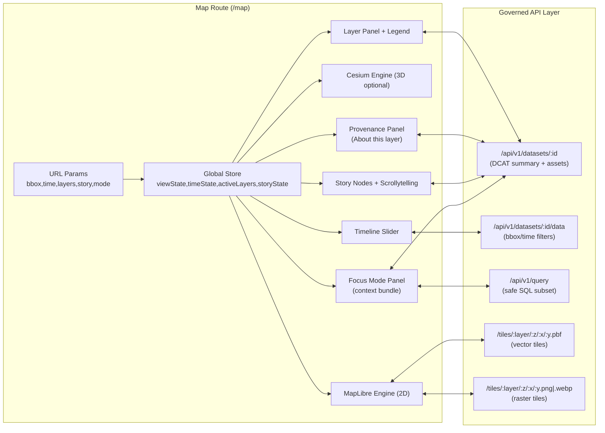

# 🗺️ Map Route — `web/src/routes/map`


> **Purpose:** This route is the primary “evidence surface” of KFM — an interactive, time-aware map experience (2D **MapLibre**, optional 3D **Cesium**) that stays synchronized with **Timeline**, **Story Nodes**, and **Focus Mode**—while enforcing KFM’s “API boundary + provenance-first” guardrails. 🧭

---

## 🔎 Quick links

- 🏠 Repo root: `../../../../README.md`
- 🌐 Web app docs (if present): `../../../README.md`
- 🧱 Master system contracts: `../../../../docs/MASTER_GUIDE_v13.md`
- 🔌 API contract & endpoints: `../../../../src/server/api/README.md`
- 🧠 AI / Focus Mode governance: `../../../../docs/architecture/ai/OLLAMA_INTEGRATION.md`

---

## 📚 Contents

- [🧭 What this route owns](#-what-this-route-owns)
- [🚦Non-negotiables](#non-negotiables)
- [🧱 Architecture at a glance](#-architecture-at-a-glance)
- [🔗 Deep-linking (URL ⇄ State)](#-deep-linking-url--state)
- [🧩 Layers & Layer Registry](#-layers--layer-registry)
- [🕰️ Time & Timeline](#️-time--timeline)
- [📖 Story Nodes & Scrollytelling](#-story-nodes--scrollytelling)
- [🧠 Focus Mode Context Bundle](#-focus-mode-context-bundle)
- [♿ UX + Accessibility](#-ux--accessibility)
- [⚡ Performance & stability](#-performance--stability)
- [🧪 Testing](#-testing)
- [🛠️ Troubleshooting](#️-troubleshooting)
- [✅ Definition of Done](#-definition-of-done)

---

## 🧭 What this route owns

This folder is **route-level composition** — it should coordinate “map mode”, layout, and state synchronization, not become a dumping ground for datasets or bespoke data-fetch code. 🧩

**Owned responsibilities:**
- 🗺️ Map canvas integration (MapLibre 2D; optional Cesium 3D)
- 🧰 Layout + docking of panels (Layers, Legend, Timeline, Story/Focus sidebars)
- 🔗 URL deep-linking (restore/share views)
- 🧾 Provenance surface (layer “About”, source/license visibility, dataset links)
- 🛡️ Guardrails in UI (respect redaction/classification & API-only access)
- 📈 Instrumentation hooks (optional): map interactions, layer toggles, story progression

**Non-goals (don’t do these here):**
- ❌ Hard-code datasets or features “just for this route”
- ❌ Query PostGIS/Neo4j directly (ever)
- ❌ Add a layer without provenance metadata + legend + attribution
- ❌ Add sensitive coordinates without an explicit governance/redaction plan

---

## 🚦Non-negotiables

These are the “drop everything and fix it” rules. 🧯

1. **API boundary** 🔌  
   The UI must access data **only** via the governed API layer (REST/GraphQL), so policy enforcement/redaction stays centralized.

2. **Provenance-first** 🧾  
   Every visible layer must be tied to **STAC/DCAT/PROV** (or an equivalent catalog reference) and must surface attribution + license.

3. **No data leakage** 🛡️  
   The UI must **not** enable “zooming around the rules.” If a dataset is generalized/rounded/aggregated, the UI must not “reconstruct” it.

4. **Deterministic UI rendering** 🧠  
   The map should render as a pure function of:
   - `viewState` (camera)
   - `timeState` (year/range)
   - `activeLayers`
   - `policy/classification decisions` (from API responses)

---

## 🧱 Architecture at a glance



> 💡 **Design hint:** keep **Map Engines** behind a tiny adapter surface so the rest of the route only deals with one `viewState` shape. This avoids “2D vs 3D divergence” bugs.

---

## 🔗 Deep-linking (URL ⇄ State)

Deep links turn the map into a shareable artifact: “same view, same time, same layers.” 🔁

Recommended query params (adjust to your router conventions):

- `bbox=minLon,minLat,maxLon,maxLat` 🌍
- `t=YYYY` or `t=YYYY..YYYY` 🕰️
- `layers=layerA,layerB,layerC` 🧩
- `mode=2d|3d` 🧭
- `story=story_id` and optional `node=node_id` 📖
- `sel=featureId` (optional) 🎯

Example:
```txt
/map?bbox=-102.1,36.9,-94.6,40.0&t=1930..1939&layers=dust_bowl,railroads_1935&mode=2d
```

**Rules of thumb:**
- ✅ URL should be the *minimal* shareable state (don’t serialize everything).
- ✅ Store still remains the “source of truth”; URL is an import/export format.
- ✅ Version your URL schema if you make breaking changes (`v=2`).

---

## 🧩 Layers & Layer Registry

### Layer registry: the single place layers are defined 🗃️

A **Layer Registry** is a config-backed inventory describing:
- how to fetch the layer (tiles vs data endpoint),
- how to style it,
- how to label it (legend),
- how to cite it (dataset IDs, attribution, license),
- how it behaves in time (static vs time-sliced),
- how it behaves under policy (public/internal/sensitive).

> 🔎 If you can’t find a registry file, search for: `layerRegistry`, `layers`, `catalog`, `styleSpec`, `sources`.

### Suggested layer definition shape

<details>
<summary><strong>📦 Minimal Layer Definition (example)</strong></summary>

```ts
export type KfmLayerDef = {
  id: string;
  title: string;

  // Provenance & discoverability
  datasetId: string;          // DCAT dataset id
  stacRef?: string;           // STAC collection/item id (if relevant)
  provRef?: string;           // PROV bundle/run id (if relevant)
  license?: string;
  attributionLabel: string;
  attributionUrl?: string;

  // Rendering
  kind: "vector-tile" | "raster-tile" | "geojson" | "cesium-3d-tiles";
  source: {
    tileUrl?: string;         // e.g. /tiles/historic_trails/{z}/{x}/{y}.pbf
    rasterTileUrl?: string;   // e.g. /tiles/landcover_1930/{z}/{x}/{y}.webp
    dataUrl?: string;         // e.g. /api/v1/datasets/:id/data?format=geojson
  };

  // Time-awareness
  time?: {
    mode: "none" | "year" | "range";
    param?: string;           // e.g. "t" or "year"
    note?: string;            // how the API expects time filtering
  };

  // UI affordances
  legend?: { title: string; items: Array<{ label: string; swatch?: string }> };
  popup?: { fields: string[]; titleField?: string };

  // Governance
  sensitivity?: {
    classification: "public" | "internal" | "sensitive";
    redaction: "none" | "rounded_coords" | "aggregated" | "hidden";
    note?: string;
  };
};
```
</details>

### How to add a new map layer ✅

1. **Confirm the dataset is “real” in KFM terms** 🧾  
   It should already exist in the pipeline outputs + catalogs (STAC/DCAT/PROV), not just as an ad-hoc file.

2. **Ensure there’s an API path** 🔌  
   Prefer **tiles** for large/interactive layers:
   - Vector tiles: `/tiles/{layer}/{z}/{x}/{y}.pbf`
   - Raster tiles: `/tiles/{layer}/{z}/{x}/{y}.png` or `.webp`

   For smaller data or debugging:
   - Dataset data streaming: `/api/v1/datasets/{id}/data?format=geojson&bbox=...`

3. **Add an entry in the Layer Registry** 🗃️  
   Include `datasetId`, `license`, `attribution`, and a basic `legend`.

4. **Wire into Layer UI** 🎛️  
   Make it togglable, and make provenance visible (About panel, tooltip, etc).

5. **Test it** 🧪  
   Verify tile URLs, style loads, filters work, and no policy bypass occurs.

---

## 🕰️ Time & Timeline

Time is a *first-class dimension* in KFM: the map should “scrub” through years/ranges smoothly. ⏳

### Recommended state model

- `timeState.mode`: `"year" | "range"`
- `timeState.year`: `number` (if year mode)
- `timeState.start`, `timeState.end`: ISO dates or years (if range mode)

### Applying time filters (patterns)

Different layers need different tactics:
- **Pre-sliced layers** (e.g., `railroads_1890`, `railroads_1900`)  
  → registry selects the correct layer based on `currentYear`.
- **Time-param tiles** (if supported)  
  → tile URL includes `?t=1935` (or a header/query param).
- **Query-backed overlays**  
  → request bbox/time and render as GeoJSON for small datasets.

> 🧠 Tip: keep the timeline logic in one place (a selector/hook), so MapLibre and Cesium both use the same time decisions.

---

## 📖 Story Nodes & Scrollytelling

The map route must support narrative driving: the story changes the map, and the map context enriches the story. 📚🗺️

Recommended behaviors:
- “Next” / “Prev” moves to a target `viewState` and `timeState`.
- Scroll-linked story sections can trigger map transitions.
- Story highlights should be reversible (back button / history-friendly).

**Map-side responsibilities:**
- Smooth camera transitions (flyTo / easing)
- Deterministic application of story “steps”
- Clear indication when the story is controlling the map (lock icon 🔒 / banner)

---

## 🧠 Focus Mode Context Bundle

Focus Mode should receive a structured, provenance-friendly context bundle — not a giant blob of UI state. 🎯

Suggested context fields:
- `viewState` (bbox/center/zoom/bearing/pitch)
- `timeState` (year or range)
- `activeLayers` (ids + datasetId)
- `selectedFeature` (id + datasetId + safe attribute subset)
- `storyContext` (storyId/nodeId, if relevant)

> 🛡️ Do not send sensitive raw attributes by default. Apply the same redaction mindset you’d apply to UI rendering.

---

## ♿ UX + Accessibility

Maps are notoriously easy to make “cool but unusable.” This route must be workshop-friendly and field-friendly. 📱🧑‍🦽

Checklist:
- 🎛️ Layer toggles are keyboard reachable (focus rings visible)
- 🧾 Legend exists for thematic layers (not optional)
- 🔎 “What am I looking at?” panel (About + provenance + license)
- 🌈 Color choices are readable (avoid low-contrast basemaps)
- 🧭 Provide scale context where feasible (scale bar, or at least clear units)
- 🧠 Maintain visual hierarchy: base/reference layers are subtle; data layers pop

---

## ⚡ Performance & stability

Hard rules for performance:
- ✅ Prefer **vector tiles** over huge GeoJSON
- ✅ Debounce expensive operations (bbox queries, catalog searches)
- ✅ Avoid re-creating map sources/layers on every render
- ✅ Keep stable IDs for sources and layers (diff updates, don’t teardown)
- ✅ Don’t “style thrash” (batch style updates when possible)

Stability tips:
- 🧯 Wrap the map canvas in an error boundary
- 🔁 Handle “style reload” events (MapLibre style changes can drop layers)
- 🧊 Cache dataset metadata for active layers (avoid repeated /datasets calls)

---

## 🧪 Testing

### What to test (minimum)
- ✅ URL → state import/export
- ✅ Layer Registry integrity (no duplicate ids, required provenance fields exist)
- ✅ Tile URL builders (including time slicing)
- ✅ Timeline interactions (year/range update triggers expected filters)
- ✅ Story step application (view + time + layers)
- ✅ Policy/redaction UI constraints (no leaking sensitive locations)

### Suggested test layers
- **Unit tests:** registry + selectors + url codecs
- **Integration tests:** render route with mocked API responses
- **E2E tests (Playwright/Cypress):** layer toggle, time scrub, click popup, story advance

---

## 🛠️ Troubleshooting

**Blank map**
- Check basemap/style URL
- Confirm tile endpoints respond (404/401/500)
- Verify CORS and dev proxy config

**Layer toggle does nothing**
- Confirm registry `id` matches what UI expects
- Confirm tile URL is correct and has the right file extension (`.pbf`, `.png`, `.webp`)

**Time slider updates but map doesn’t change**
- Verify the time selector actually influences:
  - chosen layer id (pre-sliced), or
  - tile URL param, or
  - bbox/time query

**3D toggle loses your location**
- Ensure 2D ↔ 3D transitions share a single `viewState`
- Use a conversion helper for camera mapping (center stays constant)

---

## ✅ Definition of Done

Before merging changes touching `/map`, verify:

- [ ] 🧾 Any new/changed layer includes provenance fields (datasetId/license/attribution)
- [ ] 🗺️ Legend/provenance UI is present and usable
- [ ] 🔌 Data access uses only the API (no direct DB/graph access)
- [ ] 🛡️ Sensitive data is handled explicitly (rounded/aggregated/hidden, as required)
- [ ] ♿ Keyboard navigation works for primary controls
- [ ] ⚡ No major regressions in interaction (pan/zoom remains smooth)
- [ ] 🧪 Tests updated/added where appropriate
- [ ] 🧠 Story + Focus Mode still function with the modified state model

---

### 🧭 Maintainer note

If this route starts feeling “too big,” it probably is. Split by responsibility:
- `map-engine/` (MapLibre + Cesium adapters)
- `state/` (selectors, actions, URL codec)
- `ui/` (panels)
- `layers/` (registry + helpers)

Keep `/routes/map` as the *orchestrator*, not the universe. 🌌