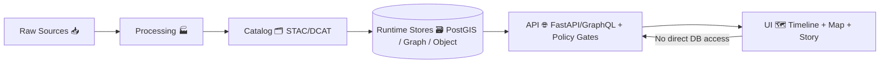
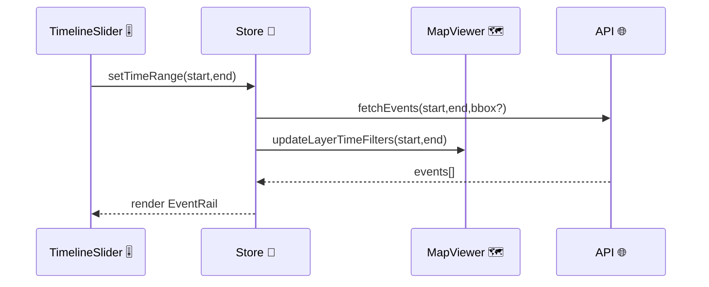
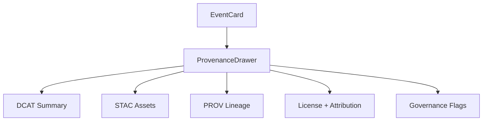

# ⏳ Timeline Route (`web/src/routes/timeline`)


> [!IMPORTANT]
> The Timeline route is the **temporal spine** of KFM: it synchronizes **time ↔ map ↔ narrative**, while enforcing KFM’s “map behind the map” trust model (every event, layer, and claim must be traceable to governed sources).

---

## 🧭 What this route is

The Timeline route provides a **time scrubber + event rail** that lets users:

- 🧩 **Scrub time** (year/date-range) and watch the map update
- 🗺️ Filter/animate **time-aware layers** (vector tiles, raster imagery, GeoJSON overlays)
- 📚 Browse **events** and jump to map locations and/or story sections
- 🎞️ Run **story playback** (“scrollytelling”) where narrative scroll steps drive time and camera
- 🧾 Inspect **provenance** for anything shown (dataset metadata + lineage)

---

## ✨ Core UX behaviors

### 1) Free exploration (time scrubbing)
- User drags the slider → global time state updates → map layers re-query/re-style by time.
- Event rail refreshes to show events within the selected time window (and optionally bbox).

### 2) Story-driven timeline (scrollytelling)
- As the user scrolls the story panel, **IntersectionObserver**-triggered “steps”:
  - set the active year/range,
  - pan/zoom (2D) or fly (3D),
  - highlight an event or layer.
- Optional 🎬 **auto-play** runs steps on a timer, with play/pause controls.

### 3) Evidence-first inspection (trust tooling)
- Every event and layer must offer:
  - **What is this?**
  - **Where did it come from?**
  - **What processing created it?**
  - **What license/constraints apply?**

---

## 🧱 Data flow and the “Truth Path” (non-negotiable)

KFM’s architecture is intentionally gated:



**Timeline rule:** UI components **must not** bypass the API. If the UI needs time-filtered features, it requests them from the API (tiles, GeoJSON, catalog search, etc.). ✅

---

## 🗂️ Suggested folder layout (route-local)

> Adapt this to the repo’s current structure, but keep the intent: **route = orchestrator**, **components = presentational**, **hooks = behavior**, **types = contracts**.

```text
web/src/routes/timeline/
├─ README.md                  # you are here 📘
├─ index.tsx                  # route entry (loader + page shell)
├─ TimelinePage.tsx           # layout orchestration 🧩
├─ components/
│  ├─ TimelineSlider/
│  │  ├─ TimelineSlider.tsx   # slider UI + keyboard controls 🎚️
│  │  └─ TimelineSlider.css
│  ├─ PlaybackControls/
│  ├─ EventRail/
│  ├─ EventCard/
│  ├─ TimeRangeChips/
│  └─ ProvenanceDrawer/       # “map behind the map” panel 🧾
├─ hooks/
│  ├─ useTimelineQuery.ts     # API calls (events + layers by time)
│  ├─ useScrollytelling.ts    # IntersectionObserver + step runner 🧭
│  ├─ usePlayback.ts          # play/pause/seek + timer loop ▶️⏸️
│  └─ useUrlSyncedTime.ts     # keep URL <-> store in sync 🔗
├─ state/
│  ├─ timelineSlice.ts        # currentYear/currentRange, playback state
│  └─ selectors.ts
└─ types/
   ├─ timeline.ts             # Event + filters + provenance contracts
   └─ provenance.ts
```

---

## 🔗 Route contract (URL ↔ state)

**Goal:** a timeline view should be shareable and reproducible.

Recommended URL parameters:

- `t=` — single year or ISO date (e.g., `t=1934` or `t=1934-05-01`)
- `start=` / `end=` — ISO date range
- `bbox=` — optional map filter (minLon,minLat,maxLon,maxLat)
- `story=` — optional story id (activates scrollytelling mode)
- `step=` — optional story step index (deep link)

Example:

```text
/timeline?start=1930-01-01&end=1939-12-31&story=dust-bowl&step=3
```

> [!TIP]
> Prefer **idempotent** URLs: loading the same URL should yield the same time selection, layer set, and highlighted event (assuming same backend data version).

---

## 🧠 State model (global store)

The technical blueprint describes a global store where timeline selection updates the map and story in sync. The timeline slice should minimally manage:

- `mode`: `"explore" | "story"`
- `currentYear` or `currentRange` (single source of truth)
- `playback`: `{ status: "idle"|"playing"|"paused", speed, stepIndex? }`
- `filters`: `{ bbox?, tags?, layerIds?, query? }`
- `selection`: `{ eventId?, datasetId?, featureId? }`

Example action flow:



---

## 🧾 Data contracts (TypeScript)

### Timeline event (UI-ready)
```ts
export type TimelineEvent = {
  id: string;
  title: string;
  summary?: string;

  /** ISO8601 start/end (end optional for instant events) */
  start: string;
  end?: string;

  /** Optional geo anchor */
  geometry?: GeoJSON.Geometry;

  /** Categorization for filtering + styling */
  tags?: string[];
  domain?: "history" | "environment" | "infrastructure" | "treaty" | "census" | "story";

  /** The “map behind the map” pointers */
  provenance: {
    datasetId?: string;      // DCAT dataset id
    stacItemId?: string;     // STAC item id (if applicable)
    provId?: string;         // lineage doc id
    citations?: Array<{
      label: string;         // “Kansas Historical Society …”
      uri?: string;          // external link
      note?: string;
    }>;
    license?: string;
    sensitivity?: "public" | "restricted" | "sensitive";
  };
};
```

### Timeline query (API-facing)
```ts
export type TimelineQuery = {
  start: string;               // ISO date
  end: string;                 // ISO date
  bbox?: [number, number, number, number];
  tags?: string[];
  layerIds?: string[];
  q?: string;                  // keyword search
};
```

---

## 🌐 API integration patterns

This route typically needs **three kinds of API calls**:

### 1) Catalog discovery (what exists for this time window?)
- Search datasets by keyword / bbox / time range
- Return dataset ids, titles, licenses, and links to assets (STAC items, etc.)

**Example (conceptual):**
```text
GET /api/v1/catalog/search?start=1930-01-01&end=1939-12-31&q=dust
```

### 2) Timeline events (what happened in this window?)
- Curated events, story steps, or derived “event-like” dataset markers
- Return `TimelineEvent[]`

**Example (conceptual):**
```text
GET /api/v1/events?start=1930-01-01&end=1939-12-31&bbox=...
```

### 3) Map rendering (show it on the map)
- Vector tiles (MVT) and raster tiles for large datasets
- GeoJSON overlays for small datasets or selected features

**Examples (conceptual):**
```text
GET /tiles/{layer}/{z}/{x}/{y}.pbf
GET /tiles/{layer}/{z}/{x}/{y}.png
GET /api/v1/datasets/{id}/data?format=geojson&bbox=...
```

> [!NOTE]
> Keep tile payloads lean; prefer styling on the client where possible, but never at the expense of provenance—tile layers should still map back to dataset ids in the catalog.

---

## 🧾 Provenance Drawer (minimum spec)

When a user clicks an event or toggles a layer, the route must be able to show:

- 📌 Dataset title + description (from DCAT)
- 🔗 Asset links (STAC items, files, tiles)
- 🧬 Lineage summary (W3C PROV-ish): inputs → processing activity → outputs
- ⚖️ License + attribution
- 🧯 Policy flags: restricted/sensitive classification + redaction notes

Suggested UI:

- Right-side drawer / bottom sheet (mobile)
- “Cite this” button that copies a short citation + dataset id
- “View lineage” collapsible section



---

## 🪶 Indigenous data & governance considerations (CARE-aligned)

Some timeline domains (e.g., treaties, land cessions, culturally sensitive materials) require **extra care**:

- ✅ Treat statistics/data as culturally embedded; avoid “deficit narrative” defaults.
- ✅ Respect **CARE** principles: Collective benefit, Authority to control, Responsibility, Ethics.
- ✅ Support metadata that indicates **provenance, origin, and authority** (e.g., labels/markers for culturally governed materials).
- ✅ Ensure policy gates exist at the API layer (UI should reflect restrictions rather than bypass them).

> [!IMPORTANT]
> If an item is flagged sensitive/restricted, the Timeline UI must degrade gracefully (e.g., show a redacted card with “restricted provenance” and guidance), rather than failing silently or leaking data.

---

## ♿ Accessibility + interaction design requirements

### Keyboard & screen reader
- Slider must be operable with arrow keys, PageUp/PageDown, Home/End.
- Visible focus rings; no “keyboard trap” in drawers/modals.
- Use ARIA for:
  - slider (`role="slider"`, `aria-valuemin/max/now`)
  - playback controls (`aria-pressed`, `aria-label`)
  - event list (`aria-live` only if necessary—avoid noisy announcements)

### Motion & comfort
- Respect `prefers-reduced-motion`:
  - reduce map fly animations
  - disable autoplay by default when reduced motion is enabled
- Keep transitions smooth but not theatrical—this is a research interface 🧑‍🔬

### Responsive layout 📱
- Desktop: left = story/events, right = map, bottom/top = timeline.
- Mobile: map-first, timeline sticky, event rail collapsible.

---

## ⚡ Performance checklist

### Avoid “death by re-render”
- Slider updates should be **debounced** (especially continuous drag).
- Use memoization (`useMemo`, `useCallback`) for derived event lists and style expressions.
- Virtualize large event rails.

### Prefer progressive loading
- Load events for the visible time window first.
- If bbox is present, prioritize bbox-filtered results; allow “expand to Kansas” as a secondary action.

### Map layer strategy
- Large layers: tiles (MVT/raster) ✅
- Small selections: GeoJSON overlays ✅
- When zoomed out: simplified/generalized geometry (or let the backend serve generalized tiles)

### User feedback
- Show subtle loading states during tile loads and event refreshes (no spinner storms).

---

## 🧪 Testing strategy

### Unit tests (fast)
- timeline slice reducers
- url ↔ state sync utilities
- formatting of time ranges and labels
- provenance mapping (API response → UI model)

### Integration tests
- slider drag updates map filter dispatch
- event click selects + opens provenance drawer
- story step triggers time change + map move

### E2E tests (critical path)
- `/timeline?start=...&end=...` loads deterministically
- keyboard control works on slider
- restricted items don’t leak details

---

## ✅ Definition of Done (DoD)

- [ ] Time selection drives map + event rail reliably
- [ ] URL deep links reproduce state
- [ ] Provenance Drawer exists for events and layers
- [ ] Works in both Explore + Story modes
- [ ] Keyboard accessible and reduced-motion aware
- [ ] No direct DB/data-lake access from UI (API only)
- [ ] Tests cover reducers + the main interactions

---

## 🔭 Future enhancements (nice-to-have)

- 🗣️ “Tour mode” with narration (TTS) synced to story steps
- 🎥 Export a timeline tour as shareable link/video preset
- 🧰 Timeline “compare mode” (two years side-by-side)
- 🧠 AI-assisted “explain this change” panel (still evidence-first)

---

## 🔗 Related docs (repo-local)

- `docs/architecture/system_overview.md` 🏛️
- `docs/architecture/AI_SYSTEM_OVERVIEW.md` 🤖
- `src/server/api/README.md` 🌐
- `docs/data/*` domain runbooks 📚

> [!TIP]
> Keep this README updated as contracts stabilize—Timeline is a cross-cutting feature touching UI, API, catalog, and governance.