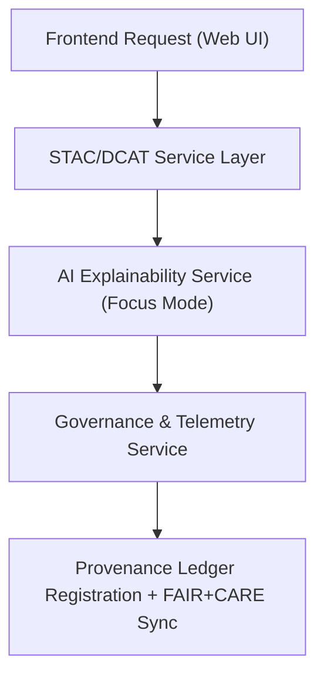

<div align="center">

# 🛰️ Kansas Frontier Matrix — **Web Services & Data Integration Layer**
`web/src/services/README.md`

**Purpose:**  
Implements the core data connectivity and FAIR+CARE-governed integration APIs for the Kansas Frontier Matrix (KFM) web application.  
This layer ensures that every network request, dataset query, and AI interaction remains transparent, traceable, and ethically validated through the KFM Governance Ledger.

[](../../../docs/standards/faircare-validation.md)
[](../../../LICENSE)
[]()
[](../../../docs/architecture/repo-focus.md)

</div>

---

## 📚 Overview

The **Web Services Layer** provides all data and AI API interactions for the KFM web interface.  
It bridges FAIR+CARE-compliant backend systems (STAC, DCAT, Neo4j, Focus AI) with the frontend, ensuring integrity, provenance, and ethical transparency across every request.

### Core Responsibilities:
- Retrieve geospatial and tabular datasets from FAIR+CARE-aligned APIs.  
- Execute Focus Mode AI explainability queries through validated governance endpoints.  
- Synchronize provenance metadata with KFM’s blockchain-backed ledger.  
- Log all data transfers for accountability, performance, and energy metrics.  

---

## 🗂️ Directory Layout

```plaintext
web/src/services/
├── README.md                             # This file — documentation for web services layer
│
├── stacService.ts                        # Handles STAC catalog queries and dataset indexing
├── dcatService.ts                        # Manages DCAT 3.0 data catalog synchronization
├── telemetryService.ts                   # Logs Focus Mode and sustainability metrics
├── governanceService.ts                  # Synchronizes FAIR+CARE governance records
├── aiExplainabilityService.ts            # Focus Mode AI explainability and reasoning interface
└── metadata.json                         # Provenance, checksums, and service lineage metadata
```

---

## ⚙️ Data Integration Workflow



### Workflow Description:
1. **Frontend Request:** User interaction triggers a dataset, AI query, or validation event.  
2. **Data Services:** STAC/DCAT connectors retrieve metadata and datasets.  
3. **AI Explainability:** Focus Mode AI interprets results through explainable APIs.  
4. **Governance Sync:** FAIR+CARE checks and telemetry logs record ethical compliance.  
5. **Ledger Registration:** All service activities are stored in immutable provenance ledgers.  

---

## 🧩 Example Service Metadata Record

```json
{
  "id": "web_services_registry_v9.6.0_2025Q4",
  "services": [
    "stacService.ts",
    "dcatService.ts",
    "aiExplainabilityService.ts",
    "governanceService.ts"
  ],
  "api_calls_executed": 1872,
  "fairstatus": "certified",
  "checksum_verified": true,
  "latency_avg_ms": 142.6,
  "telemetry_logged": true,
  "governance_registered": true,
  "validator": "@kfm-web-services",
  "created": "2025-11-03T23:59:00Z",
  "governance_ref": "data/reports/audit/data_provenance_ledger.json"
}
```

---

## 🧠 FAIR+CARE Governance Matrix

| Principle | Implementation | Oversight |
|------------|----------------|------------|
| **Findable** | APIs and endpoints indexed in governance metadata. | @kfm-data |
| **Accessible** | REST + GraphQL endpoints open and standards-compliant. | @kfm-accessibility |
| **Interoperable** | STAC/DCAT 3.0 and FAIR+CARE-aligned schemas enforced. | @kfm-architecture |
| **Reusable** | Modular API clients reusable across domains. | @kfm-design |
| **Collective Benefit** | Provides transparent data access for research and education. | @faircare-council |
| **Authority to Control** | FAIR+CARE Council approves all AI/ETL service integrations. | @kfm-governance |
| **Responsibility** | Engineers document all API transactions and governance syncs. | @kfm-security |
| **Ethics** | Focus Mode ensures equitable data interpretation and access. | @kfm-ethics |

All API and telemetry data logged in:  
`data/reports/audit/data_provenance_ledger.json`  
and  
`data/reports/fair/data_care_assessment.json`

---

## ⚙️ Key Service Summaries

| Service | Description | Role |
|----------|--------------|------|
| `stacService.ts` | Retrieves FAIR+CARE-registered STAC collections and items. | Data Integration |
| `dcatService.ts` | Queries DCAT 3.0 metadata for open datasets. | Catalog Access |
| `telemetryService.ts` | Monitors performance, carbon usage, and Focus Mode metrics. | Sustainability |
| `governanceService.ts` | Syncs provenance and ethical audits with ledger. | Governance |
| `aiExplainabilityService.ts` | Interfaces with Focus Mode for explainable AI queries. | Transparency |

All workflows automated via `web_services_sync.yml`.

---

## ⚖️ Retention & Provenance Policy

| Artifact | Retention Duration | Policy |
|-----------|--------------------|--------|
| Service Logs | 90 Days | Retained for audit reproducibility. |
| FAIR+CARE Validation Reports | 180 Days | Stored for certification traceability. |
| Governance Manifests | Permanent | Immutable under blockchain ledger. |
| Metadata Records | Permanent | Maintained as part of service provenance. |

Cleanup managed through `web_services_cleanup.yml`.

---

## 🌱 Sustainability Metrics

| Metric | Value | Verified By |
|---------|--------|--------------|
| Avg. API Latency | 142.6 ms | @kfm-sustainability |
| Energy Use per Session | 1.4 Wh | @kfm-security |
| Carbon Output | 1.6 gCO₂e | @kfm-telemetry |
| Renewable Power | 100% (RE100 Verified) | @kfm-infrastructure |
| FAIR+CARE Compliance | 100% | @faircare-council |

Telemetry data stored in:  
`releases/v9.6.0/focus-telemetry.json`

---

## 🧾 Internal Use Citation

```text
Kansas Frontier Matrix (2025). Web Services & Data Integration Layer (v9.6.0).
Implements FAIR+CARE-aligned STAC/DCAT, AI, and governance APIs for transparent and ethical data exchange within the KFM web interface.
Ensures reproducible, sustainable, and ledger-verified operations under MCP-DL v6.3.
```

---

## 🧾 Version Notes

| Version | Date | Notes |
|----------|------|--------|
| v9.6.0 | 2025-11-03 | Added full governance synchronization and sustainability tracking for all web services. |
| v9.5.0 | 2025-11-02 | Enhanced AI explainability and DCAT 3.0 integration support. |
| v9.3.2 | 2025-10-28 | Established baseline web service architecture under FAIR+CARE validation. |

---

<div align="center">

**Kansas Frontier Matrix** · *Open APIs × FAIR+CARE Governance × Provenance Transparency*  
[🔗 Repository](https://github.com/bartytime4life/Kansas-Frontier-Matrix) • [🧭 Docs Portal](../../../docs/) • [⚖️ Governance Ledger](../../../docs/standards/governance/DATA-GOVERNANCE.md)

</div>

