# 🧩 Frontend Services (`web/src/services`)

<p>
  
  
  
  
  
  
</p>

> 🧠 **Mental model:** UI components (MapView / Sidebar / Timeline / Charts) should *never* “know” how the backend works.  
> They ask **services** for data, and services talk to the **governed API**. ✅

---

## 📌 Quick links

- 🧭 Repo architecture source-of-truth: `../../../docs/MASTER_GUIDE_v13.md`
- 🧱 Backend API boundary (must-go-through): `../../../src/server/`
- 🧾 If you need a new endpoint: `../../../docs/templates/TEMPLATE__API_CONTRACT_EXTENSION.md`
- 🧠 Story & Focus pipelines: `../../../docs/reports/story_nodes/`

---

## 🎯 Purpose

`web/src/services` is the **frontend service layer**: a set of small, testable modules that:

- ✅ Encapsulate **API calls** (REST / GraphQL) behind domain-friendly functions
- ✅ Centralize **security defaults** (auth headers, redaction-safe logging, classification propagation)
- ✅ Normalize **errors** (so the UI can show consistent UX)
- ✅ Provide **map-ready resources** (tile URLs, WMS templates, GeoJSON fetchers)
- ✅ Emit **usage telemetry hooks** (without leaking sensitive payloads)

---

## ✅ Scope

| ✅ In scope (services DO) | 🚫 Out of scope (services DO NOT) |
|---|---|
| Call the governed backend API (`src/server`) | Query Neo4j directly (ever) |
| Provide typed functions like `getFieldTimeSeries()` | Store long-lived app state (that’s UI/store land) |
| Normalize errors & retries | Contain React components / hooks (wrap them elsewhere) |
| Apply safety defaults (redaction-safe logs, classification tagging) | Hardcode “published” datasets inside the UI bundle |
| Support map layer plumbing (tiles/WMS/GeoJSON fetch) | Implement business rules that belong to backend policies |

---

## 🧱 Non‑negotiables (KFM guardrails)

### 1) 🚧 The API boundary is mandatory
All data access must go through the **governed API layer** (`src/server`).  
If you’re thinking “but it’s faster to query the graph directly”… it’s also a compliance break. ❌

### 2) 🕵️ No data leakage from the UI
Services must be safe-by-default:
- Don’t log raw payloads if they might contain sensitive attributes
- Don’t cache restricted outputs into long-lived browser storage
- Don’t down-classify: outputs cannot be “less restricted” than inputs

### 3) 🧾 Evidence artifacts are not “just files”
If the UI needs an artifact (raster layer, derived map, AI output), it must be exposed via the **API**, not embedded or hard-coded into the frontend.

---

## 🗂️ Suggested folder layout

> ✅ This is a **recommended** shape. Keep the same spirit even if filenames differ.

```text
📦 web/src/services/
├─ 🧠 api/
│  ├─ client.ts            # fetch wrapper (base URL, headers, timeouts, abort)
│  ├─ errors.ts            # ApiError model + mapping helpers
│  ├─ types.ts             # shared request/response types (or generated types)
│  └─ interceptors.ts      # auth injection, correlation IDs, safe logging
├─ 🗺️ layers/
│  ├─ registry.service.ts  # layer registry resolution + gating
│  └─ tiles.service.ts     # tile URL builders, WMS/XYZ helpers
├─ 📚 catalog/
│  ├─ stac.service.ts      # STAC collections/items retrieval
│  └─ dcat.service.ts      # dataset discovery metadata retrieval
├─ 🌾 domain/
│  ├─ fields.service.ts    # field details, timeseries, alerts
│  ├─ simulation.service.ts# start/poll scenario simulations
│  └─ reports.service.ts   # report exports, downloads
├─ 🔐 auth/
│  └─ auth.service.ts      # login/session helpers (thin)
├─ 📈 telemetry/
│  └─ telemetry.service.ts # analytics hooks + audit-safe events
└─ 🧰 index.ts              # public exports (single import surface)
```

---

## 🧪 A simple service contract style

### ✅ Guidelines
- Prefer **small, composable functions**
- Return **typed values**, not raw `Response`
- Keep the service layer **framework-agnostic** (no React imports)
- Make requests **abortable** via `AbortController`
- Normalize errors into one shape (`ApiError`) so UI can decide what to show

---

## 🧰 Example: API client (thin wrapper)

```ts
// web/src/services/api/client.ts
export type ApiClientOptions = {
  baseUrl: string;
  getAuthToken?: () => string | null;
  timeoutMs?: number;
};

export class ApiError extends Error {
  status?: number;
  code?: string;
  requestId?: string;
  details?: unknown;
}

export function createApiClient(opts: ApiClientOptions) {
  const { baseUrl, getAuthToken, timeoutMs = 25_000 } = opts;

  async function request<T>(
    path: string,
    init: RequestInit & { signal?: AbortSignal } = {},
  ): Promise<T> {
    const controller = new AbortController();
    const timeout = setTimeout(() => controller.abort(), timeoutMs);

    try {
      const token = getAuthToken?.();
      const res = await fetch(`${baseUrl}${path}`, {
        ...init,
        headers: {
          "content-type": "application/json",
          ...(token ? { authorization: `Bearer ${token}` } : {}),
          ...(init.headers ?? {}),
        },
        signal: init.signal ?? controller.signal,
      });

      const requestId = res.headers.get("x-request-id") ?? undefined;

      if (!res.ok) {
        const err = new ApiError(`Request failed: ${res.status}`);
        err.status = res.status;
        err.requestId = requestId;

        // ⚠️ Don’t assume body is safe to log.
        // Try parsing for UI-friendly info, but avoid dumping raw payloads.
        try {
          err.details = await res.json();
        } catch {
          // ignore
        }

        throw err;
      }

      return (await res.json()) as T;
    } finally {
      clearTimeout(timeout);
    }
  }

  return { request };
}
```

---

## 🌾 Example: Field time series service

> 🗺️ Useful for TimelineSlider + ChartPanel updates (e.g., NDVI over time).

```ts
// web/src/services/domain/fields.service.ts
import type { ApiError } from "../api/client";
import { createApiClient } from "../api/client";

export type FieldTimeSeriesPoint = {
  date: string;        // ISO date
  value: number;
};

export type FieldTimeSeriesResponse = {
  fieldId: string;
  variable: string;    // e.g. "NDVI"
  series: FieldTimeSeriesPoint[];
  units?: string;
  // Optional: provenance/citation pointers if API provides them
  provRef?: string;
  stacItemId?: string;
};

export function createFieldsService(deps: {
  apiBaseUrl: string;
  getAuthToken?: () => string | null;
}) {
  const api = createApiClient({ baseUrl: deps.apiBaseUrl, getAuthToken: deps.getAuthToken });

  return {
    async getTimeSeries(params: {
      fieldId: string;
      variable: string;
      signal?: AbortSignal;
    }): Promise<FieldTimeSeriesResponse> {
      const { fieldId, variable, signal } = params;

      // ✅ Example REST shape:
      // /api/fields/{id}/timeseries?variable=NDVI
      const q = new URLSearchParams({ variable }).toString();

      return api.request<FieldTimeSeriesResponse>(
        `/api/fields/${encodeURIComponent(fieldId)}/timeseries?${q}`,
        { method: "GET", signal },
      );
    },
  };
}

export type { ApiError };
```

---

## 🗺️ Map layers: tiles / WMS / GeoJSON (service expectations)

Modern map UX depends on **map-friendly payloads**:

- ✅ Prefer **tile services** (`XYZ`, `WMTS`, `WMS`) for rasters
- ✅ Prefer **vector tiles** when possible
- ✅ Use GeoJSON for **small** vector overlays (field boundaries, small AOIs)
- ✅ Always request data in a way that respects redaction & classification rules

<details>
  <summary>🧭 Tiny helper example (tile URL template)</summary>

```ts
// web/src/services/layers/tiles.service.ts
export function buildXyzTemplate(params: {
  base: string; // e.g. "/api/tiles/ndvi"
  query?: Record<string, string | number | boolean | undefined>;
}): string {
  const q = new URLSearchParams();
  for (const [k, v] of Object.entries(params.query ?? {})) {
    if (v === undefined) continue;
    q.set(k, String(v));
  }
  const suffix = q.toString() ? `?${q}` : "";
  return `${params.base}/{z}/{x}/{y}.png${suffix}`;
}
```

</details>

---

## 📈 Telemetry & audit-safe events

The UI subsystem expects **usage analytics hooks** and **auditability**. Keep telemetry **thin** and **safe**:

- ✅ Emit *event names + minimal metadata* (e.g., `layer_toggle`, `story_opened`)
- 🚫 Never emit sensitive geometry or raw API payloads
- ✅ Prefer IDs that are already public/stable, or hashed/aggregated values

```ts
// web/src/services/telemetry/telemetry.service.ts
export type TelemetryEvent =
  | { name: "layer_toggle"; layerId: string; enabled: boolean }
  | { name: "timeseries_view"; fieldId: string; variable: string }
  | { name: "simulation_start"; scenarioType: string };

export function createTelemetryService(deps: { emit: (e: TelemetryEvent) => void }) {
  return {
    track(e: TelemetryEvent) {
      deps.emit(e);
    },
  };
}
```

---

## 🧯 Error handling UX map (recommended)

| Error | Typical cause | UI guidance |
|---|---|---|
| `401` | unauthenticated | prompt login / session refresh |
| `403` | policy / classification / redaction gate | show “restricted” message, don’t retry |
| `404` | missing resource | show “not found”, offer back navigation |
| `429` | rate-limited | backoff + “try again” affordance |
| `5xx` | server error | retry with jitter; offer “report issue” link |

---

## ✅ PR checklist for services

- [ ] 🔒 No direct Neo4j / direct raw-data fetch (API boundary upheld)
- [ ] 🧾 Contract matches API spec (no undocumented endpoints)
- [ ] 🧠 Services are framework-agnostic (no React imports)
- [ ] 🧯 Errors normalized (`ApiError` or equivalent)
- [ ] 🧪 Tests added or updated (mock server / contract tests)
- [ ] 📈 Telemetry hooks maintained (audit-safe)
- [ ] ♿ Accessibility impact considered (services don’t block accessible UX flows)

---

## 🗺️ Architecture sketch

```mermaid
flowchart LR
  UI[🖥️ UI Components<br/>MapView · Sidebar · Timeline · Charts]
  SVC[🧩 Services<br/>web/src/services]
  API[🧱 Governed API<br/>src/server]
  CAT[📚 Catalogs<br/>STAC/DCAT/PROV]
  GRAPH[🕸️ Graph<br/>Neo4j]
  
  UI --> SVC --> API --> CAT
  API --> GRAPH
```



---

## 📚 References inside the repo

- `../../../docs/MASTER_GUIDE_v13.md` (pipeline ordering + UI/API invariants)
- `../../../docs/templates/TEMPLATE__API_CONTRACT_EXTENSION.md` (how to add endpoints)
- `../../../docs/governance/` (ethics, sovereignty, governance gates)

---
