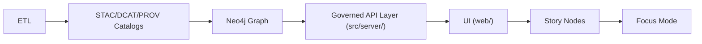

# 🌐 `web/src/services/api` — API Service Layer (Frontend)

[](#)
[](#)
[](#)
[](#)

> 🎯 **Goal:** Keep *all* frontend→backend requests centralized, typed, throttle-aware, and redaction-safe.  
> In KFM, the frontend lives in `web/` and is designed to rely on the governed API layer for all data access. [oai_citation:0‡MARKDOWN_GUIDE_v13.md.gdoc](file-service://file-UYVruFXfueR8veHMUKeugU) [oai_citation:1‡Kansas Frontier Matrix (KFM) – Comprehensive Technical Documentation & Markdown Guide.gdoc](file-service://file-XGC3Vf2AfbA2JWvTvmHNGF)

---

## 🧭 KFM data-flow context (why this folder exists)

KFM enforces a strict, non-negotiable pipeline ordering:



This ordering (and the related invariants) are core to v13 governance. [oai_citation:2‡MARKDOWN_GUIDE_v13.md.gdoc](file-service://file-UYVruFXfueR8veHMUKeugU) [oai_citation:3‡MARKDOWN_GUIDE_v13.md.gdoc](file-service://file-UYVruFXfueR8veHMUKeugU)

✅ **Key boundary rule:** The UI **must never** query Neo4j directly — all access goes through the governed API layer (`src/server/`). [oai_citation:4‡MARKDOWN_GUIDE_v13.md.gdoc](file-service://file-UYVruFXfueR8veHMUKeugU)

---

## 🧱 What lives in this folder

This folder is the **frontend API client + endpoint wrappers** used by React features/components.

KFM’s frontend structure explicitly calls out a `services/` layer used for API calls, e.g. an `apiClient.js` setting up `axios`, plus “functions to fetch specific data”, and recommends using TypeScript for stronger reliability. [oai_citation:5‡Kansas Frontier Matrix (KFM) – Comprehensive Technical Documentation & Markdown Guide.gdoc](file-service://file-XGC3Vf2AfbA2JWvTvmHNGF)

### ✅ Responsibilities ✅

- 🔌 **Centralize** HTTP concerns (base URL, headers, auth token, timeouts, retries)
- 🧾 **Type** request/response shapes (TypeScript) [oai_citation:6‡Kansas Frontier Matrix (KFM) – Comprehensive Technical Documentation & Markdown Guide.gdoc](file-service://file-XGC3Vf2AfbA2JWvTvmHNGF)
- 🔐 **Attach JWT** bearer tokens to requests [oai_citation:7‡Kansas Frontier Matrix (KFM) – Comprehensive Technical Documentation & Markdown Guide.gdoc](file-service://file-XGC3Vf2AfbA2JWvTvmHNGF)
- 🧯 **Handle** common error classes (401/403/429/5xx) with consistent UX behavior
- 🧊 **Throttle** high-frequency requests (timeline scrubbing, tile loads) [oai_citation:8‡Kansas Frontier Matrix (KFM) – Comprehensive Technical Documentation & Markdown Guide.gdoc](file-service://file-XGC3Vf2AfbA2JWvTvmHNGF)
- 🧭 **Respect redaction & sovereignty rules** (never act as a side-channel) [oai_citation:9‡MARKDOWN_GUIDE_v13.md.gdoc](file-service://file-UYVruFXfueR8veHMUKeugU) [oai_citation:10‡MARKDOWN_GUIDE_v13.md.gdoc](file-service://file-UYVruFXfueR8veHMUKeugU)

---

## 📁 Suggested folder layout

> 🧩 This is a **recommended** organization that matches the “services for API calls” intent in the KFM docs, while keeping modules clean and scalable. [oai_citation:11‡Kansas Frontier Matrix (KFM) – Comprehensive Technical Documentation & Markdown Guide.gdoc](file-service://file-XGC3Vf2AfbA2JWvTvmHNGF)

```text
web/src/services/api/
├── 📄 README.md
├── 📄 apiClient.ts              # axios/fetch wrapper + interceptors
├── 📁 endpoints/
│   ├── 📄 auth.ts               # login/refresh/logout helpers
│   ├── 📄 fields.ts             # field-specific data (timeseries, metadata)
│   ├── 📄 maps.ts               # map layers, tiles, legends, bbox queries
│   ├── 📄 simulation.ts         # long-running jobs: start + status polling
│   ├── 📄 catalog.ts            # STAC/DCAT/PROV discovery surfaces (if exposed)
│   └── 📄 index.ts              # barrel exports
├── 📁 types/
│   ├── 📄 api.ts                # shared API types
│   └── 📄 geo.ts                # GeoJSON + geometry helpers/types
└── 📁 __tests__/
   └── 📄 endpoints.test.ts
```

---

## 🔒 Authentication model (JWT) 🪪

KFM uses token-based authentication (JWT) for session management. The frontend stores the token (memory or storage depending on security posture) and sends it via headers (e.g., `Authorization: Bearer <token>`). [oai_citation:12‡Kansas Frontier Matrix (KFM) – Comprehensive Technical Documentation & Markdown Guide.gdoc](file-service://file-XGC3Vf2AfbA2JWvTvmHNGF) [oai_citation:13‡Kansas Frontier Matrix (KFM) – Comprehensive Technical Documentation & Markdown Guide.gdoc](file-service://file-XGC3Vf2AfbA2JWvTvmHNGF)

- JWTs are signed, expire (example: ~1 hour), and are kept alive via a refresh-token mechanism. [oai_citation:14‡Kansas Frontier Matrix (KFM) – Comprehensive Technical Documentation & Markdown Guide.gdoc](file-service://file-XGC3Vf2AfbA2JWvTvmHNGF)
- Backend enforces role-based authorization; unauthorized access returns `403 Forbidden` (example in docs: field ownership checks). [oai_citation:15‡Kansas Frontier Matrix (KFM) – Comprehensive Technical Documentation & Markdown Guide.gdoc](file-service://file-XGC3Vf2AfbA2JWvTvmHNGF) [oai_citation:16‡Kansas Frontier Matrix (KFM) – Comprehensive Technical Documentation & Markdown Guide.gdoc](file-service://file-XGC3Vf2AfbA2JWvTvmHNGF)

### 🔁 Recommended token flow
1. `POST /api/auth/login` → receive `{ accessToken, refreshToken }`
2. All requests attach `Authorization: Bearer <accessToken>`
3. On `401`, attempt refresh (`/api/auth/refresh`) then retry once
4. On refresh failure → force logout and clear session

> ⚠️ Keep refresh tokens guarded. If using browser storage, document the threat model clearly.

---

## 🧠 API contract discipline (don’t break clients)

Backend APIs are governed by a contract (OpenAPI / GraphQL). Contract changes must be tested and APIs remain backwards-compatible unless a version bump is declared. [oai_citation:17‡MARKDOWN_GUIDE_v13.md.gdoc](file-service://file-UYVruFXfueR8veHMUKeugU) [oai_citation:18‡MARKDOWN_GUIDE_v13.md.gdoc](file-service://file-UYVruFXfueR8veHMUKeugU)

**Frontend implication:**  
When you add/change an endpoint wrapper here, align it to the backend contract *first*.

---

## 🧪 Core patterns

### 1) `apiClient` (axios-style) — one place for HTTP rules

```ts
// apiClient.ts (illustrative)
import axios from "axios";

export const api = axios.create({
  baseURL: "/api", // prefer env-driven override in real builds
  timeout: 30_000,
});

api.interceptors.request.use((config) => {
  const token = getAccessTokenSomehow(); // from auth store/context
  if (token) config.headers.Authorization = `Bearer ${token}`;
  return config;
});

api.interceptors.response.use(
  (r) => r,
  async (err) => {
    // Map status codes into predictable app errors
    // Optionally: refresh token on 401 once
    throw err;
  }
);
```

**Why:** KFM expects centralized API call handling (services layer) and consistent auth headers for requests. [oai_citation:19‡Kansas Frontier Matrix (KFM) – Comprehensive Technical Documentation & Markdown Guide.gdoc](file-service://file-XGC3Vf2AfbA2JWvTvmHNGF) [oai_citation:20‡Kansas Frontier Matrix (KFM) – Comprehensive Technical Documentation & Markdown Guide.gdoc](file-service://file-XGC3Vf2AfbA2JWvTvmHNGF)

---

### 2) Field time series (example endpoint wrapper)

KFM provides example endpoints like:

- `GET /api/fields/{id}/timeseries?variable=NDVI` (query relational tables like `field_health_index`). [oai_citation:21‡Kansas Frontier Matrix (KFM) – Comprehensive Technical Documentation & Markdown Guide.gdoc](file-service://file-XGC3Vf2AfbA2JWvTvmHNGF)

```ts
// endpoints/fields.ts (illustrative)
import { api } from "../apiClient";

export type TimeseriesPoint = { date: string; value: number };

export async function getFieldTimeseries(
  fieldId: string,
  variable: string // prefer a union type derived from contract
): Promise<TimeseriesPoint[]> {
  const { data } = await api.get(`/fields/${fieldId}/timeseries`, {
    params: { variable },
  });
  return data;
}
```

---

### 3) Map layer retrieval (tiles vs vectors)

Docs include map-serving examples like:

- `GET /api/map/ndvi/{date}` returning either tile templates or simplified vector outputs depending on serving approach. [oai_citation:22‡Kansas Frontier Matrix (KFM) – Comprehensive Technical Documentation & Markdown Guide.gdoc](file-service://file-XGC3Vf2AfbA2JWvTvmHNGF)

```ts
// endpoints/maps.ts (illustrative)
import { api } from "../apiClient";

export type TileTemplate = { urlTemplate: string };

export async function getNdviMap(dateISO: string): Promise<TileTemplate> {
  const { data } = await api.get(`/map/ndvi/${dateISO}`);
  return data;
}
```

> 🧯 **Redaction rule reminder:** The UI must cause **no data leakage** and must respect redaction (including “no map zoom that bypasses” rules). [oai_citation:23‡MARKDOWN_GUIDE_v13.md.gdoc](file-service://file-UYVruFXfueR8veHMUKeugU)

---

### 4) Polygon analysis (drawn AOI ➜ backend stats)

KFM describes workflows where users draw polygons and the frontend sends polygon coordinates to an API endpoint for spatial queries/aggregation. [oai_citation:24‡Kansas Frontier Matrix (KFM) – Comprehensive Technical Documentation & Markdown Guide.gdoc](file-service://file-XGC3Vf2AfbA2JWvTvmHNGF) [oai_citation:25‡Kansas Frontier Matrix (KFM) – Comprehensive Technical Documentation & Markdown Guide.gdoc](file-service://file-XGC3Vf2AfbA2JWvTvmHNGF)

```ts
// endpoints/maps.ts (illustrative)
import { api } from "../apiClient";

// Keep geometry typing strict (GeoJSON Polygon / MultiPolygon)
export async function getPolygonStats(geojsonPolygon: unknown) {
  const { data } = await api.post(`/analysis/polygon-stats`, {
    geometry: geojsonPolygon,
  });
  return data;
}
```

---

### 5) Long-running simulations (start ➜ status)

Example user actions include:

- `POST /api/simulation/run` to start a scenario; backend may return a job ID and the frontend can poll or receive push updates. [oai_citation:26‡Kansas Frontier Matrix (KFM) – Comprehensive Technical Documentation & Markdown Guide.gdoc](file-service://file-XGC3Vf2AfbA2JWvTvmHNGF)

```ts
// endpoints/simulation.ts (illustrative)
import { api } from "../apiClient";

export async function startSimulation(payload: Record<string, unknown>) {
  const { data } = await api.post(`/simulation/run`, payload);
  return data as { jobId: string };
}

export async function getSimulationStatus(jobId: string) {
  const { data } = await api.get(`/simulation/status/${jobId}`);
  return data;
}
```

---

## ⚡ Performance: throttling + burst control

The docs explicitly warn about frequent request patterns (tile imagery, timeline scrubbing) and recommend throttling so the backend isn’t hammered by tiny UI changes. [oai_citation:27‡Kansas Frontier Matrix (KFM) – Comprehensive Technical Documentation & Markdown Guide.gdoc](file-service://file-XGC3Vf2AfbA2JWvTvmHNGF)

✅ Rules of thumb:
- 🧽 **Debounce** slider scrubbing (`200–400ms` is a good starting range)
- 🗺️ Let your map library handle tile concurrency; avoid custom “tile fetch loops”
- 🧊 Cache stable queries (e.g., “field metadata”, “layer registry”) at the state layer

---

## 📡 Real-time updates (WebSockets / SSE)

KFM supports push updates for sensor streams and long-running job progress, using WebSockets (or SSE). Clients subscribe on app load (after login) and update UI state on events. [oai_citation:28‡Kansas Frontier Matrix (KFM) – Comprehensive Technical Documentation & Markdown Guide.gdoc](file-service://file-XGC3Vf2AfbA2JWvTvmHNGF) [oai_citation:29‡Kansas Frontier Matrix (KFM) – Comprehensive Technical Documentation & Markdown Guide.gdoc](file-service://file-XGC3Vf2AfbA2JWvTvmHNGF)

> 💡 Keep WebSocket concerns separate from REST wrappers — but still treat them as part of “services”.

---

## 🧯 Errors & permissions (what your wrappers should normalize)

Backend authorization examples include:
- `403 Forbidden` for role/ownership violations when accessing protected field resources. [oai_citation:30‡Kansas Frontier Matrix (KFM) – Comprehensive Technical Documentation & Markdown Guide.gdoc](file-service://file-XGC3Vf2AfbA2JWvTvmHNGF)

Recommended normalization in the API layer:
- `401` → session expired → refresh (once) → else logout
- `403` → show “permission denied” UI state (no retry loop)
- `429` → backoff (especially for timeline/map requests)
- `5xx` → user-visible toast + diagnostics log

---

## 📦 Data formats you should expect

KFM outputs are primarily JSON, but can include:
- CSV exports (e.g., `/api/export/fielddata.csv`)
- GeoJSON (for geospatial interoperability)
- Binary imagery/tiles (for map visualization) [oai_citation:31‡Kansas Frontier Matrix (KFM) – Comprehensive Technical Documentation & Markdown Guide.gdoc](file-service://file-XGC3Vf2AfbA2JWvTvmHNGF)

---

## ✅ Contribution checklist (when adding a new endpoint wrapper)

- [ ] 🧾 **Confirm contract** (OpenAPI/GraphQL) and update types
- [ ] 🧱 Place wrapper in the correct module (`fields.ts`, `maps.ts`, etc.)
- [ ] 🔐 Ensure auth header is applied (if endpoint requires it)
- [ ] 🧯 Ensure redaction + sovereignty constraints are not bypassed
- [ ] ⚡ Add throttling strategy if endpoint is called in tight UI loops [oai_citation:32‡Kansas Frontier Matrix (KFM) – Comprehensive Technical Documentation & Markdown Guide.gdoc](file-service://file-XGC3Vf2AfbA2JWvTvmHNGF)
- [ ] 🧪 Add/extend tests

---

## 📚 Source anchors (project docs)

- Frontend structure includes `services/` for API calls; `apiClient.js` sets up axios; TypeScript encouraged. [oai_citation:33‡Kansas Frontier Matrix (KFM) – Comprehensive Technical Documentation & Markdown Guide.gdoc](file-service://file-XGC3Vf2AfbA2JWvTvmHNGF)
- Frontend-backend interaction: AJAX requests (fetch/axios), token headers, throttling guidance, and WebSockets integration patterns. [oai_citation:34‡Kansas Frontier Matrix (KFM) – Comprehensive Technical Documentation & Markdown Guide.gdoc](file-service://file-XGC3Vf2AfbA2JWvTvmHNGF)
- KFM v13 pipeline ordering + API boundary rule (UI must not query Neo4j directly). [oai_citation:35‡MARKDOWN_GUIDE_v13.md.gdoc](file-service://file-UYVruFXfueR8veHMUKeugU)
- Contract invariants: API backwards-compatibility + contract tests; UI must prevent data leakage and respect redaction rules. [oai_citation:36‡MARKDOWN_GUIDE_v13.md.gdoc](file-service://file-UYVruFXfueR8veHMUKeugU)
- Example API endpoints (time series + NDVI map serving + simulation runs). [oai_citation:37‡Kansas Frontier Matrix (KFM) – Comprehensive Technical Documentation & Markdown Guide.gdoc](file-service://file-XGC3Vf2AfbA2JWvTvmHNGF) [oai_citation:38‡Kansas Frontier Matrix (KFM) – Comprehensive Technical Documentation & Markdown Guide.gdoc](file-service://file-XGC3Vf2AfbA2JWvTvmHNGF) [oai_citation:39‡Kansas Frontier Matrix (KFM) – Comprehensive Technical Documentation & Markdown Guide.gdoc](file-service://file-XGC3Vf2AfbA2JWvTvmHNGF)