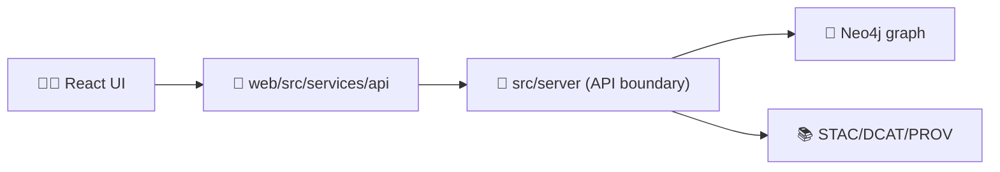

# 🧪 API Service Tests (`web/src/services/api/__tests__`)


> 🎯 This folder is the “tripwire” for API changes: **request shape**, **response parsing**, **error handling**, and **redaction / no-leakage** invariants.

---

## 🧭 What belongs here

This directory contains **unit + contract-style tests** for the **frontend API service layer** (`web/src/services/api`).  
In KFM, the UI should not scatter fetch logic—**API calls should funnel through this service layer**.

✅ Add tests here when you:
- add or change a **service function** (e.g., `get*`, `list*`, `search*`)
- change **request construction** (path params, query params, headers)
- change **response parsing / typing** (renames, new fields, optional fields)
- add **error normalization** (HTTP/network → app errors)
- introduce or modify **redaction / classification** behavior (sensitive fields)

🚫 Don’t put here:
- 🧩 **React component tests** (use React Testing Library near components/features)
- 🌐 **E2E flows** (Cypress/Selenium lives elsewhere)
- 🛠️ **Server endpoint tests** (those belong in backend test locations)

---

## 🧱 Why these tests matter (KFM rules-of-the-road)

KFM is **contract-first** and enforces a strict **API boundary**:

- **Server contracts** (OpenAPI / GraphQL schema) are the source of truth ✅  
- The **frontend must never query the graph directly** ❌  
- The UI must not introduce **data leakage**, and must respect **redaction rules** 🔒  

These tests help us detect contract drift early—before a UI regression becomes a production incident.

---

## 🔗 Quick links (relative to this folder)

- 📘 `../../../../../docs/MASTER_GUIDE_v13.md` — architecture invariants & canonical homes
- 🔌 `../../../../../src/server/contracts/` — OpenAPI / GraphQL contracts (server-side)
- 🧩 `../` — the API service implementation (client-side)

---

## 📁 Typical layout

> This is an **example** layout (the exact filenames may differ), but the intent is consistent.

```text
📁 web/
  📁 src/
    📁 services/
      📁 api/
        📁 __tests__/
          📄 README.md                👈 you are here
          📁 fixtures/                🧩 stable mocked payloads (no real data)
          📄 apiClient.test.ts        🔧 axios instance/interceptors behavior
          📄 fields.contract.test.ts  📜 endpoint “known inputs → expected shape”
          📄 errors.test.ts           🚦 error mapping + retry logic
        📄 apiClient.ts               🔌 axios setup (baseURL, headers, interceptors)
        📄 index.ts                   🧭 public exports for API services
        📁 endpoints/                 🧱 endpoint-specific modules
          📄 fields.ts
          📄 layers.ts

📁 src/
  📁 server/
    📁 contracts/                     📜 OpenAPI/GraphQL definitions (server truth)
      📄 openapi.yaml
      📄 schema.graphql
```

---

## ▶️ Running these tests

Because scripts vary by repo setup, **use the runner defined in `web/package.json`**.

```bash
cd web
npm test
```

Run only this folder (common Jest patterns):

```bash
# option A: run all tests under this path
npm test -- --runTestsByPath src/services/api/__tests__

# option B: filter by name (handy for a single endpoint)
npm test -- --testNamePattern="getField"
```

> 💡 If your project uses `yarn`, `pnpm`, `vitest`, or a custom script, use the equivalent command from `web/package.json`.

---

## 🧪 Test types we keep here

### 1) 🔧 Client wiring tests (apiClient)
Focus: base URL, headers, auth token attachment, interceptors, retry rules.

**Examples**
- attaches `Authorization` header (when available)
- maps 401/403 into a consistent auth error
- does **not** log/emit sensitive payloads

### 2) 📜 Contract-style endpoint tests
Focus: “given known input, the response shape matches what the UI expects” and stays compatible.

**Examples**
- `getField(id)` returns `{ id, name, ... }` with correct types
- optional fields remain optional (no hard failures when missing)
- new fields don’t break old consumers

### 3) 🔒 Redaction / no-leak invariants
Focus: UI must not bypass governance by reconstructing or inferring restricted data.

**Examples**
- a “redacted” response must not be expanded client-side
- restricted coordinates/identifiers remain absent or generalized
- tests assert **absence** of forbidden fields

---

## 🧩 Fixture hygiene rules

Fixtures are part of our “mini-contract snapshots,” so keep them clean:

- ✅ **Synthetic** data only (no real farms, people, or coordinates)
- ✅ Prefer **small** fixtures (minimum fields needed for the test)
- ✅ Include **redacted variants** when the endpoint supports access control
- ✅ Keep naming obvious: `field.summary.redacted.json`, `field.summary.full.json`

---

## 🧰 Example: contract-style test skeleton (Jest + axios)

<details>
<summary>📄 Click to expand example</summary>

```ts
/**
 * Template only — adapt module/function names to the repo.
 */
import { apiClient } from '../apiClient';
import { getThing } from '../endpoints/getThing';

describe('getThing (contract)', () => {
  it('returns the expected shape and respects redaction invariants', async () => {
    // Arrange: mock the axios client boundary (do NOT hit real network)
    jest.spyOn(apiClient, 'get').mockResolvedValue({
      status: 200,
      data: {
        id: 'thing_123',
        name: 'Synthetic Example',
        // NOTE: do not include sensitive fields in fixtures
      },
    } as any);

    // Act
    const result = await getThing('thing_123');

    // Assert: shape
    expect(result).toEqual(
      expect.objectContaining({
        id: expect.any(String),
        name: expect.any(String),
      }),
    );

    // Assert: redaction invariant (example)
    expect((result as any).rawLocation).toBeUndefined();
  });
});
```

</details>

---

## ✅ “I changed an endpoint” checklist

Use this before you open a PR:

- [ ] Update the **server contract** (`src/server/contracts/...`) if the API shape changed
- [ ] If the change is breaking: introduce a **versioned path** / deprecation strategy (don’t silently break clients)
- [ ] Update the **client service** (`web/src/services/api/...`)
- [ ] Add/update tests in `web/src/services/api/__tests__/`
- [ ] Add/update fixtures (synthetic + redaction-aware)
- [ ] Confirm **no-leak / redaction** rules are still respected

---

## 🗺️ Quick mental model (data flow)



---

## 🧯 Troubleshooting

<details>
<summary>Common pitfalls</summary>

- **Tests hit the network**: mock the transport boundary (axios instance / fetch wrapper).
- **Flaky time-dependent logic**: freeze time (`jest.useFakeTimers()` / `setSystemTime`) if your code uses dates.
- **Brittle deep-equality**: prefer `expect.objectContaining(...)` and invariant checks.
- **Sensitive fixture creep**: keep fixtures synthetic; remove anything that resembles real data.

</details>