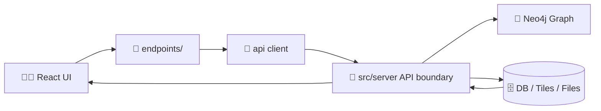

# 🌐 `web/src/services/api/endpoints/` — Frontend Endpoint Registry


This folder is the **single place** the web app defines **how it talks to the backend**: URL paths, query params, request bodies, and typed response wrappers (as applicable). It exists to keep the UI consistent with KFM’s **contract-first** approach where API contracts are treated as first-class artifacts and changes trigger versioning/compatibility checks.  [oai_citation:0‡MARKDOWN_GUIDE_v13.md.gdoc](file-service://file-UYVruFXfueR8veHMUKeugU)

---

## 🎯 Why this folder exists

KFM’s pipeline is strict: **ETL → Catalogs (STAC/DCAT/PROV) → Graph → API → UI → Story Nodes → Focus Mode**. The frontend sits *after* the API boundary and must not bypass it.  [oai_citation:1‡MARKDOWN_GUIDE_v13.md.gdoc](file-service://file-UYVruFXfueR8veHMUKeugU)

In practice:

- ✅ The UI fetches **time-series** like NDVI per field via API endpoints (e.g., `/api/field/{field_id}/timeseries?...`).  [oai_citation:2‡Kansas Frontier Matrix (KFM) – Comprehensive Technical Documentation & Markdown Guide.gdoc](file-service://file-XGC3Vf2AfbA2JWvTvmHNGF)  
- ✅ The UI sends **AOI polygons** to compute stats (mean soil moisture, drought index, etc.) via a governed endpoint.  [oai_citation:3‡Kansas Frontier Matrix (KFM) – Comprehensive Technical Documentation & Markdown Guide.gdoc](file-service://file-XGC3Vf2AfbA2JWvTvmHNGF)  
- ✅ The UI triggers **simulations** that return a **job ID** for polling status.  [oai_citation:4‡Kansas Frontier Matrix (KFM) – Comprehensive Technical Documentation & Markdown Guide.gdoc](file-service://file-XGC3Vf2AfbA2JWvTvmHNGF)  
- ✅ Map layers often resolve to **tile URLs** (potentially via a rendering service).  [oai_citation:5‡Kansas Frontier Matrix (KFM) – Comprehensive Technical Documentation & Markdown Guide.gdoc](file-service://file-XGC3Vf2AfbA2JWvTvmHNGF)  

---

## 🧭 Golden rules (non-negotiable)

### 1) 🚫 No direct graph / DB access from the UI
“All data access goes through the governed API layer (`src/server/`)” — this is how access control, redaction, and schema consistency are enforced.  [oai_citation:6‡MARKDOWN_GUIDE_v13.md.gdoc](file-service://file-UYVruFXfueR8veHMUKeugU)

### 2) 🧾 The OpenAPI / GraphQL schema is the contract
KFM expects contract tests and explicit versioning for breaking changes; frontend endpoint definitions should track those contracts closely.  [oai_citation:7‡MARKDOWN_GUIDE_v13.md.gdoc](file-service://file-UYVruFXfueR8veHMUKeugU)  [oai_citation:8‡MARKDOWN_GUIDE_v13.md.gdoc](file-service://file-UYVruFXfueR8veHMUKeugU)

### 3) 🛡️ Sovereignty + classification propagate end-to-end
No output may be “less restricted” than inputs; UI must respect redactions and safeguards (e.g., generalized sensitive locations).  [oai_citation:9‡MARKDOWN_GUIDE_v13.md.gdoc](file-service://file-UYVruFXfueR8veHMUKeugU)

---

## 🗂️ What belongs here (and what doesn’t)

✅ **Belongs here**
- Endpoint path builders (e.g., `/api/fields/:id/timeseries`)
- Typed request/response definitions (if not generated elsewhere)
- Query param helpers (pagination, date ranges, variable enums)
- “Endpoint families” grouped by domain (fields, layers/tiles, analysis, simulation, search, data admin)

🚫 **Does NOT belong here**
- React hooks/components
- State management
- Hard-coded fetches in UI components
- Data files / fixtures / “secret” URLs or tokens (CI scans for secrets & sensitive data).  [oai_citation:10‡MARKDOWN_GUIDE_v13.md.gdoc](file-service://file-UYVruFXfueR8veHMUKeugU)

---

## 🧩 Suggested folder shape (example)

> This is the intended organization style; adapt to what exists in `web/src/services/api/`.

```text
web/src/services/api/
├── client/                      # fetch/axios wrapper, auth headers, retries
├── endpoints/                   # 👈 you are here
│   ├── README.md
│   ├── index.ts                 # barrel export
│   ├── fields.ts                # /api/field/... (timeseries, metadata)
│   ├── layers.ts                # tile URLs, layer catalogs
│   ├── analysis.ts              # AOI polygon stats, compare areas
│   ├── simulation.ts            # /api/simulation/run, status polling
│   ├── search.ts                # place/feature search (gazetteer)
│   └── admin.ts                 # uploads, retrain triggers (secured)
└── types/                       # shared API types (if not generated)
```

---

## 🗺️ “How it flows” (frontend viewpoint)



KFM explicitly defines `src/server/` as the canonical home for API code, with the frontend (`web/`) consuming it rather than creating parallel “shadow” data access paths.  [oai_citation:11‡MARKDOWN_GUIDE_v13.md.gdoc](file-service://file-UYVruFXfueR8veHMUKeugU)

---

## 🧱 Endpoint patterns we support in KFM

### 1) Field time-series (charts + map selection)
Example described in KFM docs:  
- `GET /api/field/{field_id}/timeseries?var=ndvi` → NDVI time series for a field.  [oai_citation:12‡Kansas Frontier Matrix (KFM) – Comprehensive Technical Documentation & Markdown Guide.gdoc](file-service://file-XGC3Vf2AfbA2JWvTvmHNGF)

### 2) AOI (polygon) aggregation
Users draw a polygon and the UI sends coordinates to an endpoint that runs spatial queries and returns summary stats.  [oai_citation:13‡Kansas Frontier Matrix (KFM) – Comprehensive Technical Documentation & Markdown Guide.gdoc](file-service://file-XGC3Vf2AfbA2JWvTvmHNGF)

### 3) Timeline-driven layers (tiles)
Time slider updates map layers by requesting tiles or layer URLs keyed by date.  [oai_citation:14‡Kansas Frontier Matrix (KFM) – Comprehensive Technical Documentation & Markdown Guide.gdoc](file-service://file-XGC3Vf2AfbA2JWvTvmHNGF)

### 4) Long-running simulations / jobs
`POST /api/simulation/run` starts work; API returns a job ID for polling.  [oai_citation:15‡Kansas Frontier Matrix (KFM) – Comprehensive Technical Documentation & Markdown Guide.gdoc](file-service://file-XGC3Vf2AfbA2JWvTvmHNGF)

### 5) Admin/data operations (secured)
`POST /api/data/upload` and other restricted endpoints exist for dataset updates or retraining triggers.  [oai_citation:16‡Kansas Frontier Matrix (KFM) – Comprehensive Technical Documentation & Markdown Guide.gdoc](file-service://file-XGC3Vf2AfbA2JWvTvmHNGF)

---

## 🧪 Adding or changing an endpoint (workflow)

1) **Update the backend contract** (OpenAPI/GraphQL) and ensure it stays compatible, or introduce a versioned path for breaking changes.  [oai_citation:17‡MARKDOWN_GUIDE_v13.md.gdoc](file-service://file-UYVruFXfueR8veHMUKeugU)  
2) Use the governed template for documenting API changes: `docs/templates/TEMPLATE__API_CONTRACT_EXTENSION.md`.  [oai_citation:18‡MARKDOWN_GUIDE_v13.md.gdoc](file-service://file-UYVruFXfueR8veHMUKeugU)  
3) Add/update the client definition here (`endpoints/`) so the UI uses the contract consistently.  
4) Add/adjust **contract tests** (CI runs endpoint contract tests and blocks merges if they fail).  [oai_citation:19‡MARKDOWN_GUIDE_v13.md.gdoc](file-service://file-UYVruFXfueR8veHMUKeugU)  
5) Confirm the UI change **does not leak sensitive data** and respects redaction/sovereignty rules.  [oai_citation:20‡MARKDOWN_GUIDE_v13.md.gdoc](file-service://file-UYVruFXfueR8veHMUKeugU)  [oai_citation:21‡MARKDOWN_GUIDE_v13.md.gdoc](file-service://file-UYVruFXfueR8veHMUKeugU)  

---

## 🧰 Example snippets (TypeScript)

> These are illustrative patterns (not tied to any single client library).

### Timeseries endpoint builder
```ts
export const fieldTimeseries = (fieldId: string) =>
  `/api/field/${encodeURIComponent(fieldId)}/timeseries`;
```

### AOI stats endpoint builder
```ts
export const aoiStats = () => `/api/analysis/aoi/stats`;
```

### Simulation run endpoint builder
```ts
export const simulationRun = () => `/api/simulation/run`;
export const simulationStatus = (jobId: string) =>
  `/api/simulation/status/${encodeURIComponent(jobId)}`;
```

---

## 🔭 Reference library (useful context)

KFM integrates remote sensing heavily; if you’re working on endpoints that proxy or summarize EO workflows, this Earth Engine reference is useful background reading.  [oai_citation:22‡Cloud-Based Remote Sensing with Google Earth Engine-Fundamentals and Applications.pdf](file-service://file-CXGLTw8wpR4uKWWqjrGkyk)  [oai_citation:23‡Cloud-Based Remote Sensing with Google Earth Engine-Fundamentals and Applications.pdf](file-service://file-CXGLTw8wpR4uKWWqjrGkyk)

---

## ✅ Quick checklist before you PR

- [ ] Endpoint path and params match the OpenAPI/GraphQL contract (or are versioned properly).  [oai_citation:24‡MARKDOWN_GUIDE_v13.md.gdoc](file-service://file-UYVruFXfueR8veHMUKeugU)  
- [ ] No component uses a raw URL string when an endpoint helper exists.
- [ ] Request/response shapes are typed (or safely validated) and errors are handled.
- [ ] Nothing in UI bypasses API boundary (no direct graph/DB access).  [oai_citation:25‡MARKDOWN_GUIDE_v13.md.gdoc](file-service://file-UYVruFXfueR8veHMUKeugU)  
- [ ] Sensitive outputs are redacted/generalized as required (sovereignty).  [oai_citation:26‡MARKDOWN_GUIDE_v13.md.gdoc](file-service://file-UYVruFXfueR8veHMUKeugU)  
- [ ] CI contract tests remain green.  [oai_citation:27‡MARKDOWN_GUIDE_v13.md.gdoc](file-service://file-UYVruFXfueR8veHMUKeugU)  