# 🧩 API Types (`web/src/services/api/types`)


> **Purpose:** This folder contains the **TypeScript types that describe the shapes of data crossing the Web UI ↔ API boundary**.  
> Think of it as the frontend’s “contract mirror” for **request params**, **responses**, **errors**, and **shared payload primitives**.

---

## 🧭 What lives here?

This folder is for **type-only** artifacts used by the API client + API service functions, for example:

- ✅ **Request types** (`*Request`, `*Params`, `*Query`)
- ✅ **Response types** (`*Response`, `*Result`, `Paginated<T>`)
- ✅ **Error types** (`ApiError`, `ApiProblemDetails`, etc.)
- ✅ **Cross-cutting payloads** (pagination, sorting, filters, IDs, timestamps)
- ✅ **KFM data shapes** the UI consumes (examples: catalogs like STAC/DCAT/PROV, graph query results, map-layer payloads, story/focus bundles)

> **Not** for UI component props (those belong in feature folders), and **not** for runtime logic.

---

## 🗺️ How this fits the KFM pipeline

```mermaid
flowchart LR
  UI["🖥️ web/ (React UI)"] -->|typed requests| API["🔌 services/api (apiClient + endpoint wrappers)"]
  API -->|HTTP| SERVER["🧱 src/server (API boundary + redaction)"]
  SERVER --> CATALOGS["📦 STAC / DCAT / PROV catalogs"]
  SERVER --> GRAPH["🕸️ Graph (Neo4j)"]
  SERVER --> OTHER["🧰 Other governed services"]
```



**Mental model:**  
- The **server is the gate** (redaction/classification, compatibility, contracts).  
- The UI should be a **typed consumer** of what the server returns—nothing else.

---

## ✅ Folder boundaries (Do / Don’t)

| ✅ Do | ❌ Don’t |
|---|---|
| Keep this folder **types-only** | Put `axios`/`fetch` calls here |
| Model types based on the **API contract** | Model types based on “what the UI wishes existed” |
| Export types from a central `index.ts` | Create deep import paths across the app |
| Prefer stable, versionable shapes | Bake UI component concerns into API types |
| Treat API payloads as **untrusted input** (types ≠ validation) | Assume TypeScript types validate runtime data |

---

## 📦 Recommended structure

> This is a **suggested** layout — adapt it to match what’s currently in the repo.

```text
web/
└─ src/
   └─ services/
      └─ api/
         ├─ apiClient.ts            # axios instance / base config (or apiClient.js)
         ├─ endpoints/              # per-endpoint functions (getX, postY, ...)
         └─ types/
            ├─ README.md            # you are here 📍
            ├─ index.ts             # re-export hub ✅
            ├─ common.ts            # ids, pagination, timestamps, etc.
            ├─ errors.ts            # ApiError, error envelopes
            ├─ geo.ts               # GeoJSON-ish primitives, bbox, coords
            ├─ catalogs/            # STAC/DCAT/PROV shapes the UI consumes
            │  ├─ stac.ts
            │  ├─ dcat.ts
            │  └─ prov.ts
            ├─ graph.ts             # graph query result shapes
            └─ story.ts             # story nodes / focus context bundle shapes
```

---

## 🧱 Core conventions

### Naming

- **Types / interfaces:** `PascalCase`
- **Payload fields:** `camelCase` (unless the API returns `snake_case` — if so, model the API honestly and map it elsewhere)
- **Endpoint contracts:**
  - `GetLayersParams`, `GetLayersResponse`
  - `CreateStoryNodeRequest`, `CreateStoryNodeResponse`
- **Shared wrappers:**
  - `ApiResponse<T>`
  - `Paginated<T>`
  - `ApiResult<T>`

### “Types are contracts” (not suggestions)

- If the API returns `null`, type it as `null`.
- If a field is optional, make it optional (and document why).
- If a property is conditionally present, model it explicitly with unions.

### Re-exports

Keep an `index.ts` that re-exports the public surface area so imports stay clean:

```ts
// ✅ good
import type { ApiError, Paginated, StacItem } from '@/services/api/types';

// ❌ avoid
import type { StacItem } from '@/services/api/types/catalogs/stac';
```

---

## 🧪 Types vs runtime validation (important)

TypeScript helps us **at compile time**, but API responses are still **runtime data**.

**Recommended pattern:**

- `types/` → compile-time contracts
- `schemas/` (optional) → runtime validation (e.g., zod/io-ts) for critical payloads
- `mappers/` (optional) → normalization / transforms (`snake_case` → `camelCase`, etc.)

> If you add runtime validation, keep it **out of** this folder unless you create a clearly named subfolder like `types/schemas/` and keep it side-effect-free.

---

## 🔌 Usage examples

### Example: typed GET

```ts
import { apiClient } from '../apiClient';
import type { GetSomethingResponse } from '../types';

export async function getSomething(id: string): Promise<GetSomethingResponse> {
  const { data } = await apiClient.get<GetSomethingResponse>(`/something/${id}`);
  return data;
}
```

### Example: typed POST with request body + response

```ts
import { apiClient } from '../apiClient';
import type { CreateThingRequest, CreateThingResponse } from '../types';

export async function createThing(payload: CreateThingRequest): Promise<CreateThingResponse> {
  const { data } = await apiClient.post<CreateThingResponse>('/things', payload);
  return data;
}
```

### Example: paginated response wrapper

```ts
export type Paginated<T> = {
  items: T[];
  page: number;
  pageSize: number;
  totalItems: number;
  totalPages: number;
};
```

---

## ➕ Adding a new API type (workflow)

1. **Start with the backend contract**
   - Update the OpenAPI spec / GraphQL schema (wherever the server declares contracts).
2. **Define the UI-facing payload shape**
   - Add or update the TS types in this folder.
3. **Wire it into the endpoint wrapper**
   - Use the types in your `services/api/endpoints/*` function.
4. **Re-export**
   - Add exports to `types/index.ts`.
5. **Prove it**
   - Ensure contract tests / integration tests pass (and add coverage if this is a new endpoint).

---

## 🧰 PR checklist (copy/paste)

- [ ] Types added/updated in `web/src/services/api/types`
- [ ] `index.ts` exports updated (no deep-importing needed)
- [ ] Endpoint wrapper uses types (`apiClient.get<T>()`, etc.)
- [ ] Backwards-compat considered (no breaking change without version bump)
- [ ] Error shape handled (typed errors or a consistent envelope)
- [ ] UI respects redaction/classification behavior (no bypass paths)

---

## 🧠 FAQ

<details>
  <summary><strong>Why not import backend models directly?</strong></summary>

Because the UI should not couple to internal server implementation details. The server is the boundary, and the UI should reflect **what the API returns**, not what the DB model happens to look like today.
</details>

<details>
  <summary><strong>Where do UI-only types go?</strong></summary>

In feature folders, e.g. `web/src/features/map/types.ts`, or alongside the component that owns them. This folder is for **API boundary** types only.
</details>

<details>
  <summary><strong>What about “snake_case vs camelCase”?</strong></summary>

Prefer one of these two patterns:

1) **Model the API exactly** (snake_case) and map it at the boundary, or  
2) **Have the API return camelCase** and keep frontend types camelCase.

Avoid half-and-half because it multiplies confusion.
</details>

---

## 🔗 Related docs (repo-relative)

- `docs/MASTER_GUIDE_v13.md` 📘
- `docs/templates/TEMPLATE__API_CONTRACT_EXTENSION.md` 🧾
- `docs/standards/KFM_MARKDOWN_WORK_PROTOCOL.md` 📝
- `schemas/` (STAC/DCAT/PROV/story/ui/telemetry) 🧬

---

## 🏁 Summary

If it crosses **HTTP** and enters the UI, it should have a home in `types/`.  
Keep this folder **boringly consistent**: stable names, clean exports, and contracts that match reality. ✅