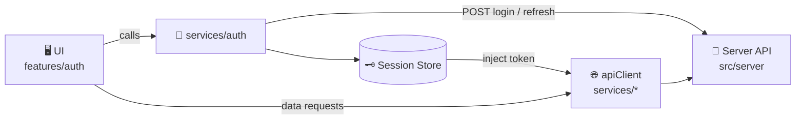
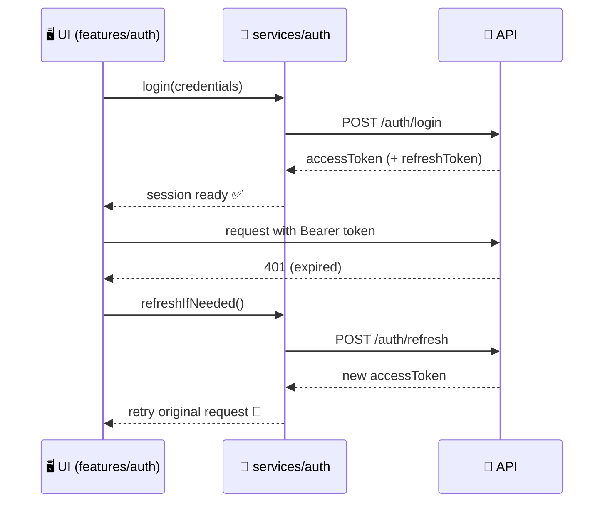

# 🔐 Auth Service (`web/src/services/auth`)


> 🧭 **Mission:** keep **authentication + session lifecycle** out of UI components by centralizing it here — so `features/*` can focus on UX, not token plumbing.

---

## 📚 Contents

- [🎯 Responsibilities](#-responsibilities)
- [🧱 Where this fits in KFM](#-where-this-fits-in-kfm)
- [🗂️ Folder map](#️-folder-map)
- [🔑 Auth lifecycle](#-auth-lifecycle)
- [🧠 Token storage strategy](#-token-storage-strategy)
- [🧰 Usage patterns](#-usage-patterns)
- [🧪 Testing](#-testing)
- [🛡️ Security checklist](#️-security-checklist)
- [🧯 Troubleshooting](#-troubleshooting)
- [🔗 Related modules](#-related-modules)

---

## 🎯 Responsibilities

✅ This folder is responsible for:

- 🔑 **Login / logout** (and any “who am I?” session hydration)
- 🧾 **Token lifecycle**: access token expiry + refresh flow
- 🧰 **Request authorization**: ensuring API calls include `Authorization: Bearer <token>`
- 🧯 **401 handling**: one refresh attempt, then fail safely and trigger logout/reauth
- 🧩 **A clean interface** for UI state containers (e.g., `features/auth` context)

🚫 This folder should **not**:

- Render UI (no React components here)
- Contain domain logic (fields, layers, story nodes, etc.)
- Talk directly to databases/graph — **everything goes through the API boundary**

> [!IMPORTANT]
> **Contract-first rule:** if auth endpoints change, update the API contracts first (server), then update this service to match.

---

## 🧱 Where this fits in KFM

**KFM UI flow (auth-focused):**



---

## 🗂️ Folder map

> ⚠️ File names may vary — this map describes the **intended responsibilities**. Align names to whatever exists in the repo.

```text
📦 web/
 └─ 📁 src/
    └─ 📁 services/
       ├─ 🌐 apiClient.(ts|js)        # shared HTTP client (axios/fetch wrapper)
       └─ 📁 auth/
          ├─ 📄 README.md             # ← you are here
          ├─ 🧩 index.(ts|js)         # public exports
          ├─ 🔑 authService.(ts|js)   # login/logout/refresh/session APIs
          ├─ 🧠 tokenStore.(ts|js)    # storage + retrieval (memory/localStorage/etc.)
          ├─ 🧷 types.(ts)            # AuthSession, UserClaims, etc.
          ├─ 🧯 errors.(ts|js)        # normalized auth errors
          └─ 🧪 __tests__/            # unit tests (tokenStore, refresh, etc.)
```

---

## 🔑 Auth lifecycle

Typical KFM browser session:

1. 🟢 **App boot**
   - Try to **hydrate session** (read stored token, validate format/expiry)
2. 🔐 **Login**
   - Send credentials → receive **access token** (JWT) + optional **refresh token**
3. 🧾 **Authenticated calls**
   - All API calls attach `Authorization: Bearer <accessToken>`
4. ⏳ **Token expiry**
   - On 401/expired token: attempt **one refresh**
5. 🔁 **Refresh**
   - If refresh succeeds: update session + retry the original request
   - If refresh fails: clear session + route to login
6. 🚪 **Logout**
   - Clear tokens locally (+ optionally tell server to revoke refresh token)



---

## 🧠 Token storage strategy

KFM guidance describes storing auth tokens **in-memory** or **localStorage** depending on security needs. This service should support either approach via a small `tokenStore` abstraction.

### Recommended default ✅
- **Access token:** in-memory (clears on tab close; reduces XSS blast radius)
- **Refresh token:** prefer **httpOnly cookie** (if server supports it), otherwise secure storage with strict XSS protections

### If you must persist tokens ⚠️
If the product requires “stay signed in” behavior:
- Store minimal session data
- Avoid storing refresh tokens in `localStorage` unless absolutely necessary
- Add defenses: CSP, strict escaping, dependency auditing, and no token logging

> [!TIP]
> Treat “token persistence” as a **deliberate product/security decision**, not a convenience default.

---

## 🧰 Usage patterns

### 1) Minimal: login + attach token to API client

```ts
// features/auth/AuthProvider.tsx (example)
import { auth } from "../../services/auth";
import { apiClient } from "../../services/apiClient";

async function handleLogin(email: string, password: string) {
  const session = await auth.login({ email, password });

  // Option A: apiClient reads token on each request from tokenStore
  // Option B: set token on apiClient once (less ideal if multiple tabs)
  apiClient.setAuthToken?.(session.accessToken);
}
```

### 2) Centralized refresh-on-401 (recommended)

Implement refresh in **one place** (usually `apiClient`), but driven by auth service:

```ts
// services/apiClient.ts (example sketch)
import { auth } from "./auth";

apiClient.onUnauthorized(async () => {
  // single-flight refresh: only one refresh in-flight at a time
  await auth.refresh();
});
```

### 3) UI session hydration (app boot)

```ts
// App boot
import { auth } from "./services/auth";

await auth.hydrate(); // reads stored token, validates/decodes, sets memory state
```

<details>
  <summary>🧩 Suggested public API surface</summary>

Keep the exported surface small and opinionated:

- `login(credentials) -> AuthSession`
- `logout()`
- `hydrate()`
- `getAccessToken()`
- `isAuthenticated()`
- `refresh()`
- `onAuthStateChanged(listener)` (optional)

</details>

---

## 🧪 Testing

Suggested unit test coverage ✅

- `tokenStore`
  - set/get/clear behavior
  - persistence mode toggles
- `authService`
  - login success/fail normalization
  - refresh success/fail + session cleanup
  - “single-flight” refresh (no parallel refresh storms)
- `apiClient integration`
  - adds auth header when token exists
  - retries once after refresh on 401

> [!NOTE]
> For tests, mock the HTTP layer (`fetch`/`axios`) and time (`Date.now()` / fake timers) to verify expiry behavior deterministically.

---

## 🛡️ Security checklist

Use this before merging changes touching auth:

- [ ] 🔒 **Never log tokens** (console logs, analytics, error reporting)
- [ ] 🧼 Clear session data on logout and on refresh failure
- [ ] 🧯 Refresh is **single-flight** (avoid 10 parallel refresh calls)
- [ ] ⛔ Only **one retry** after refresh; prevent infinite loops
- [ ] 🧾 Ensure all requests use `Authorization: Bearer …` via a single mechanism
- [ ] 🧪 Add/adjust tests for new auth flows
- [ ] 🧩 Contract-first: API contract & server behavior updated before client changes

---

## 🧯 Troubleshooting

### “401 loop” / infinite refresh 🔁
- Confirm refresh is attempted **once**, then session is cleared
- Ensure retry logic doesn’t re-trigger the same 401 handler repeatedly

### “User appears logged in, but API says unauthorized”
- Token might be expired and refresh failing silently
- Make sure the UI listens for auth state changes and redirects to login on logout

### “Works locally, fails in prod”
- Check base URL / environment config (`API_BASE_URL`, `VITE_*`, etc.)
- Confirm HTTPS and cookie flags (if cookie refresh is used)

---

## 🔗 Related modules

- 🖥️ UI auth feature: `../../features/auth/` (login form, auth context)
- 🌐 HTTP client: `../apiClient` (axios/fetch wrapper)
- 🧰 API contracts (server): `../../../../src/server/contracts/` (or equivalent)

---

### ✍️ Conventions (quick)
- Keep auth logic deterministic, side-effect-light, and testable
- Prefer TypeScript types at the boundary (`AuthSession`, `UserClaims`, `AuthError`)
- When in doubt: **fail closed** (logout + reauth) rather than leaving a “half-auth” state