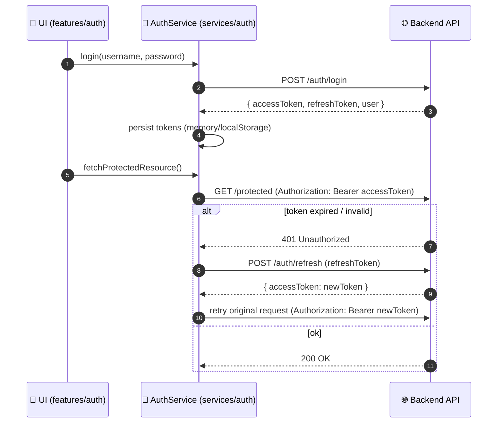

# 🔐 Auth Service Tests (`web/src/services/auth/__tests__`)


> 🧠 **Goal:** keep authentication logic **boring, deterministic, and safe**.  
> These tests protect the app’s login/session behavior (JWT + refresh token patterns) and ensure authenticated API calls send the correct headers.

---

## 📍 Quick links

- [⚡ Quick start](#-quick-start)
- [🗂️ What lives here](#️-what-lives-here)
- [✅ What we cover](#-what-we-cover)
- [🔄 Auth flow under test](#-auth-flow-under-test)
- [🧰 Mocking & fixtures](#-mocking--fixtures)
- [🧱 Adding/changing auth endpoints](#-addingchanging-auth-endpoints)
- [🧯 Troubleshooting](#-troubleshooting)
- [🔒 Security reminders](#-security-reminders)

---

## ⚡ Quick start

From the repo root:

```bash
# 1) go to the web app
cd web

# 2) run the full web test suite (recommended before PR)
npm run test
```

Run only auth-service tests (choose what matches your runner/setup):

```bash
# Option A: pass a path filter to the test runner via npm
npm run test -- src/services/auth

# Option B (Jest-style): use a testPathPattern
npm run test -- --testPathPattern=src/services/auth

# Option C: run a single file (adjust filename to what exists)
npm run test -- --testPathPattern=auth
```

> ✅ If this repo uses `pnpm` or `yarn`, swap `npm` with your package manager.

---

## 🗂️ What lives here

Typical layout (exact filenames may differ):

```text
📁 web/
  📁 src/
    📁 services/
      📁 auth/
        📁 __tests__/
          📄 README.md              👈 you are here
          📄 *.test.ts / *.spec.ts  ✅ service-level tests
          📁 fixtures/              🧪 stable fake users/tokens
          📁 mocks/                 🎭 storage + network helpers
          📁 helpers/               🛠️ builders + utilities
```

**Scope note:** UI/login component tests belong near `web/src/features/auth/…`.  
This folder focuses on the **service layer**: API calls + token handling + header injection.

---

## ✅ What we cover

Use this as a checklist when adding or refactoring auth logic:

### 🔑 Session + tokens

- [ ] Login returns expected user/session payload
- [ ] Access token is persisted (memory and/or `localStorage` depending on implementation)
- [ ] Refresh token flow (when access token is expired/invalid)
- [ ] Logout clears persisted auth state and prevents stale headers
- [ ] Token expiry logic is time-safe (no flaky tests)

### 🧾 Request auth headers

- [ ] Requests include `Authorization: Bearer <accessToken>`
- [ ] Requests **do not** include `Authorization` when unauthenticated
- [ ] 401/403 handling produces predictable errors (mapped to UI-friendly messages)

### 🧯 Error handling (edge cases)

- [ ] Invalid credentials / 400 responses
- [ ] Network failures / timeouts
- [ ] “Token exists but malformed” scenarios (bad JWT shape)
- [ ] “Refresh fails” behavior (forces logout or surfaces a hard error)

---

## 🔄 Auth flow under test



---

## 🧰 Mocking & fixtures

### 🎭 1) Network mocking

**Rule:** service tests should be **hermetic** (no real backend calls).

Pick the approach that matches the repo:

- ✅ **MSW** (preferred when available) → mock endpoints as “fake server”
- ✅ Mock `fetch` or mock your `apiClient` (axios instance) → fast unit tests

<details>
<summary><strong>MSW example (Node test runner)</strong> 📡</summary>

```ts
// server.ts (example)
// import { setupServer } from 'msw/node'
// import { http, HttpResponse } from 'msw'

// export const server = setupServer(
//   http.post('/auth/login', async () => HttpResponse.json({
//     accessToken: 'FAKE.ACCESS.TOKEN',
//     refreshToken: 'FAKE.REFRESH.TOKEN',
//     user: { id: 'test-user', roles: ['user'] },
//   })),
// )

// beforeAll(() => server.listen())
// afterEach(() => server.resetHandlers())
// afterAll(() => server.close())
```

</details>

<details>
<summary><strong>Fetch mock example</strong> 🌊</summary>

```ts
beforeEach(() => {
  global.fetch = vi.fn(); // or jest.fn()
});

afterEach(() => {
  vi.restoreAllMocks();   // or jest.restoreAllMocks()
});
```

</details>

---

### 🧠 2) Time control (token expiry)

If your AuthService evaluates expiry timestamps, **freeze time** so tests don’t become flaky.

<details>
<summary><strong>Jest fake timers example</strong> ⏱️</summary>

```ts
beforeEach(() => {
  jest.useFakeTimers();
  jest.setSystemTime(new Date('2030-01-01T00:00:00Z'));
});

afterEach(() => {
  jest.useRealTimers();
});
```

</details>

---

### 🗄️ 3) Storage mocking (`localStorage` / `sessionStorage`)

If tests run in `jsdom`, storage usually exists — but *don’t rely on it being clean*.

**Always** reset storage between tests:

```ts
afterEach(() => {
  localStorage.clear();
  sessionStorage.clear();
});
```

If your tests run in a non-DOM environment, provide a storage shim in test setup.

---

### 🧾 4) Token fixtures (JWT-shaped, not real)

Auth in KFM uses JWT-shaped tokens (three dot-separated parts). In tests:

✅ do: **use obvious fakes**  
❌ don’t: paste real tokens, secrets, or user credentials

<details>
<summary><strong>Minimal “JWT-shaped” token generator</strong> 🧪</summary>

```ts
// NOTE: Not a real signed JWT — shape-only for tests.
export const makeJwtLike = (payload: Record<string, unknown>) => {
  const header = { alg: 'none', typ: 'JWT' };

  const b64url = (obj: unknown) =>
    Buffer.from(JSON.stringify(obj))
      .toString('base64')
      .replace(/=/g, '')
      .replace(/\+/g, '-')
      .replace(/\//g, '_');

  return `${b64url(header)}.${b64url(payload)}.`; // empty "signature"
};
```

</details>

---

## 🧱 Adding/changing auth endpoints

When you add a new auth endpoint or modify payload shapes:

1. ✅ Update the service function in `web/src/services/auth/…`
2. ✅ Add/update a fixture representing the **server response shape**
3. ✅ Update mocks (MSW handler / fetch mock / axios mock)
4. ✅ Add tests for:
   - happy path
   - error path
   - token/header side effects (if any)
5. ✅ Run the full web test suite (`cd web && npm run test`)

---

## 🧯 Troubleshooting

### “`localStorage` is not defined”
- Ensure your test environment is `jsdom`, **or**
- Add a storage shim in global test setup.

### Tests are flaky around expiry
- Freeze time (`useFakeTimers` + `setSystemTime`)
- Avoid using real `Date.now()` without controlling the clock

### “Headers aren’t being set in the mock”
- If you’re mocking the API client, verify you’re testing the **real AuthService wrapper**, not a double-mocked version
- In MSW, inspect `request.headers.get('authorization')` to assert header behavior

---

## 🔒 Security reminders

- 🚫 Never commit real tokens, passwords, API keys, or personal emails into fixtures.
- ✅ Prefer `test-user`, `fake@example.com`, and `FAKE.*.TOKEN` strings.
- 🔍 Assume CI will run secret/PII scanning — keep fixtures obviously synthetic.

---