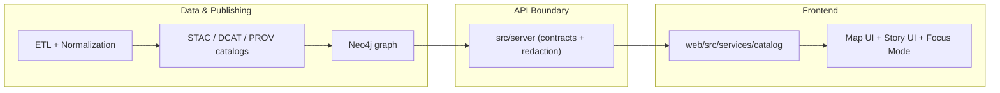

<!--
File: web/src/services/catalog/README.md
Purpose: Frontend catalog client for KFM (STAC + DCAT + PROV)
-->

# 🗂️ Catalog Service (Frontend)


> The **catalog service** is the frontend’s **single, typed entrypoint** for reading the Kansas Frontier Matrix (KFM) catalogs: **STAC** (assets), **DCAT** (dataset discovery), and **PROV** (lineage).  
> It powers dataset discovery, layer metadata, evidence panels, and “what am I looking at?” UI surfaces — without bypassing governance.

---

## 🧠 Why this exists

KFM is *contract-first* and *evidence-first*: the UI should display only what is returned by the governed API layer, and everything shown should be traceable back to cataloged evidence.

This folder exists to:

- ✅ Keep **catalog logic centralized** (one place to fetch + normalize metadata).
- ✅ Make it easy for UI features (Map / Story / Focus Mode) to **request metadata consistently**.
- ✅ Enforce frontend-safe invariants: **no direct graph access**, **no hidden data files**, **no provenance bypass**.

---

## 🧭 Where it sits in the system



---

## ✅ Responsibilities

The catalog service should be responsible for:

- **Dataset discovery**
  - list/search datasets (keywords, tags, bbox, time range)
  - provide “summary cards” (title, description, temporal/spatial coverage, license)
- **Metadata lookup**
  - resolve a dataset/layer into: STAC + DCAT + PROV pointers
  - fetch structured metadata for tooltips, legends, and evidence panels
- **Normalization**
  - map heterogeneous shapes into a small set of **UI-friendly types**
  - keep “raw catalog JSON” available for deep inspection/debugging
- **Policy-aware rendering support**
  - propagate classification flags (e.g., “sensitive location” / redactions)
  - provide safe “display geometry” (generalized/blurred if required)

---

## 🚫 Non-goals

- ❌ Implementing business rules that belong to **`src/server/`** (redaction, authorization, filtering).
- ❌ Bypassing API contracts by reading files directly from `data/…`.
- ❌ Storing canonical metadata state in the browser (cache is fine; “source of truth” is not).

---

## 🌐 The “catalog triad” (STAC + DCAT + PROV)

KFM treats catalogs as **boundary artifacts** that make downstream features safe and repeatable.

| Standard | What it represents | Typical UI use |
|---|---|---|
| **STAC** | Assets (rasters, vectors, imagery, features) with spatial/temporal indexing | Map layers, footprints, asset previews, spatial filters |
| **DCAT** | Dataset discovery entry (title, license, keywords, distributions) | Dataset browsing, search results, “About this dataset” panels |
| **PROV** | Lineage (inputs → processing → outputs) and agents | Evidence / traceability views, “how was this made?” panels |

### 🧩 Suggested unified view (UI-friendly)

The UI almost never wants *only* STAC or *only* DCAT. It wants a **merged “dataset view”**:

- `id` (stable dataset identifier)
- `title`, `description`
- `license`, `keywords/tags`
- `spatial` (bbox/geometry *as display-safe*)
- `temporal` (start/end, granularity)
- `distributions` (download links, API endpoints, STAC item refs)
- `provenance` (run id, inputs, methods, agents, timestamps)
- `classification` (sensitivity flags, redaction notes)

> Keep the raw records available too: `raw.stac`, `raw.dcat`, `raw.prov` — this helps debugging and audit UX.

---

## 🔒 API boundary rule (frontend hard constraint)

The frontend **must not** query the graph directly. All reads happen through server APIs that enforce:

- schema/contract consistency
- redaction & classification
- governance rules

✅ In practice: the catalog service should be built as a **thin client** over **contracted endpoints**, not as an ad-hoc fetch layer.

---

## 📁 Suggested module layout

> If the folder already has a different layout, keep the same separation of concerns: **transport** vs **domain adapters** vs **types**.

```text
📁 web/src/services/catalog/
├── 📄 README.md               👈 you are here
├── 📄 index.ts                # public exports
├── 📄 client.ts               # low-level HTTP client (fetch wrapper, baseUrl, headers)
├── 📄 types.ts                # UI-friendly TS types (DatasetSummary, DatasetDetail, etc.)
├── 📄 stac.ts                 # STAC adapter helpers (Collections/Items → UI)
├── 📄 dcat.ts                 # DCAT adapter helpers (Dataset JSON-LD → UI)
├── 📄 prov.ts                 # PROV adapter helpers (Lineage bundle → UI)
├── 📄 normalize.ts            # merge + normalize across STAC/DCAT/PROV
└── 📁 __tests__/              # unit tests for adapters + normalization
```

---

## 🧪 Usage patterns

### 1) Dataset discovery (list/search)

- used by: dataset browser, layer picker, search UI

```ts
// PSEUDOCODE (shape may differ — follow src/server/contracts/)
const results = await catalog.listDatasets({
  q: "treaty",
  bbox: [-102, 36.9, -94.6, 40.1],
  datetime: "1850-01-01/1900-12-31",
});

results.items.map(ds => ({
  id: ds.id,
  title: ds.title,
  license: ds.license,
}));
```

### 2) Layer metadata (tooltip / legend / “info” panel)

- used by: map overlay toggles, legends, “data source” popups

```ts
const meta = await catalog.getDatasetDetail("kfm.dataset.land-treaties.v1");

showInfoPanel({
  title: meta.title,
  source: meta.distributions,
  lineage: meta.provenance?.summary,
});
```

### 3) Evidence + provenance (Focus Mode / context panels)

- used by: Focus Mode evidence panels, story-linked entity context

```ts
const prov = await catalog.getProvenance("kfm.dataset.land-treaties.v1");
renderLineage(prov);
```

---

## 🧯 Errors & resilience

Recommended behavior:

- Normalize server failures into a small set of typed errors:
  - `NetworkError`
  - `NotFoundError`
  - `ContractMismatchError` (schema drift / unexpected response)
  - `PolicyBlockedError` (redaction/classification gate)
- Always support `AbortController` for UI navigation (avoid setting state after unmount).
- Prefer **fail-closed** for sensitive metadata:
  - if classification is unknown → do not show precise location

---

## ⚡ Caching & performance

Typical wins:

- **ETag / If-None-Match** support (when server provides it)
- in-memory request de-dupe (avoid duplicate calls on same route)
- “summary first, details on demand”
- keep cache keys tied to **dataset id + version** (avoid mixing releases)

> Avoid caching anything that could circumvent redaction (cache should store already-redacted server responses only).

---

## 🛡️ Governance & safety invariants (FAIR + CARE)

This service is a key enforcement point in the frontend. It should uphold:

- ✅ **Provenance-first UX**: provide data needed to cite sources in UI panels.
- ✅ **No sensitive location leaks**: respect classification flags; show generalized geometry when required.
- ✅ **No unsourced content surfaces**: UI features should not invent metadata; only render what’s in catalogs.
- ✅ **Propagation of restrictions**: derived artifacts should never be less restricted than inputs.

---

## ➕ Adding a new dataset or UI layer (developer checklist)

### A) New dataset / domain (pipeline → catalogs)
- [ ] Data exists under `data/raw/<domain>/` → `data/work/<domain>/` → `data/processed/<domain>/`
- [ ] Dataset publishes metadata to:
  - [ ] `data/stac/collections/` + `data/stac/items/`
  - [ ] `data/catalog/dcat/`
  - [ ] `data/prov/`
- [ ] CI validates schemas and provenance completeness

### D) New API endpoint (contracts first)
- [ ] Update `src/server/contracts/…` (OpenAPI/GraphQL/etc.)
- [ ] Implement in `src/server/…`
- [ ] Add tests + redaction rules as needed

### E) New UI layer / feature (provenance-linked)
- [ ] Layer has a stable dataset id
- [ ] Layer’s info popup/legend cites catalog metadata
- [ ] Sensitive geometry cannot be reconstructed client-side
- [ ] Catalog service exposes a clean helper for the feature (no copy-pasted fetches)

---

## 🧰 Testing recommendations

- Unit tests for:
  - STAC adapter → UI types
  - DCAT adapter → UI types
  - PROV adapter → UI types
  - merge/normalize behavior and edge cases
- Contract drift tests (optional but powerful):
  - validate example responses from `src/server/contracts/` against parsing logic
- UI integration:
  - mock catalog endpoints (MSW or equivalent) and verify panels render correctly

---

## 🧩 Troubleshooting

**“Dataset shows up in DCAT search but has no map layer”**
- Check STAC Item(s) exist and include assets with correct media types / hrefs.
- Verify the UI layer registry references the correct dataset id.

**“Map shows layer but info panel has missing license/source”**
- DCAT entry likely missing required fields or distributions.
- Ensure normalization merges DCAT fields into the unified view.

**“Focus Mode leaks precise location for a sensitive story”**
- Classification flags not propagated or ignored.
- Ensure catalog service returns a display-safe geometry and UI uses it by default.

---

## 📚 Related docs (project source of truth)

- `docs/MASTER_GUIDE_v13.md` (pipeline ordering, invariants, directory layout)
- `docs/standards/KFM_STAC_PROFILE.md`
- `docs/standards/KFM_DCAT_PROFILE.md`
- `docs/standards/KFM_PROV_PROFILE.md`
- `docs/templates/TEMPLATE__API_CONTRACT_EXTENSION.md`
- `docs/governance/*` (FAIR+CARE, sovereignty, ethics)

---

## ✅ Definition of Done (changes in this folder)

- [ ] No new ad-hoc fetch logic in random components — usage goes through this service
- [ ] Types + normalization updated (and documented if behavior changes)
- [ ] Tests updated/added
- [ ] Any API shape change is reflected in `src/server/contracts/` first