# 🧪 Catalog Service — Test Suite

| Field | Value |
|---|---|
| 📍 Location | `web/src/services/catalog/__tests__/` |
| 🎯 Goal | Keep the **Catalog client** contract-safe, provenance-safe, and sovereignty-safe before data hits the UI |
| 🧱 Guardrails | Contract-first • API-boundary-only • Provenance-first • Redaction & classification propagation |


---

## 🧭 Why this folder exists

The Catalog service is the **front door** for metadata that becomes:

- 🗺️ map layers (MapLibre/React UI)
- 📚 dataset listings / search results
- 🧾 provenance & attribution panels
- 🛡️ redaction cues (what must be blurred/generalized/withheld)

So if the Catalog service regresses, the UI can accidentally:
- display content without provenance,
- bypass contract expectations,
- or surface sensitive locations/details.

This test suite is the **early warning system**.

---

## 🗺️ Where this fits in the KFM pipeline

KFM’s canonical pipeline is strict: data becomes **catalog artifacts first**, then flows through **graph → API → UI**.

```mermaid
flowchart LR
  subgraph Data["📦 Data"]
    A["Raw Sources"] --> B["ETL + Normalization"]
    B --> C["STAC Items + Collections"]
    C --> D["DCAT Dataset Views"]
    C --> E["PROV Lineage Bundles"]
  end

  C --> G["Neo4j Graph (references back to catalogs)"]
  G --> H["API Layer (contracts + redaction)"]
  H --> I["🌐 Web UI — React · MapLibre"]
  I --> J["📖 Story Nodes"]
  J --> K["🎯 Focus Mode"]
```



### ✅ What that means for *web catalog tests*
- The **web UI must consume catalog data via the API layer**, not via direct graph access.
- Every dataset shown should be **provenance-linked** (STAC/DCAT + PROV where applicable).
- Sensitive content must propagate **classification + redaction requirements** all the way to UI behaviors.

---

## 📦 What belongs in `__tests__` (and what doesn’t)

### ✅ Belongs here
- **Unit tests** for pure transforms (mappers, normalizers, sorters)
- **Contract-ish tests** validating:
  - expected response shapes
  - schema compatibility (when schemas are available locally)
  - “required fields” presence (IDs, provenance references, attribution, etc.)
- **Integration tests** with **mocked network** (no live calls)

### 🚫 Does *not* belong here
- End-to-end UI tests (those should live with UI e2e tooling)
- Server/API tests (those belong under `src/server/...` test locations)
- Anything that requires Neo4j, live STAC endpoints, or external internet access

---

## 🗂️ Suggested folder layout

> Your repo may differ — this is the intended *shape* for maintainability.

```text
📁 web/src/services/catalog/__tests__/
├── 📄 README.md
├── 📁 fixtures/
│   ├── 🧾 stac.collection.sample.json
│   ├── 🧾 stac.item.sample.json
│   ├── 🧾 dcat.dataset.sample.json
│   ├── 🧾 prov.bundle.sample.json
│   └── 🧾 restricted.dataset.sample.json
├── 🧪 catalog.mapper.test.ts
├── 🧪 catalog.client.test.ts
├── 🧪 catalog.redaction.test.ts
└── 🧪 catalog.contract.test.ts
```

---

## 🧫 Test types & what to assert

### 1) 🧩 Unit tests (fast, pure)
Use these for:
- mapping raw JSON → internal UI models
- sorting and filtering behavior
- computed fields (derived bbox, normalized date ranges, etc.)

**Assert:**
- deterministic outputs (same input → same output)
- stable ordering (explicit sort keys)
- graceful handling of missing optional fields

---

### 2) 📜 Contract tests (shape + invariants)
Use these when:
- the API response shape changes,
- schema/profile requirements update,
- you add a new catalog-backed UI feature.

**Assert:**
- required fields exist (`id`, `title/name`, `links`, provenance pointers)
- unknown/extra fields do not break mapping
- breaking changes cause clear failures

> If you have local schemas under `schemas/`, wire tests to validate fixtures against them.

---

### 3) 🌐 Integration tests (mocked fetch)
Use these to ensure the Catalog service:
- calls the correct endpoint(s)
- handles pagination/search params
- retries / errors / empty responses correctly
- respects caching rules (if any)

**Rule:** no network. Ever. Mock it.

---

## 🛡️ Provenance & sovereignty checks (non-negotiable)

When tests cover features that affect UI-visible datasets/layers, they should enforce:

### ✅ Provenance-first
A dataset should not be surfaced as “publishable to UI” if it cannot be traced back to catalog artifacts (STAC/DCAT) and lineage (PROV) where applicable.

Practical assertions you can encode:
- every catalog entity shown includes a stable identifier
- the model includes fields the UI can use for “source / license / attribution”
- missing provenance → filtered out or marked invalid (depending on product rules)

### ✅ Classification + redaction propagation
If a fixture is marked restricted/sensitive:
- output must be **at least as restricted** as the input fixture
- UI cues must be present (flags/labels) so the UI can:
  - blur/generalize sensitive geometry
  - hide precise coordinates
  - display a “redaction notice” (and trigger telemetry if implemented)

---

## ▶️ Running the tests

Because the exact runner can vary (Jest/Vitest/etc.), use the scripts defined in `web/package.json`.

Typical patterns:

```bash
# from repo root
cd web

# run all web tests
npm test

# run only catalog-related tests (example patterns)
npm test -- src/services/catalog
npm test -- catalog
```

If your project uses pnpm/yarn:

```bash
pnpm test
yarn test
```

> 🔁 If you update this README later: replace the examples above with the repo’s **actual** commands once confirmed.

---

## 🧱 Writing new tests (team conventions)

### ✅ Prefer table-driven tests
Keeps coverage wide without copy/paste.

```ts
// PSEUDO-EXAMPLE (adjust to your runner)
describe("catalog mapper", () => {
  it.each([
    ["normal dataset", normalFixture, expectedNormal],
    ["restricted dataset", restrictedFixture, expectedRestricted],
  ])("maps %s correctly", (_label, input, expected) => {
    expect(mapCatalogEntry(input)).toEqual(expected);
  });
});
```

### ✅ Keep fixtures small & synthetic
- Prefer “representative minimal JSON” over “real giant dumps”
- Never store secrets or sensitive raw coordinates in fixtures
- Add one **edge-case fixture** per feature:
  - missing optional fields
  - empty arrays
  - unexpected link relations
  - restricted classifications

---

## ✅ Definition of Done (for changes in this folder)

Before merging a change that touches the Catalog service:

- [ ] Unit tests cover mapping logic for the change
- [ ] At least one fixture represents the new/changed shape
- [ ] A “restricted/sensitive” scenario is tested if the feature could expose location/detail
- [ ] Contract tests fail loudly if the API shape breaks
- [ ] All tests are deterministic (no time/random/network)
- [ ] Any new UI-facing layer includes provenance hooks (attribution/source fields)

---

## 🧰 Troubleshooting

<details>
<summary><strong>Tests fail due to ordering</strong></summary>

Ensure mappings sort arrays explicitly (e.g., links, assets, keywords) before asserting equality.
</details>

<details>
<summary><strong>Fetch isn't defined / runtime mismatch</strong></summary>

If tests run in Node, you may need a fetch polyfill or to mock fetch at the test environment layer. Prefer mocking network at the boundary.
</details>

<details>
<summary><strong>Snapshots are too noisy</strong></summary>

Avoid snapshotting entire catalog objects unless they’re stable. Snapshot only the mapped UI model or a normalized subset.
</details>

---

## 🔗 Related docs (repo paths)

- 📘 Master Guide (pipeline + invariants): `docs/MASTER_GUIDE_v13.md`
- 🧾 Standards/profiles: `docs/standards/` (STAC/DCAT/PROV profiles)
- 🧱 Schemas: `schemas/` (STAC/DCAT/PROV/UI/telemetry)
- 🛡️ Governance: `docs/governance/` (ethics, sovereignty, review gates)

> Tip: if you’re adding a new UI layer fed by catalog data, treat the tests here like your “proof of safety” before the UI ships it. ✅