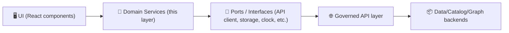

<!--
📄 Doc: Domain Service Test Runbook
📍 Path: web/src/services/domain/__tests__/README.md
🧭 Status: active
🔎 Last reviewed: 2026-01-05
-->

# 🧪 Domain Service Tests (`web/src/services/domain/__tests__`)


This folder contains **unit/contract-style tests** for the **domain service layer** in the KFM web app.

> ✅ If it’s *business logic* (rules, policy, mapping/normalization, “what should happen”), it belongs here.  
> ❌ If it’s *UI rendering* (React components) or *real network I/O*, it belongs elsewhere.

---

## 🎯 What we test here

### ✅ In-scope
- **Pure domain rules** (calculations, transforms, filtering, sorting, thresholds, aggregation)
- **Use-case orchestration logic** (domain “services” that coordinate smaller pure functions)
- **Input/output contracts** for domain services (types, invariants, edge-cases)
- **Determinism guarantees** (same input → same output)
- **Safety & governance behaviors** *at the domain boundary* (e.g., “don’t leak sensitive locations”, “preserve provenance fields”, “respect classification propagation”)

### 🚫 Out-of-scope
- React component behavior (that’s component testing)
- Real API calls / live servers / real graph access
- Browser-only behavior (that’s e2e)
- Large dataset validation (that’s pipeline/data validation)

---

## 🧱 Architectural intent (why these tests matter)

KFM follows a layered approach where **domain logic stays independent** from technical details. That separation is intentional because it makes domain logic:
- easier to reason about,
- easier to change safely,
- and **easy to test in isolation**. ✅

### 🗺️ Dependency flow (mental model)



**Rule of thumb:**  
Domain services may *call ports* (interfaces), but tests should **stub/fake those ports**.

---

## 🗂️ Suggested layout

> Your actual folder may differ — keep this as the default pattern.

```text
📁 web/
  📁 src/
    📁 services/
      📁 domain/
        📄 index.ts
        📄 <domainService>.ts
        📁 __tests__/
          📄 README.md  👈 you are here
          📄 <domainService>.spec.ts
          📁 fixtures/
            📄 <scenario>.json
          📁 factories/
            📄 make<Thing>.ts
          📁 fakes/
            📄 fake<ApiPort>.ts
```

---

## ▶️ Running the tests

Because this repo may be configured with different package managers, use the one already used by the project.

### Option A: run from repo root (common)
```bash
# run the full test suite
npm test

# or
yarn test

# or
pnpm test
```

### Option B: run from the `web/` workspace (common in monorepos)
```bash
cd web
npm test
```

### Running only domain tests (patterns)
```bash
# run tests in a folder (runner-dependent)
npm test -- domain/__tests__

# run one file (runner-dependent)
npm test -- <domainService>.spec.ts
```

> 🔎 If these flags don’t work, check the test runner’s docs or the repo’s root README/scripts.

---

## 🧪 Test design rules (non-negotiable)

### 1) ✅ Prefer contract-first tests
Treat each domain service like a contract:

- **Given** valid/invalid inputs  
- **When** the service runs  
- **Then** it returns *exactly* what the contract promises

**This keeps refactors safe** while still allowing internal implementation changes.

### 2) 🔁 Deterministic outputs
Domain services should produce stable outputs for a given input:
- Freeze time (inject a `clock` port instead of using `Date.now()` directly)
- Avoid randomness; if needed, inject a `rng` port and seed it in tests

### 3) 🔌 Stub the world (ports/adapters)
No network calls. No browser storage. No global mutable singletons.

Use fakes/stubs:
- `FakeApiClient`
- `FakeStorage`
- `FakeClock`

### 4) 🧾 Keep provenance and classification intact
If a domain service processes data that contains provenance/classification metadata:
- It must **not drop** that data unintentionally
- It must **not “downgrade”** restrictions (public output cannot be less restricted than inputs)

> 🧯 When in doubt: write a regression test that proves we don’t leak sensitive info.

---

## ✍️ Naming conventions

### Test file names
Pick one style and be consistent:
- `something.spec.ts`
- `something.test.ts`

### Test case names
Use behavior language:
- ✅ `it('returns empty collection when no layers are visible')`
- ✅ `it('preserves provenance references for derived layers')`
- ✅ `it('rejects invalid bounding boxes')`

---

## 🧩 Test templates

### ✅ Pure function test (fastest, best)
```ts
import { describe, it, expect } from "vitest"; // or jest globals

import { computeSomething } from "../computeSomething";

describe("computeSomething()", () => {
  it("handles the happy path", () => {
    const input = { /* ... */ };

    const result = computeSomething(input);

    expect(result).toEqual({ /* expected */ });
  });

  it("handles edge cases", () => {
    expect(computeSomething({ /* ... */ })).toEqual({ /* ... */ });
  });
});
```

### ✅ Domain service test with a fake port
```ts
import { describe, it, expect } from "vitest"; // or jest globals

import { buildTimeline } from "../buildTimeline";
import { makeFakeClock } from "./fakes/fakeClock";
import { makeFakeApiClient } from "./fakes/fakeApiClient";

describe("buildTimeline()", () => {
  it("is deterministic given the same inputs", async () => {
    const clock = makeFakeClock("2026-01-05T00:00:00Z");
    const api = makeFakeApiClient({
      // return stable fixtures
      stacItems: [/* ... */],
    });

    const out1 = await buildTimeline({ api, clock }, { /* params */ });
    const out2 = await buildTimeline({ api, clock }, { /* params */ });

    expect(out1).toEqual(out2);
  });
});
```

---

## 🧯 Common pitfalls (and how to avoid them)

<details>
  <summary>⚠️ “This test is flaky in CI”</summary>

- You’re probably depending on:
  - real time (`Date.now()`),
  - non-seeded randomness,
  - ordering from object iteration,
  - or unstable fixtures.

✅ Fix:
- inject a clock
- sort outputs explicitly (or assert as sets)
- use stable fixtures
</details>

<details>
  <summary>⚠️ “This is hard to test without mocking half the app”</summary>

That’s a design smell for domain services.

✅ Fix:
- split orchestration from pure transforms
- introduce a thin port interface (dependency injection)
- move IO-heavy behavior to adapters outside the domain layer
</details>

<details>
  <summary>⚠️ “Why is this test rendering React?”</summary>

If you’re rendering components, you’re no longer testing domain services.

✅ Fix:
- move UI tests to the component test suite
- keep domain tests pure and fast
</details>

---

## ✅ Definition of Done for domain-service changes

Use this checklist in PRs touching `web/src/services/domain/**`:

- [ ] Added/updated tests for new or changed behavior 🧪
- [ ] Tests cover at least: happy path + 2 edge cases (null/empty/invalid) 🧊
- [ ] No real network/IO used (ports are faked) 🔌
- [ ] Behavior is deterministic (seed/freeze time if needed) 🔁
- [ ] Contracts/invariants are explicitly asserted (types + runtime behavior) 📐
- [ ] No leakage of sensitive/classified info (add regression test if relevant) 🛡️
- [ ] CI should pass locally before pushing ✅

---

## 🔗 Related project docs (recommended reading)
- 📘 `docs/MASTER_GUIDE_v13.md` (repo-level invariants, contracts, CI gates)
- 🧭 `docs/architecture/` (system layering and boundaries)
- ⚖️ `docs/governance/ETHICS.md` + `docs/governance/SOVEREIGNTY.md` (safety constraints)

---

## 💬 When you’re unsure…
**Write the test first** as a *question the code must answer*:

> “Given X input, do we *always* do Y — and *never* do Z?”

Then implement the smallest change that makes the test pass. ✅