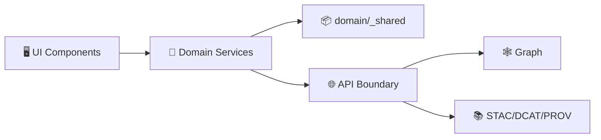

# 🧩 Domain Services — Shared Utilities (`_shared`)


> 📍 **Location:** `web/src/services/domain/_shared/`  
> 🎯 **Purpose:** Shared, cross-domain building blocks for **UI domain services** (fetching, validation, mapping, provenance, redaction, errors, caching helpers).  
> 🧠 **Big idea:** Keep domain service code **contract-first** + **provenance-first**, and keep UI access **strictly behind the API boundary**.

---

## 🧭 Why this folder exists

KFM’s architecture is intentionally layered and **API-boundary-first**: the frontend (`web/`) is the *presentation layer* and must **not** embed hidden datasets or bypass the server boundary. Domain services are the UI’s *use-case-ish* layer: they gather data from the API, validate it, map it into UI-friendly models, and attach provenance + safety metadata.

This `_shared/` directory exists to ensure every domain service:

- ✅ Fetches through consistent, testable primitives  
- ✅ Validates responses against contracts (runtime checks, not just TypeScript)  
- ✅ Returns UI-safe results with provenance + redaction context  
- ✅ Uses consistent error semantics and caching keys  
- ✅ Avoids copy/paste “one-off” implementations across domains

---

## 🧱 Non‑negotiable invariants (KFM rules) 🔒

These are the “don’t break the system” rules (see `docs/MASTER_GUIDE_v13.md`):

- 🚫 **No direct DB / graph queries from the UI.** The UI only speaks to the API boundary.
- 🧾 **Contract-first:** API responses are treated as contracts; validate and fail loudly on contract drift.
- 🧬 **Provenance-first:** anything displayed (maps, panels, Focus Mode, Story Nodes) must be traceable to evidence.
- 🕶️ **Redaction aware:** the UI must not “leak” restricted precision or sensitive attributes (including via zoom/precision tricks).
- ♿ **Accessibility + auditability:** interaction surfaces should remain accessible and measurable (telemetry hooks as needed).

> 💡 Rule of thumb: if a helper touches **provenance, redaction, or contracts**, it belongs in `_shared/` so every domain gets the same safety net.

---

## 🗂️ Suggested contents (what belongs here)

This folder should remain **domain-agnostic**. It’s shared plumbing for `web/src/services/domain/*`.

✅ **Good fits:**
- 🌐 **HTTP client wrappers** (base URL, headers, timeouts, retries, cancellation)
- 🧪 **Runtime validators** (schema parsing, safe decoding, contract guards)
- 🧭 **Query key builders** (stable cache keys across domains)
- 🧱 **Common domain models** (bbox/time window types, evidence/provenance types)
- 🧯 **Error normalization** (`ApiError`, `ContractError`, `RedactionError`)
- 🕵️ **Redaction helpers** (masking, “safe precision” formatting)
- 📡 **Telemetry shims** (optional; emitted events, not UI components)

🚫 **Not here:**
- 🧩 React components (no `MapView`, no panels, no hooks that require React)
- 🗺️ Map layer configs/registries (those live in the UI layer/config)
- 🧪 Domain-specific endpoints or domain-only mappers (belong in `domain/<x>/`)
- 📚 Story Node content (belongs in governed docs under `docs/...`)
- 🧠 Any “creative interpretation” of data (domain services return evidence, not narratives)

---

## 🧬 Dependency shape (keep it clean)

Keep dependencies pointing **inward** (clean architecture vibes):  
Domain-specific services can depend on `_shared`, but `_shared` must **not** depend on specific domains.



---

## 📁 Folder layout (recommended)

> This is a *pattern guide* — actual subfolders may evolve.

```text
📁 web/
 └── 📁 src/
     └── 📁 services/
         └── 📁 domain/
             ├── 📁 _shared/
             │   ├── 📁 http/              # fetch client, headers, retries, abort
             │   ├── 📁 contracts/         # runtime validators / decoders
             │   ├── 📁 errors/            # normalized error types
             │   ├── 📁 geo/               # bbox, coords, projections helpers
             │   ├── 📁 time/              # time ranges, parsing, formatting
             │   ├── 📁 evidence/          # provenance + evidence references
             │   ├── 📁 cache/             # query key helpers, cache policies
             │   ├── 📁 telemetry/         # event contracts (optional)
             │   ├── 📄 index.ts           # stable public exports
             │   └── 📄 README.md          # 👈 you are here
             └── 📁 <domain-name>/
                 ├── 📄 service.ts
                 ├── 📄 mappers.ts
                 └── 📄 contracts.ts
```

---

## 🧾 Core shared types (recommended)

These types are meant to standardize what domain services return, especially for map popups, evidence panels, and Focus Mode bundles.

### 🧷 Evidence + provenance

```ts
export type EvidenceKind =
  | "stac"     // catalog item/collection
  | "dcat"     // dataset metadata
  | "prov"     // pipeline/run provenance
  | "graph"    // graph entity id
  | "external" // archived doc, DOI, URL, etc.
  ;

export interface EvidenceRef {
  kind: EvidenceKind;
  id: string;          // stable identifier (URNs encouraged)
  label?: string;      // human-friendly display name
  url?: string;        // optional deep link
}

export interface ProvenanceBundle {
  evidence: EvidenceRef[];     // “what backs this claim”
  generatedBy?: EvidenceRef[]; // e.g. PROV run(s)
  notes?: string[];            // non-claim notes (safe)
}
```

### 🕶️ Redaction + sensitivity (UI-safe)

```ts
export type Sensitivity =
  | "public"
  | "restricted"
  | "sensitive"
  ;

export interface RedactionInfo {
  redacted: boolean;
  sensitivity: Sensitivity;
  reason?: string;        // short explanation
  policyRef?: EvidenceRef; // policy / governance reference (optional)
}
```

### 📦 Standard domain service result

```ts
export interface DomainResult<T> {
  data: T;
  provenance: ProvenanceBundle;
  redaction?: RedactionInfo;
  warnings?: string[];     // safe, non-claim warnings (e.g., “coarse precision”)
}
```

> ✅ If a domain service returns data displayed to users, it should return it as a `DomainResult<T>` (or something structurally equivalent) so provenance/redaction is never “forgotten”.

---

## 🧪 Contract-first pattern (how to fetch safely)

**Goal:** TypeScript types help dev-time, but runtime validation prevents “silent drift” when the backend changes.

### Recommended flow ✅

1. Build request params (bbox, time window, ids, filters)  
2. Fetch from API boundary  
3. Validate response payload (runtime)  
4. Map to UI model (pure mapping)  
5. Attach provenance + redaction metadata  
6. Return `DomainResult<T>`

```ts
// PSEUDO-CODE: adjust to the repo’s actual validator library + http layer.
import { getJson } from "../_shared/http";
import { parseOrThrow } from "../_shared/contracts";
import { DomainResult } from "../_shared/evidence";

import { FeatureCollectionSchema } from "./contracts"; // domain-specific schema

export async function getHistoricalSites(params: {
  bbox: [number, number, number, number];
  from?: string;
  to?: string;
}): Promise<DomainResult<{ geojson: unknown }>> {
  const raw = await getJson("/v1/historical/sites", { query: params });

  // ✅ runtime contract guard
  const geojson = parseOrThrow(FeatureCollectionSchema, raw);

  return {
    data: { geojson },
    provenance: {
      evidence: raw?.evidence ?? [],   // recommended: API includes evidence refs
      generatedBy: raw?.prov ?? [],
    },
    redaction: raw?.redaction,
    warnings: raw?.warnings,
  };
}
```

> 🧠 If the API doesn’t return `evidence/prov/redaction` yet, domain services must still **structure** the output to accept them. That’s how we prevent “we’ll add provenance later” debt.

---

## 🗝️ Cache keys (shared, stable, predictable)

If you use a client cache (React Query, SWR, or similar), the key must be:

- ✅ deterministic (same inputs ⇒ same key)
- ✅ normalized (bbox rounding rules, canonical order)
- ✅ domain namespaced (avoid collisions)
- ✅ safe to log (no secrets)

Example helper concept:

```ts
// PSEUDO-CODE
export function makeQueryKey(parts: Array<string | number | object>) {
  // normalize objects, sort keys, round bbox, etc.
  return parts;
}

// Usage:
const key = makeQueryKey(["historicalSites", { bbox, from, to }]);
```

---

## 🕶️ Redaction-aware UX helpers (shared)

Redaction isn’t only a backend concern. UI can leak by:

- zooming beyond allowed precision  
- showing raw coordinates when only generalized regions are allowed  
- exporting “full-fidelity” geometry when only coarse summaries are allowed  

This folder should provide small helpers like:

- `safeCoordinateString(lat, lon, sensitivity)`  
- `coarsenBbox(bbox, sensitivity)`  
- `formatPrecisionBadge(redaction)`  
- `assertNoSensitiveFields(obj)` (dev-only)

---

## 📡 Telemetry hooks (optional but recommended)

The KFM docs call out **audit logs** and interaction accountability. Domain services shouldn’t emit UI events directly, but `_shared/telemetry` can define:

- event names + payload contracts
- safe logging helpers (no secrets, no sensitive coords)

Example events you might standardize:

- `map_layer_loaded`
- `evidence_panel_opened`
- `redaction_notice_shown`
- `focus_mode_context_loaded`

---

## ✅ Contribution checklist (Definition of Done)

When adding/changing anything under `web/src/services/domain/_shared`:

- [ ] 🔁 Used by **2+ domains** (or clearly prevents duplication/safety risk)
- [ ] 🧪 Has unit tests (pure mapping / validation / key generation)
- [ ] 🧾 Contract-first: includes runtime guardrails (not just TS)
- [ ] 🧬 Provenance-ready: return types support evidence/prov metadata
- [ ] 🕶️ Redaction-safe: no accidental precision leaks
- [ ] ♿ A11y-considerate: errors and fallbacks are UI-consumable
- [ ] 🧠 Documented exports in `index.ts` (stable public surface)
- [ ] 🧹 No cross-imports into specific domains (avoid circular deps)

---

## 🔗 Related docs & paths

- 📘 `docs/MASTER_GUIDE_v13.md` — architecture rules, governance, extension points  
- 🗺️ `web/` — UI home (React, MapLibre, etc.)  
- 🌐 `src/server/` — API boundary + contracts  
- 📚 `schemas/` — STAC/DCAT/PROV + UI/telemetry schemas  
- 🧾 `docs/reports/story_nodes/` — governed narrative artifacts (not in UI code)

---

## 🧯 Quick FAQ

<details>
<summary><b>Why not put domain-specific helpers in <code>_shared</code>?</b> 🤔</summary>

Because `_shared` is the **stable substrate**. Domain-specific logic changes more often and causes circular deps.  
If only one domain needs it, keep it in that domain. If 2+ domains need it *and it’s truly generic*, lift it here.
</details>

<details>
<summary><b>Should <code>_shared</code> import Redux/React Query/React?</b> ⚛️</summary>

Prefer **no**. Keep `_shared` framework-agnostic.  
If you need integration helpers, create thin adapters closer to the UI layer (or in a separate `web/src/services/*` utility).
</details>

<details>
<summary><b>Where do “Story Node / Focus Mode” helpers belong?</b> 📖</summary>

- Shared *types* and safe parsers can live here (e.g., `FocusContextBundle` types).  
- Actual narrative content belongs in `docs/reports/story_nodes/` (governed artifacts), not in UI code.
</details>

---

🧠 _If you’re unsure whether something belongs in `_shared`_:  
✅ **Does it prevent a safety/provenance bug across domains?** → likely yes  
✅ **Does it reduce duplication across 2+ domains?** → maybe yes  
🚫 **Is it UI rendering / components / domain-only?** → no (keep it elsewhere)